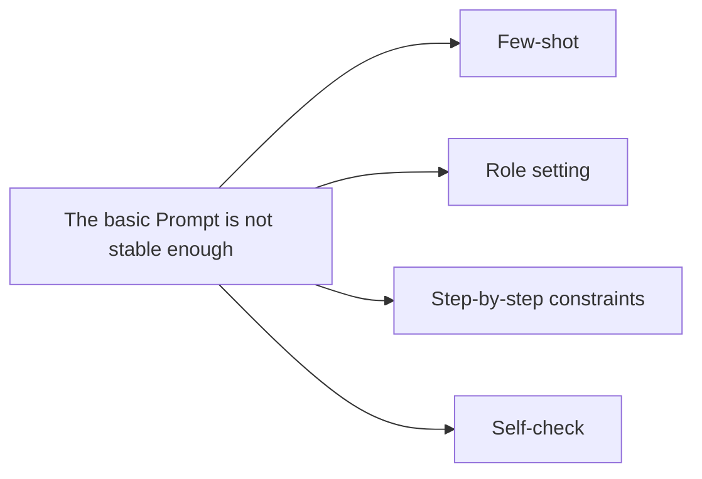

:::tip[Section focus]
Once you already understand the basics of Prompt, the next natural question is:

> **What other ways can make the model more stable and closer to the result I want?**

That is where “advanced Prompt techniques” come in.
But note: here, “advanced” does not mean “more flashy”; it means:

> **More suitable for the task.**
:::
## Learning objectives

- Understand what problems few-shot, role setting, and step-by-step constraints each help solve
- Learn when it is worth adding techniques, and when it actually makes the Prompt messy
- Build the awareness that Prompt tuning should rely on experiments, not just intuition
- Understand the real boundaries of several common advanced techniques

---

## First, build a map

The best way for beginners to understand advanced Prompt techniques is not to “stack every trick you see,” but to first see clearly:



What this section really wants to solve is:

- Which techniques address which kinds of problems
- When you should add them, and when they will make the Prompt messy

### A better analogy for beginners

You can think of advanced Prompt techniques as:

- Adding guardrails and examples to the task instructions

A basic Prompt is like:

- Stating the task clearly

An advanced Prompt is more like:

- Adding a few examples
- Clarifying what the output should look like
- Reminding the model to check whether any conditions were missed

So “advanced” does not mean mysterious; it means:

- Better suited for tasks that are more likely to go off track

## Why do we need “advanced” Prompts?

Because for some tasks, a simple one-line instruction is not stable enough.

For example:

- The boundary between labels is blurry
- The output format must be strict
- The task has multi-stage logic
- The model tends to miss conditions

At times like these, you need more detailed guidance.

But the most important principle is still:

> **It is not better to add more techniques; it is better to match the task more closely.**

---

## Few-shot: Why is “giving examples” so useful?

### What problems is it best for?

When a task is hard to explain clearly with just one definition, few-shot is especially valuable.

For example:

- `fact` vs `opinion`
- The format of information extraction fields
- A fixed reply style

### A minimal few-shot example

```python
few_shot_examples = [
    {"input": "Beijing is the capital of China.", "output": "fact"},
    {"input": "This course is very interesting.", "output": "opinion"}
]

for ex in few_shot_examples:
    print(ex)
```

Expected output:

```text
{'input': 'Beijing is the capital of China.', 'output': 'fact'}
{'input': 'This course is very interesting.', 'output': 'opinion'}
```

### What does it really do?

It is not just “writing a few more lines,” but:

> **Turning abstract rules into examples the model can imitate.**

For many fuzzy boundary tasks, this is more stable than a plain definition.

### A simple table for beginners to remember

| Task phenomenon | Technique to try first |
|---|---|
| The label boundary is very blurry | few-shot |
| The output style is always inconsistent | role setting or style constraints |
| The task clearly has multiple steps | step-by-step constraints |
| Conditions or format are often missed | self-check |

This table is very beginner-friendly because it turns a “list of techniques” back into:

- What should I add first when a certain problem appears?


:::tip[Reading guide]
When you read this diagram, do not stack techniques blindly. First identify the problem type: if the label boundary is blurry, add few-shot; if the format is unstable, add structural constraints; if the steps are complex, split them explicitly; if conditions are often missed, add self-check. The core of advanced Prompting is matching the problem, not making the Prompt look fancier.
:::
### Four terms that are easy to confuse

| Term | What it means | When to use it |
|---|---|---|
| Zero-shot | Give the task directly without examples | Use it first when the task is simple and the label boundary is clear |
| Few-shot | Provide a few input-output examples before the real task | Use it when definitions are not enough and the model needs examples to imitate |
| Role prompting | Ask the model to work in a certain role or style | Use it to control tone, perspective, or professional boundary, not to replace task clarity |
| Self-check | Ask the model to verify constraints before final output | Use it when missing fields, format errors, or unsupported facts are common |

---

## When is role setting helpful?

Many Prompts say things like:

- You are a senior technical mentor
- You are a legal assistant
- You are a code reviewer

### When does it really help?

Role setting is useful when you want the model to:

- Adopt a certain style
- Enter a certain working mode
- Maintain certain role boundaries

### But role setting is not magic

If the task itself is unclear, just saying:

- You are the world’s top expert

usually will not automatically make the result more stable.

So an important judgment is:

> Role setting is an auxiliary layer, not a replacement for task definition.

### A minimal contrast example showing that role setting cannot replace task definition

```python
bad_prompt = "You are the world's top expert. Please help me handle this content."
better_prompt = "You are a course assistant. Please summarize the text below into 3 Chinese key points, each no more than 20 characters."

print("bad_prompt   =", bad_prompt)
print("better_prompt=", better_prompt)
```

Expected output:

```text
bad_prompt   = You are the world's top expert. Please help me handle this content.
better_prompt= You are a course assistant. Please summarize the text below into 3 Chinese key points, each no more than 20 characters.
```

This example is very suitable for beginners because it reminds you that:

- Role setting is not a magical boost
- Whether the result is stable still depends on whether the task specification is clear

---

## Why are step-by-step constraints often more stable?

### Because many tasks are naturally multi-stage

For example:

1. First find the facts
2. Then make a judgment
3. Finally output a structured result

If you squeeze all these steps into one sentence, the model is more likely to get confused.

### A quick illustration

```text
Please complete the task according to the following steps:
1. First identify the key facts in the text
2. Then determine its sentiment
3. Finally output JSON
```

The core value of this kind of writing is:

> Make the internal structure of the task explicit.

---

## Why does self-check appear?

### When is it especially meaningful?

When you are most worried that the model will:

- Miss conditions
- Make format errors
- Produce output that is inconsistent with the constraints

you can ask it to perform one more round of self-check before outputting the final answer.

### A minimal example

```text
Before outputting the final answer, please check:
1. Whether any key information is missing
2. Whether the output format requirements are satisfied
3. Whether any facts not present in the original text have been included
```

### The boundaries of this technique

It may help, but it is not a cure-all.
It is more suitable for scenarios that are:

- Sensitive to format
- Sensitive to missing information

---

## Why can’t advanced techniques be stacked randomly?

Because every extra technique also increases:

- Prompt length
- Complexity
- Debugging difficulty

So a more mature approach is usually not:

- Add everything

but rather:

- First clarify the problem, then add the one layer that is most needed

This is a very important Prompt engineering habit.

### Another minimal “layered technique” experiment table

| Version | What changed | What you should observe most |
|---|---|---|
| v1 | Only the task goal | Whether the output goes off track |
| v2 | + output format | Whether the format becomes more stable |
| v3 | + few-shot | Whether boundary tasks become more stable |
| v4 | + self-check | Whether fewer conditions are missed |

This table is very beginner-friendly because it can turn Prompt tuning back into:

- A process you can test with controlled comparisons

---

## A more stable Prompt tuning order

Rather than “stacking every technique you see,” a better approach is:

1. First write the task goal clearly
2. Then write the output format clearly
3. If it is still unstable, add examples
4. If it is still unstable, add step-by-step constraints or self-check

This way, it is easier to judge:

- Which layer of change actually brought value

## The safest strategy when tuning Prompt for the first time

It is recommended that each time you only add one new layer of technique, for example:

1. First improve the output format
2. Then add 1–2 few-shot examples
3. Then consider adding step-by-step constraints

Do not stack role setting, examples, self-check, and format all at once, or it will be very hard to know which layer is actually working.

---

## The most common misconceptions

### Thinking the longer the Prompt, the more advanced it is

A long but messy Prompt is often worse.

### Stacking every technique

This makes it very hard to know which layer is doing the work.

### Tuning only by feeling, without small experiments

## Key reminders

- Advanced Prompt is not about being “fancier,” but about being “better matched to the problem”
- Few-shot, role setting, step-by-step constraints, and self-check all have their own boundaries
- The most stable tuning method is still layered experimentation, not stacking everything at once

Prompt tuning should, in essence, also be an experimental process.

## If you turn this into notes or a project, what is most worth showing?

What is most worth showing is usually not:

- A long Prompt that looks very complex

but instead:

1. The original Prompt
2. Which technique layer you added
3. What became more stable as a result
4. Which techniques did not actually help much

This makes it easier for others to see:

- That you understand Prompt tuning methods
- Not just how to pile up technique names

---

## Evidence to Keep

Keep this page's proof of learning as a small evidence card:

```text
technique: few-shot, role, step constraint, self-check, or decomposition
fixed_cases: same test inputs before/after change
improvement: score or failure reduction
risk: overlong, conflicting, or overfit prompt
decision: keep only techniques that improve evidence
```

## Summary

The most important thing in this section is not memorizing a few technique names, but understanding:

> **The real value of advanced Prompt techniques is that they help you make task definition, examples, constraints, and verification more stable.**

Not to make the Prompt “look more advanced.”

---

## Exercises

1. Write a Prompt for a sentiment classification task that includes few-shot examples.
2. Think about it: which is more fundamental, role setting or task goals? Why?
3. Explain in your own words: why are “step-by-step constraints” often more stable than one vague big instruction?
4. Why do we say the real importance of advanced Prompt techniques is not complexity, but fit?

<details>
<summary>Reference implementation and walkthrough</summary>

1. A good few-shot prompt should define the label set, show at least two labeled examples, and then ask the model to classify a new input in the same format.
2. Task goals are more fundamental. Role setting can change tone or perspective, but it cannot replace a clear objective, output contract, and constraints.
3. Step-by-step constraints reduce ambiguity by turning one large vague request into checkable sub-decisions. This makes failures easier to locate.
4. Advanced techniques matter when they match the failure mode. Extra roles, examples, or reasoning instructions are useful only if they make the task more reliable.

</details>
