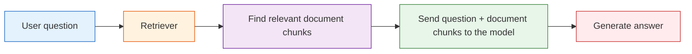
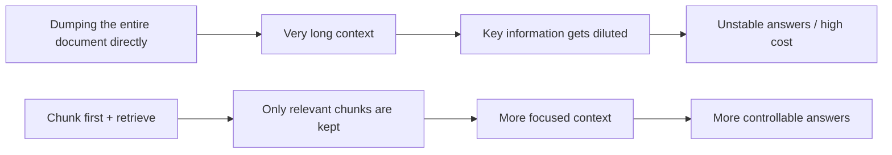

:::tip[Section focus]
RAG is most often misunderstood as:

- Just connect a vector database

But it is really more like:

- Let the system look up information first, then decide how to answer

So the most important thing in this section is not memorizing component names, but building a judgment first:

> **The core of RAG is not "adding one more module," but "getting the knowledge-integration pipeline right."**
:::
## Learning Objectives

By the end of this section, you will be able to:

- Understand why relying only on an LLM's parametric memory is not enough
- Explain the standard RAG workflow clearly
- Run a minimal, working retrieval-augmented example
- Understand which scenarios are suitable for RAG and which are not

---

## First for Beginners / Deeper Understanding Later

If you are a beginner, focus on this one sentence first: RAG does not make the model "remember more"; it makes the model look up the right materials before answering. First understand the chain: "question -> retrieval -> chunks -> assemble context -> generate answer."

If you have already built LLM applications, you can go further and focus on: chunking strategy, retrieval quality, reranking, metadata, citation sources, retrieval logs, and failure-case analysis. The maturity of a RAG project is often reflected in these engineering details.

---

## Build a Map First

### Start with a story: closed-book answering vs. open-book lookup

Imagine you ask a classmate: "How long after purchase can a course be refunded?" If they do not check the policy and answer only from memory, the answer may sound fluent but may not be accurate. A more reliable approach is: open the course policy first, find the refund clause, and then answer based on that clause.

RAG systematizes this habit. The model is still responsible for understanding the question and organizing the language, but the key facts are first retrieved from the knowledge base. That makes the answer more timely, controllable, and traceable.

If you just finished learning Prompt and fine-tuning decision logic, you can think of this section like this:

- Prompt solves "how the task is expressed"
- Fine-tuning is more like "how behavior is shaped"
- RAG solves "when knowledge is not fresh enough or complete enough, how to look it up first and then answer"

So what really matters in this section is not "another term," but:

- It is the part of an LLM system responsible for bringing in external knowledge

### A more beginner-friendly overall analogy

You can think of RAG as:

- Letting a very smart person check the manual before answering a question

If they do not check the manual, they may:

- Answer from memory
- Sound fluent, but not necessarily be correct

With RAG, the system becomes more like:

- Find evidence first
- Then answer based on that evidence

### At a glance: the full loop


This is the loop you will trace again and again in the RAG chapter: ask, retrieve, check evidence, then answer with sources.

## Why Do We Need RAG?

You can think of an LLM as "someone who has read a lot of books."
But even after reading many books, there are still three problems:

1. Some information is too new and did not exist during training
2. Some information is too specialized, and the model does not remember it reliably
3. Some answers must strictly be based on your own private documents

That is when RAG becomes necessary:

> **Look up information first, then answer.**

An analogy:

- Pure model answer: closed-book exam
- RAG answer: open-book exam

### When learning RAG for the first time, what should you focus on?

The most important thing is not the vector database, but this sentence:

> **The essence of RAG is not "making the model smarter," but "making answers based first on updatable materials."**

Once this is clear, then when you look at:

- Chunking
- Retrieval
- Reranking
- Context assembly

you will more naturally know what main goal they are serving.

---

## The Standard RAG Workflow



Breaking it down:

1. Documents are first split into smaller chunks
2. When the user asks a question, relevant chunks are retrieved from the knowledge base
3. These chunks are given to the model as context
4. The model generates an answer based on that context

### Why should you not focus only on the final generation step?

Because many RAG problems actually happen earlier:

- Documents are chunked poorly
- Retrieval recall is inaccurate
- Reranking is not done well
- Context is assembled in an unreasonable way

So the core of RAG is not "stuffing in more text before generation," but:

- Getting the right information into the model context at the right time

### A failure-diagnosis table that is very beginner-friendly

| Symptom | Where to check first |
|---|---|
| Completely off-topic answer | Retrieval did not recall relevant chunks |
| Answer is half right and half wrong | Document chunks are incomplete or chunking is poor |
| The document clearly exists but the model cannot answer | Retrieval scores, ranking, or context assembly has a problem |
| Evidence exists but the summary is wrong | The generation stage did not use the evidence correctly |

This table is important because it helps beginners avoid many detours:

- When RAG goes wrong, do not assume it is always the model's fault


:::tip[Reading tip]
Follow the diagram from left to right and ask three questions: Was the right information split into retrievable chunks? Did it enter top-k? Was it included in the final context? Only when all three layers are fine should you primarily suspect the generation model itself.
:::
---

## A Minimal, Runnable Mini RAG

To make sure the code runs directly, we will not use a vector database below. Instead, we will first simulate "retrieval" with simple keyword overlap.

```python
import re
from collections import Counter

documents = [
    {
        "id": 1,
        "title": "Refund Policy",
        "content": "Within 7 days after course purchase, if your learning progress is below 20%, you can apply for a refund."
    },
    {
        "id": 2,
        "title": "Certificate Info",
        "content": "After completing all required items and passing the course completion test, you can receive a course completion certificate."
    },
    {
        "id": 3,
        "title": "Learning Approach",
        "content": "The course supports stage-by-stage learning. It is recommended to first complete Python, data analysis, and machine learning fundamentals."
    }
]

STOPWORDS = {"a", "an", "the", "is", "are", "can", "i", "you", "your", "how", "do", "does", "after", "get", "should"}

def tokenize(text):
    words = re.findall(r"[a-zA-Z0-9_]+", text.lower())
    cjk_chars = re.findall(r"[\u4e00-\u9fff\u3040-\u30ff]", text)
    cjk_bigrams = ["".join(cjk_chars[i:i + 2]) for i in range(len(cjk_chars) - 1)]
    return [token for token in words + cjk_bigrams if token not in STOPWORDS]

def overlap_score(query, doc_text):
    query_tokens = tokenize(query)
    doc_tokens = tokenize(doc_text)
    query_count = Counter(query_tokens)
    doc_count = Counter(doc_tokens)
    return sum(min(query_count[t], doc_count[t]) for t in query_count)

def retrieve(query, documents, top_k=2):
    scored = []
    for doc in documents:
        score = overlap_score(query, doc["content"] + " " + doc["title"])
        scored.append((score, doc))
    scored.sort(key=lambda x: x[0], reverse=True)
    return [doc for score, doc in scored[:top_k] if score > 0]

def answer_with_rag(query):
    hits = retrieve(query, documents, top_k=1)
    if not hits:
        return "No sufficiently relevant information was found in the knowledge base."

    best = hits[0]
    context = "\\n".join([f"- {doc['title']}: {doc['content']}" for doc in hits])
    return (
        f"Based on the retrieval results from the knowledge base:\\n{context}"
        f"\\n\\nAnswer draft: {best['content']}"
        f"\\nSource: {best['title']}"
    )

query = "How long after purchase can I get a refund?"
print(answer_with_rag(query))
```

Expected output:

```text
Based on the retrieval results from the knowledge base:
- Refund Policy: Within 7 days after course purchase, if your learning progress is below 20%, you can apply for a refund.

Answer draft: Within 7 days after course purchase, if your learning progress is below 20%, you can apply for a refund.
Source: Refund Policy
```

Although simplified, this example already fully shows the structure of RAG.

:::tip[Why the tokenizer is slightly longer than expected]
The `tokenize()` function handles English words and simple CJK bigrams. This keeps the demo runnable in all three course languages and also hints at a real RAG detail: tokenization quality affects retrieval quality.
:::
### Another minimal example of "retrieval logs"

```python
query = "How long after purchase can I get a refund?"
hits = retrieve(query, documents, top_k=2)

for doc in hits:
    print({"query": query, "hit_title": doc["title"], "content": doc["content"]})
```

Expected output:

```text
{'query': 'How long after purchase can I get a refund?', 'hit_title': 'Refund Policy', 'content': 'Within 7 days after course purchase, if your learning progress is below 20%, you can apply for a refund.'}
```

This log is very useful for beginners because it helps answer one key question first:

- What exactly did the system retrieve?

Many RAG errors can already be half-diagnosed just by looking at this log.

---

## What Does RAG Really Improve?

RAG mainly improves three things:

### Timeliness

Materials can be updated at any time without retraining the LLM.

### Controllability

Answers are based on the knowledge base you specify, not just on the model's free-form generation.

### Traceability

You can show users which document chunks were referenced.

This is especially important in enterprise scenarios.

### Why are these three points more like engineering value than "whether the model has big parameters"?

Because they are directly related to system usability:

- Timeliness determines knowledge update efficiency
- Controllability determines whether the answer stays within business boundaries
- Traceability determines whether the system can be trusted and audited

### The safest default order when building a RAG project for the first time

A safer order is usually:

1. Narrow the knowledge scope first
2. Build the simplest retrieval baseline first
3. Understand the retrieval logs first
4. Then connect model generation
5. Finally add reranking and more complex strategies

This is usually easier than starting with a complex vector database and reranker right away, and it helps you build an explainable system faster.

---

## RAG Does Not Mean "No Hallucinations for Any Question"

This is a very common misunderstanding.

Although RAG can reduce hallucinations, it cannot eliminate them completely.
It can still go wrong in these ways:

- Retrieval finds the wrong thing
- Retrieval is incomplete
- Documents are chunked poorly
- The model still summarizes incorrectly after receiving the evidence

So RAG is not a silver bullet. It is an engineering method for making answers more grounded.

---

## Which Scenarios Are Best Suited for RAG?

### Very suitable

- Enterprise knowledge base Q&A
- Policy / regulation / FAQ lookup
- Customer support systems based on product documentation
- Retrieval Q&A based on code repositories / document repositories

### Less suitable

- Purely open-ended creative tasks
- Scenarios with no knowledge base at all
- Scenarios that require exact numeric calculations but whose documents are unstable

---

## What Is the Relationship Between RAG and Fine-Tuning?

Many beginners mix them up.

### RAG

- Does not change model parameters
- Uses "external material injected into context"

### Fine-tuning

- Modifies model parameters
- Teaches the model a style or capability over the long term

An analogy:

- RAG: bringing materials into the exam
- Fine-tuning: long-term training before the exam

The two are not mutually exclusive, and many systems use both together.

---

## A Small Example That Feels More Like a "Product"

You can package the mini RAG above a little as a "course assistant":

```python
questions = [
    "How do I get a completion certificate?",
    "Which fundamentals should I complete first?",
    "Can I get a refund?"
]

for q in questions:
    print("=" * 50)
    print("User question:", q)
    print(answer_with_rag(q))
```

Expected output:

```text
==================================================
User question: How do I get a completion certificate?
Based on the retrieval results from the knowledge base:
- Certificate Info: After completing all required items and passing the course completion test, you can receive a course completion certificate.

Answer draft: After completing all required items and passing the course completion test, you can receive a course completion certificate.
Source: Certificate Info
==================================================
User question: Which fundamentals should I complete first?
Based on the retrieval results from the knowledge base:
- Learning Approach: The course supports stage-by-stage learning. It is recommended to first complete Python, data analysis, and machine learning fundamentals.

Answer draft: The course supports stage-by-stage learning. It is recommended to first complete Python, data analysis, and machine learning fundamentals.
Source: Learning Approach
==================================================
User question: Can I get a refund?
Based on the retrieval results from the knowledge base:
- Refund Policy: Within 7 days after course purchase, if your learning progress is below 20%, you can apply for a refund.

Answer draft: Within 7 days after course purchase, if your learning progress is below 20%, you can apply for a refund.
Source: Refund Policy
```

This is the smallest prototype of many AI Q&A products.

---

## If Your Goal Is a "Knowledge-Base-Driven SOP Document Assistant," What Should You Focus on First in This Section?

For this kind of project, the key to RAG is not just "finding some relevant text,"
but finding:

- Relevant policy rules
- Relevant handled cases
- Relevant checklist items
- And which material and which page each one comes from

In other words, your knowledge chunks should not just be:

- A piece of text

They should ideally include at least these fields:

```python
sop_chunk = {
    "topic": "refund escalation",
    "content_type": "case",
    "source_type": "docx",
    "page_or_slide": 3,
    "text": "If the refund window has passed but duplicate billing is confirmed, escalate to billing support with evidence.",
}

print(sop_chunk)
```

Expected output:

```text
{'topic': 'refund escalation', 'content_type': 'case', 'source_type': 'docx', 'page_or_slide': 3, 'text': 'If the refund window has passed but duplicate billing is confirmed, escalate to billing support with evidence.'}
```

This directly affects whether later you can:

- Retrieve handled cases by topic
- Organize policies, cases, and checklists separately
- Preserve source information in the final Word document

## How Should Internal and External Materials Be Divided in RAG?

If your system looks up both internal knowledge bases and external materials,
the safest default principle is usually:

| Material type | Better for |
|---|---|
| Internal materials | Official policy wording, escalation rules, approved handled cases |
| External materials | Public background information, market notes, or examples used only as supplements |

In other words, an important RAG judgment in this kind of project is:

> **Internal materials provide the main structure, and external materials fill the gaps.**

If this boundary is unclear, the system can easily end up in a situation where:

- The internal document clearly has the standard wording, but the final answer is pulled off course by external content

## Common Beginner Mistakes

### Thinking the core of RAG is "just call a vector database"

No.
The core of RAG is: **make sure the right materials enter the model context at the right time.**

### Thinking retrieval and generation can be completely separated

No.
Retrieval quality directly determines generation quality.

### Thinking you can just dump the raw documents in as-is

In practice, the results depend heavily on chunking, cleaning, metadata, and retrieval strategy.

## If You Turn This Into a Project, What Is Most Worth Showing?

What is most worth showing is usually not:

- "I connected a vector database"

But rather:

1. A user question
2. The retrieved document chunks
3. The final answer
4. A set of representative failure cases
5. Whether the failure was caused by retrieval, chunking, or generation

That makes it easier for others to see:

- You understand the full RAG pipeline
- Not just a few component names

## A Common Mistake: Dumping the Entire Document Directly into the Prompt

Many beginners, when building RAG for the first time, think: if the model needs materials, why not just put the entire document into the prompt?

This usually causes several problems: the context window is wasted, important information gets buried, the model becomes harder to focus, and long-document cost is higher. The value of RAG is not "stuffing in more text," but "placing more relevant chunks in more suitable positions."



This failure case is especially worth remembering: RAG is not a "long prompt trick," but a mechanism for material selection and evidence organization.

---

## RAG Project Deliverables Template

If you turn a RAG system into a portfolio project, it is recommended to deliver at least these items:

| Deliverable | Description |
|---|---|
| Knowledge base sample | Show the raw documents, chunking results, and metadata fields |
| Retrieval logs | Show which chunks were hit by a user question and what the scores were |
| Answer with citations | The final answer should be traceable back to source chunks |
| Failure-case analysis | List at least 3 failure cases and explain whether they were retrieval, chunking, or generation problems |
| Improvement record | Compare the changes in effect after the baseline, improved chunking, and adding reranking |

This way, when others look at your project, they will know that you understand the full pipeline, not just that "you connected a vector database."

---

## What Should You Take Away from This Section?

Use the table below to check yourself after finishing this section:

| Level | What you should be able to do |
|---|---|
| Intuition | Explain why RAG is like "open-book answering" |
| Code | Run a minimal retrieval-augmented example and print retrieval logs |
| Engineering | Distinguish chunking problems, retrieval problems, and generation problems |
| Project | Design a RAG demo with citations, failure-case analysis, and improvement records |

---

## RAG Minimal Closed-Loop Checklist

When building RAG for the first time, do not chase framework completeness first. Instead, make sure you can see and explain all 5 steps below.

| Step | Minimal output | If it fails, suspect first |
|---|---|---|
| Prepare materials | At least 3 document chunks with titles | Unclear knowledge scope, poor document quality |
| Retrieve chunks | Can print the hit titles, content, and scores | Query, chunking, retrieval strategy |
| Assemble context | Can see the final context given to the model | top-k, context too long, order confusion |
| Generate answer | The answer is clearly based on the context | Weak prompt constraints, insufficient evidence |
| Record logs | Save query, hits, answer | Cannot review failures |

The meaning of this checklist is: do not show only the final answer in a RAG project. You should be able to show what the system actually retrieved, why it answered that way, and which layer failed when it did fail.

## Minimal RAG Debug Output

Before connecting to a real LLM, it is recommended to build the debug output first. Even if the final answer is still simple, as long as you can print the retrieval process, you will have something concrete to optimize later.

```python
def debug_rag(query):
    hits = retrieve(query, documents, top_k=2)
    print("User question:", query)
    print("Retrieved documents:")
    for idx, doc in enumerate(hits, start=1):
        print(f"{idx}. {doc['title']} -> {doc['content']}")

    if not hits:
        print("Answer: No sufficiently relevant information was found in the knowledge base.")
        return

    context = "\n".join([doc["content"] for doc in hits])
    print("Final context:", context)
    print("Answer: Please organize your answer based on the retrieved documents above and keep the sources.")

debug_rag("How long after purchase can I get a refund?")
```

Expected output:

```text
User question: How long after purchase can I get a refund?
Retrieved documents:
1. Refund Policy -> Within 7 days after course purchase, if your learning progress is below 20%, you can apply for a refund.
Final context: Within 7 days after course purchase, if your learning progress is below 20%, you can apply for a refund.
Answer: Please organize your answer based on the retrieved documents above and keep the sources.
```


This function is not final product code; it is a debugging tool. In a real project, you should at least keep these fields in the logs: `query`, `retrieved_chunks`, `scores`, `context_length`, `answer`, `source_refs`.

## Typical Failure Sample Analysis

| Failure symptom | Possible cause | Next step |
|---|---|---|
| The knowledge base clearly has the answer, but it is not retrieved | Chunk too large, keyword mismatch, embedding not suitable | Print top-k and inspect the query and chunk text |
| The correct document is retrieved, but the answer misses a key condition | Chunk incomplete, context order unreasonable, weak prompt constraints | Increase overlap, adjust context packing, require condition citations |
| The answer cites a source, but the source does not support the conclusion | Hallucination during generation, incorrect citation stitching | Do citation checks and verify evidence sentence by sentence |
| Multiple documents conflict with each other, and the answer becomes confusing | Missing version, date, or source priority | Add metadata filters and source priority rules |

These failure samples should be included in the project README or experiment notes. The value of a RAG project is not only in "answering correctly," but also in your ability to explain "why it answered incorrectly."


> **The essence of RAG is to let the model look up information before answering a question.**

It does not replace the model; it gives the model "external memory" and "updatable knowledge."

In the next section, we will continue by looking at:
How should these materials be cleaned, chunked, and vectorized?

---

## What You Should Take Away from This Section

- RAG is not replacing the model; it is the external knowledge pipeline
- The real difficulty is often not "calling the model," but "whether the materials were delivered correctly"
- All future knowledge bases, enterprise Q&A systems, and assistant systems will be built on this main thread

---

## Evidence to Keep

Keep this page's proof of learning as a small evidence card:

```text
query: one user question or test case
retrieved_chunks: chunk ids, scores, and source titles
answer: final response with citation or source note
failure_check: missing evidence, wrong chunk, stale doc, or unsupported claim
next_action: chunking, embedding, reranking, prompt, or eval change
```

## Exercises

1. Add two more documents to `documents` and try querying new questions.
2. Modify `top_k` in `retrieve()` and observe how the answer context changes.
3. Think about this: if the document says "refund within 14 days" but the model answers "7 days," which step might have gone wrong?

<details>
<summary>Reference implementation and walkthrough</summary>

1. Good added documents should test whether retrieval can separate similar topics, such as refund policy, course transfer, and certificate rules. A good query should return the document that actually contains the answer, not merely a document with overlapping words.
2. A larger `top_k` gives the generator more context, but it can also add distractors. A smaller `top_k` is cleaner, but may miss a necessary supporting chunk.
3. The error could come from retrieval missing the right document, context packing dropping the correct sentence, prompt wording allowing unsupported guesses, or the model ignoring retrieved evidence. RAG debugging should inspect each layer separately.

</details>
