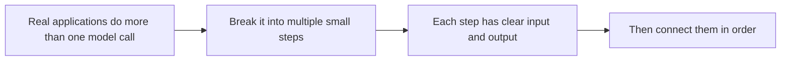

:::tip[Section Focus]
When many people first look at LangChain, they think it is just “tuning the model.”
But the problem it is really trying to solve is more specific:

> **When your application is no longer just one model call, but a combination of multiple steps and components, how do you organize it more clearly?**

That is where LangChain comes in.
:::
## Learning Objectives

- Understand why a chain-style abstraction naturally appears
- Read where Prompt, model, parser, and retriever sit in the chain
- Use a minimal example to understand the core idea of “feeding the previous output into the next step”
- Understand why it is especially suitable for prototypes and linear workflows

---

## First, Build a Map

For beginners, the best way to understand this section is not “learn the framework API first,” but to first see clearly:



So what this section is really trying to explain is:

- Why chain abstractions naturally appear
- What they are actually organizing for you

## Why Do We Need a “Chain” Abstraction?

### Because real applications usually need more than one model call

For example, if you want to build a small question-answering system, you may already need these steps:

1. Clean the user query
2. Retrieve documents
3. Build the prompt
4. Call the model
5. Format the output

If you write everything by hand in one function, it can still work, but it quickly becomes:

- unclear
- hard to reuse
- hard to debug

### What does a chain abstraction actually do?

It says:

> **Turn each step into a small component with a clear responsibility, then connect them in order.**

That is the core LangChain feeling.

---

## A Minimal Chain Example

```python
class SimpleChain:
    def __init__(self, steps):
        self.steps = steps

    def run(self, value):
        for step in self.steps:
            value = step(value)
        return value

def normalize_query(text):
    return text.strip().lower()

def retrieve_docs(query):
    if "refund" in query:
        return {"query": query, "docs": ["Courses can be refunded within 7 days after purchase."]}
    return {"query": query, "docs": []}

def format_answer(payload):
    if payload["docs"]:
        return f"According to the materials: {payload['docs'][0]}"
    return "No relevant information found."

chain = SimpleChain([
    normalize_query,
    retrieve_docs,
    format_answer
])

print(chain.run("  What is the refund policy? "))
```

Expected output:

```text
According to the materials: Courses can be refunded within 7 days after purchase.
```

### What is this code teaching?

It is already teaching you the most important thing in LangChain:

> Each step only cares about its own input and output, and the whole system completes the task by chaining them together.

That is the core value of chain-based applications.

---

## What Role Does Prompt Play in the Chain?

### Prompt is not “extra copy”; it is a component

In many pipelines, Prompt itself is one of the intermediate steps:

- take the query
- generate a clearer prompt template

### A simple example

```python
def build_prompt(payload):
    docs = payload["docs"]
    query = payload["query"]
    return f"Please answer the question based on the following materials: materials={docs}, question={query}"

payload = {"query": "What is the refund policy", "docs": ["Courses can be refunded within 7 days after purchase."]}
print(build_prompt(payload))
```

Expected output:

```text
Please answer the question based on the following materials: materials=['Courses can be refunded within 7 days after purchase.'], question=What is the refund policy
```

This example is reminding you that:

> Prompt can also be viewed as an intermediate transformation node in the chain.

---

## Add a “Model” Step

To keep the example runnable offline, we will continue using a mock model.

```python
def mock_llm(prompt):
    return f"Model output: {prompt}"

chain = SimpleChain([
    normalize_query,
    retrieve_docs,
    build_prompt,
    mock_llm
])

print(chain.run("What is the refund policy?"))
```

Expected output:

```text
Model output: Please answer the question based on the following materials: materials=['Courses can be refunded within 7 days after purchase.'], question=what is the refund policy?
```

### The key takeaway from this step

You will start to see that:

- retriever
- prompt builder
- model

are all just different nodes in the chain.

This is also why LangChain feels like a “component assembly framework.”


:::tip[Reading Tip]
LangChain is not trying to make your code look fancy. It is about making the input-output boundaries of nodes like Prompt, Retriever, Model, and Output Parser clearer. As a beginner, first look at “how data flows from one node to the next.”
:::
---

## Why Does the Output Parser Also Matter?

Many people only focus on the input prompt and the model output, while ignoring this:

> After the model outputs text, the system often still needs to perform structured processing.

For example:

- keep only part of the fields
- convert to JSON
- map to a front-end display format

### A Minimal Example

```python
def output_parser(text):
    return {
        "answer": text.replace("Model output: ", ""),
        "ok": True
    }

chain = SimpleChain([
    normalize_query,
    retrieve_docs,
    build_prompt,
    mock_llm,
    output_parser
])

print(chain.run("What is the refund policy?"))
```

Expected output:

```text
{'answer': "Please answer the question based on the following materials: materials=['Courses can be refunded within 7 days after purchase.'], question=what is the refund policy?", 'ok': True}
```

This step helps you more clearly realize that:

> The real value of LangChain often lies in “making the boundaries between different components clear.”

---

## Why Is It Especially Good for Prototyping?

Because many early-stage LLM applications are very similar:

- a fairly linear flow
- several components executed one after another

For example:

- clean the query
- retrieve
- build the prompt
- call the model
- parse the result

This is exactly the kind of scenario where a chain abstraction feels most natural.

---

## When Does It Start to Strain?

If your workflow starts to become:

- if retrieval fails, rewrite the query and search again
- if the answer is not stable enough, ask a reviewer to check it
- some requests should use tools, others should not

In this case, a “single straight chain” becomes more and more awkward.

In other words:

> When the system starts to have obvious state branches and loops, chain abstraction may no longer be enough.

That is also why frameworks like LangGraph are needed later on.

---

## A Very Important Engineering Reminder

The most common mistake people make when learning LangChain is:

- memorizing a bunch of class names and interfaces from the start

But a more stable approach is usually:

1. First understand what problem chain abstraction is solving
2. Then look at the specific API

Otherwise, it is easy to end up with:

- knowing how to write framework code
- but not knowing why it is organized that way

## The Most Stable Way for Beginners to Use LangChain for the First Time

A more reliable sequence is usually:

1. Start with only one linear workflow
2. Print the input and output of each node clearly
3. Then add retrieval, parsers, and more complex components
4. Only then consider more complex graph-style workflows

---

## Evidence to Keep

Keep this page's proof of learning as a small evidence card:

```text
request: input, state, tools/context, and expected output contract
validated_output: parser/schema or business-rule check result
trace: model call, tool/function call, document parse, or dialogue state
failure_check: invalid format, missing field, stale state, or wrong tool
next_action: prompt, schema, state, API, or parsing improvement
```

## Summary

The most important thing in this section is not remembering a specific class, but understanding this:

> **The core value of LangChain is organizing high-frequency components like prompt, retrieval, model, and parsing into a clearer linear workflow.**

Once this chain mindset is in place, reading real framework APIs later will feel much smoother.

## What Should You Take Away from This Section?

- LangChain is not replacing the model; it is organizing multi-step applications
- Understanding the chain first, then learning the framework, is more stable than memorizing APIs directly
- It is especially suitable for prototypes and linear workflows, but it is not the end point for every complex system

---

## Exercises

1. Add one more step to this `SimpleChain` to rewrite the query so it is better suited for retrieval.
2. Explain in your own words: why can Prompt also be seen as a component in the chain?
3. Think about it: when a workflow starts to have complex branches, why does chain abstraction become strained?
4. Explain in your own words: what kind of problem shape is LangChain best suited to solve?

<details>
<summary>Reference implementation and walkthrough</summary>

1. The rewrite step can normalize synonyms and produce a retrieval-focused query while preserving the original intent.
2. Prompt is a component because it transforms inputs into instructions and constrains the output shape.
3. Chains become strained when branching, retries, stateful decisions, and tool loops dominate the workflow.
4. LangChain fits composed LLM workflows with reusable prompts, retrievers, tools, and parsers, especially when the flow is mostly predictable.

</details>
