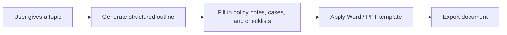

:::tip[Section focus]
When many beginners create “generated Word / slides,” they tend to directly ask the model to output a long block of text,
and then hope it naturally fits:

- chapter order
- formatting requirements
- review checklist placement
- handoff-document style

This is usually not stable.

A more reliable approach is usually:

> **First let the model produce structured content, then fill that structure into a template.**
:::
## Learning Objectives

- Understand why document generation is best built with a “structure -> template -> export” workflow
- Understand the difference between Word / PPT generation and ordinary chat output
- Read a minimal template filling process
- Build an engineering intuition that “structured output comes before document layout”

---

## First, Build a Mental Map

Template-based document generation is easier to understand as “topic -> outline -> content blocks -> template export”:



So what this section really wants to solve is:

- Why you should not let the model freely “write an entire Word document”
- Why fixed templates make generation results more stable

## Why Is Template-Based Generation So Important?

Because your goal is not ordinary Q&A,
but to deliver:

- a document that looks like an operational SOP or handoff pack

That means the system not only needs to answer correctly,
but also needs to satisfy:

- stable structure
- fixed sections
- fixed heading levels
- reasonable placement of cases and review steps

## A Better Beginner-Friendly Analogy

You can think of document generation as:

- write the outline first, then fill in the content, and finally format it

If you start by directly writing the entire body text,
it is very easy for things to go wrong:

- the structure becomes messy
- content gets repeated
- review steps end up in the wrong place

So a more reliable approach is usually:

- define the skeleton first
- then add the flesh and blood

## A Minimal Structured Document Object Example

```python
doc_spec = {
    "title": "Refund Escalation SOP",
    "target_audience": "Support operations team",
    "sections": [
        {
            "heading": "1. Policy Summary",
            "content_type": "policy",
            "items": ["Escalate refund requests when eligibility or payment status is unclear"],
        },
        {
            "heading": "2. Worked Case",
            "content_type": "case",
            "items": ["A card-paid order is older than 7 days, so send it to billing review before promising a refund"],
        },
        {
            "heading": "3. Review Checklist",
            "content_type": "checklist",
            "items": ["Check order age, payment status, usage evidence, and previous support notes"],
        },
    ],
}

print(doc_spec)
```

Expected output:

```text
{'title': 'Refund Escalation SOP', 'target_audience': 'Support operations team', 'sections': [{'heading': '1. Policy Summary', 'content_type': 'policy', 'items': ['Escalate refund requests when eligibility or payment status is unclear']}, {'heading': '2. Worked Case', 'content_type': 'case', 'items': ['A card-paid order is older than 7 days, so send it to billing review before promising a refund']}, {'heading': '3. Review Checklist', 'content_type': 'checklist', 'items': ['Check order age, payment status, usage evidence, and previous support notes']}]}
```

The most important value of this example is:

- it makes clear what structure needs to be generated first

In other words, the model should not directly output the final `.docx`,
but should first output a structured content object.

## A Document Schema Better Suited for Real Projects

If your goal is to “generate a fixed-format Word SOP or handoff document,”
it is recommended to add two more layers on top of the minimal object:

- page-level or chapter-level ordering
- template field mapping

A more robust document schema usually includes at least:

| Field | Purpose |
|---|---|
| `title` | Document title |
| `audience` | Intended audience |
| `document_goal` | Document objective |
| `sections` | Main body structure |
| `source_refs` | Reference sources |
| `template_version` | Which template is being used |

This table is especially useful for beginners because it reminds you:

- you are not generating “long text”
- you are generating a “data object that can be reliably consumed by a template”

## A Minimal Template Filling Example

The example below does not use real `python-docx`;
instead, it uses the simplest string template to make the workflow clear.

```python
template = """# {title}

Target audience: {target_audience}

{body}
"""


def render_body(sections):
    blocks = []
    for section in sections:
        blocks.append(section["heading"])
        for item in section["items"]:
            blocks.append(f"- {item}")
        blocks.append("")
    return "\n".join(blocks)


result = template.format(
    title=doc_spec["title"],
    target_audience=doc_spec["target_audience"],
    body=render_body(doc_spec["sections"]),
)

print(result)
```

Expected output:

```text
# Refund Escalation SOP

Target audience: Support operations team

1. Policy Summary
- Escalate refund requests when eligibility or payment status is unclear

2. Worked Case
- A card-paid order is older than 7 days, so send it to billing review before promising a refund

3. Review Checklist
- Check order age, payment status, usage evidence, and previous support notes

```

This example is especially suitable for beginners because it helps you first see:

- the core of templating is not the library
- it is “structure first, template second”

## How Should Template Fields Be Designed?

When building this kind of system for the first time, it is strongly recommended that you write the template fields out explicitly.

| Template field | Corresponding content |
|---|---|
| `{title}` | Document title |
| `{target_audience}` | Intended audience |
| `{document_goal}` | Document objective |
| `{policy_block}` | Policy summary |
| `{case_block}` | Worked case |
| `{checklist_block}` | Review checklist |
| `{source_block}` | Source notes |

The benefits are:

- the model knows what it needs to produce
- the template rendering layer knows what it needs to fill
- later, when you revise the system, you can tell which layer has a problem

## What Extra Things Do Word / PPT Actually Need to Handle?

In real engineering work, besides the body content, you also need to handle:

- title styles
- paragraph hierarchy
- numbering
- tables
- image slots
- headers and footers
- slide layouts

So template-based document generation is really a two-layer problem:

1. content structure
2. document layout

## A Minimal “Structured Object -> Template Fields” Example

```python
def to_template_payload(doc_spec):
    blocks = {"policy": [], "case": [], "checklist": []}
    for section in doc_spec["sections"]:
        blocks[section["content_type"]].extend(section["items"])

    return {
        "title": doc_spec["title"],
        "target_audience": doc_spec["target_audience"],
        "document_goal": "Standardize refund escalation decisions before export",
        "policy_block": "\n".join(f"- {x}" for x in blocks["policy"]),
        "case_block": "\n".join(f"- {x}" for x in blocks["case"]),
        "checklist_block": "\n".join(f"- {x}" for x in blocks["checklist"]),
        "source_block": "Source: refund policy KB + billing escalation SOP",
    }


payload = to_template_payload(doc_spec)
print(payload)
```

Expected output:

```text
{'title': 'Refund Escalation SOP', 'target_audience': 'Support operations team', 'document_goal': 'Standardize refund escalation decisions before export', 'policy_block': '- Escalate refund requests when eligibility or payment status is unclear', 'case_block': '- A card-paid order is older than 7 days, so send it to billing review before promising a refund', 'checklist_block': '- Check order age, payment status, usage evidence, and previous support notes', 'source_block': 'Source: refund policy KB + billing escalation SOP'}
```

The key takeaway for beginners in this example is:

- a structured object is not necessarily the same as a template object
- there is often an extra layer for “field organization” in between


:::tip[Reading guide]
Do not let the model directly “write Word.” First produce the document schema, then organize it into a template payload, and finally hand it to the docx/pptx rendering layer. This makes it much easier to separate formatting errors from content errors.
:::
## Hands-on: Validate Template Fields Before Rendering

Before sending data to `python-docx`, `docxtpl`, or `python-pptx`, validate that the template payload has all required fields. This avoids generating a half-empty Word document and discovering the issue only after export.

```python
REQUIRED_FIELDS = [
    "title",
    "target_audience",
    "document_goal",
    "policy_block",
    "case_block",
    "checklist_block",
    "source_block",
]


def validate_payload(payload):
    missing = [field for field in REQUIRED_FIELDS if not payload.get(field)]
    if missing:
        return False, f"missing fields: {missing}"
    return True, "ok"


def render_markdown_handout(payload):
    ok, message = validate_payload(payload)
    if not ok:
        raise ValueError(message)

    return f"""# {payload['title']}

Audience: {payload['target_audience']}
Goal: {payload['document_goal']}

## Policy Summary
{payload['policy_block']}

## Worked Case
{payload['case_block']}

## Review Checklist
{payload['checklist_block']}

## Sources
{payload['source_block']}
"""


payload = {
    "title": "Refund Escalation SOP",
    "target_audience": "Support operations team",
    "document_goal": "Standardize refund escalation decisions before export",
    "policy_block": "- Escalate refund requests when eligibility or payment status is unclear",
    "case_block": "- A card-paid order is older than 7 days, so send it to billing review before promising a refund",
    "checklist_block": "- Check order age, payment status, usage evidence, and previous support notes",
    "source_block": "Source: refund policy KB + billing escalation SOP",
}

print(validate_payload(payload))
print(render_markdown_handout(payload))
```

Expected output:

```text
(True, 'ok')
# Refund Escalation SOP

Audience: Support operations team
Goal: Standardize refund escalation decisions before export

## Policy Summary
- Escalate refund requests when eligibility or payment status is unclear

## Worked Case
- A card-paid order is older than 7 days, so send it to billing review before promising a refund

## Review Checklist
- Check order age, payment status, usage evidence, and previous support notes

## Sources
Source: refund policy KB + billing escalation SOP

```


This check is simple, but it is the difference between a demo and an engineering pipeline: every rendering step should fail early when required structured fields are missing.

<details>
<summary>Solution approach and explanation</summary>

The correct first check is that `validate_payload(payload)` returns `(True, "ok")` for a complete payload, and raises a clear error before rendering when any required field is empty or missing. That means the renderer should not silently produce a half-empty handout.

A solid implementation separates three responsibilities:

1. The document schema decides what policy notes, cases, checklist items, and sources exist.
2. The template payload maps those fields into the exact placeholders a document template needs.
3. The renderer only formats an already validated payload.

If you remove `checklist_block`, the expected behavior is not a broken exported document. The validation layer should return a missing-field message, and the calling code should stop before the export step.

</details>

## Why Is This Layer Closely Related to Prompt / Structured Output?

Because you will usually ask the model to first produce:

- JSON
- an outline
- a title list
- the policy notes / cases / checklists for each section

rather than directly producing a long, free-form prose document.

The most relevant existing lessons for this part are:
- [7.5.2 Prompt Basics](/ch07-llm-principles/ch05-prompt/01-prompt-basics/)
- [7.5.4 Structured Output](/ch07-llm-principles/ch05-prompt/03-structured-output/)

## The Safest Scope Control When You Build This Module for the First Time

When you build this for the first time, the safest scope is usually:

1. Generate only `Word` first
2. Support only one template first
3. Do not add automatic image layout yet
4. Do not do complex style switching yet

This makes it easier to first prove that:

- the structured object is stable
- the template fields are stable
- the export pipeline is stable

## A Generation Sequence Beginners Can Follow Directly

When building this kind of system for the first time, a more reliable sequence is usually:

1. Define the document structure first
2. Generate structured JSON / an outline first
3. Then fill in policy notes and cases
4. Finally export to Word / PPT

This is much more stable than directly generating `.docx` content from the start.

## What Libraries Are Used in Real Projects?

This section has not yet expanded into specific library usage,
but when you work on a project, you will likely encounter:

- `python-docx`
- `docxtpl`
- `python-pptx`

So you can think of this section as:

- first get the idea straight
- then check the official documentation for the specific libraries

## If You Turn This into a Project, What Is Most Worth Showing?

What is most worth showing is usually not:

- “we can export Word”

but rather:

1. What the structured content object looks like
2. What the template looks like
3. How the final Word / PPT maps to the structure
4. Which formatting requirements are stable and controllable

That way, others can more easily see:

- that you understand template-based generation
- not just “having the model write long text”

## Evidence to Keep

Keep this page's proof of learning as a small evidence card:

```text
request: input, state, tools/context, and expected output contract
validated_output: parser/schema or business-rule check result
trace: model call, tool/function call, document parse, or dialogue state
failure_check: invalid format, missing field, stale state, or wrong tool
next_action: prompt, schema, state, API, or parsing improvement
```

## Summary

- The most important thing in template-based document generation is to define a stable schema first, then define template fields
- Separating “structured object -> field organization -> template rendering” into three layers makes the system much more stable
- When building this for the first time, getting a single-template Word export working smoothly is more reliable than trying to do Word and PPT at the same time

## What You Should Take Away from This Section

- The most reliable path for document generation is usually “structured output -> template rendering -> document export”
- Defining the structure first and then filling content is much more stable than letting the model freely write the entire handout
- If your goal is to generate Word / slides, this layer is a critical part of project success
