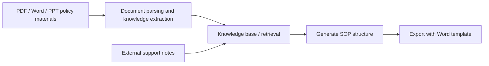
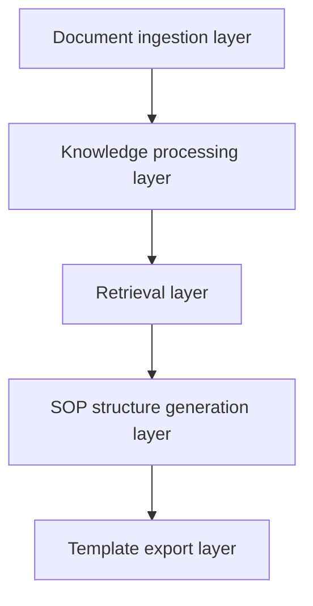

# 8.5.5 Project: Knowledge Base-Driven SOP Document Assistant


:::tip[Section Positioning]
This project goes one step further than a typical knowledge base Q&A system.
It is not just about answering questions. It actually produces:

- A Word SOP document with clear sections, source references, and checklist fields

So it is especially suitable for training these system capabilities to work together:

- Document parsing
- Knowledge retrieval
- Policy and case extraction
- Structured output
- Template-based document generation
:::
## Learning Objectives

- Learn how to organize "incident topic -> policy retrieval -> case extraction -> SOP draft" into a complete workflow
- Learn how to define the minimum project boundary for a knowledge base-driven SOP document system
- Learn how to design internal policy retrieval and external support-note supplementation separately
- Learn how to turn this project into a portfolio-quality system with a product feel

## Beginner Terminology Bridge

This project crosses document processing, retrieval, generation, and export. Clarify these terms first:

| Term | Beginner meaning | Role in this project |
|---|---|---|
| `ingestion` | Bringing files into the system and preparing them for processing | PDF / Word / PPT policy materials enter the pipeline here |
| `policy and case extraction` | Identifying policy clauses, decision rules, handled cases, and review checklists from documents | SOP drafts need operational evidence, not just paragraphs |
| `schema` | A stable data structure that defines the SOP output | Keeps retrieval, generation, and template export aligned |
| `template rendering` | Filling structured content into a Word or PPT template | Separates content generation from document formatting |
| `source_refs` | Source references kept with each generated section or item | Lets the final Word draft explain where the content came from |
| `internal vs external materials` | Internal materials are trusted company policy; external materials are supplements | Prevents external notes from overriding official policy |

The core judgment is: the model should not directly "write a Word file." It should help build a structured SOP object that the template layer can render reliably.

---

## First, Build a Map

This project is best understood as "knowledge ingestion -> retrieval -> structured generation -> template export":



So what this project really wants to solve is:

- When the user only provides an incident topic, how does the system automatically find policy materials, extract cases and checklists, and then write them out according to a template?

## How Should We Narrow the Project Scope?

A very solid starting point is usually:

> **Build a knowledge base-driven support SOP assistant that takes an incident topic as input and automatically generates a Word draft containing policy summary, worked cases, review checklist, and source notes.**

Why is this scope a good fit?

- The topic is clear
- The material format is clear
- Policy clauses, handled cases, and checklist items can be extracted from documents
- The Word output target is explicit

It is not recommended to start with:

- All departments
- Every policy area at once
- Automatically generating Word + PPT + Slack replies + approval tickets

That will easily distract from the main project line.

## A Better Analogy for Beginners

You can think of this system as:

- An operations analyst that first reads policy materials, then organizes a handoff outline, and finally drafts the SOP for you

It does not write blindly out of thin air. Instead, it:

1. First checks internal policies
2. Then supplements with external support notes when needed
3. Then selects policy clauses, handled cases, and checklist items from the materials
4. Finally writes them into an SOP document in a fixed format

This analogy matters, because it helps beginners avoid thinking of the project as:

- "Just ask the model to write a Word document directly"

## What Does the Minimum System Loop Look Like?

1. Ingest documents
2. Parse body text, headings, tables, and decision rules
3. User enters an incident topic
4. The system retrieves internal knowledge chunks
5. Supplement with external support notes if needed
6. Generate a structured SOP object
7. Export Word via a template

As long as these 7 steps run smoothly, the project already feels very close to a real product.

## Let's First Run a Minimal Workflow Example

```python
knowledge_base = [
    {
        "topic": "Refund escalation",
        "content_type": "policy",
        "text": "Escalate refund requests when eligibility or payment status is unclear.",
    },
    {
        "topic": "Refund escalation",
        "content_type": "case",
        "text": "A card-paid order older than 7 days should go to billing review before promising a refund.",
    },
    {
        "topic": "Refund escalation",
        "content_type": "checklist",
        "text": "Check order age, payment status, usage evidence, and previous support notes.",
    },
]


def retrieve_internal(topic):
    return [item for item in knowledge_base if item["topic"] == topic]


def retrieve_external(topic):
    # Minimal simulation only
    return [{"topic": topic, "content_type": "note", "text": f"External supplement: recent support-process notes for {topic}."}]


def build_sop_document(topic):
    internal = retrieve_internal(topic)
    external = retrieve_external(topic)
    all_items = internal + external
    return {
        "title": topic,
        "policies": [x["text"] for x in all_items if x["content_type"] == "policy"],
        "cases": [x["text"] for x in all_items if x["content_type"] == "case"],
        "checklists": [x["text"] for x in all_items if x["content_type"] == "checklist"],
        "notes": [x["text"] for x in all_items if x["content_type"] == "note"],
    }


print(build_sop_document("Refund escalation"))
```

Expected output:

```text
{'title': 'Refund escalation', 'policies': ['Escalate refund requests when eligibility or payment status is unclear.'], 'cases': ['A card-paid order older than 7 days should go to billing review before promising a refund.'], 'checklists': ['Check order age, payment status, usage evidence, and previous support notes.'], 'notes': ['External supplement: recent support-process notes for Refund escalation.']}
```

### What Is the Most Important Value of This Example?

It shows that the real value of this system is not just that it can:

- Retrieve

But that it can reorganize what it retrieved into:

- The section structure needed by an SOP document

## Add a Quick Structure Check

Before exporting Word, check whether each required slot has content. This prevents a template renderer from producing a beautiful but empty document.

```python
sop_doc = build_sop_document("Refund escalation")
required_slots = ["policies", "cases", "checklists", "notes"]

for slot in required_slots:
    count = len(sop_doc[slot])
    print(f"{slot}: {count} item(s)", "OK" if count else "CHECK")
```

Expected output:

```text
policies: 1 item(s) OK
cases: 1 item(s) OK
checklists: 1 item(s) OK
notes: 1 item(s) OK
```

## A System Layering Diagram That Looks More Like a Real Project

When beginners build this kind of project, the easiest mistake is mixing "knowledge base, retrieval, generation, and export" together.

A safer approach is to separate the layers first:



You can simply understand it as:

- Ingestion layer: read materials in
- Processing layer: turn materials into knowledge chunks
- Retrieval layer: find relevant policies and cases
- Generation layer: reorganize materials into an SOP document structure
- Export layer: turn the structure into Word

## What Capabilities Does This Project Need Most?

Viewed by system layers, the core capabilities are:

### Document Parsing

- PDF / DOCX / PPTX reading
- OCR for scanned documents
- Heading hierarchy, tables, and decision-rule recognition

Related courses:
- [8.3.8 Document Parsing and Knowledge Extraction](../ch03-app-dev/07-document-parsing.md)
- [8.1.3 Document Processing](../ch01-rag/02-document-processing.md)
- [10.5.4 OCR Text Recognition](../../ch10-computer-vision/ch05-advanced/03-ocr.md)

### Knowledge Base and Retrieval

- Chunking
- Metadata
- Topic retrieval
- Policy and case recall

Related courses:
- [8.1.2 RAG Basics](../ch01-rag/01-rag-basics.md)
- [8.1.4 Vector Databases](../ch01-rag/03-vector-databases.md)
- [8.1.5 Retrieval Strategies](../ch01-rag/04-retrieval-strategies.md)

### Structured Output and Template Generation

- Generate an outline first
- Then generate policy summary / worked cases / review checklist
- Then export Word using a template

Related courses:
- [7.5.2 Prompt Basics](../../ch07-llm-principles/ch05-prompt/01-prompt-basics.md)
- [7.5.4 Structured Output](../../ch07-llm-principles/ch05-prompt/03-structured-output.md)
- [8.3.9 Template-Based Document Generation (Word / PPT)](../ch03-app-dev/08-template-doc-generation.md)

### Tool Calling and Workflows

- Internal knowledge base retrieval
- External support-note supplementation
- Template rendering
- File export

Related courses:
- [8.3.4 Function Calling Practice](../ch03-app-dev/03-function-calling.md)
- [8.3.6 Dialogue Systems and Multi-Turn Management](../ch03-app-dev/05-dialog-system.md)
- [9.2.5 Plan-and-Execute](../../ch09-agent/ch02-reasoning/04-plan-and-execute.md)

## Why Not Let the Model Directly Generate a Word File?

Direct generation looks fast in a demo, but it makes the system hard to debug. When the final document is wrong, you cannot easily tell whether the problem came from:

- The document parser
- The retriever
- The prompt
- The output schema
- The Word template

The better project architecture is:

```text
documents -> chunks -> retrieved evidence -> SOP schema -> Word template
```

Each intermediate result is inspectable. That is what makes the system product-like instead of just a prompt demo.

## What Should the Minimal Fixed-Format SOP Schema Look Like?

The schema does not need to be complicated at first.
The important point is that it should describe "what the SOP document should look like."

For example:

```python
sop_schema = {
    "title": "SOP Name",
    "audience": "Support Team",
    "document_goal": ["Goal 1", "Goal 2"],
    "sections": [
        {"type": "policy", "heading": "Policy Summary", "items": []},
        {"type": "case", "heading": "Worked Cases", "items": []},
        {"type": "checklist", "heading": "Review Checklist", "items": []},
    ],
    "source_refs": [{"doc_id": "policy_001", "page_or_slide": 3}],
}
```

This schema gives every layer a clear contract:

- Retrieval knows what evidence to search for
- Generation knows what structure to fill
- Template rendering knows where to place each block
- Evaluation knows what to check

## How Should Internal and External Materials Be Combined?

For SOP generation, internal materials should decide the main document skeleton. External materials can fill gaps, but they should not override company policy.

| Content need | Priority |
|---|---|
| Eligibility rules | Internal policies first |
| Escalation cases | Internal runbooks first |
| Recent exceptions or support-process notes | External notes as supplement |
| Internal gaps | External notes may help draft questions or reminders |

A simple rule is:

- Internal policies define the skeleton
- External notes only supplement missing background or recent operational context

This is especially important in compliance-sensitive workflows.

## A More Complete Project Workflow

After the minimal loop works, the whole workflow can become:

```python
def generate_sop_document(topic):
    parsed_docs = load_parsed_documents()
    internal_hits = retrieve_internal(parsed_docs, topic)
    external_hits = retrieve_external(topic)
    selected = merge_and_rank(internal_hits, external_hits)
    structured = build_sop_schema(topic, selected)
    return export_word(structured)
```

This function hides many implementation details, but the project boundary is clear:

- Inputs: topic and document library
- Middle products: parsed chunks, retrieval results, structured schema
- Output: Word SOP document

## Read the Production Line Diagram


Read this diagram like a production line: materials are ingested, parsed into knowledge chunks, retrieved by topic and content type, converted into an SOP schema, and then rendered into Word. If any layer has no intermediate output, debugging the next layer becomes very difficult.

## How Should This Project Be Evaluated?

Do not evaluate it only by asking whether the final Word file "looks good." Check the full chain:

1. Is retrieval correct?
2. Are policy, case, and checklist items extracted correctly?
3. Does the generated structure match the template?
4. Can source references trace back to original materials?
5. Can the system handle missing or conflicting evidence?

An evaluation table can look like this:

| Dimension | Checkpoint |
|---|---|
| Retrieval quality | Relevant policy and case materials are found |
| Structural correctness | Policy summary, worked cases, and checklist items are placed correctly |
| Citation traceability | Each important item has a source reference |
| Template quality | Word output has stable headings, tables, and formatting |
| Failure handling | Missing evidence produces a clear follow-up question or warning |

## Suggested Version Roadmap

Build this project in versions:

| Version | Goal |
|---|---|
| V0 | Manual list of policy chunks plus a fixed SOP schema |
| V1 | Local PDF / Word / PPT parsing |
| V2 | Vector retrieval with metadata filters |
| V3 | External support-note supplementation |
| V4 | Word template export |
| V5 | Evaluation set, failure log, and source trace view |

This is easier than trying to build a fully automated operations-document Agent from the start.

## A Portfolio-Quality Demo Should Show These Things

If you want this project to feel professional, show:

1. The input topic
2. Retrieved internal policy chunks
3. External supplement notes, if used
4. How the final SOP structure was formed
5. The exported Word file
6. A small evaluation table

This proves not only that the model can generate text, but also that you can build a reliable document-generation workflow.

## Common Pitfalls

| Pitfall | Why it hurts | Better approach |
|---|---|---|
| Directly asking the model to write the whole document | Hard to trace errors | Generate a structured SOP object first |
| Ignoring source references | Final output cannot be trusted | Keep `source_refs` with each important item |
| Treating external notes as official policy | Can create incorrect guidance | Make internal policy higher priority |
| Designing the template before the schema | Formatting and content drift apart | Define the schema first, then map it to the template |
| Evaluating only the final Word file | Hides retrieval and parsing errors | Evaluate each layer separately |

## Related Project Variants

After finishing this baseline, you can adapt the same architecture to:

- Customer support handoff notes
- Compliance review summaries
- Incident response runbooks
- Internal onboarding playbooks
- Product release checklist documents

The domain changes, but the core pattern stays the same:

```text
document library -> retrieval evidence -> structured document -> template export
```

## Key Takeaways

- The core of this project is the complete pipeline of "document knowledge -> structured SOP document -> template export"
- Internal policies should define the main skeleton, while external notes only supplement missing context
- The model should generate structured data first, not directly manipulate Word formatting
- A good project demo shows intermediate evidence, not only the final document

<details>
<summary>Check reasoning and explanation</summary>

1. The most important thing in this project is not "document output," but the whole chain of "document knowledge -> structured SOP document."
2. Internal materials decide the reliable skeleton. External materials can supplement, but should not override official sources.
3. A strong portfolio demo should include retrieval evidence, schema output, exported Word file, and evaluation results.

</details>
