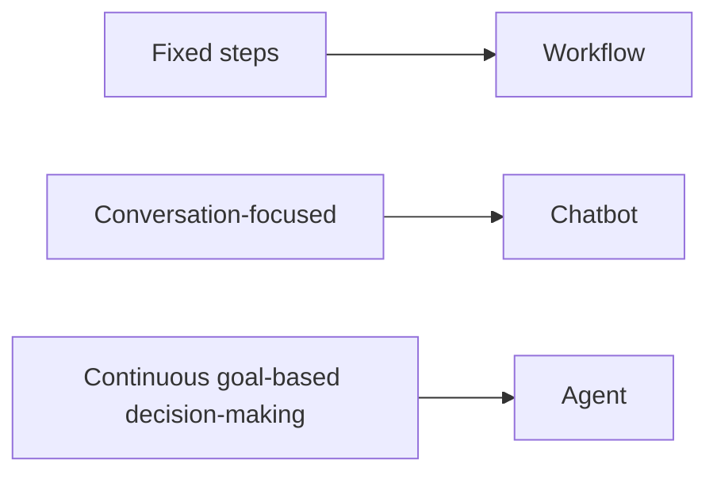
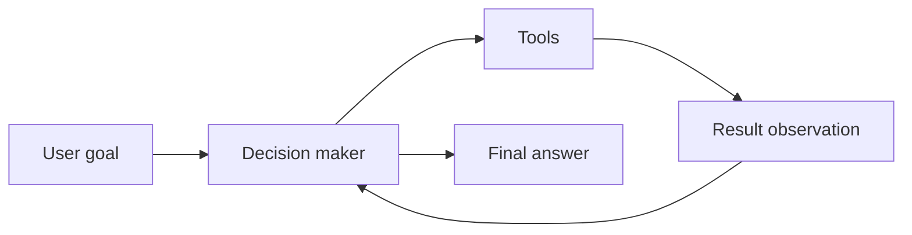
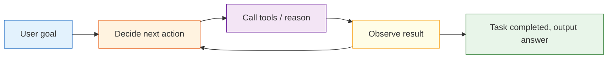

# 9.1.2 What Is an AI Agent


:::tip[Section Overview]
Beginners often misunderstand an Agent as:

- a model that is simply better at chatting

A more accurate understanding is:

- a system that repeatedly performs “judge -> act -> observe -> judge again” around a goal

So the most important thing in this section is not to idealize the Agent first, but to distinguish it from:

- workflows
- chatbots
- one-time function calls

Make these system boundaries clear first.
:::
## Learning Goals

By the end of this section, you will be able to:

- clearly explain the differences between workflows, chatbots, and Agents
- understand the minimal components of an Agent
- run a mini Agent example with tool calling
- understand why an Agent is more than “just wrapping a prompt”

---

## How This Section Connects to the Earlier Main Thread of LLM Applications

If you just finished Stage 8B, you can understand this section as follows:

- earlier, you already learned to build systems with “model + knowledge + tools + application”
- this section starts answering: when do these systems step into Agent territory instead of remaining fixed workflows?

So the real importance of this section is not a single definition, but:

- first separate Agent from workflows, chat systems, and function-call systems

### A Better Overall Analogy for Beginners

You can think of these three system types like this:

- workflow: a fixed subway line
- chatbot: a front desk receptionist
- Agent: an assistant that decides for itself what to do next

Of course, this assistant can talk,
but its real key point is not “being able to chat” — it is:

- whether it can organize a chain of actions toward a goal

## Don’t Rush to Put Agent on a Pedestal

When many people first hear about Agents, they imagine them as “AI employees that can think and execute tasks autonomously.”

That description is not entirely wrong, but it can be too abstract.

A more stable understanding is:

> **Agent = a system that completes tasks step by step based on goals, state, and tools.**

It usually has these abilities:

- receive a goal
- break down steps
- call tools
- continue acting based on results
- stop when appropriate

### When Learning Agent for the First Time, What Should You Focus on First?

The first thing to focus on is not the word “autonomous,” but this sentence:

> **The key of an Agent is not that it can talk, but that it can organize a chain of actions around a goal.**

Once this idea is stable, when you later look at:

- planning
- tools
- memory
- multi-Agent systems

you will more naturally understand why they exist.

---

## What Is the Difference Between Workflows, Chatbots, and Agents?

### Workflow

Every step is written in advance:

1. user asks a question
2. query the database
3. assemble the prompt
4. return the answer

This is more like a fixed pipeline.

### Chatbot

The focus is on “conversation.”
It may not proactively break down tasks or use external tools.

### Agent as a System Role

The focus is on “dynamically choosing actions to achieve the goal.”

For example, an Agent may:

1. first judge what the user wants
2. then decide whether to check the weather, search docs, or calculate
3. after getting the result, organize the output

### Why Must These Three Concepts Be Separated First?

Because many systems look like they “just connect a model,” but their engineering forms are completely different:

- workflow is more like a fixed route
- chatbot is more like a conversation interface
- Agent is more like a goal-driven execution system

If you don’t separate these boundaries at the beginning, later it becomes easy to:

- call anything with many tools an Agent
- think something is an Agent just because it has state
- mistake a chatting system for an Agent

### A System Boundary Diagram That Beginners Can Remember First



This diagram is very important because it helps beginners first see:

- an Agent is not “a smarter chat box”
- instead, the way the system is controlled changes


:::tip[Reading Tip]
When reading this diagram, don’t first ask who is more “intelligent.” Instead, look at where the control lies: the workflow path is predefined by the program, the chatbot mainly handles replies, and the Agent repeatedly decides the next action around a goal.
:::
---

## The Minimal Components of an Agent

You can first break an Agent into 4 parts:

| Component | Role |
|---|---|
| Goal | What needs to be accomplished this time |
| Model / decision-maker | What to do next |
| Tools | What external capabilities can be called |
| State / memory | Where the current task has progressed to |

### When You See These Four Parts for the First Time, What Is the Most Worth Remembering Sentence?

You can remember this first:

> **Agent = goal + decision + tools + state.**

Later, many chapters in 9 AI Agent and Intelligent Agent Systems are essentially expanding these four parts.

An analogy:

> An Agent is like an intern who can get things done: there is a task goal, a toolbox, work records, and they still need to decide the next step on their own.

### Look at Another Minimal “Candidate Action” Example

```python
def choose_action(query):
    if "weather" in query:
        return "use_weather_tool"
    if "refund" in query or "certificate" in query:
        return "use_docs_tool"
    if "calculate" in query:
        return "use_calculator"
    return "reply_directly"


for query in ["What's the weather in Beijing", "What is the refund policy", "calculate 7 * 8"]:
    print(query, "->", choose_action(query))
```

Expected output:

```text
What's the weather in Beijing -> use_weather_tool
What is the refund policy -> use_docs_tool
calculate 7 * 8 -> use_calculator
```

This example is very suitable for beginners because it helps you grasp one core action first:

- an Agent does not answer first
- it first decides what to do next

### A System Boundary Diagram That Beginners Can Remember First



This diagram is especially important because it reminds you:

- the key of an Agent is not just outputting one sentence
- instead, it enters a closed loop of “goal -> action -> observation”


:::tip[Reading Tip]
You can read this diagram as a timeline: after the goal enters the system, the Agent leaves behind action, observation, and state updates in each round. When debugging an Agent later, you don’t just look at the final answer — you look at this trace that can be reviewed afterward.
:::
---

## A Mini Agent That Does Not Depend on a Large Model

To make the principle clearer, let’s not use a real large model yet. Instead, we’ll write a “rule-based Agent.”

```python
import ast
import operator

OPS = {
    ast.Add: operator.add,
    ast.Sub: operator.sub,
    ast.Mult: operator.mul,
    ast.Div: operator.truediv,
}


def safe_calculate(expression):
    def visit(node):
        if isinstance(node, ast.Expression):
            return visit(node.body)
        if isinstance(node, ast.Constant) and isinstance(node.value, (int, float)):
            return node.value
        if isinstance(node, ast.BinOp) and type(node.op) in OPS:
            return OPS[type(node.op)](visit(node.left), visit(node.right))
        if isinstance(node, ast.UnaryOp) and isinstance(node.op, ast.USub):
            return -visit(node.operand)
        raise ValueError("unsupported_expression")

    return visit(ast.parse(expression, mode="eval"))


def tool_weather(city):
    fake_weather = {
        "Beijing": "Sunny, 22°C",
        "Shanghai": "Cloudy, 25°C",
        "Shenzhen": "Light rain, 28°C"
    }
    return fake_weather.get(city, "No weather data available for this city")

def tool_calculate(expression):
    return str(safe_calculate(expression))

def tool_search_docs(keyword):
    docs = {
        "refund": "You can apply for a refund within 7 days of purchase and if your learning progress is below 20%.",
        "certificate": "You can receive a certificate after completing all required items and passing the final assessment."
    }
    for k, v in docs.items():
        if k in keyword:
            return v
    return "No relevant document found."

def simple_agent(user_query):
    steps = []

    if "weather" in user_query:
        city = "Beijing" if "Beijing" in user_query else "Shanghai" if "Shanghai" in user_query else "Shenzhen"
        steps.append(f"Detected a weather query, preparing to call the weather tool, city={city}")
        result = tool_weather(city)
        steps.append(f"Tool returned: {result}")
        final_answer = f"Current weather in {city}: {result}"

    elif "refund" in user_query or "certificate" in user_query:
        steps.append("Detected a knowledge query, preparing to call the docs tool")
        result = tool_search_docs(user_query)
        steps.append(f"Tool returned: {result}")
        final_answer = result

    elif "calculate" in user_query:
        expression = user_query.replace("calculate", "").strip()
        steps.append(f"Detected a calculation task, preparing to call the calculator tool, expression={expression}")
        result = tool_calculate(expression)
        steps.append(f"Tool returned: {result}")
        final_answer = f"The calculation result is: {result}"

    else:
        steps.append("No tool matched, replying with the default answer directly")
        final_answer = "I don’t yet know which tool to call."

    return steps, final_answer

query = "calculate 23 * 7"
steps, answer = simple_agent(query)

print("User question:", query)
print("Execution steps:")
for step in steps:
    print("-", step)
print("Final answer:", answer)
```

Expected output:

```text
User question: calculate 23 * 7
Execution steps:
- Detected a calculation task, preparing to call the calculator tool, expression=23 * 7
- Tool returned: 161
Final answer: The calculation result is: 161
```

This example is simple, but it already contains the core flavor of an Agent:

- recognize the task
- choose a tool
- get the result
- organize the output

---

## What Is the Relationship Between an Agent and “Function Calling”?

Agents often use function calling (Function Calling / Tool Calling), but the two are not exactly the same.

### Function Calling

The focus is on whether the model can produce structured parameters and correctly call a tool.

### The Boundary of Agent and Function Calling

The focus is on whether the model or system can dynamically decide around a goal:

- when to call a tool
- which tool to call
- how many times to call it
- what to do next after the call

So you can remember it like this:

> Tool calling is a common capability of an Agent, but an Agent is not just tool calling.

### Why Is This Step So Easy for Beginners to Mix Up?

Because many early demos all look like:

- identify intent
- call one tool
- answer with the result

But a real Agent goes further and cares about:

- when to call
- which tool to call
- what to do next after the call
- whether it needs to iterate further

## Why Is an Agent Harder Than a Normal Q&A System?

Because it adds an extra layer of “action.”

A normal Q&A system is more like:

- look at the input
- generate an answer

An Agent is more like:

- look at the input
- plan
- try to act
- observe the result
- then decide the next step

This brings more challenges:

- errors accumulate over multiple steps
- tool calls may fail
- cost and latency are higher
- safety risks are also greater

---

## A Looping Idea That Feels More Like an Agent

A real Agent system often looks like this:



This is why Agents emphasize:

- planning
- observation
- feedback
- iteration

### What Is Most Worth Understanding in This Loop Is Not the Diagram, But the “Closed Loop”

In other words, the key of an Agent is not a one-time output, but:

- look at the goal
- take an action
- observe the result
- then decide the next step

This is one of the most fundamental differences between it and a normal Q&A system.

### The Safest Default Order When Building Your First Agent Project

A more stable sequence is usually:

1. first implement single-step tool calling
2. then make the system able to choose actions
3. then add next-step judgment after observing results
4. finally introduce more complex planning and memory

This is easier than trying to build a “fully autonomous Agent” from the start, and it is much more likely to produce a truly controllable system.

## If You Turn This Into a Project or Notes, What Is Most Worth Showing?

What is most worth showing is usually not:

- a demo video that simply shows “it can call tools”

But rather:

1. the user goal
2. what action the Agent chose
3. why it chose that action
4. what the tool returned
5. how the Agent continued to the next step based on the result

This makes it easier for others to see:

- you understand the action loop
- you are not just wiring a model and tools together

---

## What Tasks Are Suitable for Agents?

### More Suitable

- multi-step tasks
- tasks that need external tools
- tasks that need strategy adjustments based on intermediate results

For example:

- research assistant
- automated reports
- data analysis assistant
- code fixing assistant

### Less Suitable

- simple FAQs that can be answered in one step
- tasks with completely fixed workflows
- scenarios that require extremely high stability and cannot tolerate free-form behavior

In many cases, **a workflow is actually more suitable than an Agent**.

---

## Common Beginner Mistakes

### Thinking “able to chat” means Agent

Wrong.
A chatbot does not necessarily act autonomously in steps.

### Thinking an Agent is definitely more advanced than a workflow

Not necessarily.
For simple and stable tasks, a workflow may be cheaper and more reliable.

### Thinking that adding tool calling solves everything

The more tools and steps you add, the harder debugging and safety become.

---

## Checklist: How to Tell Whether a System Is an Agent

Many beginners call “chatbots, RAG applications, and tool-calling applications” Agents. A safer way is to check with the table below first.

| Question | If the answer is “yes” | More like |
|---|---|---|
| Are the steps completely fixed? | It follows the same process every time | Workflow |
| Is the main goal continuous conversation? | The focus is on understanding context and replying | Chatbot |
| Is it only calling one tool once? | The user asks something and it calls one corresponding function | Tool-calling application |
| Does it decide the next step based on intermediate results? | Tool results affect later actions | Agent |
| Does it have clear stop conditions and execution records? | You can tell why it continued or stopped | Closer to a controllable Agent |

You can remember one rule first: if a system does not “observe the result and then decide the next step,” it is usually still just a workflow or a tool-calling application, and there is no need to rush into calling it an Agent.

## How Should Your First Agent Project Be Built to Stay Stable?

For your first Agent project, it is not recommended to start with a “fully automatic complex assistant.” A more stable version path is:

| Version | Goal | Acceptance Criteria |
|---|---|---|
| v0.1 Single-step tools | Can choose one tool based on the user question | Print tool_call, parameters, and tool result |
| v0.2 Multi-step execution | Can complete a 2–3 step task | Each step has a trace, and it never loops forever |
| v0.3 Failure recovery | Can explain and try an alternative when a tool fails | Has error logs and fallback answers |
| v0.4 Human confirmation | Requires confirmation before high-risk actions | Can distinguish read-only tools from write tools |
| v0.5 Project showcase | Has README, examples, failure cases, and safety boundaries | Can explain why the Agent acted this way |

This path helps you focus on the “controllable action loop” instead of chasing flashy autonomy.

## Agent Execution Trace Template

The most valuable thing to show in an Agent project is the execution process. It is recommended to record at least these fields for each run:

| Field | Example | Purpose |
|---|---|---|
| `goal` | Help me make a study plan for this week | User goal |
| `step` | 1 | Which step it is |
| `thought_type` | plan / tool / observe / final | Current stage type |
| `action` | search_course_docs | Action taken |
| `arguments` | `{topic: "RAG"}` | Tool parameters |
| `observation` | Found 3 relevant chapters | Return from the tool or environment |
| `next_decision` | Continue generating the plan | Why continue or stop |

A minimal trace might look like this:

```text
goal: Create a RAG study plan
step 1: action=search_course_docs, arguments={topic: RAG}
observation: Found 3 chapters on RAG basics, document processing, and retrieval strategies
step 2: action=build_plan, arguments={days: 3}
observation: A 3-day plan has been generated
final: Return the study plan and explain which chapters were referenced
```

Without a trace, when an Agent goes wrong, it is hard to locate the problem: did it misunderstand the goal, choose the wrong tool, pass the wrong parameters, get an abnormal tool return, or forget to define a stop condition?

## What an Agent Should Not Do

The stronger an Agent becomes, the more boundaries it needs. Especially in the beginner stage, remember: not everything is suitable to be executed autonomously by an Agent.

| Things an Agent should not do autonomously | More stable approach |
|---|---|
| Delete files, submit code, send messages, place orders or payments | Require human confirmation |
| Execute arbitrary code without whitelist restrictions | Restrict tool permissions and runtime environment |
| Keep trying forever until success | Set a maximum number of steps, maximum cost, and timeout |
| Make up conclusions when evidence is insufficient | Clearly allow “I don’t know” |
| Rely on memory to overwrite current facts | Read the current state first, then act |

This table is not meant to weaken the Agent, but to make it more like a reliable system. A truly engineered Agent is not mainly about “whether it can do many things by itself,” but about “whether it knows when to stop, when to ask a human, and when it should not act.”

---

## Evidence to Keep

Keep this page's proof of learning as a small evidence card:

```text
agent_boundary: how this differs from chatbot or fixed workflow
goal_state_action: goal, current state, next action, observation
architecture_parts: planner, tools, memory, guardrails, evaluator
failure_check: over-autonomy, vague goal, missing state, or no trace
next_action: build the smallest traceable single-agent loop
```

## Summary

The most important sentence in this section is:

> **An Agent is not a “talking model,” but a “system that can take actions around a goal.”**

Its value is not only in answering, but in completing tasks.
In the next chapters, we will continue to expand on reasoning, tools, memory, multi-Agent systems, deployment, and safety.

## What You Should Take Away From This Section

- The key of an Agent is not conversation, but the action loop
- Workflows, chat systems, function calling, and Agents must first be clearly separated
- In 9 AI Agent and Intelligent Agent Systems, all later modules are essentially expansions of these four parts: “goal + decision + tools + state”

---

## Exercises

1. Add another tool to `simple_agent()`, such as “check course schedule.”
2. Make the Agent support a two-step task like “first check the docs, then calculate.”
3. Think about this: if a tool returns an error message, how should the Agent handle it more safely?

<details>
<summary>Reference implementation and walkthrough</summary>

1. A new tool should have a clear name, input shape, return shape, and failure mode. For `check_course_schedule`, return a small structured result instead of a long paragraph.
2. A two-step task needs state between steps: the result of document lookup should be stored and passed into the calculation step, with a maximum-step guard.
3. The Agent should not hide tool errors or continue as if they were facts. It should classify the error, retry only when safe, ask for missing information if needed, or return a controlled failure message.

</details>
