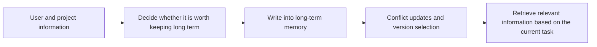

:::tip[Section Focus]
Short-term memory solves:

- What is happening in this task right now

Long-term memory solves:

- What a user, a project, or a system looks like over a longer time scale

Many Agents first think of long-term memory like this:

- Store important information

But when you actually build it, the question quickly becomes:

> **Which information is really worth keeping for the long term, and who should you trust when old and new information conflict?**
:::
## Learning Objectives

- Understand the boundary between long-term memory and short-term memory
- Learn to distinguish between user preferences, stable background, and temporary facts
- Understand the basic strategies for writing, updating, handling conflicts, and reading long-term memory
- Build a minimal long-term memory store with a runnable example

---

## First, Build a Map

Long-term memory is easier to understand in terms of “what to write -> how to update -> how to use”:



So what this section really wants to solve is:

- Why long-term memory is not just “store a little more”
- Why write and read strategies are equally important

---

## What Information Belongs in Long-Term Memory?

### Likely to Be Used Again in the Future

The most important criterion for long-term memory is not “looks important,”
but:

- It is likely to be reused in the future

For example:

- User preference: likes concise answers
- User background: is a beginner
- Project background: currently building a refund assistant

These pieces of information may keep being useful across many turns.

### Relatively Stable, Not Just Momentary Fluctuations

For example:

- “I’m in a bad mood today”
  is more like short-term context
- “Long-term preference for table summaries”
  is more like a long-term trait

If you write short-term fluctuations into long-term memory too,
the system will quickly learn a lot of noise.

### An Analogy

Long-term memory is more like a “user profile” and “project profile,”
not a chat history backup box.

A profile emphasizes:

- Stability
- Reusability
- A sense of versioning

### A Better Analogy for Beginners

You can think of long-term memory as:

- Maintaining profile cards for users and projects

What should go on those cards is:

- Information that will be used repeatedly in the future

Not:

- Temporary emotional fluctuations in this chat
- A casual request mentioned in passing

This analogy matters, because it helps beginners avoid turning long-term memory into an “infinite chat log” from the start.

---

## The Three Most Common Types of Long-Term Memory Content

### User Preferences

For example:

- Likes concise answers
- Likes Chinese
- Prefer output with tables

### Stable Background Information

For example:

- The user’s role is operations
- The user is working on a RAG project
- The team mainly uses Python

### Long-Term Task Context

For example:

- This week’s focus is optimizing the refund module
- What is the success criterion for the current project

This kind of information is not as short-lived as “the last 3 messages,”
and it is not quite like episodic memory tied to a single event.

---

## The Hardest Part of Long-Term Memory Is Not “Storing,” but “Updating”

### Because New Information May Overrule Old Information

For example, an earlier record says:

- The user likes detailed explanations

Later, the user repeatedly says:

- Please keep it concise from now on

At this point, the system cannot simply keep both records forever,
otherwise it will conflict when reading.

### So Long-Term Memory Usually Needs:

- Timestamps
- Confidence
- An update policy

Common strategies include:

- New records overwrite old records
- Old and new coexist, but higher confidence wins
- Keep version history and choose the latest at read time

### Why Is “Confidence” So Important?

Because a user’s casual remark should not necessarily be written in stone forever.
For example:

- “Don’t use tables for this one”

Does not necessarily mean:

- “Never use tables again”

So long-term memory should ideally have:

- Number of observations
- Explicitness
- Confidence level

### A Simple Write Decision Table for Beginners

| Information Type | More Suitable for Short-Term or Long-Term |
|---|---|
| Keep it concise for this one | More short-term |
| User likes Chinese in the long run | More long-term |
| Current project is a refund assistant | More long-term task background |
| I’m in a bad mood today | More short-term |

This table is very useful for beginners because it helps answer the easiest confusing question first:

- What exactly is worth putting into long-term memory


:::tip[Reading the Diagram]
Long-term memory is not “permanent chat history.” When reading the diagram, focus on write policy, confidence, version, and retrieval: the system must first decide whether something is worth writing, then handle conflicts between old and new information, and finally retrieve the relevant facts for the current task.
:::
---

## Run a Minimal Long-Term Memory Store First

This example does four things:

1. Writes long-term memory
2. Updates existing memory
3. Reads memory ordered by confidence and time
4. Isolates memory by user

```python
from dataclasses import dataclass


@dataclass
class LongTermFact:
    user_id: str
    key: str
    value: str
    confidence: float
    updated_at: int


class LongTermMemoryStore:
    def __init__(self):
        self.items = []
        self.clock = 0

    def _tick(self):
        self.clock += 1
        return self.clock

    def upsert(self, user_id, key, value, confidence=0.6):
        now = self._tick()

        for item in self.items:
            if item.user_id == user_id and item.key == key:
                # If the new value has higher confidence, overwrite the old one
                if confidence >= item.confidence:
                    item.value = value
                    item.confidence = confidence
                    item.updated_at = now
                return item

        fact = LongTermFact(
            user_id=user_id,
            key=key,
            value=value,
            confidence=confidence,
            updated_at=now,
        )
        self.items.append(fact)
        return fact

    def get_profile(self, user_id):
        records = [item for item in self.items if item.user_id == user_id]
        records.sort(key=lambda x: (x.confidence, x.updated_at), reverse=True)
        return {item.key: item.value for item in records}


store = LongTermMemoryStore()
store.upsert("u_001", "response_style", "detailed", confidence=0.4)
store.upsert("u_001", "response_style", "concise", confidence=0.9)
store.upsert("u_001", "language", "zh", confidence=0.8)
store.upsert("u_002", "response_style", "table", confidence=0.7)

print("u_001 profile:", store.get_profile("u_001"))
print("u_002 profile:", store.get_profile("u_002"))
```

Expected output:

```text
u_001 profile: {'response_style': 'concise', 'language': 'zh'}
u_002 profile: {'response_style': 'table'}
```

### What Is the Most Important Thing to Notice Here?

Not “can it be stored,”
but:

- The same key can be updated
- Higher-confidence information overwrites the old value
- Reading is aggregated by user profile

This is already much closer to real long-term memory than “just append a string to a list.”

### Why Is `key-value` a Good Fit Here?

Because many pieces of information in long-term memory are naturally profile-like:

- `response_style`
- `language`
- `project_name`

For these kinds of data, a key-value structure is easier to control than a plain text paragraph.

### When Is This Form Not a Good Fit?

If the information is more like a story or an experience,
then it is better suited for:

- Episodic memory

rather than simple key-value storage.

### Another Minimal “Write Decision” Example

```python
facts = [
    {"text": "Please use Chinese from now on", "stability": "high", "target": "long_term"},
    {"text": "Keep this answer short for this time", "stability": "low", "target": "short_term"},
]

for fact in facts:
    print(fact)
```

Expected output:

```text
{'text': 'Please use Chinese from now on', 'stability': 'high', 'target': 'long_term'}
{'text': 'Keep this answer short for this time', 'stability': 'low', 'target': 'short_term'}
```

Although this example is very small, it is great for helping beginners build one key habit first:

- Before writing memory, ask whether this information is really long-term or short-term

---

## How Should Long-Term Memory Be Read Without Becoming “Too Much and Too Messy”?

### Don’t Put Everything into the Context When Reading

Even if long-term memory stores many records,
not all of them are relevant when answering the current question.

A better approach is:

- Filter by user first
- Then filter by key or topic
- Finally retrieve only the few most relevant items

### A Minimal Topic-Based Filtering Example

```python
def select_relevant_profile(profile, query):
    selected = {}
    if "answer" in query or "style" in query:
        if "response_style" in profile:
            selected["response_style"] = profile["response_style"]
    if "Chinese" in query or "language" in query:
        if "language" in profile:
            selected["language"] = profile["language"]
    return selected


profile = store.get_profile("u_001")
print(select_relevant_profile(profile, "keep the response style consistent later"))
```

Expected output:

```text
{'response_style': 'concise'}
```

This shows that long-term memory only becomes truly effective
when the retrieval strategy is also good.

### The Most Stable Default Order for Your First Long-Term Memory System

A safer default sequence is usually:

1. First store only the most stable user preferences
2. First use a simple key-value profile
3. First make the conflict update rules clear
4. Then add more complex reading and retrieval strategies

This is usually much easier to make stable than building a “big and complete memory system” from the start.

---

## If Your Goal Is a “Knowledge-Base-Driven SOP Document Assistant,” What Information Is Worth Storing Long Term?

The easiest mistake in this kind of project is:

- Storing every SOP topic into long-term memory

In reality, many topics are just one-off tasks
and are not suitable for long-term retention.

What is more suitable for long-term memory is often stable preference data like this:

| Information | More Long-Term or Short-Term |
|---|---|
| User prefers output in Word in the long run | Long-term |
| User likes concise checklist style in the long run | Long-term |
| The current task is to draft a “refund escalation SOP” | Short-term |
| Only 2 handled cases are needed this time | More short-term |
| User usually writes for frontline support teams | Long-term or semi-long-term |

You can compress this into one sentence:

> **Long-term memory stores preferences and stable background, while short-term state stores current task details.**

### A More Realistic Long-Term Profile Example

```python
profile = {
    "preferred_doc_format": "word",
    "preferred_style": "concise checklist",
    "preferred_language": "zh/en/ja",
    "default_audience": "frontline support",
    "prefer_source_refs": True,
}

print(profile)
```

Expected output:

```text
{'preferred_doc_format': 'word', 'preferred_style': 'concise checklist', 'preferred_language': 'zh/en/ja', 'default_audience': 'frontline support', 'prefer_source_refs': True}
```

What beginners should notice most here is:

- Long-term memory is not about remembering “what to write this time”
- It is about helping the system remember “how you usually like it written”

---

## The Most Common Pitfalls in Long-Term Memory

### Mistake 1: Writing It Permanently After Hearing It Once

This causes many accidental preferences to become permanently fixed.

### Mistake 2: Not Separating Long-Term Memory from Short-Term Memory

The result is:

- Current conversation information and long-term profiles get mixed together

The system becomes more and more disorganized.

### Mistake 3: Only Writing, But Never Updating or Handling Conflicts

If conflicts are not handled, long-term memory will eventually contradict itself.

## If You Turn This into a Project or System Design, What Is Most Worth Showing?

What is most worth showing is usually not:

- “I stored a lot of history”

But rather:

1. Which information goes into long-term memory
2. How conflicting information gets updated
3. Which relevant profiles are retrieved for the current task
4. Why this strategy will not make the system more and more messy as it stores more

That way, others can more easily see:

- You understand a long-term profile system
- Not just a message warehouse

---

## Evidence to Keep

Keep this page's proof of learning as a small evidence card:

```text
memory_type: short-term, long-term, episodic, or procedural
write_rule: when memory is created or updated
retrieve_rule: query, relevance, recency, and permission check
failure_check: stale memory, privacy leak, contradiction, or over-retrieval
cleanup_action: summarize, merge, expire, delete, or ask for confirmation
```

## Summary

The most important thing in this section is not to understand long-term memory as “store more information,”
but to understand its essence:

> **Long-term memory builds a stable profile for the Agent that updates over time, rather than hoarding historical messages.**

As long as you hold on to the three keywords “stable, reusable, and updatable,”
you will not go off track when designing a long-term profile system later.

---

## Exercises

1. Add a `source` field to the example to distinguish between “explicit user statement” and “system inference,” then make the write policy treat the two differently.
2. Think about why `Keep it concise for this one` should not necessarily be written directly as a long-term preference.
3. If user preferences change frequently, would you use overwrite, version retention, or confidence decay? Why?
4. How would you combine long-term memory and short-term memory to support the current response?

<details>
<summary>Reference implementation and walkthrough</summary>

1. A `source` field lets the write policy trust explicit user statements more than system inferences, and require confirmation before storing inferred preferences.
2. `Keep it concise for this one` is scoped to the current task, so it should remain short-term unless the user states it as a durable preference.
3. For changing preferences, version retention plus confidence decay is often safer than blind overwrite because it preserves history and reduces stale memory impact.
4. Use long-term memory for stable preferences and facts, then combine it with short-term memory for the current goal, constraints, recent corrections, and retrieved evidence.

</details>
