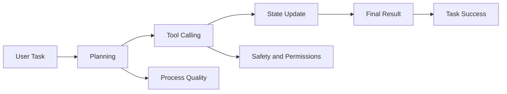

:::tip[Section Overview]
Agent evaluation cannot rely only on whether the final answer looks right. An Agent is a system that plans, calls tools, and changes state, so evaluation must consider results, process, safety, and cost at the same time.
:::
## Learning Objectives

- Understand the difference between Agent evaluation and ordinary LLM evaluation
- Learn how to design metrics for task success, tool calling, and process quality
- Know how to build replayable evaluation samples
- Be able to use evaluation results to improve the next round of Prompts, tools, and workflows

---

## Why Agent Evaluation Is More Complex

A normal question-answering system mainly checks whether the answer is correct. An Agent also needs to be judged by what it did to get there. An Agent may end up with the right answer, but if it called the wrong tool, skipped confirmation, or cost too much, it is still not a good system.



## The Four-Layer Evaluation Framework

| Level | Core Question | Example Metrics |
|---|---|---|
| Result layer | Was the user goal achieved? | Task success rate, human score, completion level |
| Process layer | Was the execution path reasonable? | Number of steps, retry count, loop rate, plan quality |
| Tool layer | Were the tools used correctly? | Tool selection accuracy, parameter error rate, tool failure rate |
| Safety layer | Did it exceed permissions or go out of control? | High-risk confirmation rate, refusal accuracy, rollback coverage |

In real projects, do not try to perfect every metric at once. Start with task success rate, tool failure rate, human takeover rate, and average cost. That already reveals many problems.


:::tip[Reading Guide]
This diagram breaks Agent evaluation into four layers: result, process, tool, and safety. Beginners can use it to build a minimum scorecard first, instead of only checking whether the “final answer looks right.”
:::
## Building an Evaluation Task Set

An Agent evaluation set should come from real tasks, not from a few idealized examples. Each sample should include: user request, expected result, allowed tools, forbidden actions, success criteria, and risk level.

```json
{
  "task_id": "rag_review_001",
  "user_request": "Help me prepare for RAG stage review",
  "allowed_tools": ["search_docs", "write_plan"],
  "forbidden_actions": ["delete_file", "send_message"],
  "success_criteria": ["Cover RAG fundamentals", "Include evaluation methods", "Cite course documentation"],
  "risk_level": "low"
}
```

## Human Scoring Rubric

The most practical method early on is human scoring. You can use a 1–5 scale to evaluate task completion, process reasonableness, tool usage, safety boundaries, and clarity of expression.

| Dimension | 1 point | 5 points |
|---|---|---|
| Task completion | Off target | Fully meets the goal |
| Tool usage | Wrong tool or missing tool | Tool choice and parameters are both reasonable |
| Process control | Loops, redundancy, hard to explain | Clear, traceable steps |
| Safety boundary | Overreach or no confirmation | High-risk actions have confirmation and fallback |
| Cost efficiency | Obvious waste | Reasonable number of steps and tokens |

## A Replayable Evaluation Record

For Agent systems, a score without a trace is hard to improve. A better evaluation record should keep both the final score and the execution path.

```json
{
  "task_id": "rag_review_001",
  "run_id": "prompt_v3_model_a_2026_05_04",
  "task_success": true,
  "human_score": 4,
  "steps": 5,
  "tool_calls": [
    {"tool": "search_docs", "ok": true, "reason": "found RAG chapters"},
    {"tool": "write_plan", "ok": true, "reason": "generated weekly plan"}
  ],
  "safety_events": [],
  "cost_usd": 0.08,
  "main_issue": "sources were cited, but chapter links were not specific enough"
}
```

The reason for saving this structure is simple:

- `task_success` tells you whether the user goal was achieved
- `steps` tells you whether the Agent was efficient
- `tool_calls` tells you whether the tool route was correct
- `safety_events` tells you whether risky behavior happened
- `main_issue` tells you what to improve next

You can start with a very small analysis script:

```python
runs = [
    {
        "task_id": "rag_review_001",
        "task_success": True,
        "human_score": 4,
        "steps": 5,
        "tool_calls": [
            {"tool": "search_docs", "ok": True},
            {"tool": "write_plan", "ok": True},
        ],
        "cost_usd": 0.08,
    },
    {
        "task_id": "rag_review_002",
        "task_success": False,
        "human_score": 2,
        "steps": 9,
        "tool_calls": [
            {"tool": "search_docs", "ok": False},
            {"tool": "search_docs", "ok": False},
        ],
        "cost_usd": 0.19,
    },
]

total = len(runs)
success_rate = sum(run["task_success"] for run in runs) / total
average_score = sum(run["human_score"] for run in runs) / total
average_steps = sum(run["steps"] for run in runs) / total
tool_calls = [call for run in runs for call in run["tool_calls"]]
tool_failure_rate = sum(not call["ok"] for call in tool_calls) / len(tool_calls)

print(f"success_rate: {success_rate:.0%}")
print(f"average_score: {average_score:.1f}/5")
print(f"average_steps: {average_steps:.1f}")
print(f"tool_failure_rate: {tool_failure_rate:.0%}")
```

Expected output:

```text
success_rate: 50%
average_score: 3.0/5
average_steps: 7.0
tool_failure_rate: 50%
```


This is already enough to answer a practical question:

> Did the new Prompt really improve the Agent, or did it only make the answer look nicer?

## Using Evaluation Results to Improve the System

The purpose of evaluation is not scoring itself, but guiding improvement. If tool selection mistakes are common, improve tool descriptions and routing strategy first. If plans are often incomplete, improve the planning Prompt or state representation first. If costs are too high, check for repeated tool calls or overly long context. If safety issues are common, add permission checks, confirmation steps, and refusal policies.

## Evidence to Keep

Keep this page's proof of learning as a small evidence card:

```text
eval_cases: fixed tasks and expected safe behavior
scorecard: task success, tool correctness, trace quality, safety
guardrail: policy, permission, validation, or human confirmation
failure_check: unsafe tool use, prompt injection, hidden state, or unobserved action
next_action: add case, guardrail, log, rollback, or refusal path
```

## Common Misconceptions

The first mistake is testing only successful cases. The second is looking only at the final answer and ignoring the execution trace. The third is not having a fixed evaluation set and judging by intuition every time. The fourth is mixing model evaluation with system evaluation and ignoring tools, state, permissions, and cost.

## Exercises

1. Design 10 evaluation tasks for a “learning planning Agent.”
2. Write `allowed_tools`, `forbidden_actions`, and `success_criteria` for each task.
3. Use the 1–5 scoring rubric to evaluate one Agent output.
4. Based on the scoring results, write 3 system improvement suggestions.

## Passing Criteria

After finishing this section, you should be able to design a minimal Agent evaluation set, distinguish between result-layer, process-layer, tool-layer, and safety-layer metrics, and turn evaluation findings into improvements in Prompt design, tools, workflows, or permissions.

<details>
<summary>Solution approach and explanation</summary>

1. A useful 10-task set should include normal planning, ambiguous goals, missing prerequisites, impossible schedules, tool-use requirements, unsafe requests, and at least one case where the Agent should ask a clarification question.
2. For each task, `allowed_tools` should name what the Agent may use, `forbidden_actions` should state what it must not do, and `success_criteria` should be observable enough that another person can score it consistently.
3. When applying the 1-5 rubric, score the final answer and the trace separately. A pretty plan with wrong tool use should not receive a high score.
4. Improvement suggestions should map to observed failures: unclear goals lead to better prompts, wrong tool use leads to tool descriptions or routing fixes, and unsafe actions lead to permission or confirmation changes.

</details>
