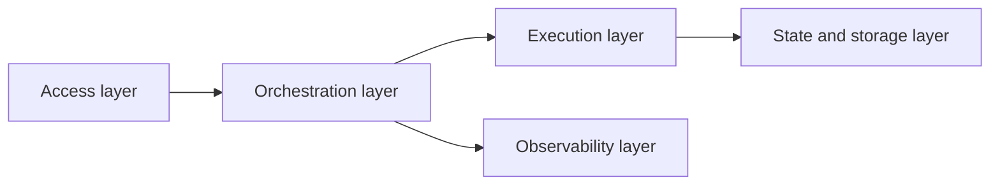
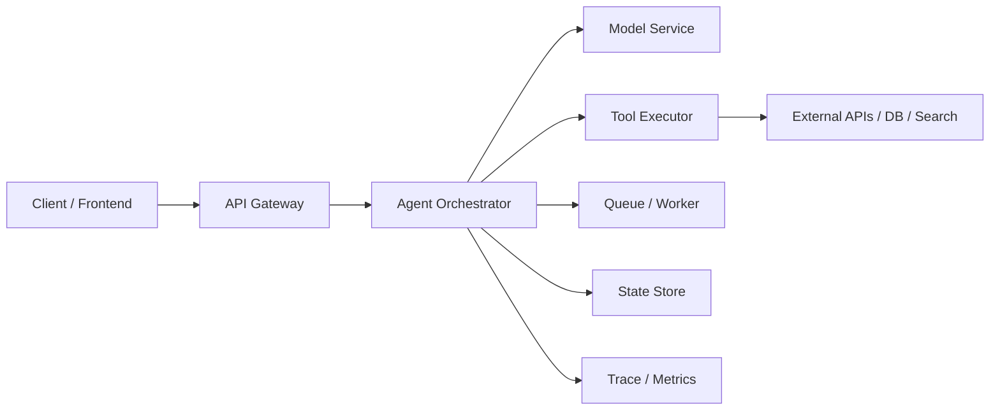

# 9.9.2 Agent Deployment Architecture

:::tip[Section overview]
Many Agent projects start as just a script:

- Receive a request
- Call the model
- Print the answer

But when it goes to production, what we usually need is not “a script,” but an architecture.

Because after launch, the system must handle all of the following at the same time:

- Concurrency
- State
- Tool dependencies
- Log auditing
- Fault recovery

What we want to build in this section is that architecture map.
:::
## Learning objectives

- Understand the layered structure of the core modules in an Agent deployment architecture
- Understand why “model service” is only one layer
- Master how requests flow through the architecture with a runnable example
- Build an overall view from demo to production system

---

## First, build a map

An Agent deployment architecture is easier to understand by asking: “Where does the request enter, where are decisions made, where is state stored, and how is it observed?”



So what this section really wants to solve is:

- Why does a script turn into so many layers once it becomes a production system?
- Why is the model service only part of the execution layer?

---

## What layers does a production-ready Agent system usually include?

### Access layer

Responsible for:

- Receiving HTTP / WebSocket / internal RPC requests
- Authentication, rate limiting, and routing

### Orchestration layer

Responsible for:

- Selecting the workflow
- Calling the model
- Deciding when to call tools
- Managing task state

This layer is often the “outer brain” of the Agent.

### Execution layer

Responsible for:

- Actual tool calls
- Model inference services
- Retrieval services
- External API calls

### State and storage layer

Responsible for:

- Session state
- Long-term memory
- Task checkpoints
- Logs and auditing

### Observability layer

Responsible for:

- Metrics
- Traces
- Error alerts

### A more beginner-friendly analogy

You can think of an Agent deployment architecture like this:

- A company receives customers, assigns tasks, asks employees to do the work, keeps records, and then checks the operations report later

If you try to make one person do everything,
it may work for a short time,
but once concurrency, state, tools, and failures show up, the system will quickly lose control.

This analogy is especially useful for beginners because it helps you first understand:

- Layering is not for complexity
- It is for separating different responsibilities

---

## Why isn’t “model API + a few tools” enough to be called an architecture?

### Because there is no state boundary

Once a task becomes longer, the system must clearly answer:

- Which step are we on now?
- What was the result of the previous step?
- How do we recover after a failure?

### Because there is no execution boundary

The model should not directly take on:

- Permission control
- Timeout policies
- Tool auditing

These are more suitable for the architecture layer to handle.

### Because there is no observability boundary

If something goes wrong in production but you cannot answer:

- Which tool is the bottleneck?
- Which type of request is the slowest?
- Which path fails most often?

then the system will be very hard to maintain over time.

---

## First, let’s look at a minimal architecture flow example

This example does not actually start a service,
but it very clearly shows how a request flows through the architecture:

1. The access layer receives the request
2. The orchestration layer selects the tool
3. The execution layer calls the tool
4. The storage layer records the state
5. The observability layer records the trace

```python
def gateway(request):
    return {
        "request_id": request["request_id"],
        "user_id": request["user_id"],
        "message": request["message"],
    }


def orchestrator(envelope):
    if "refund" in envelope["message"]:
        return {"workflow": "refund_flow", "tool": "search_policy"}
    return {"workflow": "default_flow", "tool": "none"}


def tool_executor(tool_name, message):
    if tool_name == "search_policy":
        return {"policy_text": "Refunds must be within 7 days and the learning progress must be below 20%."}
    return {"note": "no_tool_used"}


def state_store(request_id, workflow, observation):
    return {
        "request_id": request_id,
        "workflow": workflow,
        "observation": observation,
    }


def trace_logger(request_id, stage, payload):
    return {"request_id": request_id, "stage": stage, "payload": payload}


request = {"request_id": "req-001", "user_id": "u-01", "message": "Please tell me the refund policy"}

envelope = gateway(request)
trace = [trace_logger(envelope["request_id"], "gateway", envelope)]

decision = orchestrator(envelope)
trace.append(trace_logger(envelope["request_id"], "orchestrator", decision))

observation = tool_executor(decision["tool"], envelope["message"])
trace.append(trace_logger(envelope["request_id"], "tool_executor", observation))

persisted = state_store(envelope["request_id"], decision["workflow"], observation)
trace.append(trace_logger(envelope["request_id"], "state_store", persisted))

for item in trace:
    print(item)
```

Expected output:

```text
{'request_id': 'req-001', 'stage': 'gateway', 'payload': {'request_id': 'req-001', 'user_id': 'u-01', 'message': 'Please tell me the refund policy'}}
{'request_id': 'req-001', 'stage': 'orchestrator', 'payload': {'workflow': 'refund_flow', 'tool': 'search_policy'}}
{'request_id': 'req-001', 'stage': 'tool_executor', 'payload': {'policy_text': 'Refunds must be within 7 days and the learning progress must be below 20%.'}}
{'request_id': 'req-001', 'stage': 'state_store', 'payload': {'request_id': 'req-001', 'workflow': 'refund_flow', 'observation': {'policy_text': 'Refunds must be within 7 days and the learning progress must be below 20%.'}}}
```

### What is this code really teaching?

Not “how to write a few functions,”
but to help you form a clear mental layering:

- Request entry
- Decision logic
- Tool execution
- State persistence
- Trace logging

Once these layers are clearly separated, the architecture starts to stabilize.

### Why should the orchestration layer and execution layer be separated?

Because:

- The orchestration layer is responsible for “deciding”
- The execution layer is responsible for “doing the work”

If the two are mixed together, it becomes difficult later to do:

- Security control
- Independent scaling
- Debugging

### Why can’t state storage be just logs?

Because logs are more like “what happened.”
True state also includes:

- Current step
- Current context
- Whether recovery is possible

It is more about “can continue execution” than just “has happened.”

### A beginner-friendly layer table to remember first

| Layer | Most important responsibility to remember |
|---|---|
| Access layer | Receive requests, handle authentication and rate limiting |
| Orchestration layer | Decide which path to follow |
| Execution layer | Actually call models and tools |
| State layer | Remember where the current task is |
| Observability layer | Tell you where the system is having problems |

This table is great for beginners because it compresses “there are many architecture layers” back into five very clear roles.


:::tip[Reading the diagram]
This diagram is best read as a request flow: the access layer receives the request, the orchestration layer decides the process, the task queue smooths spikes, the execution layer calls models and tools, the state layer saves checkpoints, and the observability layer records traces and alerts.
:::
---

## What does a more common production architecture look like?

It can usually be abstracted into the following chain:



The key points in this diagram are:

- The model service is only part of the execution layer
- The tool system is usually an independent execution layer
- State and observability should both exist as independent support layers

---

## When do you need queues and asynchronous workers?

### Long-running tasks

For example:

- Generating long reports
- Multi-stage data organization
- Multi-tool asynchronous workflows

### Tasks that should not block the user request

For example:

- Batch summarization
- Weekly report generation
- Long-chain analysis

### Why are queues helpful?

They can provide:

- Asynchronous decoupling
- Rate-limiting buffers
- Retry on failure

But the tradeoff is:

- The system becomes more complex
- State management becomes harder

### The safest default order when designing deployment for the first time

A safer order is usually:

1. First separate the access, orchestration, and execution layers
2. First make the state write points clear
3. First add trace and metrics
4. Only then decide whether you really need queues and asynchronous workers

This makes it easier to establish the main architecture path than introducing lots of middleware from the start.

---

## The most common architecture mistakes

### Mistake 1: Put all logic into one service

It may be simple at the beginning, but later it becomes:

- Tool execution tightly coupled with orchestration
- Hard to scale
- Hard to observe

### Mistake 2: Having a database means you have a stateful architecture

A database is only a storage method.
What really matters is whether you have thought through:

- What to store
- When to write
- Who will recover it

### Mistake 3: Adding trace and metrics only after launch

Without observability, when something goes wrong, you can almost only guess.

## If you turn it into a project or system design, what is most worth showing?

What is most worth showing is usually not:

- A diagram full of service names

But rather:

1. How the request flows through each layer
2. Which layer is responsible for decision-making and which for execution
3. Where state is written and why
4. How traces help you locate problems when errors happen

This makes it easier for others to see:

- That you understand the logic of architectural layering
- Not just that you drew a diagram

---

## Evidence to Keep

Keep this page's proof of learning as a small evidence card:

```text
runtime: queues, workers, state store, tool services, and model endpoint
persistence: checkpoints, event log, memory store, and recovery path
ops_signal: latency, cost, error rate, trace coverage, and saturation
failure_check: stuck run, duplicate action, partial failure, or runaway cost
recovery_action: resume, rollback, cancel, human handoff, or degrade gracefully
```

## Summary

What matters most in this section is not memorizing how many infrastructure names there are,
but building a clear deployment map:

> **A production-ready Agent system should at least clearly separate the access, orchestration, execution, state, and observability layers; the model is only one layer of it, not the whole thing.**

Once this map is firmly in your mind,
you will have a much smoother time later when dealing with runtime, recovery, cost, and production practices.

---

## Exercises

1. Expand `search_policy` in the example into a workflow that requires two tools to cooperate, and observe which layer is most suitable for state aggregation.
2. If you want to support asynchronous execution for long-running tasks, where would you place the queue? Why?
3. Why can’t “model service” be treated as the same thing as “Agent architecture”?
4. Think about it: which part is your current project missing most, the access layer, execution layer, or observability layer?

<details>
<summary>Project reference and review notes</summary>

1. A two-tool workflow might retrieve policy first, then check eligibility or summarize the answer. State aggregation usually belongs in the execution/orchestration layer because it sees both tool results and the current task state.
2. Put the queue between the access layer and execution layer, or inside the execution layer boundary. It protects the user-facing API from long-running work and gives you retry, status, and cancellation control.
3. Model service is only one dependency. Agent architecture also includes tools, state, memory, permissions, queues, traces, retries, and safety gates.
4. Diagnose your project by asking what would break first under real users: request intake, task execution, or observability. The missing layer is the one that would make failures invisible or unrecoverable.

</details>
