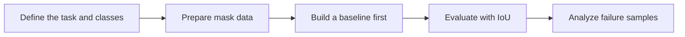

# 10.4.4 Segmentation Practice

:::tip[Section Overview]
The biggest challenge in a segmentation project is often not the model name,
but:

- mask annotation quality
- class imbalance
- whether the evaluation method is reasonable

So the main goal of this section is to clearly explain the framework of a minimal segmentation project.
:::
## Learning Objectives

- Learn how to define a minimal segmentation project
- Understand the basic organization of mask data and metrics
- Build intuition for project evaluation through a runnable example
- Learn how to present the most important results in a segmentation project

---

## First, Build a Map

If you just finished learning semantic segmentation and instance segmentation, the most natural continuation in this section is:

- You already know what objects like mask and IoU are doing
- Now we ask, “If we turn this into a real project, which parts are most likely to go wrong first?”

So what really matters in this section is not a new network, but:

- mask annotation
- class definition
- evaluation method
- failure sample presentation

For beginners, the best order for understanding this section is not “train a model directly,” but to first understand the project loop:



So what this section really wants to solve is:

- How should a segmentation project move forward?
- Besides the model, where are the places most likely to fail in a project?

### A More Beginner-Friendly Overall Analogy

You can think of a segmentation project as:

- carefully coloring a batch of maps

The difficulty is not just “can you color it at all,” but:

- Is each boundary colored accurately?
- Were small regions missed?
- Is everyone following the same standard while coloring?

Once you think about it this way, it becomes much easier to understand why segmentation projects depend so much on:

- mask quality
- boundary standards
- failure sample analysis

## How Do You Define the Project Problem?

A very suitable segmentation project for practice is:

- road scene segmentation

Or:

- medical region segmentation

Shared characteristics:

- clear mask labels
- region boundaries matter
- IoU is meaningful

### When a Beginner Does a Segmentation Project for the First Time, How Should They Choose a Task?

A more stable task usually has these characteristics:

- not too many classes
- relatively clear region boundaries
- failure samples that are easy to understand visually

So when you do a project for the first time,
“fewer classes, strong boundaries, easy to explain” is usually more important than “the task looks cooler.”

### Why Is “Clear Boundaries” So Important?

Because many of the hard parts in segmentation tasks are concentrated in:

- boundaries
- small regions
- places where classes are mixed together

If you start with a task whose boundaries are especially blurry and whose annotation standards are unstable,
it will be hard to tell:

- whether the model is poor
- or whether the labels themselves are unstable

---

## First Run a Minimal Segmentation Project Evaluation Example

```python
pred_masks = [
    [[0, 0, 1], [0, 1, 1], [0, 0, 1]],
    [[1, 1, 0], [1, 0, 0], [1, 0, 0]],
]

gt_masks = [
    [[0, 0, 1], [0, 1, 1], [0, 1, 1]],
    [[1, 1, 0], [1, 1, 0], [1, 0, 0]],
]


def iou(mask_a, mask_b, target=1):
    inter = 0
    union = 0
    for row_a, row_b in zip(mask_a, mask_b):
        for a, b in zip(row_a, row_b):
            if a == target and b == target:
                inter += 1
            if a == target or b == target:
                union += 1
    return inter / union if union else 0.0


ious = [iou(pred, gt) for pred, gt in zip(pred_masks, gt_masks)]
mean_iou = sum(ious) / len(ious)

print("ious:", [round(x, 4) for x in ious])
print("mean_iou:", round(mean_iou, 4))
```

Expected output:

```text
ious: [0.8, 0.8]
mean_iou: 0.8
```

This tells you both samples perform similarly in this toy dataset. In a real report, you would keep the per-sample values because the average alone can hide bad edge cases.

### What Is This Example Trying to Show?

The most important thing in a segmentation project is usually not:

- whether one image looks okay

but:

- how the whole set of samples performs

So projects usually need to summarize:

- per-sample IoU
- mean IoU

### Why Do Segmentation Projects Especially Need to “Review Sample by Sample”?

Because averages can easily hide problems.

For example:

- the large regions are segmented well
- the small target regions are completely wrong

In that case, the average score may still look acceptable, but the project is actually not stable.

### When Doing a Segmentation Project for the First Time, Which Types of Failures Are Most Worth Separating First?

A very practical failure categorization is:

1. Boundary errors
   The overall outline is roughly correct, but the edges are rough.

2. Missing small classes
   The large background is segmented well, but small targets are often missed.

3. Class confusion
   Two region classes are stuck together.

Once you separate these three types, it becomes much easier to decide:

- whether to add more data
- whether to change the loss function
- or whether to change the model input resolution


:::tip[Reading Tip]
The biggest danger in a segmentation project is only looking at the average score. This diagram breaks failure samples into boundary errors, missing small classes, and class confusion, so you can match the next optimization step to the specific problem.
:::
### Another Minimal Example of a “Project Checklist”

```python
checklist = {
    "classes_defined": True,
    "mask_quality_checked": True,
    "baseline_ready": True,
    "failure_buckets_defined": False,
}


def next_step(checklist):
    if not checklist["classes_defined"]:
        return "First narrow down the class definitions."
    if not checklist["mask_quality_checked"]:
        return "First sample-check the mask annotation quality."
    if not checklist["baseline_ready"]:
        return "First build a minimal baseline."
    if not checklist["failure_buckets_defined"]:
        return "First bucket the failure samples."
    return "You can continue with targeted optimization."


print(next_step(checklist))
```

Expected output:

```text
First bucket the failure samples.
```

The baseline and mask checks are ready, so the next useful action is not “try a bigger model” yet. It is to group failure samples so the next change has a clear target.

This example is very small, but it is great for helping beginners understand:

- A project is not just about whether model training runs
- You also need to see whether the project framework is complete

---

## The Most Common Pitfalls in Segmentation Projects

### Inconsistent Mask Annotation Boundaries

This will contaminate both training and evaluation.

### Severe Class Imbalance

Small-region classes are often overwhelmed by the main background.

### Only Looking at the Average, Not the Failure Samples

The average may hide some especially bad cases.

### Only Showing Success Cases, Not Boundary Failures

Segmentation projects are especially easy to make “look good,”
because colored mask images are visually impressive by themselves.
But if you do not show:

- boundary failures
- missed small targets
- class confusion

it becomes hard to tell where the project is still unstable.

## A Recommended Workflow for Beginners to Follow

A better approach is:

1. First define the classes clearly
2. Then sample-check the mask annotations
3. Build a minimal baseline first
4. Evaluate IoU in a unified way
5. Finally, analyze the failure samples separately

This is much more effective than immediately switching models.

### If You Turn It into a Portfolio Project, What Is Most Worth Showing?

Rather than only pasting a colorful mask image, it is more valuable to show:

- original image / ground truth / prediction triplet
- per-class IoU
- several typical failure samples
- how you explain these failures
- what you would improve next

### If This Is Your First Time Doing This Kind of Project, What Is the Safest Default Goal?

When doing it for the first time, it is not recommended to chase:

- many classes
- a very complex model
- flashy visualizations

Instead, first aim to achieve:

1. Clear class definitions
2. Interpretable mask quality
3. A baseline that runs stably
4. Clear explanations of IoU and failure samples

If you can do these four things, the project already feels much more like a real project.

---

## Evidence to Keep

Keep this page's proof of learning as a small evidence card:

```text
input_image: original image and target mask or class map
prediction: predicted mask, overlay visualization, and boundary examples
metric: IoU, Dice, per-class score, and boundary failure notes
failure_check: annotation quality, thin boundary, small region, or class confusion
Expected_output: mask overlay plus segmentation metric summary
```

## Summary

The most important thing in this section is to build a project mindset:

> **The core of a segmentation project is not just model training, but also mask label quality, IoU evaluation, and failure sample analysis.**

## What You Should Take Away from This Section

- A segmentation project is first a data and evaluation project, and only then a model project
- Mask annotation quality directly determines the upper bound
- Failure sample analysis is especially important in segmentation projects

If we compress it into one sentence, it is:

> **The real challenge in a segmentation project is not just making the model draw masks, but making the boundaries, coverage, and errors of each region clearly explainable.**

---

## Exercises

1. Build another set of `pred_masks` and `gt_masks`, and observe how `mean_iou` changes.
2. Why is the mask annotation standard especially important in segmentation projects?
3. If a certain class covers a very small region, why is IoU especially sensitive?
4. How would you turn a segmentation project into a portfolio page?

<details>
<summary>Project reference and review notes</summary>

1. When you change `pred_masks`, `mean_iou` should drop for missing masks, wrong classes, or poor boundaries. Also inspect class-wise IoU so one easy class does not hide another failure.
2. Mask annotation standards matter because boundary thickness, ignored regions, and ambiguous edges directly define the target and the evaluation.
3. For very small regions, a few wrong pixels can change the intersection and union by a large percentage, so IoU becomes sensitive.
4. A portfolio page should show the problem definition, mask rules, IoU/Dice metrics, overlay examples, failure cases, limitations, and next steps.

</details>
