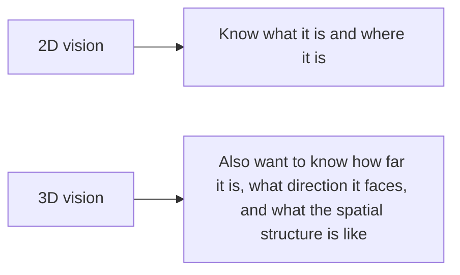

:::tip[Section Overview]
2D vision mainly understands content in flat images.
3D vision goes one step further:

> **It is not only about knowing what is in the image, but also how far it is from us in space, what direction it faces, and what its structure looks like.**

This is also the biggest difference between it and ordinary CV.
:::
## Learning Objectives

- Understand the basic intuition behind depth, point clouds, and multi-view geometry
- Understand why 3D vision is harder than 2D vision
- Build a minimal intuition for depth estimation through runnable examples
- Know the common application scenarios of 3D vision

---

## First, Build a Map

The best way for beginners to understand 3D vision is not “there is one more dimension,” but to first see where the problem has actually evolved:



So what this section really wants to help you build is:

- The difference between flat understanding and spatial understanding
- What depth, point clouds, and multi-view geometry are each solving

### A More Beginner-Friendly Overall Analogy

You can think of the difference between 2D and 3D as:

- 2D is like looking at a travel photo
- 3D is like really standing in the scene, wanting to know how far a person is from you, how high the table is, and whether the car is in front-left or front-right of you

In other words, what 3D vision really adds is not “one more column of numbers,” but:

- You begin to care about spatial relationships themselves

## What Is the Most Core New Problem in 3D Vision?

In 2D images, most of the time we only care about:

- Category
- Location

3D vision also further cares about:

- Distance
- Volume
- Spatial structure

### An Analogy

2D is more like looking at a map screenshot.
3D is more like standing in the scene and wanting to know:

- How far is this object from me

---

## Several of the Most Common 3D Vision Concepts

### Depth

How far each point is from the camera.

### Point Cloud

Representing a scene as many points with 3D coordinates.

### Multi-View Geometry

Recovering 3D structure through correspondences between multiple views.

---

## First, Look at a Minimal Depth Intuition Example

```python
def estimate_depth(focal_length, baseline, disparity):
    if disparity == 0:
        return float("inf")
    return focal_length * baseline / disparity


focal_length = 800
baseline = 0.12

for disparity in [40, 20, 10]:
    depth = estimate_depth(focal_length, baseline, disparity)
    print({"disparity": disparity, "depth": round(depth, 4)})
```

Expected output:

```text
{'disparity': 40, 'depth': 2.4}
{'disparity': 20, 'depth': 4.8}
{'disparity': 10, 'depth': 9.6}
```

As disparity gets smaller, the estimated depth becomes larger. This is the first intuition to keep before studying stereo geometry in detail.

### What Is This Example Trying to Express?

It captures the most essential intuition of stereo vision:

- The larger the disparity, the closer the object usually is
- The smaller the disparity, the farther the object usually is

### Why Is This Important?

Because it connects “points in an image” to real 3D space for the first time.

### When Beginners First Learn 3D Vision, What Three Things Should They Remember First?

1. Depth
   First understand “how far it is from the camera.”

2. Point Cloud
   First understand that the 3D world can be represented as many spatial points.

3. Disparity
   First understand why multiple views can recover spatial distance.

### Then Look at a Minimal Example of “Recovering Points from Depth”

```python
pixels = [
    {"u": 10, "v": 20, "z": 2.0},
    {"u": 12, "v": 21, "z": 2.5},
]


def to_point(pixel):
    return (pixel["u"] * pixel["z"], pixel["v"] * pixel["z"], pixel["z"])


points = [to_point(pixel) for pixel in pixels]
print(points)
```

Expected output:

```text
[(20.0, 40.0, 2.0), (30.0, 52.5, 2.5)]
```

This is a simplified point-cloud intuition: each image point carries a depth value, so you can imagine it as a point in 3D space.

This example is not a strict camera model. It is only meant to help beginners build an intuition first:

- Once you already know the depth
- A point in the image can be reimagined as a point in space

This is exactly the easiest place to get started with a “point cloud feel.”


:::tip[Reading Hint]
What 3D vision truly adds is spatial relationships. When reading this diagram, first see how disparity affects depth, then see how image points become a point cloud with depth, and finally understand why camera parameters and multi-view geometry matter.
:::
---

## Why Is 3D Vision Harder?

### Data Is Harder to Collect

2D images are easy to gather,
while 3D annotations and depth data are usually more expensive.

### Geometric Relationships Are More Complex

You are not only processing appearance,
but also handling:

- Camera parameters
- Viewpoint changes
- Spatial consistency

### Visualization and Debugging Are Harder Too

Errors in 2D images are very intuitive,
while errors in 3D structure are often much harder to see with the naked eye.

---

## The Most Common Misunderstandings

### Misunderstanding 1: 3D Vision Is Just “One More Dimension”

Not quite.
It brings new geometric problems.

### Misunderstanding 2: If You Do 2D Well, You Can Naturally Do 3D

That helps, but you still need to build spatial geometry intuition.

### Misunderstanding 3: Start Directly with Complex 3D Networks

A more stable approach is usually to first make these basics solid:

- Depth
- Disparity
- Point cloud

### The Most Stable Default Order When You First Work on a 3D Project

A more stable order is usually:

1. First choose a small single-object scenario
2. First understand depth and disparity
3. First understand the correspondence between 2D points and 3D points
4. Then move into point clouds or multi-view geometry
5. Finally look at more complex reconstruction or 3D detection

This is usually much easier than jumping straight into a complex 3D network at the beginning.

## The Right Learning Expectation for This Section

This section is not meant to take you directly into complex 3D reconstruction,
but to help you truly realize first that:

- What makes 3D vision different from 2D vision is the spatial geometry problem
- This affects the difficulty of data, modeling, evaluation, and debugging

---

## Evidence to Keep

Keep this page's proof of learning as a small evidence card:

```text
scenario_boundary: face, video, OCR, 3D, medical, or another vision scenario
input_sample: source image/frame/document and the expected output type
result_artifact: extracted text, tracked event, depth clue, diagnosis flag, or review note
failure_check: privacy, lighting, temporal drift, layout, calibration, or domain risk
Expected_output: scenario-specific artifact with metric or human-review note
```

## Summary

The most important thing in this section is to build one judgment:

> **The core value of 3D vision is lifting image understanding from flat space to spatial structure, and this naturally adds one more layer of geometric difficulty compared with 2D vision.**

## What You Should Take Away Most

- 3D vision is not as simple as “one more dimension”
- Depth, disparity, and point cloud are the three layers of intuition most worth building first
- Learning spatial intuition first, then looking at complex models, will be much more stable

## If You Turn It into a Project, What Is Most Worth Showing?

- A small depth estimation or stereo example
- A comparison between the depth map and the original image
- A minimal visualization from image points to spatial points
- A set of error cases for “near / far” judgments

This will be more convincing than simply saying “I did 3D vision.”

---

## Exercises

1. Change `disparity` and observe the trend in depth changes.
2. Why is 3D vision said to rely more on geometric intuition than 2D vision?
3. Why is a point cloud a very natural 3D representation?
4. Think about which applications depend especially on 3D vision, rather than only needing 2D detection.

<details>
<summary>Reference implementation and walkthrough</summary>

1. In stereo vision intuition, depth is inversely related to disparity: larger disparity usually means closer, smaller disparity means farther, and near-zero disparity is unstable.
2. 3D vision relies on geometry because you must reason about camera models, depth, coordinates, scale, calibration, and pose, not only appearance.
3. A point cloud is natural because it stores visible 3D surfaces directly as `(x, y, z)` points, often with color or intensity.
4. Robotics, autonomous driving, AR, mapping, measurement, grasping, and collision avoidance depend on 3D structure rather than only 2D boxes.

</details>
