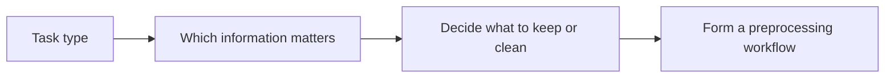

:::tip[Section overview]
Text preprocessing is most likely to be misunderstood by beginners as:

- a fixed workflow

But in reality, it is more like:

- a set of organization tools chosen according to the task

So the most important thing in this section is not memorizing steps, but first building a judgment:

> **Why are you doing this step, what will it keep, and what will it remove?**
:::
## Learning objectives

By the end of this section, you will be able to:

- Understand what text preprocessing is actually solving
- Master common steps such as cleaning, normalization, tokenization, and stopword removal
- Write a preprocessing function that can run directly
- Understand why preprocessing is not about doing more, but about being task-driven

---

## First, build a map

Text preprocessing is easier to understand in the order of “task -> information -> operation”:



So what this section really wants to solve is:

- Why preprocessing is not about doing more
- Why the same text can be processed differently in different tasks

## Why preprocess text?

Raw text is usually very “dirty”:

- Inconsistent capitalization
- Lots of punctuation
- Mixed links, numbers, and emojis
- The same meaning may have many different ways of writing it

You can think of text preprocessing as “washing vegetables”:

- If you don’t wash them, the model is hard to cook with directly
- If you wash too much, you may wash away the nutrients too

So the core of preprocessing is not “the cleaner the better,” but:

> **Make the text more suitable for the current task.**

### A better analogy for beginners

You can think of text preprocessing as:

- Organizing your backpack before going out

If you are going hiking, you will pack differently than if you are going to the office.
Likewise:

- In sentiment analysis, negation words matter a lot
- In retrieval, keyword coverage matters more
- In named entity recognition, capitalization and format information may matter a lot

So preprocessing is not:

- always the same fixed set of actions

But rather:

- choose based on what task you are preparing for

---

## The most common preprocessing steps

| Step | Common purpose |
|---|---|
| Lowercasing | Unify English capitalization |
| Remove links / special symbols | Reduce meaningless noise |
| Remove extra spaces | Standardize format |
| Tokenization | Split into smaller processing units |
| Stopword handling | Remove frequent, low-information words |
| Normalize numbers / special patterns | Unify certain regular patterns |

But remember:

- These steps are not all applied every time
- More steps does not mean better

### A judgment table worth remembering for beginners

| Task | Information to prioritize keeping |
|---|---|
| Sentiment analysis | Negation words, emotion words, degree words |
| Retrieval / RAG | Keywords, terms, numbers, proper nouns |
| NER | Capitalization, format, entity boundaries |
| Traditional text classification | Slightly stronger cleaning is often more common |

This table is not an absolute rule, but it helps beginners build an important intuition:

- Whether preprocessing is reasonable must be judged in the context of the task itself

---

## Start with a minimal preprocessing function

Here we will first use an English example, because English is easier to demonstrate with the standard library.
The same idea applies to Chinese, except that Chinese usually relies on more specialized segmentation tools.

```python
import re

stopwords = {"the", "is", "a", "an", "and", "to", "of", "in"}


def preprocess(text):
    text = text.lower()                          # 1. Lowercase
    text = re.sub(r"http\\S+", " ", text)        # 2. Remove links
    text = re.sub(r"[^a-z0-9\\s]", " ", text)    # 3. Remove special symbols
    text = re.sub(r"\\s+", " ", text).strip()    # 4. Collapse extra spaces

    tokens = text.split()                        # 5. Simple tokenization
    tokens = [t for t in tokens if t not in stopwords]  # 6. Remove stopwords
    return tokens


sample = "The movie is AMAZING, and the ending is full of surprises!"
print(preprocess(sample))
```

Expected output:

```text
['movie', 'amazing', 'ending', 'full', 'surprises']
```

The casing, punctuation, common stopwords, and extra symbols are removed, while the words that carry sentiment and topic information are kept.

### What should you notice from this example?

Text preprocessing is usually not a mysterious black box,
but a chain of very simple steps.

What really matters is:

- Why each step exists
- Whether it really fits the current task

### A minimal contrast showing why keeping negation words matters

```python
import re

stopwords_keep_not = {"the", "is", "a", "an", "and", "to", "of", "in"}
stopwords_drop_not = {"the", "is", "a", "an", "and", "to", "of", "in", "not"}


def preprocess_with_stopwords(text, stopwords):
    text = text.lower()
    text = re.sub(r"[^a-z0-9\\s]", " ", text)
    text = re.sub(r"\\s+", " ", text).strip()
    tokens = text.split()
    return [t for t in tokens if t not in stopwords]


sample = "This movie is not good"
print("keep_not :", preprocess_with_stopwords(sample, stopwords_keep_not))
print("drop_not :", preprocess_with_stopwords(sample, stopwords_drop_not))
```

Expected output:

```text
keep_not : ['this', 'movie', 'not', 'good']
drop_not : ['this', 'movie', 'good']
```

The second result silently flips the meaning by removing `not`. This is exactly why stopword rules must be chosen according to the task.

This example is especially good for beginners because it shows directly that:

- a word that seems “not important”
- may actually be the key to determining the direction of meaning

---

## Why is lowercasing so common?

### Unify word forms

In English:

- `Apple`
- `apple`
- `APPLE`

Many tasks may want to treat them as the same word.

### But it should not always be done

For example:

- Named entity recognition
- Brand name recognition

Capitalization itself may be important information.

So remember:

- Preprocessing must always be considered together with the task

---

## Why is tokenization so important?

### Because models do not directly process the “entire original sentence”

They usually need smaller units:

- words
- subwords
- characters

### English and Chinese are different

English naturally has spaces,
so in simple cases you can use `split()` directly.

Chinese does not have natural spaces,
so tokenization becomes more complicated.

For example:

- “Natural language processing”

Should it be split as:

- Natural language processing

or:

- Natural / language / processing

This directly affects downstream representations and model performance.

### A simple awareness for Chinese segmentation

Even if we are not introducing a professional segmentation tool yet, you should first build this judgment:

> **Chinese text does not naturally come with word boundaries.**

---

## Why are stopwords useful, and why are they risky?

### Where they are useful

High-frequency but low-discriminative words, such as:

- the
- is
- and

can indeed introduce noise in many traditional models.

### Where they are risky

Some words that seem unimportant may be very critical.

For example:

- `not good`

If you remove `not`, the meaning flips.

### So stopwords are not something you must always delete

A more reasonable view is:

- It is an optional operation
- Whether to use it depends on the task

---

## Let’s look at a slightly more complete exercise

```python
import re

stopwords = {"the", "is", "a", "an", "and", "to", "of", "in", "this"}


def preprocess(text):
    text = text.lower()
    text = re.sub(r"http\\S+", " ", text)
    text = re.sub(r"[^a-z0-9\\s]", " ", text)
    text = re.sub(r"\\s+", " ", text).strip()
    tokens = text.split()
    tokens = [t for t in tokens if t not in stopwords]
    return tokens


texts = [
    "This course is easy to follow!",
    "The examples are clear and practical.",
    "I love the hands-on exercises in this class.",
]

for text in texts:
    print("Original:", text)
    print("Processed:", preprocess(text))
    print("-" * 30)
```

Expected output:

```text
Original: This course is easy to follow!
Processed: ['course', 'easy', 'follow']
------------------------------
Original: The examples are clear and practical.
Processed: ['examples', 'are', 'clear', 'practical']
------------------------------
Original: I love the hands-on exercises in this class.
Processed: ['i', 'love', 'hands', 'on', 'exercises', 'class']
------------------------------
```

Use this before/after view as a habit. If an important word disappears, adjust the rule before training a model.

### What is really worth paying attention to here?

You should look at:

- What information was kept
- What information was removed
- Whether the removal matches the task requirements

This is more important than memorizing a preprocessing step list.

---

## Why are preprocessing strategies different for traditional models and pretrained models?

### Traditional machine learning

It usually relies more on manual preprocessing because the model itself is relatively shallow,
and it is more sensitive to noise.

### Pretrained models / large models

In many cases, they rely more on the model’s built-in tokenizer,
and if you over-clean on the outside, you may instead:

- damage the original structure
- lose information the model could have used

### A very important judgment

Not all NLP eras use the same preprocessing strategy.

### The safest default order when doing your first NLP project

A safer order is usually:

1. First clarify what the task is
2. Write a lightweight baseline preprocessing pipeline
3. Check what information is being removed
4. Then decide whether to add more rules

This is usually clearer than piling on a lot of regexes and rules from the start.

---

## Evidence to Keep

Keep this page's proof of learning as a small evidence card:

```text
raw_text: original examples before cleaning or tokenization
processed_text: cleaned text, tokens, normalization notes, and removed items
task_boundary: classification, extraction, retrieval, generation, or QA output
failure_check: lost meaning, bad token split, language issue, or ambiguous label
Expected_output: before/after text samples plus token or representation output
```

## Common beginner mistakes

### Thinking more preprocessing means more advanced

Not true.
If you remove too much information, performance may get worse.

### Using the same rule set for every task

Text classification, retrieval, NER, and RAG often need different preprocessing strategies.

### Using `split()` directly for Chinese

In many tasks, that is usually not enough.

## If you turn this into a project, what is most worth showing?

What is most worth showing is usually not:

- how many regexes you used

But rather:

1. What the raw text looks like
2. What the processed text looks like
3. What information was kept
4. What information was removed
5. Why this processing is suitable for the current task

This makes it easier for others to see that:

- you understand the task requirements
- you are not just mechanically cleaning text

---

## Summary

The most important thing in text preprocessing is not “cleaning it thoroughly,” but:

> **Organize text into a form that is more suitable for the current model based on the task.**

In the next section, we will keep moving forward and solve another key problem:

> **How do we represent text as numbers?**

## What you should take away from this section

- Text preprocessing is not a fixed template, but a task-driven choice
- The information you remove and the information you keep are equally important
- When doing your first project, a lightweight baseline is usually more reliable than heavy cleaning

---

## Exercises

1. Add a number-replacement rule to `preprocess()` so that all numbers are replaced with `<num>`.
2. Add `not` to the stopwords list, then observe what problem appears in sentiment sentences.
3. Find 5 short reviews yourself, run preprocessing on them, and see what information is kept and what is removed.
4. Think about this: in an NER scenario, why might lowercasing be harmful?

<details>
<summary>Reference implementation and walkthrough</summary>

1. A number rule can replace digit spans with `<num>`, but keep a before/after example because dates, prices, and IDs may need different handling.
2. Adding `not` to stopwords often damages sentiment because `not good` and `good` become too similar after cleaning.
3. For your five reviews, compare raw text, cleaned text, and tokens. The best observation is not “shorter is better,” but whether useful evidence survived.
4. Lowercasing can harm NER because names, product codes, acronyms, and places often use capitalization as evidence.

</details>
