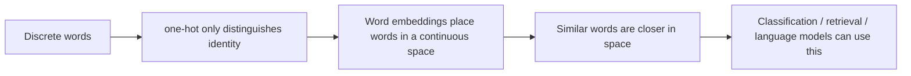

# 11.2.2 Word Embeddings


:::tip[Section overview]
When doing NLP, the model does not directly understand the words “refund,” “certificate,” or “password” themselves.
It first sees:

- a sequence of IDs
- then a sequence of vectors

That is where word embeddings are valuable:

> **They do not just give words IDs; they let words express semantic relationships in vector space.**

If this layer is not truly understood, it will be hard to feel confident later when learning contextual representations, BERT, and retrieval vectors.
:::
## Learning Objectives

- Understand why one-hot representations are not enough
- Understand why word embeddings can express similarity
- Master the most common intuition behind similarity measures such as cosine similarity
- Build a first sense of “word vector space” through runnable examples

## Historical Background: Why Did Word2Vec Become a Key Milestone in NLP?

The most important historical milestone to know in this section is:

| Year | Paper / Method | Key Author(s) | What Did It Most Important Solve? |
|---|---|---|---|
| 2013 | Word2Vec | Mikolov et al. | It gave words distributed semantic representations, pushing NLP from “whether a word appears” toward “relationships between words can also be computed” |

For beginners, the most important takeaway is:

> **The significance of Word2Vec is not just that “word vectors are cooler,” but that it made “semantic similarity” a computable relationship in vector space for the first time.**

---

## First, Build a Map

If you have just finished one-hot, BoW, and TF-IDF, the most natural next step is:

- the previous methods already turned text into numbers
- this section starts solving how those numbers can begin to carry semantic relationships

So what really matters here is not “another representation method,” but:

- representation evolving from “can be computed” to “more like it has semantic structure”

For beginners, the best way to understand word embeddings is not to memorize vector methods directly, but first to see clearly:



So what this section is really trying to solve is:

- Why one-hot is not enough
- Why the relationship between words should become a computable distance

### A Better Analogy for Beginners

You can think of representation methods like this:

- one-hot is like giving each word an employee ID
- word embeddings are like putting each word on a “semantic map”

An employee ID can distinguish who is who,
but it does not tell you:

- which words are more alike
- which words often appear in similar situations

Once words become map coordinates, “closeness” becomes something you can compute for the first time.

## Why Do We Need Word Embeddings?

### one-hot Can Only Distinguish Identity, Not Relationships

Suppose the vocabulary contains:

- `refund`
- `return`
- `password`

If we use one-hot:

- `refund` might be `[1, 0, 0]`
- `return` might be `[0, 1, 0]`
- `password` might be `[0, 0, 1]`

The problem is:

- `refund` and `return` are clearly semantically closer
- but in one-hot, they are equally “far” from each other

### What Is Word Embedding Doing?

What word embeddings do is:

- map words into low-dimensional vectors
- make semantically similar words closer in vector space

In other words, it is not just “encoding,” but also:

- semantic representation

### An Analogy

You can think of word embeddings as map coordinates.

- one-hot is more like an ID number
- word embeddings are more like positions on a map

An ID number can distinguish people, but it does not show who lives closer together;
map coordinates, however, make “closeness” computable.

### When Learning Word Embeddings for the First Time, What Should You Focus on Most?

What matters most is not the training method, but this sentence:

> **The most important value of word embeddings is that they bring relationships between words into the representation itself.**

Once this idea is stable, the following will become much easier to understand:

- cosine similarity
- neighboring words
- contextual representations

---

## How Do Word Embeddings Learn Semantics?

### Core Assumption: Similar Contexts Often Mean Similar Word Meaning

If two words often appear in similar contexts,
the model will tend to learn them as nearby vectors.

For example:

- `refund`
- `return`

may often appear in contexts like:

- after-sales
- order
- application

This will push them closer together in space.

### Being “Close” in Vector Space Does Not Mean Exactly the Same Meaning

It more often means:

- similar usage
- similar context distribution

So in word embeddings, “close” often means distributionally close, not necessarily strictly synonymous in dictionary terms.

### Why Is This Already Very Useful?

Because once you have this spatial relationship,
many tasks can take advantage of it:

- similar word lookup
- text classification
- retrieval
- clustering

### Why Does “Distributional Similarity” Change the Main NLP Storyline?

Because from this point on, the model no longer only asks:

- Did this word appear?

It starts to more easily ask:

- Which contexts does this word usually appear with?
- Which type of words does it resemble in semantic space?

This is exactly the starting point of representation learning as it moves deeper later on.

---

## Run a Word Vector Similarity Example First

The example below does three things:

1. Defines a small embedding for a few words
2. Computes cosine similarity between them
3. Compares which words are closer

```python
from math import sqrt

embeddings = {
    "refund": [0.90, 0.80, 0.10],
    "return": [0.88, 0.78, 0.12],
    "invoice": [0.15, 0.85, 0.20],
    "password": [0.10, 0.15, 0.95],
}


def cosine(a, b):
    dot = sum(x * y for x, y in zip(a, b))
    norm_a = sqrt(sum(x * x for x in a))
    norm_b = sqrt(sum(x * x for x in b))
    return dot / (norm_a * norm_b)


print("refund vs return  :", round(cosine(embeddings["refund"], embeddings["return"]), 4))
print("refund vs invoice :", round(cosine(embeddings["refund"], embeddings["invoice"]), 4))
print("refund vs password:", round(cosine(embeddings["refund"], embeddings["password"]), 4))
```

Expected output:

```text
refund vs return  : 0.9998
refund vs invoice : 0.78
refund vs password: 0.261
```

The toy vectors make `refund` and `return` almost point in the same direction. `password` is far away, so a classifier or retrieval system can use that distance as a useful signal.

### What Is the Most Important Intuition Here?

You will see that:

- `refund` and `return` are closer
- they are farther from `password`

This is the key intuition behind word embeddings:

> **“Semantic closeness” can be turned into “vector closeness.”**

### Why Use Cosine Similarity Here?

Because we often care more about:

- whether the directions are similar

rather than the absolute length.
Cosine similarity is a natural fit for this kind of comparison.

### What Should Beginners Remember First When Learning Word Embeddings?

The most important things to remember are:

1. one-hot is more like an ID than a semantic representation
2. the value of word embeddings is turning “semantically close” into “vector close”
3. the first step in many NLP models is, in essence, still using embeddings

### Another Minimal “Find Nearest Neighbors” Example

```python
from math import sqrt

embeddings = {
    "refund": [0.90, 0.80, 0.10],
    "return": [0.88, 0.78, 0.12],
    "invoice": [0.15, 0.85, 0.20],
    "password": [0.10, 0.15, 0.95],
}


def cosine(a, b):
    dot = sum(x * y for x, y in zip(a, b))
    norm_a = sqrt(sum(x * x for x in a))
    norm_b = sqrt(sum(x * x for x in b))
    return dot / (norm_a * norm_b)


target = "refund"
neighbors = []
for word, vector in embeddings.items():
    if word == target:
        continue
    neighbors.append((word, round(cosine(embeddings[target], vector), 4)))

neighbors.sort(key=lambda x: x[1], reverse=True)
print(neighbors)
```

Expected output:

```text
[('return', 0.9998), ('invoice', 0.78), ('password', 0.261)]
```

This nearest-neighbor list is the practical face of embeddings: instead of only storing word IDs, the space lets you ask which words are semantically closer.

This example is especially good for beginners because it quickly turns an abstract concept into something concrete:

- if vectors really carry semantic relationships
- then you should be able to find “more similar words” from the space

---

## Why Are Word Embeddings Helpful for Later Tasks?

### Text Classification

If `refund` and `return` are close in vector space,
the model can more easily learn to group them into a “after-sales” category.

### Similar Text Retrieval

If a piece of text contains many similar words,
it is usually also closer in vector space to content on the same topic.

### Input to Downstream Deep Learning Models

For many models, the first layer is essentially:

- token id -> embedding vector

So word embeddings are not old knowledge; they are the entry point for more complex models later.

### Why Does This Section Connect Directly to the Pretraining Storyline Later?

Because most NLP models you will see later still do something similar at the beginning:

- first turn tokens into vector representations

The difference is:

- fixed embeddings are more static
- contextual representations are more dynamic
- pretrained models learn this representation power at much larger scale

### If You Use Embeddings in a Project for the First Time, the Safest Default Workflow

A safer workflow is usually:

1. first turn words into vectors
2. first check whether similar words and similar sentences make sense
3. then connect embeddings to classification, retrieval, or clustering

This is easier to build intuition with than starting directly with a complex model.

---

## Evidence to Keep

Keep this page's proof of learning as a small evidence card:

```text
representation: BoW, TF-IDF, static embedding, contextual embedding, or language-model score
comparison: nearest text, similarity score, or next-token/log-prob style output
interpretation: what the representation captures and what it misses
failure_check: polysemy, domain mismatch, short text, tokenization, or semantic drift
Expected_output: small comparison table with at least one surprising result
```

## Common Pitfalls with Word Embeddings

### Mistake 1: Word Embeddings Are the Same as Dictionary Definitions

No.
They are more like a statistical semantic space, not a dictionary definition table.

### Mistake 2: Once Word Vectors Are Well Trained, They Can Solve Everything

Word embeddings can only express basic semantic relationships.
When facing polysemy and complex context, they quickly become insufficient.

### Mistake 3: Only Look at Individual Words, Not the Task

The value of word embeddings still has to be judged in the context of the specific task.

## Summary

The most important takeaway from this section is to understand word embeddings as:

> **A way to map discrete vocabulary into a continuous semantic space, so that “similar words” are also closer in vector space.**

Once this intuition is established,
it becomes much easier to understand contextual representations, sentence vectors, and language models later.

---

## What You Should Take Away from This Section

- Word embeddings are not just new IDs for words; they give words positions in a semantic space
- Cosine similarity is the most important first key to understanding this semantic space
- Contextual representations and pretrained models later are, in fact, continuing along the same path

If this is compressed into one sentence, it is:

> **The meaning of word embeddings is not to make words shorter, but to finally give words a computable semantic distance from one another.**

---

## Exercises

1. Add a new word `delivery` to the example, decide its vector yourself, and observe its similarity to the other words.
2. Why can one-hot distinguish words but cannot express relationships between words?
3. Explain in your own words why cosine similarity is suitable for comparing word vectors.
4. Think about this: if a word often appears in multiple different contexts, what problems will fixed word vectors run into?

<details>
<summary>Reference implementation and walkthrough</summary>

1. A plausible `delivery` vector should be closer to shipping, order, or logistics words than to unrelated words. The exact numbers are less important than the relative neighborhood.
2. One-hot vectors distinguish words by ID, but every different word is equally far apart, so they cannot express similarity.
3. Cosine similarity is useful because it compares vector direction, which often captures semantic neighborhood better than raw magnitude.
4. Fixed vectors struggle with polysemy because one vector must represent all meanings of a word such as `bank`, `apple`, or `python`.

</details>
