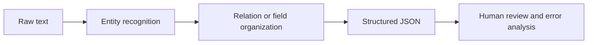

:::tip[Reading Guide]
The key to information extraction is to define the schema first, then let the text reliably map to fields, entities, and relationships. When reading the diagram, focus on how rules, NER, relation extraction, JSON output, and human review connect into a deliverable workflow.
:::
:::tip[Section Positioning]
The goal of an information extraction project is not to make the model “understand every text,” but to reliably turn key entities, relationships, or fields in text into structured data. It is an important bridge between traditional NLP, RAG document processing, and LLM structured output.
:::
## Project Goal

Build a “small course announcement information extractor”: given a course announcement or event notice, output structured fields such as time, location, topic, speaker, and target audience.



## Minimal Version

For the basic version, you do not need to train a model first. Use rules and regular expressions to extract fields. For example, extract clearly formatted information such as dates, times, and locations from text.

```python
import re

text = "This Saturday at 19:30 on Tencent Meeting, Presenter Zhang will deliver an introductory RAG livestream for AI application beginners."

speaker_match = re.search(r"Presenter [A-Z][a-z]+", text)

result = {
    "time": re.findall(r"\d{1,2}:\d{2}", text)[0],
    "platform": "Tencent Meeting" if "Tencent Meeting" in text else None,
    "topic": "RAG Introduction" if "RAG" in text else None,
    "speaker": speaker_match.group(0) if speaker_match else None,
    "audience": "AI application beginners" if "AI application beginners" in text else None,
}

print(result)
```

Expected output:

```text
{'time': '19:30', 'platform': 'Tencent Meeting', 'topic': 'RAG Introduction', 'speaker': 'Presenter Zhang', 'audience': 'AI application beginners'}
```

Although this version is simple, it helps you understand the core of information extraction: extracting usable fields from unstructured text.

### Add a Tiny Field-Level Evaluator

Do not stop at one success case. A project needs to show whether each field is stable across more than one input.

```python
import re

examples = [
    {
        "text": "This Saturday at 19:30 on Tencent Meeting, Presenter Zhang will deliver an introductory RAG livestream.",
        "gold": {"time": "19:30", "platform": "Tencent Meeting", "topic": "RAG Introduction", "speaker": "Presenter Zhang"},
    },
    {
        "text": "Sunday 10:00 on Zoom, Presenter Li explains evaluation metrics.",
        "gold": {"time": "10:00", "platform": "Zoom", "topic": "evaluation metrics", "speaker": "Presenter Li"},
    },
]


def extract(text):
    time_match = re.search(r"\d{1,2}:\d{2}", text)
    speaker_match = re.search(r"Presenter [A-Z][a-z]+", text)
    platform = next((name for name in ["Tencent Meeting", "Zoom"] if name in text), "")
    topic = "RAG Introduction" if "RAG" in text else ("evaluation metrics" if "evaluation metrics" in text else "")
    return {
        "time": time_match.group(0) if time_match else "",
        "platform": platform,
        "topic": topic,
        "speaker": speaker_match.group(0) if speaker_match else "",
    }


correct = 0
total = 0
for item in examples:
    predicted = extract(item["text"])
    print({"text": item["text"], "predicted": predicted})
    for field, gold_value in item["gold"].items():
        correct += int(predicted[field] == gold_value)
        total += 1

print("field_accuracy =", round(correct / total, 4))
```

Expected output:

```text
{'text': 'This Saturday at 19:30 on Tencent Meeting, Presenter Zhang will deliver an introductory RAG livestream.', 'predicted': {'time': '19:30', 'platform': 'Tencent Meeting', 'topic': 'RAG Introduction', 'speaker': 'Presenter Zhang'}}
{'text': 'Sunday 10:00 on Zoom, Presenter Li explains evaluation metrics.', 'predicted': {'time': '10:00', 'platform': 'Zoom', 'topic': 'evaluation metrics', 'speaker': 'Presenter Li'}}
field_accuracy = 1.0
```

This evaluator is small, but it teaches the habit that matters: information extraction should be measured field by field, not only judged by whether the final JSON looks plausible.

## Standard Version

The standard version can introduce NER or LLM structured output. You can use an off-the-shelf NER model to identify names, organizations, and locations, then use rules or a Prompt to organize the results into JSON. The focus is not perfection, but building a workflow where extraction results can be checked.

A recommended output format is:

```json
{
  "event_name": "RAG Intro Livestream",
  "time": "Saturday 19:30",
  "location": "Tencent Meeting",
  "speaker": "Presenter Zhang",
  "audience": "Beginners in AI applications",
  "confidence": "medium"
}
```

## Challenge Version

The challenge version can add batch extraction and human validation. For example, if you input 20 course announcements, the system generates JSON in batches, and then a person marks which fields are correct, which fields are missing, and which fields were extracted incorrectly. Finally, calculate field-level accuracy.

| Field | Accuracy | Common Errors |
|---|---|---|
| time | 90% | Relative time is not normalized |
| location | 85% | Online platforms and locations are confused |
| speaker | 80% | The boundary between title and name is unclear |
| topic | 75% | The topic is too long or missing keywords |

## Connection to RAG / Agent

Information extraction can be used to build metadata for RAG documents. For example, extract stages, chapters, key concepts, and target audience from course documents, and use them as retrieval filters. It can also serve as a tool for an Agent: when an Agent needs to organize meetings, contracts, tickets, or course materials, it can first extract structured fields and then make follow-up decisions.

## Project Deliverables

The README should include: project goals, input examples, output JSON schema, extraction method, field explanations, evaluation method, failed samples, and next steps. When presenting your portfolio, it is best to include a comparison table showing “original text -> JSON -> human correction.”

## Evidence to Keep

Keep this page's proof of learning as a small evidence card:

```text
task_output: label, entity fields, summary, answer, retrieval result, or semantic graph
artifacts: raw text, processed text, predictions, metrics, and failure cases
metric: accuracy/F1, precision/recall, retrieval hit rate, faithfulness, or schema validity
failure_check: unclear labels, over-cleaning, boundary errors, hallucination, or unsupported answer
Expected_output: reproducible text pipeline folder with metrics and examples
```

## Common Mistakes

The first mistake is showing only successful examples without field-level evaluation. The second mistake is an unstable JSON schema, which makes downstream programs unusable. The third mistake is ignoring boundary issues—for example, in “Presenter Zhang will share at Peking University,” Peking University may be a location or an organization. The fourth mistake is sending LLM output directly into the database without validation.


## Suggested Version Roadmap

| Version | Goal | Delivery Focus |
|---|---|---|
| Basic Version | Complete the minimal loop | Able to input, process, and output, while keeping a set of examples |
| Standard Version | Form a presentable project | Add configuration, logging, error handling, README, and screenshots |
| Challenge Version | Close to portfolio quality | Add evaluation, comparison experiments, failed sample analysis, and next-step roadmap |

It is recommended to finish the basic version first; do not try to make everything comprehensive from the start. Every time you upgrade a version, write into the README what new capability was added, how it was verified, and what problems remain.

## Exercises

1. Design a JSON schema for extracting course announcements.
2. Test rule-based extraction on 5 sample announcements and record whether each field is correct.
3. Find 3 failed extraction cases and analyze whether the issue is entity boundary errors, missing fields, or unclear schema design.
4. Think about how these structured fields help subsequent RAG retrieval.

<details>
<summary>Project reference and review notes</summary>

1. A course-announcement schema might include `course`, `date`, `deadline`, `task`, `location_or_url`, `target_audience`, and `required_action`.
2. Evaluate each sample at field level: correct, missing, wrong boundary, wrong type, or unsupported by the source text.
3. For three failures, separate entity boundary errors, missing fields, and unclear schema design; each category needs a different fix.
4. Structured fields help RAG by enabling filtering, routing, metadata search, citation grouping, and safer downstream Agent actions.

</details>

## Passing Criteria

After completing the project, you should be able to explain the difference between information extraction, text classification, and NER; design a stable output schema; evaluate extraction quality with field-level metrics; and explain how it serves RAG or Agent systems.
