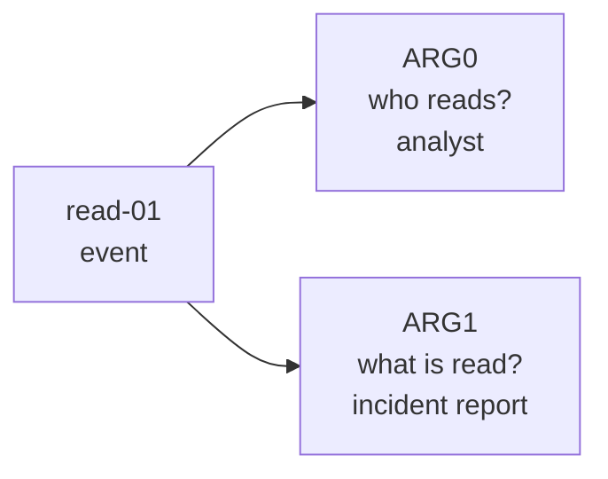
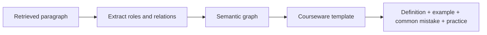

:::tip[Where this section fits]
Text is not just a sequence of words. Often, what we really want is the structured meaning behind a sentence.

The semantic-graph approach represented by AMR tries to answer this question:

> **Can we turn a sentence into a structural graph of “who did what to whom, and under what conditions”?**
:::
## Why do we need semantic graphs?

Plain text representation often looks like this:

```text
Jobs founded Apple.
```

But information extraction and knowledge-base systems want a structure more like this:

```text
Person: Jobs
Relation: founded
Organization: Apple
```

If the sentence becomes more complex, it may contain time, place, cause, condition, negation, and reference.
At that point, simple keyword matching is no longer enough.

The goal of semantic graphs is:

> **To turn meaning in natural language into a graph structure that machines can operate on more easily.**

## What is AMR?

AMR stands for Abstract Meaning Representation. You can first think of it as a kind of abstract semantic graph representation.

It does not just mark entities; it also tries to represent events and role relationships.

For example, “The analyst reads the incident report” can be imagined as:

```text
read-01
  ARG0: analyst
  ARG1: incident report
```

This structure expresses:

- The core event is reading
- Who is reading: the analyst
- What is being read: the incident report

This is much closer to “what the sentence is really trying to say” than simple word segmentation.

For beginners, the easiest way to read this structure is:



`ARG0` and `ARG1` do not mean “first word” and “second word.” They mean semantic roles. In many simple event sentences, you can first read them as:

- `ARG0`: the doer of the action
- `ARG1`: the thing affected by the action

This small shift is important: semantic graphs care less about word order and more about meaning.

## What is the relationship between semantic graphs and information extraction?

Information extraction usually starts with more specific tasks:

- Entity extraction
- Relation extraction
- Event extraction
- Attribute extraction

Semantic graphs are more like a way to organize these results into a more complete meaning structure.

| Task | What the output looks like |
|---|---|
| NER | Which words are person names, organizations, or locations |
| Relation extraction | What relationship A and B have |
| Event extraction | Who did what at what time |
| AMR / semantic graph | The roles and semantic structure behind the whole sentence |

## Why is this useful for RAG and knowledge-base projects?

The “automatically write Word course materials from a knowledge base” project you mentioned earlier can benefit a lot from semantic-graph ideas.

That is because course materials often contain:

- Definitions
- Example problems
- Steps
- Conditions
- Notes
- Cause-and-effect relationships

If the system only does vector retrieval, it may find similar paragraphs, but it may not understand the structure.
If it can extract structured relationships, it can organize course materials more reliably:

```text
Knowledge point -> Definition -> Example -> Solution steps -> Common mistakes -> Practice questions
```

This is the value of semantic graphs and information extraction for knowledge-base systems.

## Relationship to syntactic parsing and recurrent neural networks

Before Transformer became mainstream, NLP spent a long time studying syntactic structure and semantic structure.

This included:

- Dependency parsing
- Constituency parsing
- Semantic role labeling
- Explorations of recurrent neural networks for tree-structured representations

Together, these works show one thing:

> **Text understanding is not only about word-vector similarity, but also about structural relationships.**

Today, many large models can implicitly handle a lot of structure, but in serious knowledge bases, law, medicine, and SOP document generation, explicit structure is still very valuable.

## A minimal example of structured extraction

The following is not a full AMR example. It is just a simulation of the feeling of “rewriting a sentence into structure”:

```python
sentence = "Professor Andrew Ng teaches a machine learning course"

semantic_graph = {
    "event": "teach",
    "teacher": "Professor Andrew Ng",
    "topic": "machine learning course",
}

for role, value in semantic_graph.items():
    print(role, "=>", value)
```

Expected output:

```text
event => teach
teacher => Professor Andrew Ng
topic => machine learning course
```

Read this as a role table first. The sentence is no longer only a string; it has become an event plus participants.

The main point is for you to first understand:

- Text can be broken into roles
- Roles can be connected into a graph
- Graph structures can support later generation and retrieval

## From a sentence to SOP document structure

If your goal is to generate SOP documents from a knowledge base, a semantic graph can become an intermediate layer between “retrieved paragraph” and “final Word document.”

Here is a very small example:

```python
sentence = "The refund escalation policy helps frontline support decide what to do after the standard window."

semantic_graph = {
    "policy": "refund escalation",
    "function": "decide what to do",
    "scenario": "frontline support",
    "condition": "after the standard window",
}

sop_block = {
    "title": semantic_graph["policy"],
    "summary": "A rule for handling refund requests after the standard window.",
    "why_it_matters": f"It helps {semantic_graph['scenario']} {semantic_graph['function']}.",
    "draft_hint": f"Explain it as a clear rule for {semantic_graph['condition']}.",
}

for key, value in sop_block.items():
    print(f"{key}: {value}")
```

Expected output:

```text
title: refund escalation
summary: A rule for handling refund requests after the standard window.
why_it_matters: It helps frontline support decide what to do.
draft_hint: Explain it as a clear rule for after the standard window.
```

This is the practical value of semantic structure: once the roles are explicit, the next template can use them consistently.

The workflow becomes clearer:



This is why AMR is useful even if you do not implement a full AMR parser right away. It teaches you to ask better structural questions:

- What is the concept?
- What action or relation is being described?
- Who or what participates in that relation?
- What condition, cause, or result is attached?

## Assigning historical milestones to course chapters

| Historical milestone | Problem it solved | Corresponding course chapter |
|---|---|---|
| Syntactic parsing / recurrent neural network explorations | Tree-structured language representation | Section 7.5, Section 5.2 Seq2Seq background |
| AMR | Representing sentence meaning as a semantic graph | Section 7.5, Section 7.4 information extraction project |
| Semantic role labeling | Who did what to whom | Section 7.4 information extraction, knowledge graph extensions |
| Knowledge Graph | Organizing extracted results into queryable knowledge | Chapter 8 RAG, knowledge-base systems |

## The intuition you should have after learning this section

Vector retrieval tells you “which text is similar,” while semantic graphs care more about “what roles and relationships exist in this text.”

If you are building educational course materials, knowledge-base QA, or automatic Word document generation, this difference is very important:

- Vector retrieval helps you find materials
- Information extraction helps you capture key points
- Semantic graphs help you organize structure
- Large models help you generate content according to templates

This is also why modern knowledge-base applications increasingly value “retrieval + structure + generation.”

## Evidence to Keep

Keep this page's proof of learning as a small evidence card:

```text
task_output: label, entity fields, summary, answer, retrieval result, or semantic graph
artifacts: raw text, processed text, predictions, metrics, and failure cases
metric: accuracy/F1, precision/recall, retrieval hit rate, faithfulness, or schema validity
failure_check: unclear labels, over-cleaning, boundary errors, hallucination, or unsupported answer
Expected_output: reproducible text pipeline folder with metrics and examples
```
