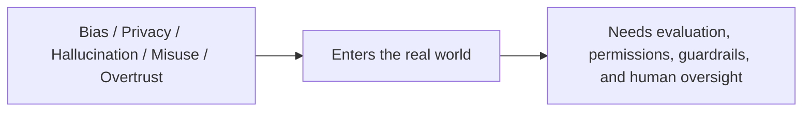

:::tip[Reading Guide]
Ethics and safety are not abstract slogans. They are engineering guardrails that can be implemented through data, models, prompts, output review, human review, and appeal mechanisms. When reading the diagram, first look at how risks are detected, blocked, and traced.
:::
:::tip[Section Overview]
When discussing ethics and safety, it is easy to become vague.
This lesson does not want to stop at “be responsible.” Instead, it wants you to truly see:

> **Where AIGC systems can hurt people, mislead people, or lose control.**

Only after the problems are clearly understood can the engineering measures that follow really hold up.
:::
## Learning Objectives

- Understand the common types of ethical and safety risks in AIGC systems
- Learn to break risks down into categories such as bias, privacy, false content, and misuse
- Understand why “human oversight” is still important in many high-risk scenarios
- Build a mindset that ethical issues must be translated into engineering measures

---

## First, Build a Map

AI ethics and safety are easier to understand using a “risk type -> real-world consequence -> engineering measure” structure:



So what this section really wants to solve is:

- Why ethical issues are not abstract slogans
- Why they always end up back in system design

---

## Why Are AIGC Ethics and Safety Issues So Prominent?

Because what these systems generate includes:

- Text
- Images
- Audio
- Video

This content can easily enter:

- User cognition
- Public opinion
- Decision-making processes

In other words, AIGC does not just score things internally; it directly affects the real world.

So its risks are not only “getting an answer wrong,” but also:

- Incorrect advice
- Misleading information
- Deepfakes
- Privacy exposure

### A More Beginner-Friendly Analogy

You can think of an AIGC system as:

- A machine that automatically produces content at scale

Traditional software often processes internal logic;
AIGC more often directly produces content that people:

- Read
- Believe
- Share
- Use to make decisions

That is why its ethical and safety risks are amplified.

---

## First Risk Type: Bias and Unfairness

### Why Does Bias Appear?

Because the model learns patterns from historical data.
And historical data may already contain:

- Gender bias
- Regional bias
- Occupational stereotypes

### The Most Intuitive Way to Understand It

If the training data has long associated a certain group with a certain label, the model may learn those biases.

This shows that:

> Models do not automatically become fairer than humans; they often inherit and even amplify existing biases.

### A Risk Table Worth Remembering First

| Risk Type | Most Important Question to Ask First |
|---|---|
| Bias | Will the system systematically be less fair to certain groups? |
| Privacy | Does it expose content that should not be seen, remembered, or output? |
| Hallucination | Does it pretend to “know” when it actually does not? |
| Misuse | Can it be used for clearly harmful purposes? |
| Overtrust | Will users trust it too much because it sounds human? |

This table is great for beginners because it turns “ethics and safety” back into a few concrete questions that can be checked.

### Why Is This Hard?

Because it is usually not a “clear error,” but instead:

- Subtle, yet persistent
- Large-scale output

That is why it especially requires evaluation and monitoring.

---

## Second Risk Type: Privacy and Sensitive Information Leakage

### Why Is AIGC Especially Prone to This Problem?

Because it often handles:

- User-uploaded content
- Internal enterprise documents
- Conversation history

These materials may contain:

- Identity information
- Medical information
- Trade secrets

### A Very Important Engineering Intuition

Privacy is not only about “whether the model remembers training data.” It also includes:

- Whether retrieval goes beyond authorization
- Whether logs are stored improperly
- Whether outputs expose sensitive fields

In other words, privacy is often a combined issue of:

> Model + system + process.

---

## Third Risk Type: False Content and Hallucination

### Why Do Generative Systems Naturally Have This Risk?

Because the model’s goal is usually not:

- To output only truth

but rather:

- To generate content that most resembles a reasonable answer

This creates hallucination problems.

### Why Is It More Dangerous in AIGC Scenarios?

Because once the output is:

- A news summary
- Medical advice
- Legal interpretation
- A synthetic video

the consequences of errors are magnified.

So hallucination is not a “small model flaw.” In many scenarios, it is a high-risk problem.

---

## Fourth Risk Type: Misuse and Malicious Use

### Why Is This Problem Especially Real?

Because AIGC is not only used by legitimate users; it may also be used for:

- Bulk scam copywriting
- Deepfakes
- Automated attack scripts
- False promotion

### What Does This Mean?

It means safety is not just about “whether the model itself can go out of control,” but also about:

> What people use the system for.

So in many cases, the focus of protection also falls on:

- Permissions
- Quotas
- Content review
- Output restrictions

---

## Fifth Risk Type: Anthropomorphism and Misplaced Trust

Many users naturally mistake something that:

- Can talk
- Can explain
- Sounds very confident

for something that:

- Truly understands
- Is definitely reliable

This is especially obvious in digital humans, voice assistants, and multimodal systems.

So an important question is not just “Can the model speak?” but:

> Will users develop misplaced trust because it “feels human”?

This is also a very important type of risk from an ethics perspective.

---

## Why Is Human Oversight Still Important?

Because in many high-risk scenarios, you cannot leave the final decision entirely to a generative system.

For example:

- Healthcare
- Law
- Finance
- High-risk enterprise workflows

In these cases, a safer approach is usually:

- The model provides suggestions first
- Humans make the final confirmation

So a very practical rule of thumb is:

> **In high-risk scenarios, AIGC is better suited to assist rather than fully replace humans.**

### A Layered Thinking Pattern That Is Easy for Beginners to Remember

You can first understand governance as three layers:

1. Classify the risks first
2. Add system guardrails next
3. Keep human confirmation in high-risk scenarios at the end

If you start out with only “trust the model” or “never let the model do anything,”
that usually is not the most robust engineering solution.

---

## A Very Practical Risk Decomposition Example

```python
risk_map = {
    "bias": "Outputs contain stereotypes or unfair tendencies",
    "privacy": "Sensitive information is leaked or access goes beyond authorization",
    "hallucination": "Generates content that is not true but sounds reasonable",
    "misuse": "Used in malicious scenarios such as scams, forgery, or attacks",
    "overtrust": "Users develop misplaced trust in the system's capabilities"
}

for k, v in risk_map.items():
    print(k, "->", v)
```

Expected output:

```text
bias -> Outputs contain stereotypes or unfair tendencies
privacy -> Sensitive information is leaked or access goes beyond authorization
hallucination -> Generates content that is not true but sounds reasonable
misuse -> Used in malicious scenarios such as scams, forgery, or attacks
overtrust -> Users develop misplaced trust in the system's capabilities
```

Use this as the first pass of a risk register. After the categories are visible, you can assign owners, checks, and mitigation steps.

This example is not meant to “solve” the risks. It is teaching you that:

> Risks must be clearly classified first before engineering measures can be discussed.

---

## The Most Important Point: Ethical Issues Must Be Turned into Engineering Issues

If ethics is discussed only in terms of:

- Fairness
- Responsibility
- Transparency

it can easily become vague.

The truly valuable approach is to keep asking:

- In which module will this risk appear?
- Should we rely on evaluation, permissions, logs, or human confirmation to handle it?

In other words:

> Ethical issues must ultimately be translated into actionable system design.

## If You Turn This into a Project or Governance Document, What Is Most Worth Showing?

What is usually most worth showing is not:

- “We care about ethics”

but rather:

1. Which risk types you identified
2. What engineering measure corresponds to each risk
3. Which scenarios kept human confirmation
4. Which issues will be continuously evaluated and monitored

That way, others can more easily see:

- That you understand the closed loop of ethical governance
- Not just a value statement

---

## Evidence to Keep

Keep this page's proof of learning as a small evidence card:

```text
risk_scope: frontier capability, ethics issue, regulation, or product policy boundary
engineering_rule: what must be logged, blocked, reviewed, disclosed, or escalated
test_case: one realistic input/output case that exercises the rule
failure_check: privacy, copyright, portrait, bias, safety, provenance, or compliance gap
Expected_output: review checklist or product requirement translated into engineering action
```

## Summary

The most important takeaway from this section is not memorizing a few risk terms, but understanding:

> **The core of AIGC ethics and safety is not just “whether the model makes mistakes,” but “whether those mistakes can enter the real world through the system and cause consequences.”**

Only when you see risk as a combined issue of “model + data + system + users” will governance truly become practical.

---

## Exercises

1. Choose an AIGC product you are familiar with, and try analyzing two risk categories from bias, privacy, hallucination, and misuse.
2. Think about why “the model sounds human” increases the risk of misplaced user trust.
3. Explain in your own words why high-risk scenarios are better suited to “model assistance + human confirmation.”
4. Try rewriting an ethical risk into a concrete engineering problem, such as “log anonymization,” “access control,” or “manual approval.”

<details>
<summary>Solution approach and explanation</summary>

1. A useful answer should turn each risk into evidence and control. For example, a face-editing app may need bias tests across skin tones and privacy controls for uploads, retention, and deletion.
2. Human-like output increases trust because users apply social expectations to the system. They may assume the model understands, remembers, or verifies more than it actually does.
3. High-risk scenarios need human confirmation because the model can assist with drafting or detection, but accountability, context judgment, and final approval should remain with a responsible person.
4. Ethical risk becomes engineering work when it is expressed as a requirement: anonymize logs, restrict access by role, record consent, add manual approval for high-risk exports, or block unsafe prompts.

</details>
