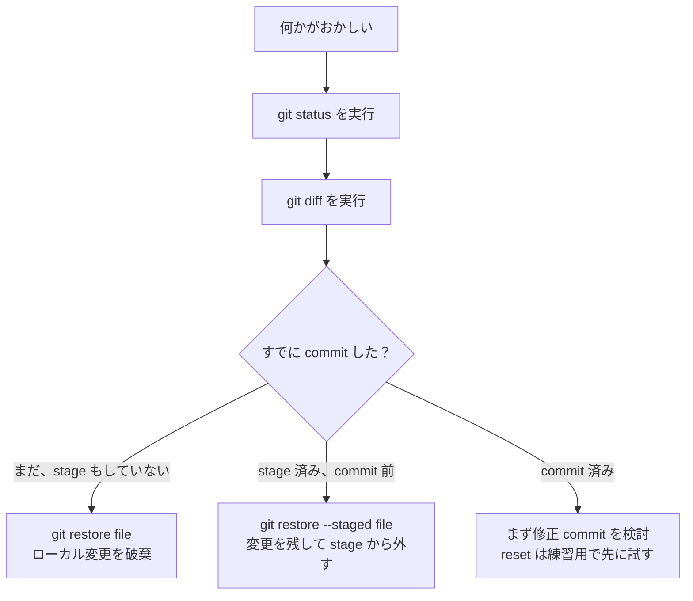

# 1.2.2 Gitのコア操作


## 残す証拠

このページを終えたら、この evidence card を残します。

```text
リポジトリ状態: 操作前後の git status
操作：init、add、commit、branch、merge、remote、pull、またはpushコマンドを使用
履歴：何が変わったかを示す git log またはブランチグラフ
失敗確認: 未追跡ファイル、誤ったブランチ、マージ衝突、またはリモート/認証の問題
期待される成果：別の学習者が安全に再実行できる、きれいな Git の trace
```

## この節の位置づけ

この節から、Git を実際に使い始めます。重点は、毎日くり返し使う add、commit、status、log、diff、そして取り消し操作を身につけて、「少しコードを書く → 状態を確認する → 1 回記録を残す」という基本的な開発習慣を作ることです。

## 学習目標

- `git add`、`git commit`、`git status`、`git log` を使いこなす
- `git diff` で変更内容を確認できる
- `.gitignore` ファイルを書けるようになる
- よく使う取り消し操作を理解する

---

## 準備

ここでは、AI プロジェクトの模擬例を使って、いろいろな操作を練習します。まずプロジェクトを作成します。

```bash
mkdir ai-image-classifier
cd ai-image-classifier
git init

# 基本的なプロジェクト構成を作成
mkdir data models src
touch src/train.py src/model.py src/utils.py
touch README.md requirements.txt
```

---

## 状態を確認する：git status

`git status` は最もよく使うコマンドの 1 つです。今のリポジトリの状態を教えてくれます。どのファイルが変更されたのか？ どれがステージングエリアにあるのか？ どれがまだ Git に追跡されていないのか？

```bash
git status
```

出力：

```
On branch main

No commits yet

Untracked files:
  (use "git add <file>..." to include in what will be committed)
        README.md
        requirements.txt
        src/

nothing added to commit but untracked files present
```

**Untracked files（未追跡ファイル）**：Git はそのファイルを見つけていますが、まだ管理していません。`git add` を使って、Git に「このファイルの追跡を始めてください」と伝える必要があります。

---

## ステージングエリアに追加する：git add

```bash
# 単一ファイルを追加
git add README.md

# 複数ファイルを追加
git add src/train.py src/model.py

# フォルダ全体を追加
git add src/

# すべてのファイルを追加（最もよく使う）
git add .

# 変更された追跡済みファイルだけを追加（新規ファイルは含まない）
git add -u
```

### 実践例

まず、ファイルに少し内容を書きます。

```bash
echo "# AI 画像分類器" > README.md
echo "torch>=2.0" > requirements.txt

cat > src/model.py << 'EOF'
import torch.nn as nn

class SimpleCNN(nn.Module):
    def __init__(self):
        super().__init__()
        self.conv1 = nn.Conv2d(3, 16, 3, padding=1)
        self.pool = nn.MaxPool2d(2, 2)
        self.fc1 = nn.Linear(16 * 16 * 16, 10)

    def forward(self, x):
        x = self.pool(torch.relu(self.conv1(x)))
        x = x.view(-1, 16 * 16 * 16)
        x = self.fc1(x)
        return x
EOF
```

では、すべてのファイルを追加して状態を確認します。

```bash
git add .
git status
```

出力：

```
On branch main

No commits yet

Changes to be committed:
  (use "git rm --cached <file>..." to unstage)
        new file:   README.md
        new file:   requirements.txt
        new file:   src/model.py
        new file:   src/train.py
        new file:   src/utils.py
```

ファイルが緑色の **"Changes to be committed"** になっています。これは、ステージングエリアに入り、コミットできる状態になったという意味です。

---

## コミットする：git commit

```bash
git commit -m "プロジェクトを初期化：モデル定義とプロジェクト構成を追加"
```

出力：

```
[main (root-commit) a1b2c3d] プロジェクトを初期化：モデル定義とプロジェクト構成を追加
 5 files changed, 18 insertions(+)
 create mode 100644 README.md
 create mode 100644 requirements.txt
 create mode 100644 src/model.py
 create mode 100644 src/train.py
 create mode 100644 src/utils.py
```

### コミットメッセージはどう書く？

コミットメッセージは、簡潔で分かりやすく、この変更で何をしたのかが一目で分かるように書きます。

**よいコミットメッセージ：**

```bash
git commit -m "CNN モデル定義を追加"
git commit -m "学習ループの学習率が更新されない bug を修正"
git commit -m "データ拡張を追加：ランダム反転と色変動"
git commit -m "README を更新：インストール手順を追加"
```

**よくないコミットメッセージ：**

```bash
git commit -m "update"           # 何を変えたの？
git commit -m "fix"              # 何を直したの？
git commit -m "aaa"              # ？？？
git commit -m "いろいろ変更"       # 何も伝わらない
```

:::tip[実用的な考え方]
コミットメッセージはこの質問に答えるものです：**「このコミットで何をしたか？」**
動詞で始めて（追加、修正、更新、削除、リファクタリングなど）、対象をはっきり書きましょう。
:::
---

## 変更を確認する：git diff

`git diff` は、「前回のコミット以降、何を変更したか」を教えてくれます。

### 例：モデルコードを修正する

```bash
# model.py に新しい層を追加
cat > src/model.py << 'EOF'
import torch
import torch.nn as nn

class SimpleCNN(nn.Module):
    def __init__(self):
        super().__init__()
        self.conv1 = nn.Conv2d(3, 16, 3, padding=1)
        self.conv2 = nn.Conv2d(16, 32, 3, padding=1)  # 追加した畳み込み層
        self.pool = nn.MaxPool2d(2, 2)
        self.fc1 = nn.Linear(32 * 8 * 8, 10)

    def forward(self, x):
        x = self.pool(torch.relu(self.conv1(x)))
        x = self.pool(torch.relu(self.conv2(x)))  # 追加
        x = x.view(-1, 32 * 8 * 8)
        x = self.fc1(x)
        return x
EOF
```

では、変更を確認します。

```bash
git diff
```

出力では、赤と緑で差分が強調されます。

```diff
--- a/src/model.py
+++ b/src/model.py
@@ -1,4 +1,5 @@
+import torch
 import torch.nn as nn

 class SimpleCNN(nn.Module):
     def __init__(self):
         super().__init__()
         self.conv1 = nn.Conv2d(3, 16, 3, padding=1)
+        self.conv2 = nn.Conv2d(16, 32, 3, padding=1)  # 追加した畳み込み層
         self.pool = nn.MaxPool2d(2, 2)
-        self.fc1 = nn.Linear(16 * 16 * 16, 10)
+        self.fc1 = nn.Linear(32 * 8 * 8, 10)
```

- **赤色（`-` で始まる行）**：削除された行
- **緑色（`+` で始まる行）**：追加された行

では、この変更をコミットします。

```bash
git add src/model.py
git commit -m "2つ目の畳み込み層を追加してモデルの表現力を向上"
```

### diff の使い方いろいろ

```bash
git diff                    # 作業ディレクトリの未ステージ変更を確認
git diff --staged           # ステージングエリアの変更を確認（add 済みだが commit 前）
git diff HEAD~1             # 最新の 1 回前のコミットとの差分を見る
git diff abc1234 def5678    # 2 つのコミット間の差分を比較
```

---

## 履歴を確認する：git log

```bash
git log
```

出力：

```
commit def5678... (HEAD -> main)
Author: Zhang San <zhangsan@example.com>
Date:   Mon Feb 9 10:30:00 2026

    2つ目の畳み込み層を追加してモデルの表現力を向上

commit a1b2c3d...
Author: Zhang San <zhangsan@example.com>
Date:   Mon Feb 9 10:00:00 2026

    プロジェクトを初期化：モデル定義とプロジェクト構成を追加
```

### もっと簡潔に履歴を見る

```bash
# 1 行で 1 レコード表示（最もよく使う）
git log --oneline
# 出力:
# def5678 2つ目の畳み込み層を追加してモデルの表現力を向上
# a1b2c3d プロジェクトを初期化：モデル定義とプロジェクト構成を追加

# ファイル変更の統計つき
git log --oneline --stat

# ブランチを図で表示（ブランチがあるときに便利）
git log --oneline --graph --all
```

---

## .gitignore：Git に無視させるファイルを指定する

Git で管理しないほうがよいファイルがあります。

- データファイル（数 GB の学習データ）
- モデル重みファイル（数百 MB）
- 仮想環境フォルダ
- OS が生成する一時ファイル
- API キーやパスワードなどの機密情報

`.gitignore` ファイルを作って、Git に無視させます。

```bash
cat > .gitignore << 'EOF'
# Python キャッシュ
__pycache__/
*.pyc
*.pyo

# 仮想環境
venv/
.venv/
env/

# Jupyter Notebook のチェックポイント
.ipynb_checkpoints/

# データファイル（大きすぎるので Git に入れない）
data/*.csv
data/*.json
data/*.zip
*.h5
*.hdf5

# モデル重みファイル
models/*.pt
models/*.pth
models/*.onnx
*.bin

# 環境変数ファイル（API キーなどの機密情報を含む）
.env
.env.local

# IDE の設定
.vscode/
.idea/

# OS のファイル
.DS_Store
Thumbs.db

# ログ
logs/
*.log

# 配布/パッケージ
dist/
build/
*.egg-info/
EOF
```

```bash
git add .gitignore
git commit -m ".gitignore を追加：キャッシュ、データ、モデル重み、機密ファイルを無視"
```

### .gitignore が効いているか確認する

```bash
# 無視されるべきファイルをいくつか作成
mkdir -p __pycache__
touch __pycache__/model.cpython-311.pyc
touch .env
echo "OPENAI_API_KEY=your_api_key_here" > .env

# 状態を確認——これらのファイルは表示されない
git status
# 出力: nothing to commit, working tree clean
```

`.env` と `__pycache__/` は無視され、Git に送られません。API キーは安全です。

:::caution[すでに追跡されているファイル]
`.gitignore` は、**まだ Git に追跡されていない**ファイルにのみ有効です。
先にファイルをコミットしてから `.gitignore` に追加しても、自動では無視されません。先に手動で追跡解除する必要があります。

```bash
git rm --cached .env
git commit -m ".env ファイルを Git から削除"
```
:::
---

## 取り消し操作：後悔したときの対処

Git にはいくつかの「後悔したときの対処法」があります。どこまで進めたあとに取り消したいかで使い分けます。

:::caution[取り消しコマンドは、まず練習用リポジトリで試す]
取り消しコマンドは便利ですが、一部のコマンドは意図的に変更を破棄します。実際のプロジェクトで使う前に、`git status` と `git diff` を実行し、どの変更が残り、どの変更が失われるのかを確認してください。
:::
初心者は、次の順番で考えると安全です。



### 場面 1：ファイルを変更したが、まだ add していない。元に戻したい

```bash
# src/utils.py を変更したが、満足できないので前回のコミット状態に戻す
git restore src/utils.py

# すべてのファイルを戻す
git restore .
```

:::caution[`git restore` は**変更を破棄**します。元に戻せません。本当に不要な変更だと確認してから実行してください。]
:::
### 場面 2：すでに add したが、ステージングエリアから外したい（変更は残す）

```bash
# model.py を add したが、まだ commit したくない
git restore --staged src/model.py

# ファイルはステージングエリアから作業ディレクトリに戻り、変更内容は残る
```

### 場面 3：すでに commit したが、コミットメッセージを直したい

```bash
# 直前のコミットをしたあと、メッセージの誤りに気づいた
git commit --amend -m "修正後のコミットメッセージ"
```

### 場面 4：すでに commit したが、コミット全体を取り消したい

```bash
# 最新のコミットを取り消すが、ファイル変更は残す（add 前の状態に戻る）
git reset HEAD~1

# 最新のコミットを取り消し、変更もすべて破棄する（完全に戻す。慎重に）
git reset --hard HEAD~1
```

最初の数週間は、`git reset --hard` を日常コマンドではなく緊急用コマンドとして扱ってください。チーム開発では履歴を書き換えると他の人にも影響するため、間違いを直す新しい commit を作る方が安全なことが多いです。

### 例：完全なやり直しの流れ

```bash
# うっかり API キーをコミットしてしまったとする
echo "API_KEY=your_api_key_here" > config.py
git add .
git commit -m "設定ファイルを追加"

# まずい！ キーは commit してはいけない。今回の commit を取り消す
git reset HEAD~1

# ファイルは残るが、コミットは取り消された。ここで .gitignore に追加する
echo "config.py" >> .gitignore
git add .gitignore
git commit -m ".gitignore を更新：config.py を無視"
```

### 取り消し操作の早見表

| 何を取り消したいか | コマンド | ファイル変更は残るか |
|------------|------|:-----------:|
| 作業ディレクトリの変更（まだ add していない） | `git restore ファイル名` | ❌ 破棄 |
| ステージングエリアのファイル（add 済みで commit 前） | `git restore --staged ファイル名` | ✅ 残る |
| 最新の commit メッセージを間違えた | `git commit --amend -m "新しいメッセージ"` | ✅ 残る |
| 最新の commit を取り消す（変更は残す） | `git reset HEAD~1` | ✅ 残る |
| 最新の commit を取り消す（変更も破棄） | `git reset --hard HEAD~1` | ❌ 破棄 |

---

## 実践練習：1 回の開発プロセスを通してやってみる

```bash
# 1. 学習スクリプトを書く
cat > src/train.py << 'EOF'
import torch
from model import SimpleCNN

model = SimpleCNN()
optimizer = torch.optim.Adam(model.parameters(), lr=0.001)
print("モデルのパラメータ数:", sum(p.numel() for p in model.parameters()))
EOF

git add src/train.py
git commit -m "基本的な学習スクリプトを追加"

# 2. ユーティリティ関数を書く
cat > src/utils.py << 'EOF'
def accuracy(predictions, labels):
    """正解率を計算する"""
    correct = (predictions.argmax(dim=1) == labels).sum().item()
    return correct / len(labels)
EOF

git add src/utils.py
git commit -m "正解率計算のユーティリティ関数を追加"

# 3. README を更新
cat > README.md << 'EOF'
# AI 画像分類器

CNN を使ったシンプルな画像分類プロジェクトです。

## インストール

```bash
pip install -r requirements.txt
```

## 使い方

```bash
python src/train.py
```
EOF

git add README.md
git commit -m "README を更新：インストール方法と使い方を追加"

# 4. 完全な履歴を確認
git log --oneline
```

次のような 5 つのコミット履歴が見えるはずです。

```
f6g7h8i README を更新：インストール方法と使い方を追加
d4e5f6g 正解率計算のユーティリティ関数を追加
b2c3d4e 基本的な学習スクリプトを追加
9a0b1c2 .gitignore を追加：キャッシュ、データ、モデル重み、機密ファイルを無視
a1b2c3d プロジェクトを初期化：モデル定義とプロジェクト構成を追加
```

それぞれが、あとから戻れる保存ポイントです。

<details>
<summary>プロジェクト参考とレビュー観点</summary>

1. 最後の `git log --oneline` には、この練習で作った 3 つの commit と、前に初期化した commit が表示されます。
2. 1 つの commit には 1 つの小さな考えだけを保存します。学習スクリプト、ユーティリティ関数、README 更新を混ぜすぎないようにします。
3. 最後の `git status` は clean か、説明できる未追跡ファイルだけが残っている状態にします。
4. `src/train.py` が `torch` や `model` 不足で失敗する場合、それは Git ではなく実行環境の問題です。失敗は記録し、Git 操作の証拠は残します。
5. よい commit message は `Add basic training script` のように動作と意味が分かります。`update stuff` のような曖昧な表現は避けます。

</details>

---

## まとめ

| コマンド | 用途 | 使用頻度 |
|------|------|:------:|
| `git status` | 現在の状態を確認する | ⭐⭐⭐⭐⭐ |
| `git add .` | すべての変更をステージする | ⭐⭐⭐⭐⭐ |
| `git commit -m "メッセージ"` | コミットする | ⭐⭐⭐⭐⭐ |
| `git log --oneline` | 履歴を見る | ⭐⭐⭐⭐ |
| `git diff` | 変更内容を見る | ⭐⭐⭐⭐ |
| `git restore` | 作業ディレクトリの変更を取り消す | ⭐⭐⭐ |
| `git reset` | コミットを取り消す | ⭐⭐ |
