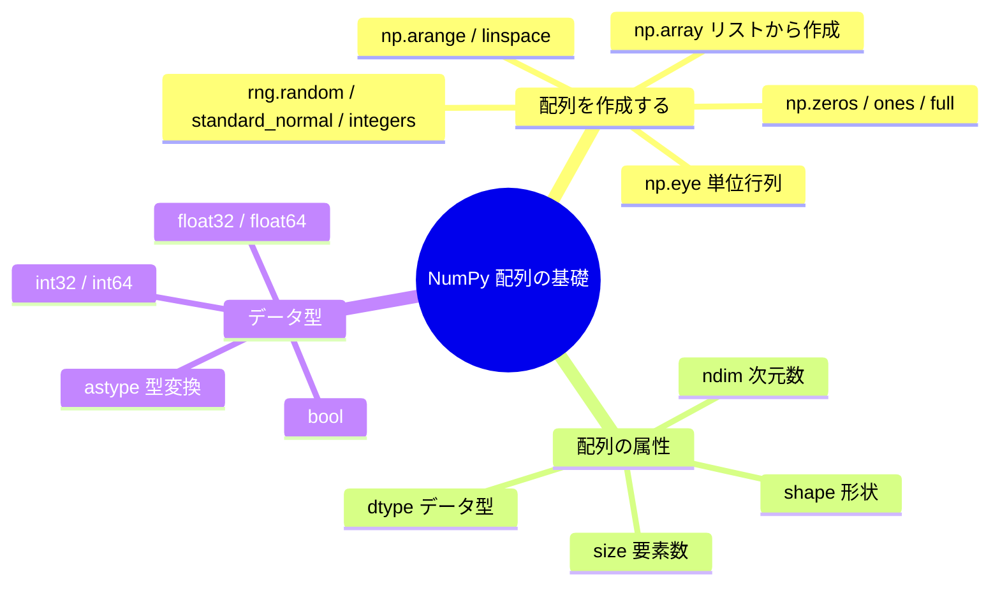

# 3.2.2 配列の基礎


## 学習目標

- さまざまな配列の作成方法を身につける
- 配列の基本属性（shape、dtype、ndim、size）を理解する
- NumPy のデータ型システムを知る
- 配列のデータ型変換を身につける

---

## 配列を作成する

### Python のリストから作成する

最も基本的な方法は、`np.array()` を使って Python のリストを NumPy 配列に変換することです。

```python
import numpy as np

# 1次元配列
a = np.array([1, 2, 3, 4, 5])
print(a)         # [1 2 3 4 5]
print(type(a))   # <class 'numpy.ndarray'>

# 2次元配列（行列）
b = np.array([
    [1, 2, 3],
    [4, 5, 6]
])
print(b)
# [[1 2 3]
#  [4 5 6]]

# 3次元配列
c = np.array([
    [[1, 2], [3, 4]],
    [[5, 6], [7, 8]]
])
print(c.shape)  # (2, 2, 2)
```

:::caution[よくある間違い]
```python
# ❌ 間違い：入れ子リストの長さがそろっていない
bad = np.array([[1, 2, 3], [4, 5]])  # 警告が出るか、object 配列が作られる

# ✅ 正しい：各行の長さは同じである必要がある
good = np.array([[1, 2, 3], [4, 5, 6]])
```
:::
### 便利な作成関数

NumPy には、要素を1つずつ手で書かなくても配列をすばやく作れる関数がたくさんあります。

```python
import numpy as np

# ========== 全部 0 / 全部 1 の配列 ==========
zeros_1d = np.zeros(5)
print(zeros_1d)  # [0. 0. 0. 0. 0.]

zeros_2d = np.zeros((3, 4))   # 3 行 4 列
print(zeros_2d)
# [[0. 0. 0. 0.]
#  [0. 0. 0. 0.]
#  [0. 0. 0. 0.]]

ones_2d = np.ones((2, 3))     # 2 行 3 列
print(ones_2d)
# [[1. 1. 1.]
#  [1. 1. 1.]]

# ========== 指定した値で埋める ==========
fives = np.full((2, 3), 5)    # すべて 5 で埋める
print(fives)
# [[5 5 5]
#  [5 5 5]]

# ========== 単位行列 ==========
eye = np.eye(3)                # 3×3 の単位行列
print(eye)
# [[1. 0. 0.]
#  [0. 1. 0.]
#  [0. 0. 1.]]
```

### 等差数列: arange と linspace

```python
# arange：Python の range に似ているが、NumPy 配列を返す
a = np.arange(10)          # 0 から 9
print(a)                    # [0 1 2 3 4 5 6 7 8 9]

b = np.arange(2, 10, 2)    # 2 から始めて、10（含まない）まで、刻み幅 2
print(b)                    # [2 4 6 8]

c = np.arange(0, 1, 0.2)   # 小数の刻み幅も使える！（range は対応していない）
print(c)                    # [0.  0.2 0.4 0.6 0.8]

# linspace：個数を指定して、刻み幅を自動計算する
d = np.linspace(0, 10, 5)   # 0 から 10（含む）まで、均等に 5 点
print(d)                     # [ 0.   2.5  5.   7.5 10. ]

e = np.linspace(0, 1, 11)   # 0 から 1 の間で 11 個の点を取る
print(e)                     # [0.  0.1 0.2 ... 0.9 1. ]
```

:::tip[arange と linspace の違い]
- `arange(start, stop, step)`：**刻み幅**を指定すると、NumPy が要素数を計算する
- `linspace(start, stop, num)`：**要素数**を指定すると、NumPy が刻み幅を計算する

グラフを描くときは `linspace` のほうがよく使われます。たいていは、サンプリング点の数を調整したいからです。
:::
### ランダム配列を作成する

```python
# 新しい NumPy コードでは default_rng() を優先する
rng = np.random.default_rng(seed=42)

# 0〜1 の一様分布の乱数
rand = rng.random((3, 4))       # 3×4
print(rand)

# 標準正規分布の乱数（平均0、標準偏差1）
randn = rng.standard_normal((3, 4))     # 3×4

# 指定範囲のランダムな整数
randint = rng.integers(1, 100, size=(3, 4))  # 1〜99 の 3×4 整数
print(randint)
```

:::tip[なぜここでは `default_rng()` を使うのか？]
古い教材では `np.random.rand()` や `np.random.randint()` をよく見ます。今も動きますが、グローバルな乱数状態に依存します。`np.random.default_rng()` は独立した乱数生成器を作るため、大きなプロジェクトで再現しやすく安全です。
:::
### 作成方法の早見表

| 関数 | 役割 | 例 |
|------|------|------|
| `np.array()` | リストから作成する | `np.array([1, 2, 3])` |
| `np.zeros()` | 全部 0 の配列 | `np.zeros((3, 4))` |
| `np.ones()` | 全部 1 の配列 | `np.ones((2, 3))` |
| `np.full()` | 指定した値で埋める | `np.full((2, 3), 7)` |
| `np.eye()` | 単位行列 | `np.eye(4)` |
| `np.arange()` | 等差数列（刻み幅を指定） | `np.arange(0, 10, 2)` |
| `np.linspace()` | 等差数列（要素数を指定） | `np.linspace(0, 1, 100)` |
| `rng.random()` | 一様乱数 [0, 1) | `rng.random((3, 4))` |
| `rng.standard_normal()` | 標準正規分布 | `rng.standard_normal((3, 4))` |
| `rng.integers()` | ランダム整数 | `rng.integers(0, 10, size=(3, 4))` |

---

## 配列の属性

各 NumPy 配列には重要な属性があります。これらを理解することは、後の操作の基礎です。

```python
import numpy as np

arr = np.array([
    [1, 2, 3, 4],
    [5, 6, 7, 8],
    [9, 10, 11, 12]
])

print(f"形状 (shape):  {arr.shape}")    # (3, 4) → 3 行 4 列
print(f"次元数 (ndim):   {arr.ndim}")     # 2 → 2次元配列
print(f"要素数 (size): {arr.size}")      # 12 → 3 × 4 = 12
print(f"データ型 (dtype): {arr.dtype}")  # int64
print(f"各要素のバイト数: {arr.itemsize}") # 8 → int64 は 8 バイト
print(f"総バイト数: {arr.nbytes}")         # 96 → 12 × 8 = 96
```

### shape の意味

`shape` は最もよく使う属性で、配列の「形」を表します。

```python
# 1次元配列
a = np.array([1, 2, 3])
print(a.shape)      # (3,) → 3 個の要素

# 2次元配列
b = np.array([[1, 2, 3], [4, 5, 6]])
print(b.shape)      # (2, 3) → 2 行 3 列

# 3次元配列
c = np.ones((2, 3, 4))
print(c.shape)      # (2, 3, 4) → 「3行4列の行列」が 2 つ
```

shape を理解するコツは、**外側から内側へ、順番に数える**ことです。

```
3次元配列 shape = (2, 3, 4)
          ↓  ↓  ↓
          │  │  └── 最も内側: 各行に 4 個の要素
          │  └───── 中間層: 各行列に 3 行
          └──────── 最も外側: 合計 2 個の行列
```

---

## データ型（dtype）

NumPy 配列のすべての要素は、同じ型でなければなりません。これが高速に計算できる理由でもあります。

### よく使うデータ型

| dtype | 意味 | 例 | よくある用途 |
|-------|------|--------|---------|
| `int32` | 32ビット整数 | -2147483648 ~ 2147483647 | カウント、インデックス |
| `int64` | 64ビット整数（デフォルト） | より広い範囲 | 一般的な整数 |
| `float32` | 32ビット浮動小数点数 | 約7桁の有効数字 | 深層学習（VRAM節約） |
| `float64` | 64ビット浮動小数点数（デフォルト） | 約15桁の有効数字 | 科学計算（高精度） |
| `bool` | 真偽値 | True / False | 条件による絞り込み |
| `str_` | 文字列 | "hello" | テキストラベル（あまり使わない） |

### データ型を指定する

```python
# 自動で型を推定する
a = np.array([1, 2, 3])         # int64（すべて整数）
b = np.array([1.0, 2.0, 3.0])   # float64（小数点あり）
c = np.array([1, 2.5, 3])       # float64（混在すると自動で上位の型になる）

# 手動で型を指定する
d = np.array([1, 2, 3], dtype=np.float32)
print(d)        # [1. 2. 3.]
print(d.dtype)  # float32

e = np.zeros(5, dtype=np.int32)
print(e)        # [0 0 0 0 0]
print(e.dtype)  # int32
```

### 型変換: astype

```python
# 整数を浮動小数点数に変換する
int_arr = np.array([1, 2, 3, 4])
float_arr = int_arr.astype(np.float64)
print(float_arr)        # [1. 2. 3. 4.]
print(float_arr.dtype)  # float64

# 浮動小数点数を整数に変換する（そのまま切り捨てられる。四捨五入ではない！）
float_arr2 = np.array([1.7, 2.3, 3.9])
int_arr2 = float_arr2.astype(np.int32)
print(int_arr2)  # [1 2 3]  ← 注意：3.9 は 4 ではなく 3 になる！

# bool への変換
bool_arr = np.array([0, 1, 0, 2, -1]).astype(bool)
print(bool_arr)  # [False  True False  True  True]  ← 0 は False、0 以外は True
```

:::caution[float を int に変換するときの注意]
`astype(int)` は**小数部分をそのまま切り捨てる**ので、四捨五入にはなりません。四捨五入したい場合は、先に `np.round()` を使います。

```python
arr = np.array([1.5, 2.3, 3.7])
print(arr.astype(int))     # [1 2 3] ← 切り捨て
print(np.round(arr).astype(int))  # [2 2 4] ← 四捨五入してから変換
```
:::
### float32 と float64: どちらを使う？

```python
# float64：デフォルト。精度が高い
a = np.array([1.0, 2.0, 3.0])  # デフォルトは float64、各要素 8 バイト

# float32：メモリ節約。深層学習でよく使う
b = np.array([1.0, 2.0, 3.0], dtype=np.float32)  # 各要素 4 バイト

# メモリ比較
rng = np.random.default_rng(seed=42)
big_f64 = rng.random(1_000_000)                          # float64
big_f32 = rng.random(1_000_000).astype(np.float32)       # float32
print(f"float64 のメモリ使用量: {big_f64.nbytes / 1024 / 1024:.1f} MB")  # 7.6 MB
print(f"float32 のメモリ使用量: {big_f32.nbytes / 1024 / 1024:.1f} MB")  # 3.8 MB
```

:::tip[実用的なアドバイス]
- **データ分析**では、デフォルトの float64 を使えばOKです。精度が高く、気にしすぎる必要はありません
- **深層学習**では、モデルのパラメータやデータは通常 float32（場合によっては float16）を使います。GPU の VRAM は貴重だからです
- いまは、この2つの型があると知っておけば十分です。後で深層学習の段階で詳しく学びます
:::
---

## 既存の配列から作成する

すでにある配列の形をもとに、新しい配列を作りたいことがあります。

```python
original = np.array([[1, 2, 3], [4, 5, 6]])

# original と同じ形の全 0 配列を作る
z = np.zeros_like(original)
print(z)
# [[0 0 0]
#  [0 0 0]]

# original と同じ形の全 1 配列を作る
o = np.ones_like(original)
print(o)
# [[1 1 1]
#  [1 1 1]]

# original と同じ形の指定値配列を作る
f = np.full_like(original, 99)
print(f)
# [[99 99 99]
#  [99 99 99]]

# 初期化されていない配列を作る（速いが値は不定）
e = np.empty_like(original)
# ⚠️ 値は不定なので、代入せずに empty 配列をそのまま使わないでください！
```

---

## 残す証拠

このページを終えたら、この evidence card を残します。

```text
配列状態: 操作前の shape、dtype、axis、サンプル値
操作：indexing、slicing、broadcasting、reshape、線形代数、またはランダム/stat関数
出力：結果の配列形状、値、または統計量
失敗確認：軸の混同、view/copy の落とし穴、ブロードキャスト不一致、または誤った形状
期待される成果: 配列操作を確認できる出力形状と値
```

## まとめ



---

## 練習問題

### 練習 1: さまざまな配列を作成する

```python
import numpy as np

# 1. 1 から 20 までを含む 1次元配列を作成する
arr1 = np.arange(1, 21)

# 2. 4×5 の全ゼロ行列を作成する
arr2 = np.zeros((4, 5))

# 3. 3×3 の行列を作成し、すべての要素を 7 にする
arr3 = np.full((3, 3), 7)

# 4. 0 から 2π (np.pi * 2) の間で均等に分布した 100 個の点を作成する
arr4 = np.linspace(0, np.pi * 2, 100)

# 5. 5×5 のランダムな整数行列を作成する（範囲 1〜50）
rng = np.random.default_rng(seed=42)
arr5 = rng.integers(1, 51, size=(5, 5))
```

### 練習 2: 属性を確認する

shape が (3, 4, 5) の全 1 配列を作成し、次の質問に答えてください。
1. 次元数（ndim）はいくつですか？
2. 要素数（size）はいくつですか？
3. デフォルトの dtype は何ですか？
4. それを int32 型に変換した後、各要素は何バイトですか？

### 練習 3: 型変換

```python
# 与えられた試験の点数（浮動小数点数）
scores = np.array([85.6, 92.3, 78.8, 95.1, 60.5, 73.9])

# 1. 点数を四捨五入して整数にする
rounded = np.rint(scores).astype(int)

# 2. 各点数が合格かどうか（>= 60）を判定し、bool 配列を得る
passed = scores >= 60

# 3. 合格人数を求める（ヒント: True は 1、False は 0 として数えられる）
pass_count = passed.sum()
```


<details>
<summary>参考実装と解説</summary>

- 形状チェックは、`arr1.shape == (20,)`、`arr2.shape == (4, 5)`、`arr3.shape == (3, 3)`、`arr4.shape == (100,)`、`arr5.shape == (5, 5)` になります。
- `np.ones((3, 4, 5))` は 3 次元で、要素数は 60 です。dtype を指定しなければ通常は `float64` になり、`int32` 配列の `itemsize` は 4 バイトです。
- スコア配列は丸めると整数のように見せられますが、合格者数は元のルール、例えば `scores >= 60` で数えます。そのため `60.5` は合格です。

</details>
