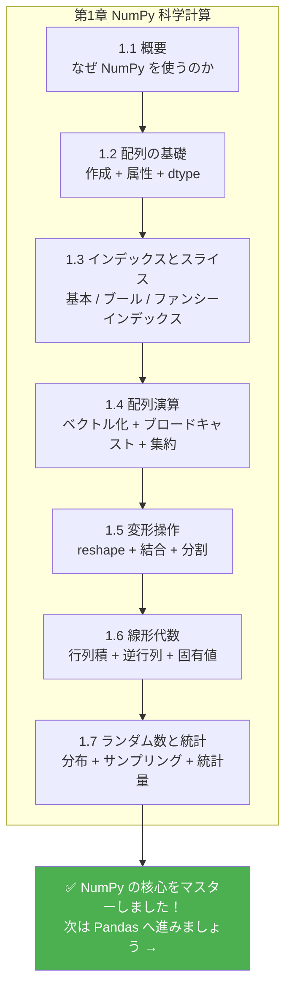

## 学習目標

- `numpy.random` モジュールのよく使う関数を理解する
- よく使う確率分布（均一分布、正規分布、二項分布）を理解する
- 乱数シード（seed）の役割を理解する
- NumPy を使って基本的な統計演算ができるようになる

---

## なぜ乱数が必要なの？

データサイエンスや AI では、乱数はいたるところで使われます。

| 場面 | なぜ乱数が必要か |
|------|----------------|
| データセット分割 | 学習用データとテスト用データをランダムに分ける |
| モデル初期化 | ニューラルネットワークの重みをランダムに初期化する |
| データ拡張 | 画像をランダムに切り抜く、回転する、反転する |
| モンテカルロシミュレーション | ランダムサンプリングで複雑な問題を推定する |
| A/B テスト | ユーザーを対照群と実験群にランダムに割り当てる |

---

## numpy.random の基本

### 新しい API（推奨）

NumPy では、新しい `Generator` API の使用が推奨されています。

```python
import numpy as np

# 乱数生成器を作成
rng = np.random.default_rng(seed=42)

# 一様分布の乱数 [0, 1)
print(rng.random(5))
# [0.773... 0.438... 0.858... 0.697... 0.094...]

# 指定範囲のランダム整数
print(rng.integers(1, 100, size=5))
# [67 82 42 91 23]（例）

# 正規分布の乱数
print(rng.standard_normal(5))
# [-0.15... 0.74... -0.27... ...]
```

### 古い API（今でもよく使われる）

多くのチュートリアルやコードでは、古い API もまだ使われています。これも読めるようにしておきましょう。

```python
# 古い書き方（今でも有効）
np.random.seed(42)  # グローバルシードを設定

# 一様乱数 [0, 1)
print(np.random.rand(3))

# 標準正規分布
print(np.random.randn(3))

# ランダム整数
print(np.random.randint(1, 100, size=5))
```

:::tip[新版 vs 旧版]
- **新版** `default_rng()`：より柔軟で、独立した乱数状態を扱える。新しいコードではこちらを推奨
- **旧版** `np.random.xxx()`：グローバル状態を使う。シンプルで分かりやすく、古いコードでよく見られる

どちらも理解しておきましょう。この教材では両方の書き方を扱います。
:::
---

## 乱数シード： "ランダム" を再現可能にする

科学研究やデバッグでは、同じコードを実行するたびに同じ結果が得られる「再現可能な乱数」がよく必要になります。

```python
# シードを設定しない：毎回結果が異なる
print(np.random.rand(3))  # 毎回違う

# シードを設定する：毎回同じ結果になる
np.random.seed(42)
print(np.random.rand(3))  # [0.374... 0.950... 0.731...]

np.random.seed(42)        # 同じシードを再設定
print(np.random.rand(3))  # [0.374... 0.950... 0.731...]  完全に同じ！
```

```python
# 新しい API でのシード設定
rng = np.random.default_rng(seed=42)
print(rng.random(3))

rng2 = np.random.default_rng(seed=42)  # 同じシード
print(rng2.random(3))                    # 同じ結果
```

:::note[シードの役割]
乱数シードは、"乱数のレシピ" のようなものです。シードが同じなら、いつも同じ順序の乱数が生成されます。次の場面では、必ずシードを設定しましょう。

- **学習 / チュートリアル**：結果を確認しやすくする
- **科学実験**：結果の再現性を確保する
- **コードのデバッグ**：乱数による影響を切り分ける
- **機械学習の学習**：比較実験の公平性を保つ
:::
---

## よく使う確率分布

### 一様分布

各値が出る確率が同じ分布です。

```python
rng = np.random.default_rng(42)

# [0, 1) の一様分布
uniform_01 = rng.random(10000)
print(f"平均: {uniform_01.mean():.4f}")  # ≈ 0.5
print(f"最小: {uniform_01.min():.4f}")   # ≈ 0
print(f"最大: {uniform_01.max():.4f}")   # ≈ 1

# [low, high) の一様分布
uniform_custom = rng.uniform(low=10, high=50, size=1000)
print(f"平均: {uniform_custom.mean():.1f}")  # ≈ 30
```

### 正規分布（ガウス分布）

自然界やデータの中でとてもよく現れる、最も重要な分布のひとつです。

```python
rng = np.random.default_rng(42)

# 標準正規分布：平均=0, 標準偏差=1
standard = rng.standard_normal(10000)
print(f"平均: {standard.mean():.4f}")  # ≈ 0
print(f"標準偏差: {standard.std():.4f}")  # ≈ 1

# 平均と標準偏差を指定した正規分布
# 例：中国の成人男性の身長は約 170cm、標準偏差は約 6cm
heights = rng.normal(loc=170, scale=6, size=10000)
print(f"平均身長: {heights.mean():.1f} cm")
print(f"標準偏差: {heights.std():.1f} cm")
print(f"最小値: {heights.min():.1f} cm")
print(f"最大値: {heights.max():.1f} cm")
```

### 二項分布

n 回の独立試行で成功した回数を表します（例：コイン投げ）。

```python
rng = np.random.default_rng(42)

# コインを 10 回投げる実験を 10000 回シミュレーションする（表が出る確率 0.5）
results = rng.binomial(n=10, p=0.5, size=10000)
print(f"平均の表の回数: {results.mean():.2f}")  # ≈ 5
print(f"最小: {results.min()}")
print(f"最大: {results.max()}")
```

### その他のよく使う分布

```python
rng = np.random.default_rng(42)

# ポアソン分布（イベントの発生回数）
# 例：1時間あたり平均 5 人の来客がある
visitors = rng.poisson(lam=5, size=1000)
print(f"ポアソン分布 - 平均: {visitors.mean():.2f}")

# 指数分布（イベント間の待ち時間）
wait_times = rng.exponential(scale=2.0, size=1000)
print(f"指数分布 - 平均: {wait_times.mean():.2f}")

# choice：配列からランダムに選ぶ
names = np.array(["Alice", "Bob", "Charlie", "Diana", "Eve"])
chosen = rng.choice(names, size=3, replace=False)  # 非復元抽出
print(f"ランダムに選んだもの: {chosen}")
```

---

## ランダム操作

### ランダムシャッフル

```python
rng = np.random.default_rng(42)

arr = np.arange(10)    # [0 1 2 3 4 5 6 7 8 9]

# シャッフル（元の配列を直接変更）
rng.shuffle(arr)
print(arr)              # [8 1 5 0 7 2 9 4 3 6]（ランダムな順序）

# シャッフルして新しい配列を返す（元の配列は変更しない）
arr2 = np.arange(10)
shuffled = rng.permutation(arr2)
print(arr2)       # [0 1 2 3 4 5 6 7 8 9]  元の配列はそのまま
print(shuffled)   # シャッフル後の新しい配列
```

### ランダムサンプリング

```python
rng = np.random.default_rng(42)

data = np.arange(100)

# 復元抽出（重複する可能性あり）
sample1 = rng.choice(data, size=10, replace=True)
print(f"復元抽出: {sample1}")

# 非復元抽出（重複しない）
sample2 = rng.choice(data, size=10, replace=False)
print(f"非復元抽出: {sample2}")

# 重み付きランダムサンプリング
items = np.array(["よくある", "普通", "珍しい", "伝説"])
weights = np.array([0.6, 0.25, 0.1, 0.05])  # 確率
drops = rng.choice(items, size=20, p=weights)
unique, counts = np.unique(drops, return_counts=True)
for item, count in zip(unique, counts):
    print(f"  {item}: {count} 回")
```

---

## 統計演算

NumPy には、豊富な統計関数があります。

### 記述統計

```python
rng = np.random.default_rng(seed=42)
data = rng.normal(loc=75, scale=10, size=100)  # 100 人の学生の成績

print("=== 記述統計 ===")
print(f"平均 (mean):     {np.mean(data):.2f}")
print(f"中央値 (median): {np.median(data):.2f}")
print(f"標準偏差 (std):    {np.std(data):.2f}")
print(f"分散 (var):      {np.var(data):.2f}")
print(f"最小値 (min):    {np.min(data):.2f}")
print(f"最大値 (max):    {np.max(data):.2f}")
print(f"範囲 (ptp):      {np.ptp(data):.2f}")   # max - min
```

### パーセンタイル

```python
rng = np.random.default_rng(seed=42)
data = rng.normal(loc=75, scale=10, size=1000)

# パーセンタイル
print(f"25 パーセンタイル: {np.percentile(data, 25):.2f}")
print(f"50 パーセンタイル: {np.percentile(data, 50):.2f}")  # = 中央値
print(f"75 パーセンタイル: {np.percentile(data, 75):.2f}")
print(f"90 パーセンタイル: {np.percentile(data, 90):.2f}")

# 四分位範囲 (IQR)
q1 = np.percentile(data, 25)
q3 = np.percentile(data, 75)
iqr = q3 - q1
print(f"四分位範囲 (IQR): {iqr:.2f}")
```

### 相関係数

```python
rng = np.random.default_rng(seed=42)

# 身長と体重は通常、正の相関があります
height = rng.normal(170, 8, 100)
weight = height * 0.6 - 30 + rng.normal(0, 5, 100)  # おおよその線形関係 + ノイズ

# 相関係数行列を計算
corr_matrix = np.corrcoef(height, weight)
print(f"相関係数: {corr_matrix[0, 1]:.4f}")  # ≈ 0.7~0.9（正の相関）

# 解釈：
# 1.0  = 完全な正の相関
# 0.0  = 無相関
# -1.0 = 完全な負の相関
```

### ヒストグラム統計

```python
rng = np.random.default_rng(seed=42)
scores = rng.normal(75, 10, 200)

# 各点数帯の人数を集計
bins = [0, 60, 70, 80, 90, 100]
counts, bin_edges = np.histogram(scores, bins=bins)
labels = ["不合格", "合格", "普通", "良い", "優秀"]

print("=== 成績分布 ===")
for label, count, left, right in zip(labels, counts, bin_edges[:-1], bin_edges[1:]):
    bar = "█" * count
    print(f"  {label} [{left:.0f}-{right:.0f}): {count:3d} {bar}")
```

---

## 実践：モンテカルロシミュレーション

モンテカルロ法は、乱数を使って複雑な問題を推定する定番の方法です。ここでは、円周率 π を推定してみましょう。

```python
import numpy as np

def estimate_pi(n_points):
    """
    正方形の中にランダムに点を打って π を推定する
    四分円の中に入る点の割合 ≈ π/4
    """
    rng = np.random.default_rng(42)

    # [0, 1] × [0, 1] の正方形の中にランダムに点を打つ
    x = rng.random(n_points)
    y = rng.random(n_points)

    # 原点からの距離を計算
    distance = np.sqrt(x**2 + y**2)

    # 四分円の中（距離 <= 1）に入る点の数
    inside = np.sum(distance <= 1)

    # π ≈ 4 ×（円内の点の数 / 全点数）
    pi_estimate = 4 * inside / n_points
    return pi_estimate

# 点の数による推定精度の違い
for n in [100, 1000, 10000, 100000, 1000000]:
    pi_est = estimate_pi(n)
    error = abs(pi_est - np.pi)
    print(f"  {n:>10,} 個の点 → π ≈ {pi_est:.6f}  誤差: {error:.6f}")
```

出力：

```
       100 個の点 → π ≈ 3.120000  誤差: 0.021593
     1,000 個の点 → π ≈ 3.156000  誤差: 0.014407
    10,000 個の点 → π ≈ 3.153200  誤差: 0.011607
   100,000 個の点 → π ≈ 3.140480  誤差: 0.001113
 1,000,000 個の点 → π ≈ 3.142484  誤差: 0.000891
```

点が多いほど、推定はより正確になります。これがモンテカルロ法の面白いところです。

---

## 残す証拠

このページを終えたら、この evidence card を残します。

```text
配列状態: 操作前の shape、dtype、axis、サンプル値
操作：indexing、slicing、broadcasting、reshape、線形代数、またはランダム/stat関数
出力：結果の配列形状、値、または統計量
失敗確認：軸の混同、view/copy の落とし穴、ブロードキャスト不一致、または誤った形状
期待される成果: 配列操作を確認できる出力形状と値
```

## まとめ

```course-map
  root((ランダム数と統計))
    乱数生成
      random / rand 一様分布
      normal / randn 正規分布
      integers / randint ランダム整数
      choice ランダムに選ぶ
      shuffle / permutation シャッフル
    乱数シード
      seed 再現性を確保
      default_rng 新しい API
    確率分布
      一様分布 uniform
      正規分布 normal
      二項分布 binomial
      ポアソン分布 poisson
    統計関数
      mean / median / std / var
      min / max / argmin / argmax
      percentile パーセンタイル
      corrcoef 相関係数
      histogram ヒストグラム
```

---

## 実践練習

### 練習 1：サイコロ投げのシミュレーション

```python
rng = np.random.default_rng(42)

# サイコロを 2 個、10000 回投げる
# 1. 10000×2 のランダム整数配列を生成する（各行が 1 回分の 2 個のサイコロ）
# 2. 各回の出目の合計を計算する
# 3. 各合計値（2〜12）が何回出たかを集計する
# 4. 最も多く出た合計値を見つける（7 のはず）
```

### 練習 2：株価のシミュレーション

```python
rng = np.random.default_rng(42)

# 1 つの株式の 250 営業日の価格変動をシミュレーションする
# 初期価格は 100 円
# 毎日のリターンは正規分布に従う：平均 0.05%、標準偏差 2%
initial_price = 100
n_days = 250

# 1. 250 日分の日次リターンを生成する
# daily_returns = rng.normal(loc=?, scale=?, size=?)

# 2. 毎日の価格を計算する（ヒント：np.cumprod を使う）
# prices = initial_price * np.cumprod(1 + daily_returns)

# 3. 最終価格、最高価格、最低価格を計算する
# 4. 年率リターンを計算する
```

### 練習 3：バッチ指標分析

```python
rng = np.random.default_rng(seed=42)

# 200 個の推論バッチの指標を生成する
accuracy = rng.normal(0.78, 0.08, 200).clip(0, 1)
latency_ms = rng.normal(180, 35, 200).clip(40, None)

# 1. それぞれの指標の平均、標準偏差、中央値を計算する
# 2. accuracy と latency の相関係数を計算する
# 3. accuracy < 0.7 かつ latency < 160 ms のバッチ数を数える
# 4. histogram で 2 つの指標の分布を確認する
# 5. accuracy Top 10 バッチの平均 latency を計算する
```

---


<details>
<summary>参考実装と解説</summary>

- サイコロシミュレーションでは `(10000, 2)` 配列を作り、`axis=1` で和を取り、`np.bincount` で合計値を数えます。組み合わせが最も多いため、最頻値は多くの場合 `7` になります。
- 株価シミュレーションでは日次リターンを生成し、`100 * np.cumprod(1 + returns)` で価格系列を作ります。最終リターン、必要なら最大ドローダウン、そして経路が見えるグラフを報告します。
- バッチ指標では、`mean`、`std`、`corrcoef`、ブールフィルタ、ヒストグラム、top-k ソートを使います。同じサンプルを再現できるよう random seed も説明します。

</details>


## 章のまとめ：NumPy の全体像

NumPy のすべての内容を終えました。ここで、この章で学んだことを振り返ってみましょう。



> **✅ 自己チェック：** NumPy で 100×3 のランダム行列を作り、各列の平均と標準偏差を計算し、さらに各行の最大値がある列のインデックスを見つけられますか？

```python
import numpy as np

rng = np.random.default_rng(42)
matrix = rng.normal(loc=50, scale=15, size=(100, 3))

# 各列の平均
print("各列の平均:", np.mean(matrix, axis=0))

# 各列の標準偏差
print("各列の標準偏差:", np.std(matrix, axis=0))

# 各行の最大値がある列のインデックス
print("各行の最大値の列インデックス:", np.argmax(matrix, axis=1))
```

これらがすべて問題なくできれば、次は Pandas の世界に進む準備ができています！
