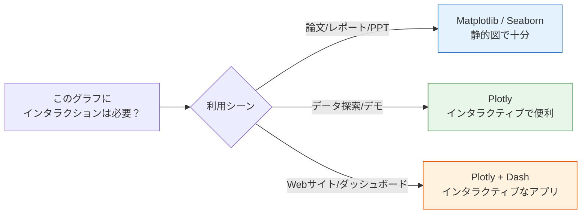

# 3.4.4 インタラクティブ可視化

:::note[この節の位置づけ]
多くの初心者は、`Plotly` を初めて見ると次のように感じます。

- グラフがかっこいい
- マウスで動かせる

でも、本当に大事なのは次の問いです。

> **静的な図で十分なときと、インタラクティブさが本当に必要なときはいつか。**

この節でいちばん重要なのは、「かっこいい図を作ること」ではなく、次を見分けられるようになることです。

- どんな場面ならインタラクティブな図が役立つか
- どんな場面では、静的な図のほうが分かりやすいか
:::
:::note[選修内容]
この節は選修です。時間が限られている場合は、いったん飛ばして、必要になったら戻って学んでも大丈夫です。ただし、インタラクティブなグラフの機能を知るために、まずは一通り見ておくことをおすすめします。
:::
## 学習目標

- 静的図とインタラクティブ図の違いを理解する
- Plotly Express で素早くグラフを作る方法を身につける
- インタラクティブなダッシュボードの考え方を知る

---

## まずは全体像をつかもう

`Plotly` は、「いつユーザーにグラフを自由に見てもらいたいか」という観点で理解するのがいちばん分かりやすいです。


この節で本当に知りたいのは、次の点です。

- インタラクティブ図は、静的図のどの能力を補っているのか
- いつ便利で、いつは逆に少し過剰に見えるのか

---

## なぜインタラクティブなグラフが必要なの？

| 比較 | 静的図（Matplotlib/Seaborn） | インタラクティブ図（Plotly） |
|------|--------------------------|-----------------|
| マウスオーバー | 非対応 | 詳細データを表示 |
| ズーム・ドラッグ | 非対応 | 自由に拡大・移動できる |
| データの絞り込み | 非対応 | 凡例をクリックして表示/非表示を切り替えられる |
| エクスポート | 画像として保存 | 画像 + HTMLページ |
| 利用シーン | 論文、レポート | データ探索、Web表示 |



### 初心者向けの分かりやすい比喩

`Plotly` は、次のように考えると理解しやすいです。

- 自分で拡大したり、絞り込んだりしながら見られる地図のようなグラフ

静的図は、次のようなイメージです。

- すでに印刷されたポスター

インタラクティブ図は、次のようなイメージです。

- 拡大鏡や絞り込みボタンが付いた電子地図

つまり、いちばん向いているのは、

- 読む人が自分でさらに調べていく場面

です。
すべての場面で無理にインタラクションを入れる必要はありません。

---

## インストールとインポート

```python
# インストール
# python -m pip install --upgrade plotly

# Plotly Express：素早くグラフを作る（おすすめ）
import plotly.express as px

# Plotly Graph Objects：より細かい制御ができる
import plotly.graph_objects as go

import pandas as pd
import numpy as np
```

---

## Plotly Express の基本

Plotly Express は Plotly の高レベル API で、**1行のコード**でも見やすいインタラクティブなグラフを作れます。

### Plotly を最初に学ぶときのおすすめ順

最初は、次の順番がいちばん無理がありません。

1. `px.scatter()`、`px.line()`、`px.bar()` で基本の操作に慣れる
2. そのあとで、ヒートマップ、3D、アニメーションを見る
3. 最後に、ダッシュボードや Web 表示を学ぶ

この順番のほうが、いきなり Dash に入るより混乱しにくいです。

### 散布図

```python
# 内蔵データセットを使う
df = px.data.iris()

fig = px.scatter(df, x="sepal_width", y="sepal_length",
                 color="species",        # 種類ごとに色分け
                 size="petal_length",    # 花びらの長さで点の大きさを変える
                 hover_data=["petal_width"],  # ホバー時に花びらの幅を表示
                 title="アヤメデータセット - インタラクティブ散布図")
fig.show()
```

実行すると、ホバー、ズーム、ドラッグができるグラフが表示されます。

### 折れ線グラフ

```python
df = px.data.gapminder()
# 中国、アメリカ、日本のデータを抽出
countries = df[df["country"].isin(["China", "United States", "Japan"])]

fig = px.line(countries, x="year", y="gdpPercap",
              color="country",
              title="中国・米国・日本の1人当たりGDPの変化",
              labels={"gdpPercap": "1人当たりGDP（米ドル）", "year": "年", "country": "国"})
fig.show()
```

### 棒グラフ

```python
df = px.data.tips()

fig = px.bar(df, x="day", y="total_bill", color="sex",
             barmode="group",          # "group" はグループ表示, "stack" は積み上げ
             title="曜日ごとの支出（性別でグループ化）",
             labels={"total_bill": "支出金額", "day": "曜日", "sex": "性別"})
fig.show()
```

### ヒストグラム

```python
df = px.data.tips()

fig = px.histogram(df, x="total_bill", color="time",
                   nbins=20,
                   marginal="box",    # 余白の図："box", "violin", "rug"
                   title="支出金額の分布（箱ひげの補助図つき）")
fig.show()
```

### 箱ひげ図

```python
df = px.data.tips()

fig = px.box(df, x="day", y="total_bill", color="smoker",
             notched=True,             # くぼみ付きの箱ひげ図
             title="曜日ごとの支出分布（喫煙の有無で比較）")
fig.show()
```

### 円グラフ / ドーナツグラフ

```python
# 円グラフ
fig = px.pie(df, names="day", values="total_bill",
             title="曜日ごとの支出割合",
             hole=0.3)  # hole > 0 でドーナツグラフになる
fig.show()
```

---

## 応用グラフ

### ヒートマップ

```python
# 相関係数を計算する
df = px.data.iris()
numeric_cols = df.select_dtypes(include="number")
corr = numeric_cols.corr()

fig = px.imshow(corr, text_auto=".2f",
                color_continuous_scale="RdBu_r",
                title="アヤメ特徴量の相関ヒートマップ")
fig.show()
```

### 3D 散布図

```python
df = px.data.iris()

fig = px.scatter_3d(df, x="sepal_length", y="sepal_width", z="petal_length",
                    color="species",
                    title="アヤメの3D散布図（回転できます！）")
fig.show()
```

この 3D 図は、マウスでドラッグして回転できます。
いろいろな角度からデータを見てみましょう。

### アニメーション付きグラフ

```python
df = px.data.gapminder()

fig = px.scatter(df, x="gdpPercap", y="lifeExp",
                 size="pop", color="continent",
                 hover_name="country",
                 animation_frame="year",      # 年ごとにアニメーション再生
                 animation_group="country",
                 log_x=True,
                 range_x=[100, 100000],
                 range_y=[25, 90],
                 title="各国の発展の軌跡（1952-2007）")
fig.show()
```

再生ボタンをクリックすると、国ごとの年次変化を見ることができます。
これは有名な **Hans Rosling のバブルチャート** です。

---

## グラフのカスタマイズ

### レイアウトを更新する

```python
fig = px.scatter(px.data.iris(), x="sepal_width", y="sepal_length",
                 color="species")

fig.update_layout(
    title=dict(text="カスタムタイトル", font=dict(size=20)),
    xaxis_title="がく片の幅 (cm)",
    yaxis_title="がく片の長さ (cm)",
    template="plotly_white",      # テンプレートテーマ
    width=800,
    height=500,
    legend_title="品種"
)

fig.show()
```

### よく使うテンプレート

| テンプレート名 | スタイル |
|--------|------|
| `"plotly"` | デフォルトの青背景 |
| `"plotly_white"` | 白背景（おすすめ） |
| `"plotly_dark"` | ダーク背景 |
| `"ggplot2"` | R の ggplot 風 |
| `"simple_white"` | シンプルな白背景 |

### 初心者が最初に覚えておくとよい判断表

| あなたの目的 | 最初のおすすめ |
|---|---|
| 論文やレポート用の図を作る | まずは静的図 |
| データの細部を自分で調べる | Plotly が向いている |
| 誰かに Web で見せる | Plotly が向いている |
| ただ「もっと派手にしたい」だけ | いったん止まって、本当に必要か考える |

この表は初心者に特に役立ちます。
「インタラクティブ図はかっこいい」という気持ちを、実際の利用シーンの判断に戻してくれるからです。

### グラフを保存する

```python
# インタラクティブな HTML として保存
fig.write_html("my_chart.html")

# 静的画像として保存（kaleido のインストールが必要）
# python -m pip install --upgrade kaleido
fig.write_image("my_chart.png", scale=2)
fig.write_image("my_chart.svg")
```

---

## Plotly vs Matplotlib vs Seaborn

| 特性 | Matplotlib | Seaborn | Plotly |
|------|-----------|---------|--------|
| インタラクティブ性 | なし | なし | 強い |
| 見た目のきれいさ | 普通 | 良い | 良い |
| 学習の難しさ | 中 | 低 | 低 |
| カスタマイズ性 | 非常に高い | 中 | 高い |
| 出力形式 | 画像/PDF | 画像/PDF | HTML/画像 |
| 向いている場面 | 論文/細かい制御 | 素早い統計グラフ | データ探索/表示 |

---

## インタラクティブなダッシュボード入門

実際の仕事では、複数のインタラクティブなグラフを組み合わせて、**ダッシュボード**（Dashboard）を作ることがあります。

よく使うツール：

| ツール | 特徴 |
|------|------|
| **Plotly Dash** | Python コードで作れる。高機能。 |
| **Streamlit** | いちばん簡単。数行でアプリが作れる。 |
| **Gradio** | AI モデルのデモ向け。 |
| **Panel** | Jupyter エコシステムとの相性が良い。 |

簡単な Dash の例です（雰囲気だけ知ればOKです）。

```python
# python -m pip install --upgrade dash
from dash import Dash, html, dcc
import plotly.express as px

app = Dash(__name__)

df = px.data.gapminder().query("year == 2007")
fig = px.scatter(df, x="gdpPercap", y="lifeExp", size="pop",
                 color="continent", hover_name="country", log_x=True)

app.layout = html.Div([
    html.H1("世界の発展指標ダッシュボード"),
    dcc.Graph(figure=fig)
])

# 実行: python app.py のあと、http://127.0.0.1:8050 を開く
# app.run(debug=True)
```

:::tip[今後の学習]
ダッシュボードの詳しい開発は、この段階では扱いません。後のプロジェクト段階で実践練習があります。
:::
---

## 残す証拠

このページを終えたら、この evidence card を残します。

```text
質問：このグラフが答える比較、分布、傾向、または関係
グラフ選択：折れ線、棒、散布図、ヒストグラム、箱ひげ図、ヒートマップ、またはインタラクティブダッシュボード
成果物: 保存した chart 画像/html と、そのデータスライス
失敗確認: 誤解を招くスケール、情報過多のグラフ、誤った集計、またはラベル不足
期待される成果：1文で示唆を説明するチャートのアーティファクト
```

## まとめ

| Plotly Express の関数 | グラフの種類 |
|---------------------|---------|
| `px.scatter()` | 散布図 |
| `px.line()` | 折れ線グラフ |
| `px.bar()` | 棒グラフ |
| `px.histogram()` | ヒストグラム |
| `px.box()` | 箱ひげ図 |
| `px.pie()` | 円グラフ |
| `px.imshow()` | ヒートマップ |
| `px.scatter_3d()` | 3D 散布図 |

Plotly のいちばんの強みは、**インタラクション**です。
マウスオーバーでデータを見たり、ズームして一部を詳しく見たり、アニメーションで変化を示したりできます。データ探索や結果の見せ方でとても役立ちます。

## この節でいちばん持ち帰ってほしいこと

- `Plotly` の本当の価値は、派手さではなく、読者がデータをさらに探索できること
- インタラクティブ図は、データ探索、Web 表示、デモに向いている
- 最初は `px.scatter` / `px.line` / `px.bar` を押さえれば十分

---

## ハンズオン練習

### 練習 1：インタラクティブ探索

```python
# gapminder データセットを読み込む
# 1. px.scatter で 2007 年の各国の gdpPercap と lifeExp の関係を描く
#    - pop で点の大きさを変え、continent で色分けする
#    - hover で country を表示する
# 2. px.line で中国の 1952-2007 年の lifeExp の変化を描く
```

### 練習 2：データ分布

```python
# tips データセットを読み込む
# 1. px.histogram で支出金額の分布を描き、marginal="violin" で補助図を追加する
# 2. px.box で曜日ごとの支出金額を比較する
```

### 練習 3：アニメーション図

```python
# gapminder データセットでアニメーション散布図を作る
# 1952-2007 年の各国の gdpPercap と lifeExp の変化を表示する
# animation_frame="year" を使う
```


<details>
<summary>参考実装と解説</summary>

- Gapminder 風の散布図では、x、y、size、color、hover text を意図して割り当てます。hover 項目は、全列を見せるためではなく質問に答えるために選びます。
- 国や商品のトレンド線では、時間でソートし、x 軸が日付または順序つき年フィールドであることを確認します。未ソートの時系列は誤解を招くジグザグ線になります。
- アニメーションには安定した質問が必要です。比較を邪魔するなら、静的な要約図や最終フレームの注記を追加します。

</details>
