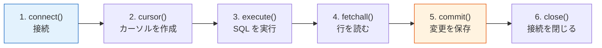

# 3.5.4 Python データベース操作


:::tip[この節の位置づけ]
ここまで来ると、多くの学習者がこう感じます。

- SQL はもう書ける
- Python ももう書ける

では、なぜ「Python データベース操作」を別のトピックとして学ぶのでしょうか？

答えはシンプルです。

> **この節では、アプリケーションコードが実際にデータベースとどう連携するかを学びます。**

SQL をもう一度学ぶのではありません。実際のツールの裏側にある工程を学びます。

- Python でデータベースに接続する
- SQL を安全に送る
- 行データを Python に読み戻す
- 必要なデータを Pandas に渡して分析する
- 必要に応じて、整形済みデータや集計結果を書き戻す
:::
## 学習目標

- Python 標準の `sqlite3` モジュールで CRUD 操作を行う
- パラメータ化クエリで SQL インジェクションを避ける
- `read_sql_query` でデータベース結果を Pandas に読み込む
- `to_sql` で DataFrame の結果をデータベースに書き戻す
- SQLAlchemy が必要になる場面を理解する

---

## まず全体像をつかもう

Python のデータベース操作は、次の流れで考えるとわかりやすいです。


フルスタックや AI エンジニアリングのプロジェクトでは、この流れによって「表がある」状態から「機能、レポート、ダッシュボード、データパイプラインを作れる」状態に進みます。


### まず理解しておきたい略語

| 用語 | 英語の正式名称 | 実務での意味 |
|---|---|---|
| `DB` | Database | 構造化データを長期保存する場所 |
| `SQL` | Structured Query Language | 表に質問するための言語 |
| `CRUD` | Create, Read, Update, Delete | 多くのアプリが使う作成・読み取り・更新・削除 |
| `SQLite` | SQLite database engine | 1つのファイルに保存できる軽量データベース。学習、試作、ローカルツールに向く |
| `ORM` | Object-Relational Mapping | すべての SQL を手書きせず、Python オブジェクトで行を扱う方法 |
| `SQL injection` | SQL injection attack | 危険な入力によって SQL 文の意味が変わるセキュリティ問題 |

まずは 1 つの安全な流れに集中しましょう。Python が接続し、パラメータ化 SQL を送り、行を受け取り、有用な部分を Pandas に渡します。

## sqlite3 標準ライブラリ

Python には `sqlite3` モジュールが標準で入っているため、追加インストールは不要です。

### 実務に近いたとえ

顧客サポートツールを想像してください。

- データベースは、チケット、顧客、優先度、状態を保存する
- Python は、それらの記録を作成・更新・検索するアプリケーションロジック
- Pandas は、未解決チケット、初回返信時間、作業量を集計する分析レイヤー

この節の価値は、コードとデータベースが 1 つのシステムとして動き始めることです。

### 基本的な作業フロー



### 完全な例

この例では、小さな顧客サポートチケット表を使います。管理画面、ダッシュボード、社内ツール、AI サポート補助システムで出会う流れに近いものです。

```python
import sqlite3

# ========== 接続 ==========
# ファイルベースのデータベースに接続する。存在しない場合は自動で作成される。
conn = sqlite3.connect("example.db")

# すばやいテストにはメモリ上のデータベースも使える。
# conn = sqlite3.connect(":memory:")

cursor = conn.cursor()

# ========== テーブル作成 ==========
cursor.execute("""
    CREATE TABLE IF NOT EXISTS tickets (
        id INTEGER PRIMARY KEY AUTOINCREMENT,
        customer TEXT NOT NULL,
        issue_type TEXT NOT NULL,
        status TEXT NOT NULL,
        priority TEXT NOT NULL,
        first_reply_minutes INTEGER CHECK(first_reply_minutes >= 0)
    )
""")

# ========== データ挿入 ==========
# 方法 1：固定のデモデータを直接挿入する
cursor.execute("""
    INSERT INTO tickets (customer, issue_type, status, priority, first_reply_minutes)
    VALUES ('Acme Co', 'login', 'open', 'high', 18)
""")

# 方法 2：パラメータ化挿入（おすすめ）
cursor.execute(
    """
    INSERT INTO tickets (customer, issue_type, status, priority, first_reply_minutes)
    VALUES (?, ?, ?, ?, ?)
    """,
    ("Northwind", "billing", "pending", "medium", 42)
)

# 方法 3：まとめて挿入
tickets = [
    ("Globex", "api", "open", "high", 64),
    ("Initech", "billing", "closed", "low", 35),
    ("Umbrella", "login", "open", "medium", 27),
    ("Hooli", "api", "pending", "high", 51),
]
cursor.executemany(
    """
    INSERT INTO tickets (customer, issue_type, status, priority, first_reply_minutes)
    VALUES (?, ?, ?, ?, ?)
    """,
    tickets
)

conn.commit()

# ========== データ取得 ==========
cursor.execute("SELECT * FROM tickets")
all_rows = cursor.fetchall()
print("すべてのチケット：", all_rows)

cursor.execute("SELECT * FROM tickets WHERE customer = 'Acme Co'")
one_row = cursor.fetchone()
print("Acme Co：", one_row)

cursor.execute("""
    SELECT customer, issue_type, first_reply_minutes
    FROM tickets
    WHERE status != 'closed'
    ORDER BY first_reply_minutes DESC
""")
slow_open_tickets = cursor.fetchmany(3)
print("返信が遅い未完了チケット：", slow_open_tickets)

# ========== 列名の取得 ==========
cursor.execute("SELECT * FROM tickets")
col_names = [desc[0] for desc in cursor.description]
print("列名：", col_names)
# ['id', 'customer', 'issue_type', 'status', 'priority', 'first_reply_minutes']

conn.close()
```

### まず覚えるべきこと

まずはこの順番を覚えましょう。

1. データベースに接続する
2. カーソルを作る
3. SQL を実行する
4. 結果を取得する
5. データを変更したら保存する

最初からすべてのメソッドを暗記する必要はありません。まずこの流れを身につけます。

---

## パラメータ化クエリ：SQL インジェクションを防ぐ

:::danger[SQL インジェクションとは？]
SQL インジェクションとは、危険なユーザー入力によって SQL 文の意味が変わってしまうセキュリティ脆弱性です。
:::
### 悪い書き方（危険）

```python
# このように文字列を連結して SQL を作らない。
user_input = "Acme Co"
sql = f"SELECT * FROM tickets WHERE customer = '{user_input}'"
cursor.execute(sql)

# 入力が次の場合：  ' OR '1'='1
# SQL はこうなる：SELECT * FROM tickets WHERE customer = '' OR '1'='1'
# すべての行が返る可能性がある。
```

### 正しい書き方（安全）

```python
# ? プレースホルダーを使う。
user_input = "Acme Co"
cursor.execute("SELECT * FROM tickets WHERE customer = ?", (user_input,))

# 複数のパラメータ。
cursor.execute(
    "SELECT * FROM tickets WHERE status = ? AND priority = ?",
    ("open", "high")
)
```

:::tip[一言で覚える]
**値はプレースホルダーで渡す。外部入力を f-string や文字列連結で SQL に埋め込まない。**
:::
### 初学者向けの判断基準

次のような形を書いているなら、

- `f"SELECT ... {user_input} ..."`

いったん止めて、パラメータ化クエリに直しましょう。

---

## with 文で接続を管理する

`with` 文を使うと接続管理が安全になります。ブロックが成功すると変更が保存され、例外が起きると SQLite がトランザクションをロールバックします。

```python
import sqlite3

with sqlite3.connect("example.db") as conn:
    cursor = conn.cursor()

    cursor.execute("SELECT * FROM tickets WHERE status = ?", ("open",))
    results = cursor.fetchall()

    for row in results:
        print(row)
```

---

## Row ファクトリ：辞書のように結果を読む

デフォルトでは、検索結果はタプルなので `row[0]` のようにインデックスでアクセスします。`sqlite3.Row` を使うと列名でアクセスできます。

```python
import sqlite3

conn = sqlite3.connect("example.db")
conn.row_factory = sqlite3.Row

cursor = conn.cursor()
cursor.execute("SELECT * FROM tickets WHERE customer = ?", ("Acme Co",))
row = cursor.fetchone()

print(row["customer"])  # Acme Co
print(row["status"])    # open
print(dict(row))

conn.close()
```

列が多い結果では特に便利です。コードが列の順番に依存しにくくなります。

---

## Pandas + データベース：強力な組み合わせ

Pandas はデータベースを直接読み書きできます。実務では、次の流れがよく使われます。

1. まず SQL で必要な行を絞り込む
2. そのあと Pandas で分析、レポート、可視化を行う

### データベースから DataFrame に読み込む

```python
import pandas as pd
import sqlite3

conn = sqlite3.connect("example.db")

# 方法 1：read_sql_query（最初におすすめ）
df = pd.read_sql_query("SELECT * FROM tickets", conn)
print(df)
#    id   customer issue_type   status priority  first_reply_minutes
# 0   1    Acme Co      login     open     high                   18
# 1   2  Northwind    billing  pending   medium                   42
# 2   3     Globex        api     open     high                   64
# ...

# 方法 2：条件付きで検索
df_open = pd.read_sql_query(
    """
    SELECT customer, issue_type, priority, first_reply_minutes
    FROM tickets
    WHERE status = ?
    ORDER BY first_reply_minutes DESC
    """,
    conn,
    params=("open",)
)
print(df_open)

conn.close()
```

:::tip[ここで `read_sql_table()` を使わない理由]
`pd.read_sql_query()` は通常の `sqlite3` 接続でそのまま使えるため、初学者にとって一番安全な最初の選択です。`pd.read_sql_table()` には SQLAlchemy engine が必要です。
:::
### DataFrame をデータベースに書き込む

```python
import pandas as pd
import sqlite3

df_new = pd.DataFrame({
    "customer": ["Stark Industries", "Wayne Labs", "Wonka Factory"],
    "issue_type": ["api", "login", "billing"],
    "status": ["open", "pending", "closed"],
    "priority": ["high", "medium", "low"],
    "first_reply_minutes": [22, 40, 31],
})

conn = sqlite3.connect("example.db")

df_new.to_sql(
    "new_tickets",
    conn,
    if_exists="replace",
    index=False
)

df_check = pd.read_sql_query("SELECT * FROM new_tickets", conn)
print(df_check)

conn.close()
```

### 実務の流れ：データベース -> Pandas -> 分析

```python
import pandas as pd
import sqlite3

conn = sqlite3.connect("example.db")

# 1. まず SQL で絞り込む。
df = pd.read_sql_query("""
    SELECT customer, issue_type, status, priority, first_reply_minutes
    FROM tickets
    WHERE status != 'closed'
    ORDER BY first_reply_minutes DESC
""", conn)

# 2. Pandas で分析する。
print("状態と優先度ごとの未完了作業量：")
print(df.groupby(["status", "priority"]).size())

print("\n初回返信時間の分布：")
print(df["first_reply_minutes"].describe())

conn.close()
```

:::tip[ベストプラクティス]
- **大きな表の絞り込み**：まず SQL の `WHERE` で転送するデータ量を減らす
- **分析**：SQL で絞ったあと、Pandas でグループ化、グラフ、レポートを作る
- **書き戻し**：きれいな抽出結果や集計表を `to_sql()` で保存する
:::
## そのまま使えるデータベース連携の順番

Python とデータベースを初めて連携するときは、この順番で進めます。

1. データベースに接続する
2. 一番簡単な検索を実行する
3. その検索をパラメータ化クエリに変える
4. 結果を Pandas に読み込む
5. 小さな結果テーブルをデータベースに書き戻す

### 実用的な選択表

| 何をしたいか | まず選ぶとよい方法 |
|---|---|
| 大きな表を絞り込みたい | SQL |
| 選んだデータを分析、グループ化、可視化したい | Pandas |
| 整形結果やレポート表を保存したい | `to_sql()` |

---

## SQLAlchemy の紹介

SQLAlchemy は人気の高い Python データベースツールキットです。多くのデータベースに対応し、Web アプリ向けの ORM 機能も提供します。

```python
# インストール
# python -m pip install --upgrade sqlalchemy

from sqlalchemy import create_engine
import pandas as pd

engine = create_engine("sqlite:///example.db")

# SQLite:  sqlite:///ファイルパス
# MySQL:   mysql+pymysql://ユーザー:パスワード@ホスト:ポート/データベース
# PostgreSQL: postgresql://ユーザー:パスワード@ホスト:ポート/データベース

df = pd.read_sql("SELECT * FROM tickets", engine)
print(df)

df.to_sql("tickets_backup", engine, if_exists="replace", index=False)
```

:::note[どんなときに SQLAlchemy を使う？]
- SQLite だけなら、`sqlite3` で十分
- MySQL や PostgreSQL が必要なら、SQLAlchemy を使う
- Web アプリを作るなら、SQLAlchemy の ORM 機能が役に立つ
:::
## 残す証拠

このページを終えたら、この証拠カードを残します。

```text
schema: tickets テーブル、主キー、フィールド、制約
query: 使用したパラメータ化 SQL または Python データベースコード
output: 返された行、行数、保存した抽出結果、または集計表
failure_check: 危険なクエリ、commit 不足、フィルタ条件の誤り、または schema 不一致
expected_output: クエリ、結果表、データ品質メモ 1 件
```

## この節で特に持ち帰ってほしいこと

- Python データベース操作は、アプリケーションコード、保存されたデータ、分析をつなぐ橋です
- 外部入力があるときは、必ずパラメータ化クエリを優先します
- 安定した流れは、まず SQL で絞り込み、Pandas で分析し、本当に必要な結果だけを書き戻すことです

---

## 完全実践：顧客サポートチケットログ

```python
import sqlite3
import pandas as pd


class TicketDB:
    """小さな顧客サポートチケットデータベース。"""

    def __init__(self, db_path="tickets.db"):
        self.conn = sqlite3.connect(db_path)
        self.conn.row_factory = sqlite3.Row
        self._create_table()

    def _create_table(self):
        self.conn.execute("""
            CREATE TABLE IF NOT EXISTS tickets (
                id INTEGER PRIMARY KEY AUTOINCREMENT,
                customer TEXT NOT NULL,
                issue_type TEXT NOT NULL,
                status TEXT NOT NULL,
                priority TEXT NOT NULL,
                first_reply_minutes INTEGER CHECK(first_reply_minutes >= 0)
            )
        """)
        self.conn.commit()

    def add_ticket(self, customer, issue_type, status, priority, first_reply_minutes):
        """サポートチケットを 1 件追加する。"""
        self.conn.execute(
            """
            INSERT INTO tickets (customer, issue_type, status, priority, first_reply_minutes)
            VALUES (?, ?, ?, ?, ?)
            """,
            (customer, issue_type, status, priority, first_reply_minutes)
        )
        self.conn.commit()

    def query_by_status(self, status):
        """指定した状態のチケットを返す。"""
        cursor = self.conn.execute(
            "SELECT * FROM tickets WHERE status = ? ORDER BY priority",
            (status,)
        )
        return [dict(row) for row in cursor.fetchall()]

    def mark_closed(self, ticket_id):
        """id でチケットを完了にする。"""
        self.conn.execute(
            "UPDATE tickets SET status = ? WHERE id = ?",
            ("closed", ticket_id)
        )
        self.conn.commit()

    def priority_summary(self):
        """優先度ごとに作業量を集計する。"""
        return pd.read_sql_query("""
            SELECT priority AS Priority,
                   COUNT(*) AS Ticket_Count,
                   ROUND(AVG(first_reply_minutes), 1) AS Avg_First_Reply_Minutes
            FROM tickets
            GROUP BY priority
            ORDER BY Ticket_Count DESC
        """, self.conn)

    def close(self):
        self.conn.close()


db = TicketDB(":memory:")

for ticket in [
    ("Acme Co", "login", "open", "high", 18),
    ("Northwind", "billing", "pending", "medium", 42),
    ("Globex", "api", "open", "high", 64),
    ("Initech", "billing", "closed", "low", 35),
    ("Umbrella", "login", "open", "medium", 27),
    ("Hooli", "api", "pending", "high", 51),
]:
    db.add_ticket(*ticket)

print("\n未完了チケット：")
print(db.query_by_status("open"))

print("\n優先度サマリー：")
print(db.priority_summary())

db.mark_closed(1)
print("\n1 番のチケットを完了にした後の未完了チケット：")
print(db.query_by_status("open"))

db.close()
```

---

## まとめ

| 方法 | 適用場面 | 特徴 |
|------|---------|------|
| `sqlite3` | SQLite データベース | Python 標準、追加依存なし |
| `pd.read_sql_query()` | SQL -> DataFrame | 分析に便利 |
| `df.to_sql()` | DataFrame -> データベース | DataFrame を表として書き込める |
| `SQLAlchemy` | 複数データベースと Web アプリ | より汎用的で、engine と ORM を扱える |

**基本原則：**

- 値にはプレースホルダーを使い、外部入力を SQL に連結しない
- `with` または明示的な `commit()` / `close()` で接続を管理する
- まず SQL で絞り込み、その後 Pandas で選んだデータを分析する

---

## ハンズオン練習

### 練習 1：チケット CRUD

```python
# SQLite データベースを作成する。
# customer、issue_type、status、priority、first_reply_minutes を持つ tickets テーブルを作る。
# 5 件のチケットを挿入する。
# open かつ high priority のチケットを検索する。
# あるチケットの状態を closed に更新する。
# cancelled または duplicate のテストチケットを 1 件削除する。
```

### 練習 2：Pandas 連携

```python
# 1. pd.read_sql_query で open チケットを DataFrame に読み込む。
# 2. Pandas で status と priority ごとのチケット数を計算する。
# 3. priority ごとの平均 first_reply_minutes を計算する。
# 4. to_sql で集計結果を ticket_summary テーブルに書き戻す。
```

### 練習 3：クラスを拡張する

```python
# 上の TicketDB 例を拡張する：
# - assign_ticket(ticket_id, assignee) メソッドを追加する
# - add_message(ticket_id, author, body) メソッドを追加する
# - ある担当者に割り当てられた open チケットを検索する
# - ダッシュボード用の小さなサマリー表を書き出す
```

<details>
<summary>参考実装と解説</summary>

コード練習の参考答案では、最終的な数値だけでなく、動くパターンを示します。

```python
import sqlite3
import pandas as pd

with sqlite3.connect(":memory:") as conn:
    conn.execute("""
        CREATE TABLE tickets (
            id INTEGER PRIMARY KEY AUTOINCREMENT,
            customer TEXT NOT NULL,
            issue_type TEXT NOT NULL,
            status TEXT NOT NULL,
            priority TEXT NOT NULL,
            first_reply_minutes INTEGER CHECK(first_reply_minutes >= 0)
        )
    """)

    conn.executemany(
        """
        INSERT INTO tickets (customer, issue_type, status, priority, first_reply_minutes)
        VALUES (?, ?, ?, ?, ?)
        """,
        [
            ("Acme Co", "login", "open", "high", 18),
            ("Northwind", "billing", "pending", "medium", 42),
            ("Globex", "api", "open", "high", 64),
            ("Initech", "billing", "cancelled", "low", 35),
            ("Umbrella", "login", "open", "medium", 27),
        ]
    )

    rows = conn.execute(
        "SELECT * FROM tickets WHERE status = ? AND priority = ?",
        ("open", "high")
    ).fetchall()
    print(rows)

    conn.execute("UPDATE tickets SET status = ? WHERE customer = ?", ("closed", "Acme Co"))
    conn.execute("DELETE FROM tickets WHERE status = ?", ("cancelled",))

    df = pd.read_sql_query("SELECT * FROM tickets WHERE status != ?", conn, params=("closed",))
    summary = (
        df.groupby(["status", "priority"])
        .agg(
            ticket_count=("id", "count"),
            avg_first_reply_minutes=("first_reply_minutes", "mean"),
        )
        .reset_index()
    )
    summary.to_sql("ticket_summary", conn, if_exists="replace", index=False)

    print(pd.read_sql_query("SELECT * FROM ticket_summary", conn))
```

解説：

- CRUD 部分では、`UPDATE` と `DELETE` の前後に検索して状態変化を確認します。
- 外部から入る値はすべて `?` プレースホルダーで渡します。
- SQL で行数を有用な範囲まで減らしてから、Pandas で統計します。
- よいクラス設計では、接続設定、テーブル作成、挿入/更新メソッド、レポート用メソッドを分けます。

</details>
