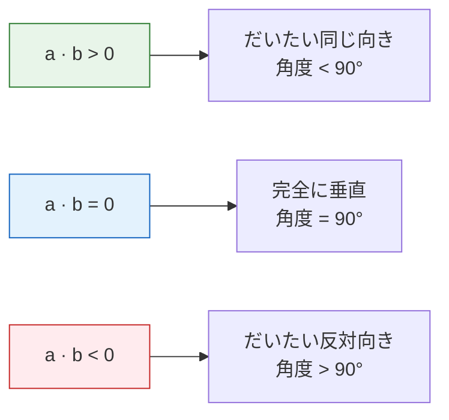
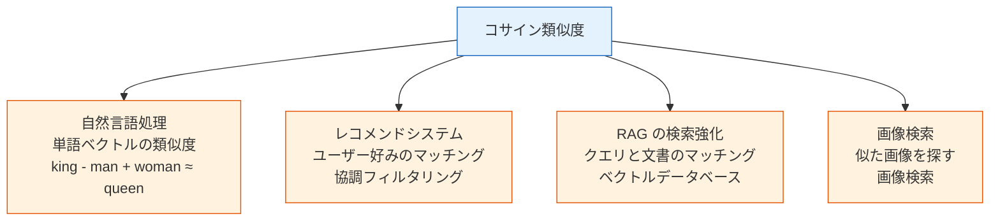

:::tip[学習の進め方]
この章の数学では、定理を「証明」する必要はありません。必要なのは、**直感を理解して、コードで実装できること**です。各概念には可視化と NumPy コードを付けています。式がすぐに分からなくても大丈夫。図とコードが分かれば十分です。
:::
## 学習目標

- ベクトルとは何かを直感的に理解する（方向 + 大きさ）
- ベクトルの加算、スカラー倍を理解する
- 内積（Dot Product）の意味を理解する
- コサイン類似度を身につける——AI で最もよく使う類似度指標
- NumPy でベクトル操作を実装する

## まず、学習のゴールをはっきりさせよう

この節ではコードも使いますが、**コードは理解の代わりではありません**。
コードは、主に次の 2 つを助けてくれます。

- 抽象的な対象を、目で見える形にする
- 「自分の直感は合っているか」を確かめる

この節を読んだあと、すぐに問題をスラスラ解けなくても大丈夫です。
むしろ大切なのは、次のことです。

- 「ある現実の対象」をベクトルとして表せるか
- 内積とコサイン類似度が、何を比べているのか説明できるか
- それをおすすめ、検索、RAG などの AI の場面につなげられるか

---

## まずは全体の地図を持とう

この節で一番大事なのは、たくさんの用語を覚えることではなく、まず流れをつかむことです。


この授業は、次のように考えると分かりやすいです。

- 前半：ひとつの対象をどうベクトルで表すか
- 後半：ふたつのベクトルがどれくらい似ているかどう比べるか

## すぐ見返せる小さな用語集

| 用語 | 意味 | 初心者が知っておきたい理由 |
|---|---|---|
| `scalar` | スカラー、つまり `2` や `0.5` のような1つの数 | スカラー倍は「1つの数でベクトル全体を拡大・縮小する」操作です。 |
| `dimension` | 次元、つまりベクトルの成分数 | `[90, 85, 92]` は数字が3つあるので 3 次元です。 |
| `shape` | NumPy が配列の構造を表す情報 | `(3,)`、`(1, 3)`、`(3, 1)` は数字の数は同じでも、掛け算での振る舞いが違います。 |
| `norm` | ノルム、つまりベクトルの長さ | `np.linalg.norm(a)` はベクトルの長さや強さを計算します。 |
| `NLP` | Natural Language Processing、自然言語処理 | テキストベクトルや単語ベクトルは、AI でよく使うベクトル例です。 |
| `vector database` | ベクトルを保存し、似たベクトルを探すためのデータベース | 多くの RAG や意味検索システムの検索部分を支えます。 |

この表は暗記用ではなく、安全ネットとして使いましょう。後のコードで同じ言葉が出たら、ここに戻って、いまの操作とどうつながるか確認してください。

## 一、ベクトルとは何か？

### 直感で理解する

**ベクトル = 順番のある数字の集まり。**

### 初心者向けのたとえ

初めてベクトルを学ぶとき、「方向 + 大きさ」という説明がまだ少し抽象的に感じることがあります。そんなときは、まず次のように考えてみましょう。

- ある対象の「情報カード」

たとえば、あるモデル評価の記録があり、

- accuracy 0.86
- latency 120 ms
- memory 3.8 GB

という情報があるとします。
これらを決まった順番で並べると、コンピュータが扱える情報カードになります。

- `[0.86, 120, 3.8]`

つまり、ベクトルのいちばん素朴な意味は「幾何学の図形」ではなく、

> **ある対象を、安定した順番の数字列として表すこと**

です。AI の世界では、ベクトルはあらゆるところに出てきます。

| AI の場面 | ベクトル表現 | 次元 |
|---------|---------|------|
| 1 回のモデル実行 | [accuracy, latency_ms, memory_gb] = [0.86, 120, 3.8] | 3 次元 |
| あるピクセルの色 | [R, G, B] = [255, 128, 0] | 3 次元 |
| ある単語の意味（単語ベクトル） | [0.2, -0.5, 0.8, ...] | 通常 100〜300 次元 |
| 1 枚の画像（平坦化後） | [ピクセル1, ピクセル2, ..., ピクセルn] | 数万〜数百万次元 |

```course-map
  root((AI の中のベクトル))
    データ表現
      各行のデータはベクトル
      画像はピクセルベクトル
      テキストは単語ベクトル
    類似度計算
      レコメンドシステム
      検索エンジン
      顔認識
    モデルのパラメータ
      ニューラルネットワークの重み
      勾配もベクトル
```

### 幾何学的な直感

2 次元空間では、ベクトルは**矢印付きの線分**として描けます。つまり、**方向**と**大きさ（長さ）**を持っています。

```python
import numpy as np
import matplotlib.pyplot as plt

plt.rcParams['font.sans-serif'] = ['Arial Unicode MS']
plt.rcParams['axes.unicode_minus'] = False

# 2つの2次元ベクトルを定義する
a = np.array([3, 2])
b = np.array([1, 4])

# ベクトルを描画する
fig, ax = plt.subplots(figsize=(6, 6))
ax.quiver(0, 0, a[0], a[1], angles='xy', scale_units='xy', scale=1,
          color='steelblue', linewidth=2, label=f'a = {a}')
ax.quiver(0, 0, b[0], b[1], angles='xy', scale_units='xy', scale=1,
          color='coral', linewidth=2, label=f'b = {b}')

ax.set_xlim(-1, 6)
ax.set_ylim(-1, 6)
ax.set_aspect('equal')
ax.grid(True, alpha=0.3)
ax.axhline(y=0, color='k', linewidth=0.5)
ax.axvline(x=0, color='k', linewidth=0.5)
ax.legend(fontsize=12)
ax.set_title('2次元ベクトルの幾何学的表現')
plt.show()
```

**解釈**：ベクトル a = [3, 2] は原点から出発して、右に 3、上に 2 進んだものです。

:::note[高次元ベクトルはどう考える？]
AI で使うベクトルは、通常は数百次元や数千次元です。図には描けませんが、数学的な操作は同じです。ベクトルは**数字の並び**であり、どの次元でも同じルールで計算できます。
:::
### 実際のデータからベクトルへ

初心者がつまずきやすいのは、「ベクトルは数字の列だ」と分かっても、それが現実のデータとどうつながるのか分からないことです。

```python
import numpy as np

model_run = {
    "accuracy": 0.86,
    "latency_ms": 120,
    "memory_gb": 3.8,
}

model_vector = np.array([
    model_run["accuracy"],
    model_run["latency_ms"],
    model_run["memory_gb"],
])

print("モデル実行ベクトル:", model_vector)
print("ベクトルの形状:", model_vector.shape)  # (3,)
```

本質は次のとおりです。

- 現実世界では「意味のある項目」がある
- コンピュータでは「決まった順番の数値配列」にする必要がある

ひとたび対象をベクトルとして表せれば、数式で計算できるようになります。

```python
weights = np.array([0.7, -0.002, -0.03])
score = model_vector @ weights
print("デプロイスコア:", round(score, 3))  # 0.248
```

ここでは、すでにこの先の機械学習の流れにつながっています。

- データはベクトル
- ルールもベクトル
- それらの内積で、1 つのスコアが出る

---

## 二、ベクトルの基本演算

### ベクトルの加算

2 つのベクトルを足す = **対応する位置の数字を足す** ことです。

```python
a = np.array([3, 2])
b = np.array([1, 4])

# ベクトルの加算
c = a + b
print(f"a + b = {c}")  # [4, 6]
```

幾何学的には、b を a の終点に置くと、結果は最初の始点から最後の終点へ向かうベクトルになります。

```python
fig, ax = plt.subplots(figsize=(7, 7))

# a を描く
ax.quiver(0, 0, a[0], a[1], angles='xy', scale_units='xy', scale=1,
          color='steelblue', linewidth=2, label=f'a = {a}')
# b を描く（a の終点から開始）
ax.quiver(a[0], a[1], b[0], b[1], angles='xy', scale_units='xy', scale=1,
          color='coral', linewidth=2, label=f'b = {b}')
# a + b を描く
ax.quiver(0, 0, c[0], c[1], angles='xy', scale_units='xy', scale=1,
          color='green', linewidth=2.5, label=f'a + b = {c}')

ax.set_xlim(-1, 7)
ax.set_ylim(-1, 8)
ax.set_aspect('equal')
ax.grid(True, alpha=0.3)
ax.legend(fontsize=11)
ax.set_title('ベクトルの加算：頭と尾をつなぐ')
plt.show()
```

### スカラー倍

ベクトルに数を掛ける = **各成分にその数を掛ける** ことです。

```python
a = np.array([3, 2])

# スカラー倍
print(f"2 * a = {2 * a}")     # [6, 4]  —— 方向は変わらず、長さは 2 倍
print(f"0.5 * a = {0.5 * a}") # [1.5, 1.0]  —— 方向は変わらず、長さは半分
print(f"-1 * a = {-1 * a}")   # [-3, -2]  —— 方向が反転
```

```python
fig, ax = plt.subplots(figsize=(8, 6))

vectors = [
    (a, 'steelblue', f'a = {a}'),
    (2 * a, 'green', f'2a = {2*a}'),
    (0.5 * a, 'orange', f'0.5a = {0.5*a}'),
    (-1 * a, 'red', f'-a = {-1*a}'),
]

for vec, color, label in vectors:
    ax.quiver(0, 0, vec[0], vec[1], angles='xy', scale_units='xy', scale=1,
              color=color, linewidth=2, label=label)

ax.set_xlim(-5, 8)
ax.set_ylim(-4, 6)
ax.set_aspect('equal')
ax.grid(True, alpha=0.3)
ax.axhline(y=0, color='k', linewidth=0.5)
ax.axvline(x=0, color='k', linewidth=0.5)
ax.legend(fontsize=11)
ax.set_title('スカラー倍：拡大・縮小と反転')
plt.show()
```

### ベクトルの長さ（ノルム）


ベクトルの**長さ**（**ノルム**や**大きさ**とも呼ぶ）は、三平方の定理で計算できます。

ベクトル a = [a1, a2] の長さ = √(a1² + a2²)

```python
a = np.array([3, 4])

# 方法 1: 自分で計算
length_manual = np.sqrt(a[0]**2 + a[1]**2)
print(f"手計算の長さ: {length_manual}")  # 5.0

# 方法 2: NumPy の内蔵関数（おすすめ）
length = np.linalg.norm(a)
print(f"NumPy の長さ: {length}")  # 5.0
```

:::tip[3-4-5 の三角形]
ベクトル [3, 4] の長さはちょうど 5 です。これは有名なピタゴラス数です。データサイエンスでは、ベクトルの長さを求めるときに `np.linalg.norm()` をよく使います。
:::
### 単位ベクトル

長さが 1 のベクトルを**単位ベクトル**といいます。どんなベクトルも、その長さで割ると、同じ向きを持つ単位ベクトルになります。

```python
a = np.array([3, 4])

# 単位化（正規化）
unit_a = a / np.linalg.norm(a)
print(f"単位ベクトル: {unit_a}")                  # [0.6, 0.8]
print(f"単位ベクトルの長さ: {np.linalg.norm(unit_a)}")  # 1.0
```

**なぜ重要なのか？** AI では、2 つのベクトルの**大きさ**ではなく**向き**を比べたい場面がよくあります。単位化すると、向きの情報だけを残せます。

### まず身につけたい shape 感覚

ベクトル学習の最初の壁は、概念は分かっても、コードを書くと `shape` で混乱することです。

```python
import numpy as np

a = np.array([1, 2, 3])          # 1次元ベクトル
row = a.reshape(1, 3)            # 行ベクトル
col = a.reshape(3, 1)            # 列ベクトル

print("a.shape   =", a.shape)    # (3,)
print("row.shape =", row.shape)  # (1, 3)
print("col.shape =", col.shape)  # (3, 1)
```

どれも「3 つの数字」に見えますが、行列計算では意味が違います。

- `(3,)` は NumPy の普通の 1 次元配列
- `(1, 3)` は「1 行 3 列」を明示
- `(3, 1)` は「3 行 1 列」を明示

この先、行列やニューラルネットワークを学ぶときは、公式を暗記するよりも `shape` の感覚が大事です。

---

## 三、内積——ベクトルで最も重要な演算

### 内積とは？

2 つのベクトルの**内積**（Dot Product）= **対応する位置を掛けて、最後に足し合わせる** ことです。

```python
a = np.array([1, 2, 3])
b = np.array([4, 5, 6])

# 方法 1: 手計算
dot_manual = a[0]*b[0] + a[1]*b[1] + a[2]*b[2]
print(f"手計算: {dot_manual}")  # 1*4 + 2*5 + 3*6 = 32

# 方法 2: NumPy（おすすめ）
dot_np = np.dot(a, b)
print(f"NumPy: {dot_np}")  # 32

# 方法 3: @ 演算子（Python 3.5+）
dot_at = a @ b
print(f"@ 演算子: {dot_at}")  # 32
```

### 内積の幾何学的な意味

内積は、2 つのベクトルの**向きの関係**を表します。



```python
# 同じ向き
a = np.array([1, 0])
b = np.array([1, 1])
print(f"同じ向き: a · b = {np.dot(a, b)}")  # 1（正の数）

# 垂直
a = np.array([1, 0])
b = np.array([0, 1])
print(f"垂直:   a · b = {np.dot(a, b)}")  # 0

# 反対向き
a = np.array([1, 0])
b = np.array([-1, 0])
print(f"反対向き: a · b = {np.dot(a, b)}")  # -1（負の数）
```

### なぜ内積は「そろい具合」と考えられるのか？

内積には、次のような重要な見方もあります。

> **あるベクトルが、別のベクトルの方向にどれだけ投影されるかが大きいほど、内積は大きくなりやすい。**

公式は次のように書けます。

`a · b = |a| × |b| × cos(theta)`

今は導出を覚える必要はありません。まずは次の 3 つだけ押さえましょう。

1. 2 つのベクトルが同じ向きに近いほど、`cos(theta)` は 1 に近づく
2. 2 つのベクトルが垂直に近いほど、`cos(theta)` は 0 に近づく
3. 2 つのベクトルが反対向きに近いほど、`cos(theta)` は -1 に近づく

つまり、内積には次の 2 つが同時に入っています。

- 長さの情報
- 向きの情報

### 可視化で内積を理解する

```python
fig, axes = plt.subplots(1, 3, figsize=(15, 4))

cases = [
    ([2, 1], [1, 2], '同じ向き（内積 > 0）'),
    ([2, 0], [0, 2], '垂直（内積 = 0）'),
    ([2, 1], [-1, -2], '反対向き（内積 < 0）'),
]

for ax, (a, b, title) in zip(axes, cases):
    a, b = np.array(a), np.array(b)
    dot = np.dot(a, b)

    ax.quiver(0, 0, a[0], a[1], angles='xy', scale_units='xy', scale=1,
              color='steelblue', width=0.02, label='a')
    ax.quiver(0, 0, b[0], b[1], angles='xy', scale_units='xy', scale=1,
              color='coral', width=0.02, label='b')

    ax.set_xlim(-3, 4)
    ax.set_ylim(-3, 4)
    ax.set_aspect('equal')
    ax.grid(True, alpha=0.3)
    ax.axhline(y=0, color='k', linewidth=0.5)
    ax.axvline(x=0, color='k', linewidth=0.5)
    ax.set_title(f'{title}\na·b = {dot}')
    ax.legend()

plt.tight_layout()
plt.show()
```

---

## 四、コサイン類似度——AI で最もよく使う類似度

### 内積からコサイン類似度へ

内積の大きさは、向きだけでなくベクトルの長さにも影響されます。
もし**向きがどれくらい似ているか**だけを見たいなら、長さの影響を取り除く必要があります。

**コサイン類似度 = 内積 / (ベクトル A の長さ × ベクトル B の長さ)**

```python
def cosine_similarity(a, b):
    """2つのベクトルのコサイン類似度を計算する"""
    dot_product = np.dot(a, b)
    norm_a = np.linalg.norm(a)
    norm_b = np.linalg.norm(b)
    if norm_a == 0 or norm_b == 0:
        raise ValueError("ゼロベクトルには方向がないため、コサイン類似度は定義できません。")
    return dot_product / (norm_a * norm_b)
```

ゼロベクトルを確認する理由は、長さが `0` のベクトルには方向がないからです。コサイン類似度は方向を比べる指標なので、長さ 0 で割ると誤解を招く結果や実行時警告につながります。

コサイン類似度の値の範囲は次の通りです。

| 値 | 意味 |
|----|------|
| 1 | 方向が完全に同じ |
| 0 | 完全に無関係（垂直） |
| -1 | 方向が完全に反対 |

### 例：実行プロファイルの類似度

3 つのモデルサービングプロファイルが、5 つの正規化された信号を持つとします。

```python
# [accuracy, throughput, low_latency, low_memory, stability] のスコア（1-5）
baseline = np.array([4, 3, 2, 2, 4])
quantized = np.array([4, 3, 3, 3, 4])
oversized = np.array([5, 1, 1, 1, 3])

# 2つずつの類似度を計算する
print(f"Baseline vs quantized: {cosine_similarity(baseline, quantized):.4f}")
print(f"Baseline vs oversized: {cosine_similarity(baseline, oversized):.4f}")
print(f"Quantized vs oversized:{cosine_similarity(quantized, oversized):.4f}")
```

出力：
```
Baseline vs quantized: 0.9857
Baseline vs oversized: 0.9159
Quantized vs oversized:0.8775
```

**解釈**：quantized model は oversized model より baseline に近く、quantized と oversized の向きはより離れています。ベクトル検索やレコメンドも同じで、まず方向を比べ、近い候補をドメイン知識で確認します。

### AI におけるコサイン類似度の応用



:::tip[コサイン類似度はこれから何度も使います]
- **NLP（11 自然言語処理）**：2 つの単語ベクトルがどれだけ似ているかを計算する。たとえば「猫」と「犬」はコサイン類似度が高い
- **RAG（8 LLM アプリ開発と RAG）**：ベクトルデータベースで、関連性の高い文書断片を検索する
- **レコメンドシステム**：好みが最も近いユーザーを見つける

つまり、コサイン類似度は AI 学習のあちこちで何度も登場する、とても重要な道具です。
:::
### 可視化：コサイン類似度が違うベクトル

```python
fig, axes = plt.subplots(1, 4, figsize=(16, 4))

# 異なる類似度を持つベクトルの組
pairs = [
    ([1, 0], [1, 0.1], '≈ 1.0（ほぼ同じ）'),
    ([1, 0], [0.7, 0.7], '≈ 0.7（かなり似ている）'),
    ([1, 0], [0, 1], '= 0（無関係）'),
    ([1, 0], [-0.9, -0.3], '≈ -0.95（反対）'),
]

for ax, (a, b, desc) in zip(axes, pairs):
    a, b = np.array(a), np.array(b)
    sim = cosine_similarity(a, b)

    ax.quiver(0, 0, a[0], a[1], angles='xy', scale_units='xy', scale=1,
              color='steelblue', width=0.02)
    ax.quiver(0, 0, b[0], b[1], angles='xy', scale_units='xy', scale=1,
              color='coral', width=0.02)

    ax.set_xlim(-1.5, 1.5)
    ax.set_ylim(-1, 1.5)
    ax.set_aspect('equal')
    ax.grid(True, alpha=0.3)
    ax.set_title(f'cos = {sim:.2f}\n{desc}', fontsize=10)

plt.tight_layout()
plt.show()
```

### もっとも小さな検索例：3 つの候補から最も近いものを探す

次の例は手作りの小さなベクトルですが、考え方はベクトル検索、RAG、意味検索と同じです。

```python
import numpy as np

def cosine_similarity(a, b):
    return np.dot(a, b) / (np.linalg.norm(a) * np.linalg.norm(b))

query = np.array([0.9, 0.1, 0.8, 0.2])

docs = {
    "文書A：機械学習入門": np.array([0.8, 0.2, 0.75, 0.1]),
    "文書B：旅行ガイド":     np.array([0.1, 0.9, 0.2, 0.8]),
    "文書C：深層学習の基礎": np.array([0.85, 0.15, 0.7, 0.25]),
}

scores = []
for name, vec in docs.items():
    sim = cosine_similarity(query, vec)
    scores.append((name, sim))

scores.sort(key=lambda x: x[1], reverse=True)

for name, sim in scores:
    print(f"{name}: {sim:.4f}")
```

期待される出力：

```text
文書C：深層学習の基礎: 0.9964
文書A：機械学習入門: 0.9922
文書B：旅行ガイド: 0.3333
```

相似度が最も高いものは、たいていクエリの意味にいちばん近い文書です。

---

## 五、NumPy によるベクトル操作のまとめ

この節で学んだ操作を、NumPy で整理しておきましょう。

```python
import numpy as np

# ========== ベクトルの作成 ==========
a = np.array([1, 2, 3])
b = np.array([4, 5, 6])

# ========== 基本演算 ==========
print("加算:", a + b)           # [5, 7, 9]
print("減算:", a - b)           # [-3, -3, -3]
print("スカラー倍:", 3 * a)     # [3, 6, 9]
print("要素ごとの掛け算:", a * b)  # [4, 10, 18]

# ========== 内積 ==========
print("内積:", np.dot(a, b))    # 32
print("内積:", a @ b)           # 32（同じ意味）

# ========== 長さ（ノルム） ==========
print("長さ:", np.linalg.norm(a))   # 3.742

# ========== 単位化 ==========
unit_a = a / np.linalg.norm(a)
print("単位ベクトル:", unit_a)

# ========== コサイン類似度 ==========
cos_sim = np.dot(a, b) / (np.linalg.norm(a) * np.linalg.norm(b))
print("コサイン類似度:", cos_sim)   # 0.9746

# scikit-learn にも内蔵関数があります
# from sklearn.metrics.pairwise import cosine_similarity
```

---

## ここまで学んだら、次に持っていくべき問い

ベクトルを学び終えたら、次の 3 つの疑問を持って次へ進むとよいです。

1. ある対象がベクトルで表せるなら、たくさんの対象はどう表せるのか？
2. 2 つのベクトルの類似度を比べられるなら、たくさんのベクトルはどう変換するのか？
3. ニューラルネットワークでは、なぜ毎回 1 つのベクトルだけを処理せず、まとめて処理するのか？

この 3 つの問いは、自然に次の内容へつながります。

- [4.1.3 行列：データのバッチ変換](/ja/ch04-ai-math/ch01-linear-algebra/02-matrices/)

:::note[次につながる内容]
- **次の節**：行列——ベクトルの集まりをまとめて変換する
- **5 機械学習入門から実践へ**：線形回帰では、各サンプルは特徴ベクトルで、モデルは重みベクトルを見つけること
- **11 自然言語処理（選択トラック）**：単語ベクトル、文ベクトル、コサイン類似度が何度も登場する
- **8 LLM アプリ開発と RAG**：ベクトルデータベースの中心は、高次元ベクトルの類似検索
:::
---

## 残す証拠

このページを終えたら、この evidence card を残します。

```text
数学対象：ベクトル、行列、固有値、基底、またはベクトル空間の概念
数値例：これを計算するために使う小さな数値または NumPy のスニペット
可視化または出力：形状、変換後の点、類似度スコア、固有方向、または射影
AI との関係: これが embeddings、バッチ、PCA、ニューラル層、または attention のどこに現れるか
期待される成果：計算と、それを AI の操作に結びつける1文
```

## まとめ

| 概念 | 直感的な理解 | NumPy 実装 |
|------|---------|-----------|
| ベクトル | 順番のある数字の集まり | `np.array([1, 2, 3])` |
| ベクトルの加算 | 対応する位置を足す | `a + b` |
| スカラー倍 | ベクトルを拡大・縮小する | `k * a` |
| ベクトルの長さ | 原点から終点までの距離 | `np.linalg.norm(a)` |
| 内積 | 2 つのベクトルの向きの関係を測る | `np.dot(a, b)` または `a @ b` |
| コサイン類似度 | 長さを見ずに、向きだけで比べる類似度 | `dot / (norm_a * norm_b)` |

## この節でいちばん持ち帰ってほしいこと

- ベクトルは、まず「対象を表すもの」であって、矢印の図形だけではない
- 内積は、まず「そろい具合」として理解するのがよい
- コサイン類似度は、まず「向きの近さ」として理解するのがよい
- だからこそ、AI の多くの検索・推薦・マッチングシステムでベクトルが欠かせない

## 手を動かして練習しよう

### 練習 1：ベクトル演算

ベクトル a = [2, 3, -1] と b = [1, -2, 4] が与えられたとき、NumPy を使って次を計算してください。
1. a + b
2. 3a - 2b
3. a の長さ
4. a と b の内積
5. a と b のコサイン類似度

### 練習 2：最も近い実行プロファイルを見つける

3 つのモデルサービングプロファイルがあるとします。

```python
profiles = {
    "baseline": np.array([4, 3, 2, 2, 4]),
    "quantized": np.array([4, 3, 3, 3, 4]),
    "oversized": np.array([5, 1, 1, 1, 3]),
}
```

課題：各プロファイルのペアごとにコサイン類似度を計算し、最も近い組と最も異なる組を見つけてください。

### 練習 3：ベクトルの加算を可視化する

Matplotlib を使って、次のベクトル加算の過程を矢印付きで描いてみましょう。
- a = [2, 3]、b = [-1, 2]。a、b、a+b を描く

ヒント：2.1 節のコードを参考にしてください。


<details>
<summary>参考実装と解説</summary>

- `a=[2,3,-1]`、`b=[1,-2,4]` では、`a+b=[3,1,3]`、`3a-2b=[4,13,-11]`、`||a||=sqrt(14)≈3.742`、`a·b=-8`、コサイン類似度は約 `-0.8018` です。
- 実行プロファイルのベクトルでは、baseline と quantized が最も近いはずです。latency や memory の次元を変えると、最も近いプロファイルも変わります。これが、プロダクト上のトレードオフを数字にする意味です。
- ベクトル加法の図では、まず `a` を描き、`a` の先端から `b` を描き、`a+b=[1,5]` を原点からの最終矢印として示します。図形と数値が一致していることが重要です。

</details>
