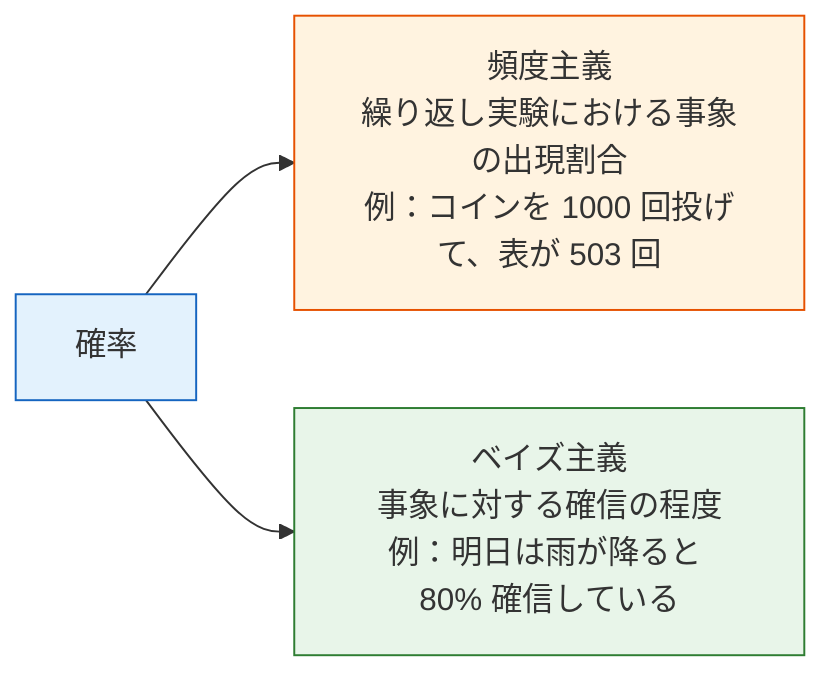
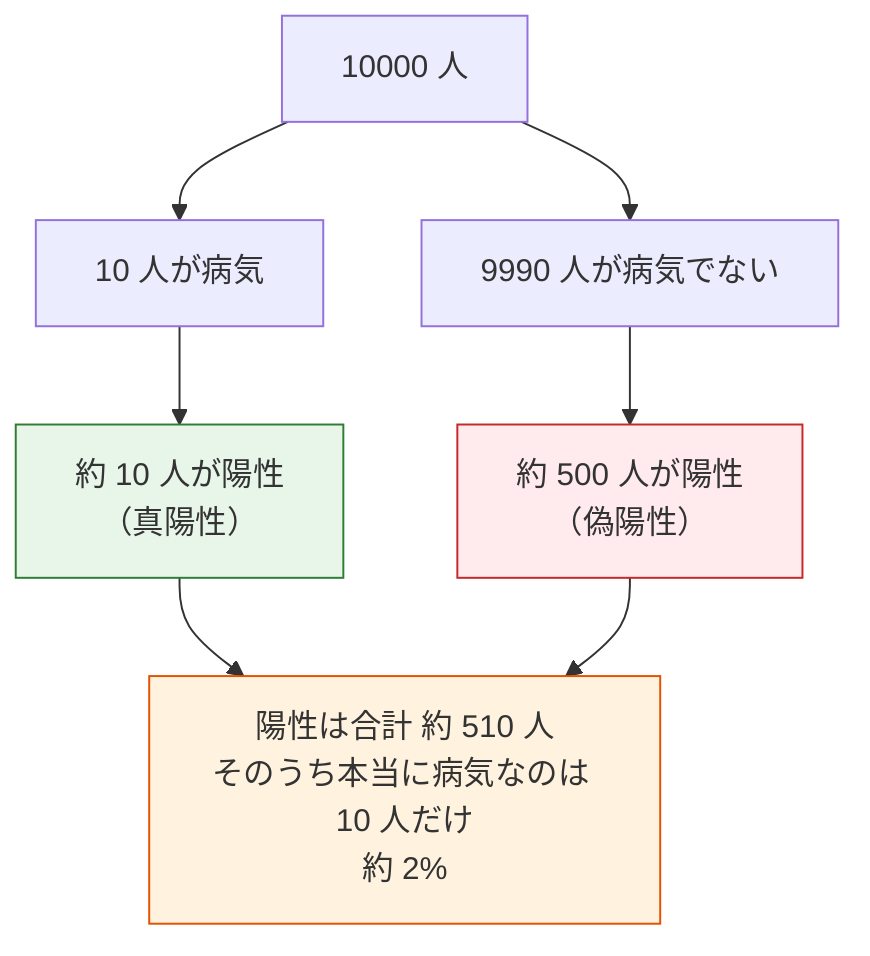
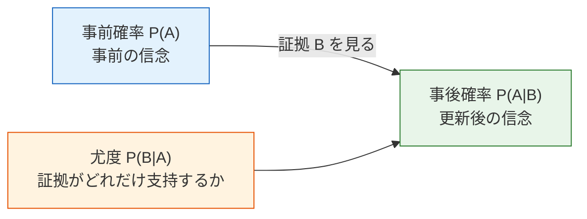

:::tip[なぜ確率を学ぶの？]
AI は本質的に「不確実性」の中で意思決定しています。モデルの出力は「この画像は必ず猫です」ではなく、「この画像は 95% の確率で猫です」という形です。確率論は、不確実性を扱うための数学的な道具です。
:::
## 学習目標

- 確率の 2 つの捉え方（頻度 vs 信念）を理解する
- 条件付き確率と同時確率を習得する
- 典型例を通してベイズの定理を理解する
- Python でシミュレーションして確率の公式を検証する

## 公式の前に用語を読み解く

確率の記号が難しく見える理由は、計算そのものよりも「この記号が何を意味しているのか」が見えにくいことです。

| 用語 | 意味 | この節での読み方 |
|---|---|---|
| `P(A)` | 事象 A の確率 | 追加情報がない状態で、A はどれくらい起こりそうか？ |
| `P(A\|B)` | 条件付き確率 | B が分かったあとで、A はどれくらい起こりそうか？ |
| `P(A かつ B)` | 同時確率 | A と B が同時に起こる可能性はどれくらいか？ |
| `prior` | 事前確率 | 新しい証拠を見る前の判断 |
| `likelihood` | 尤度 | その仮説が正しいなら、この証拠はどれくらい自然か？ |
| `posterior` | 事後確率 | 事前確率と証拠を合わせたあとの更新済みの判断 |
| `normalization` | 正規化 | 確率の合計が 1 になるように整える分母 |
| `Monte Carlo` | ランダムサンプリングによるシミュレーション | 多数のランダム試行で、公式が直感に合うか確認する方法 |

この節のコードの主な依存ライブラリは **NumPy** です。グラフを描く例では **Matplotlib** も使います。初学者がそのまま実行しやすいように、同時確率表の例では `pandas` を追加せず、NumPy だけで計算します。

## 歴史背景：ベイズの法則はどこから来たの？

この節でいちばん知っておきたい歴史的なポイントは次の通りです。

| 年 | ポイント | 何を最も重要に解決したか |
|---|---|---|
| 1763 | Bayes' Theorem（のちに Price が整理して発表） | 「新しい証拠が得られたあと、どう判断を更新するか」という確率推論の主軸を築いた |

初心者がまず覚えるべきなのは、原論文の細かい内容ではなく、次の点です。

> **ベイズの法則の最大の価値は、公式そのものではなく、「事前の判断 + 新しい証拠 = 更新後の判断」という流れを明確にしたことです。**

そのため、後の機械学習でも次のような場面で何度も登場します。

- スパム判定
- 医療検査
- ナイーブベイズ

### なぜベイズは、多くの初学者にとって「面白い」と感じやすいのか？

それは、ただ計算するだけの公式ではなく、
現実の生活にかなり近い問いに答えているからです。

- もともとどう判断していたか
- 新しい証拠が来たあと、考えを変えるべきか

この感覚はとても身近です。
たとえば医療検査、スパム判定、リスク管理、推薦システムなどは、
本質的に「絶対の答えを知る」のではなく、次のように動いています。

- 証拠を見ながら
- そのつど確からしさを更新する

だからベイズの法則は、
「美しいから」ではなく、
「現実の判断のしかたに似ているから」
ずっと覚えられているのです。

### なぜこの考え方は後世まで強く残ったのか？

それは、人々に次のことを非常に明確に伝えたからです。

- 推論は「結論が出たら終わり」ではない
- 推論は、証拠に応じて更新し続けられる

今では自然に感じますが、歴史的にはとても重要でした。
ベイズの法則は、次のような素朴で深いメッセージだと考えるとわかりやすいです。

> **最初にどう考えていたかは重要ではなく、新しい証拠を得たあとに、判断を更新できるかが重要です。**

つまり、これは単なる数学の公式ではなく、
不確実な世界をどう見るかという「考え方」そのものなのです。

## まず大事な学習イメージ

この節では、確率論のすべてを一気に学ぶわけではありません。
現実的な目標は次の 3 つです。

- 確率は「神秘的なもの」ではなく、「不確実性の表現」だと知る
- 新しい情報が入ると判断が更新されると知る
- モデルが確率を出力するとはどういう意味かを知る

なので、いま大切なのは公式を丸暗記することではなく、
次の 3 つを自然に見分けられるようになることです。

- 事象
- 条件
- 更新

---

## まずは全体像をつかむ

この節は、章全体の中でこういう位置づけです。


ここで本当に学ぶのは、単なる数式ではなく、次の考え方です。

- 世界の多くの判断は 0 か 1 かでは決まらない
- 新しい証拠があれば、判断は更新される
- これこそが、AI モデルが確率を出すときの基本的な考え方

## 一、確率とは何か？

### 2 つの捉え方



AI では、この 2 つの考え方の両方を使います。
- **モデルを学習する**とき：頻度主義的な方法（大量のデータから規則を統計的に見つける）
- **モデルで推論する**とき：ベイズ的な方法（観測に基づいて信念を更新する）

### 初心者向けのたとえ

確率は、状況によって 2 種類の「どれくらい確かか」という意味で考えられます。

- 頻度主義：何度も実験した結果の統計
- ベイズ主義：証拠を得たあとに自分の見方を更新すること

### Python で「頻度こそ確率」を体験する

```python
import numpy as np
import matplotlib.pyplot as plt

plt.rcParams['font.sans-serif'] = ['Arial Unicode MS']
plt.rcParams['axes.unicode_minus'] = False

# コイン投げをシミュレーション
rng = np.random.default_rng(seed=42)
n_flips = 10000
results = rng.choice(['表', '裏'], size=n_flips)

# 投げる回数が増えるほど、表の割合は 0.5 に近づく
cumulative_ratio = np.cumsum(results == '表') / np.arange(1, n_flips + 1)

plt.figure(figsize=(10, 5))
plt.plot(cumulative_ratio, color='steelblue', linewidth=1)
plt.axhline(y=0.5, color='red', linestyle='--', label='理論確率 0.5')
plt.xlabel('投げた回数')
plt.ylabel('表が出た割合')
plt.title('大数の法則：投げる回数が増えるほど、割合は真の確率に近づく')
plt.legend()
plt.xscale('log')
plt.grid(True, alpha=0.3)
plt.show()
```

確認用に、最後の割合を表示してみましょう。

```python
print(f"{n_flips} 回投げた後の表の最終割合: {cumulative_ratio[-1]:.4f}")
```

`seed=42` の場合の出力例：

```text
10000 回投げた後の表の最終割合: 0.5061
```

**大数の法則**：実験回数が多いほど、頻度は真の確率に近づきます。これが、深層学習で「大規模データ」が必要な理由です。

---

## 二、条件付き確率——「ある情報がわかっているとき」

### 直感的な理解

**条件付き確率 P(A|B)** ＝ B が起きたとわかっているときに、A が起きる確率。

### なぜ条件付き確率は AI の考え方にそっくりなの？

現実の判断は、ほとんどいつも「文脈つき」で行われるからです。

つまり、条件付き確率で大事なのは記号ではなく、この一文です。

> **より多くの情報がわかったら、最初の判断は更新されるべきです。**

:::tip[生活の例]
- P(遅刻 | 渋滞) = 渋滞しているときに遅刻する確率（普段より高い）
- P(合格 | しっかり復習した) = しっかり復習したときに合格する確率（これも普段より高い）
- P(スパムメール | "無料" を含む) = "無料" という単語を含むメールがスパムである確率
:::
### 公式と計算

**P(A|B) = P(A かつ B) / P(B)**

わかりやすい例で見てみましょう。

```python
# あるクラスに 100 人の学生がいる
# 60 人は数学が好き、50 人はプログラミングが好き、30 人は両方好き

n_total = 100
n_math = 60
n_code = 50
n_both = 30

# P(プログラミングが好き | 数学が好き) = P(両方好き) / P(数学が好き)
p_code_given_math = n_both / n_math
print(f"数学が好きな人の中で、プログラミングも好きな割合: {p_code_given_math:.1%}")  # 50%

# P(数学が好き | プログラミングが好き)
p_math_given_code = n_both / n_code
print(f"プログラミングが好きな人の中で、数学も好きな割合: {p_math_given_code:.1%}")  # 60%
```

期待される出力：

```text
数学が好きな人の中で、プログラミングも好きな割合: 50.0%
プログラミングが好きな人の中で、数学も好きな割合: 60.0%
```

**注意**：P(A|B) と P(B|A) は通常同じではありません。

### 初心者がつまずきやすいポイント

初学者はここで、次の 2 つを同じだと思いがちです。

- 「数学が好きな人の中で、どれくらいの人がプログラミングも好きか」

と

- 「プログラミングが好きな人の中で、どれくらいの人が数学も好きか」

でも、分母が違うので、これはまったく別の問いです。
つまり、本質的には別の問題です。

### 同時確率と周辺確率

```python
# NumPy でデータをシミュレーション
rng = np.random.default_rng(seed=42)
n = 10000

# 天気：晴れ(0.7) / 雨(0.3)
weather = rng.choice(['晴れ', '雨'], n, p=[0.7, 0.3])

# 傘を持つ確率は天気によって変わる
umbrella = np.where(
    weather == '雨',
    rng.choice(['持つ', '持たない'], n, p=[0.8, 0.2]),  # 雨の日は 80% が傘を持つ
    rng.choice(['持つ', '持たない'], n, p=[0.1, 0.9])   # 晴れの日は 10% が傘を持つ
)

# pandas を追加せず、NumPy だけで同時確率表を計算する
weather_labels = ['晴れ', '雨']
umbrella_labels = ['持つ', '持たない']
joint = np.array([
    [((weather == w) & (umbrella == u)).mean() for u in umbrella_labels]
    for w in weather_labels
])

print("同時確率表：")
print("          持つ  持たない")
for label, row in zip(weather_labels, joint):
    print(f"{label:>6}   {row[0]:.3f}    {row[1]:.3f}")
print(f"\n周辺確率 P(雨): {(weather == '雨').mean():.3f}")
print(f"周辺確率 P(傘を持つ): {(umbrella == '持つ').mean():.3f}")
```

`seed=42` の場合の期待される出力：

```text
同時確率表：
          持つ  持たない
    晴れ   0.068    0.637
     雨   0.235    0.059

周辺確率 P(雨): 0.294
周辺確率 P(傘を持つ): 0.304
```

| | 傘を持つ | 持たない | 合計（周辺確率） |
|---|------|------|---------|
| 晴れ | 0.07 | 0.63 | 0.70 |
| 雨 | 0.24 | 0.06 | 0.30 |
| 合計 | 0.31 | 0.69 | 1.00 |

これはシミュレーション結果なので、理論値とは少しだけずれます。サンプル数を増やすほど、理論表に近づきます。

---

## 三、ベイズの定理——AI で最も重要な確率の公式

### 導入：病院の検査の話

ある珍しい病気の発症率は 0.1%（1000 人に 1 人）です。病院には次の検査があります。
- 病気の人が陽性になる確率は 99%（感度）
- 病気でない人が陽性になる確率は 5%（偽陽性率）

**質問：もし検査が陽性だったら、本当に病気である確率はどれくらいでしょうか？**

多くの人は直感で「99%」と答えますが、実際の答えは驚くかもしれません。

### ベイズの公式

**P(病気 | 陽性) = P(陽性 | 病気) × P(病気) / P(陽性)**

```python
# 与えられた条件
p_disease = 0.001       # 事前確率：発症率 0.1%
p_positive_if_disease = 0.99    # 病気 → 陽性の確率
p_positive_if_healthy = 0.05    # 病気でない → 陽性の確率（偽陽性率）

# P(陽性) = P(陽性|病気)×P(病気) + P(陽性|病気でない)×P(病気でない)
p_positive = (p_positive_if_disease * p_disease +
              p_positive_if_healthy * (1 - p_disease))
print(f"P(陽性): {p_positive:.4f}")

# ベイズの公式
p_disease_if_positive = (p_positive_if_disease * p_disease) / p_positive
print(f"P(病気|陽性): {p_disease_if_positive:.4f}")  # ≈ 0.0194
print(f"約 {p_disease_if_positive:.1%}")                # ≈ 1.9%
```

期待される出力：

```text
P(陽性): 0.0509
P(病気|陽性): 0.0194
約 1.9%
```

**結果：わずか約 2%！** 検査が陽性でも、実際に病気である確率は 2% ほどです。

### なぜこんなに低いの？

発症率がとても低いからです（0.1%）。そのため、陽性の多くは偽陽性になります。

```python
# 10000 人でシミュレーション
n_people = 10000
n_sick = int(n_people * p_disease)        # 10 人が病気
n_healthy = n_people - n_sick             # 9990 人が病気でない

true_positive = n_sick * p_positive_if_disease    # 病気かつ陽性: ≈ 10
false_positive = n_healthy * p_positive_if_healthy # 病気でないが陽性: ≈ 500

total_positive = true_positive + false_positive

print(f"10000 人のうち：")
print(f"  病気の人: {n_sick}")
print(f"  陽性になった人: {total_positive:.0f}")
print(f"    そのうち真陽性: {true_positive:.0f}")
print(f"    そのうち偽陽性: {false_positive:.0f}")
print(f"  陽性の中で本当に病気の割合: {true_positive/total_positive:.1%}")
```

期待される出力：

```text
10000 人のうち：
  病気の人: 10
  陽性になった人: 509
    そのうち真陽性: 10
    そのうち偽陽性: 500
  陽性の中で本当に病気の割合: 1.9%
```



### ベイズの定理の核心



**事後 = 事前 × 尤度 / 正規化因子**

これがベイズの核心です。**新しい証拠で信念を更新し続ける**、ということです。

### シミュレーションでベイズの定理を確かめる

```python
# モンテカルロシミュレーション
rng = np.random.default_rng(seed=42)
n_sim = 1_000_000

# 1. 各人が病気かどうか
has_disease = rng.random(n_sim) < p_disease

# 2. 各人の検査結果
test_positive = np.where(
    has_disease,
    rng.random(n_sim) < p_positive_if_disease,  # 病気
    rng.random(n_sim) < p_positive_if_healthy    # 病気でない
)

# 3. 陽性の人の中で、病気である割合
positive_people = test_positive.sum()
positive_and_sick = (test_positive & has_disease).sum()

simulated_probability = positive_and_sick / positive_people
print(f"シミュレーション結果 P(病気|陽性): {simulated_probability:.4f}")
print(f"公式による計算: {p_disease_if_positive:.4f}")
print(f"両者の差: {abs(simulated_probability - p_disease_if_positive):.6f}")
```

`seed=42` の場合の期待される出力：

```text
シミュレーション結果 P(病気|陽性): 0.0194
公式による計算: 0.0194
両者の差: 0.000012
```

シミュレーションは公式の代わりではありません。学習のための道具です。多数のランダム試行を行うと、公式と同じ結果に近づくことが確認できます。

---

## 四、ベイズの定理の AI での応用

### ナイーブベイズ分類器

スパムフィルタは、ベイズの定理の典型的な応用です。

```python
# 簡略化したスパム分類
# P(スパム | "無料" を含む) = P("無料"|スパム) × P(スパム) / P("無料")

p_spam = 0.3                      # メールの 30% はスパム
p_free_given_spam = 0.8           # スパムの 80% に "無料" が含まれる
p_free_given_ham = 0.05           # 通常メールの 5% に "無料" が含まれる

# P("無料" を含む)
p_free = p_free_given_spam * p_spam + p_free_given_ham * (1 - p_spam)

# ベイズ
p_spam_given_free = p_free_given_spam * p_spam / p_free
print(f"'無料' を含むメールがスパムである確率: {p_spam_given_free:.1%}")
# ≈ 87.3%
```

期待される出力：

```text
'無料' を含むメールがスパムである確率: 87.3%
```

### ほかの AI 分野での応用

| 応用 | 事前確率 | 尤度 | 事後確率 |
|------|------|------|------|
| スパムフィルタ | メールがスパムである確率 | スパムに特定の単語が含まれる確率 | 単語が与えられたときにスパムである確率 |
| 医療診断 | 病気の発症率 | 病気のときに検査が陽性になる確率 | 陽性後に本当に病気である確率 |
| 推薦システム | ユーザーがある種類を好む確率 | その種類を好む人がある映画を見る確率 | ユーザーがその映画を見る確率 |
| 言語モデル | ある単語が出る確率 | 前文が与えられたときにその単語が出る確率 | 次に最も出やすい単語 |

---

## 五、独立性——計算を簡単にする強力な考え方

### 独立とは？

2 つの事象が**独立**であるとは、一方の発生がもう一方の確率に影響しないということです。

**P(A かつ B) = P(A) × P(B)**（A、B が独立のときのみ）

```python
# 2 回コインを投げる——2 回は独立
p_head = 0.5

# 2 回とも表
p_both_heads = p_head * p_head
print(f"2 回とも表: {p_both_heads}")  # 0.25

# シミュレーションで確認
rng = np.random.default_rng(seed=42)
n = 100000
coin1 = rng.random(n) < 0.5
coin2 = rng.random(n) < 0.5
both = (coin1 & coin2).mean()
print(f"シミュレーション結果: {both:.4f}")  # ≈ 0.25
```

期待される出力：

```text
2 回とも表: 0.25
シミュレーション結果: 0.2512
```

### AI における独立性の仮定

ナイーブベイズが「ナイーブ」と呼ばれるのは、**すべての特徴が独立だと仮定する**からです（実際には独立でないことが多いですが、それでもかなりうまく機能します）。

この仮定は自然言語では厳密には成り立ちません。たとえば「無料」と「当選」は一緒に出やすい単語です。それでも、この仮定によって計算は大きく簡単になりますし、**baseline（基準モデル）** としては十分役に立つことがよくあります。基準モデルとは、より複雑な方法が本当に改善しているかを比べるための、シンプルな最初のモデルです。

```python
# ナイーブベイズ：各単語が独立に現れると仮定
# P(スパム|"無料","当選","クリック") ∝ P(スパム) × P("無料"|スパム) × P("当選"|スパム) × P("クリック"|スパム)

p_spam = 0.3
words = {
    "無料": (0.8, 0.05),    # (P(単語|スパム), P(単語|通常))
    "当選": (0.6, 0.01),
    "クリック": (0.7, 0.1),
}

# 分子を計算
score_spam = p_spam
score_ham = 1 - p_spam

for word, (p_word_spam, p_word_ham) in words.items():
    score_spam *= p_word_spam
    score_ham *= p_word_ham

# 正規化
p_spam_given_words = score_spam / (score_spam + score_ham)
print(f"メールに '無料'+'当選'+'クリック' が含まれるとき、スパムである確率: {p_spam_given_words:.1%}")
```

期待される出力：

```text
メールに '無料'+'当選'+'クリック' が含まれるとき、スパムである確率: 100.0%
```

この結果がほぼ 100% になるのは、教材として分かりやすくするために例の確率をかなり強めに設定しているからです。実際のシステムでは、平滑化を使い、検証データで評価し、1 回の確率出力を絶対的な結論として扱わないようにします。

---

## ここまで学んだら、次に持っていくべき問いは？

確率の基礎を学んだあと、次の節に進むときに考えるとよい問いは次の 3 つです。

1. ある 1 回の事象を確率で表すとき、たくさん繰り返した全体の結果はどうなるのか？
2. なぜある現象は鐘形の曲線に見え、別の現象は回数を数える分布に見えるのか？
3. モデルのノイズ、初期化、誤差は、なぜ特定の分布と結びつきやすいのか？

この 3 つの問いは、次の内容につながります。

- [4.2.3 確率分布：データの背後にある規則](./02-distributions.md)

:::note[次につながる内容]
- **次の節**：確率分布——データの背後にある規則
- **5 機械学習入門から実践へ**：ナイーブベイズ分類器はベイズの定理に直接基づく
- **5 機械学習入門から実践へ**：ロジスティック回帰の出力は条件付き確率 P(y=1|x)
- **7 大規模言語モデルの原理、Prompt とファインチューニング**：大規模言語モデルが次の token を生成する確率分布
:::
---

## 残す証拠

このページを終えたら、この evidence card を残します。

```text
確率過程：事象、分布、サンプル、尤度、エントロピー、またはベイズ更新
シミュレーションまたは式: 不確実性を可視化するために使ったコードまたは式
出力：probability、sample statistic、interval、entropy、または更新された信念
失敗確認：ベースレートの混同、p値の誤用、サンプルバイアス、または確率と確実性の混同
期待される成果: 数値結果と平易な言葉での解釈
```

## まとめ

| 概念 | 直感 | 公式/コード |
|------|------|----------|
| 確率 | 不確実性の測り方（0〜1） | `rng.random() < p` |
| 条件付き確率 | B が起きたときの A の確率 | P(A\|B) = P(AかつB) / P(B) |
| 同時確率 | A と B が同時に起こる確率 | NumPy のブールマスク、例：`(A & B).mean()` |
| ベイズの定理 | 証拠で信念を更新する | 事後 = 事前 × 尤度 / 正規化 |
| 独立性 | 互いに影響しない | P(AかつB) = P(A) × P(B) |

## この節でいちばん持ち帰ってほしいこと

- 確率は不確実性を表すもので、絶対的な確実さを装うものではない
- 条件付き確率の大事な直感は「情報が変われば、判断も変わる」
- ベイズでまず覚えるべきなのは「事前 + 証拠 -> 更新後の判断」
- だから AI の多くの出力は、絶対的な結論ではなく確率として表される

## 手を動かしてみよう

### 練習 1：条件付き確率

52 枚のトランプから 1 枚をランダムに引きます。
1. P(ハート) = ?
2. P(ハート | 赤) = ?（赤いカードだとわかっている）
3. P(A | ハート) = ?（ハートだとわかっている）

Python で 100000 回シミュレーションして確認してください。

参考実装：

```python
rng = np.random.default_rng(seed=42)
n_trials = 100000

suits = np.array(['ハート', 'ダイヤ', 'クラブ', 'スペード'])
ranks = np.array(['A', '2', '3', '4', '5', '6', '7', '8', '9', '10', 'J', 'Q', 'K'])
deck = [(suit, rank) for suit in suits for rank in ranks]

indices = rng.integers(0, len(deck), size=n_trials)
draws = [deck[i] for i in indices]

is_hearts = np.array([suit == 'ハート' for suit, rank in draws])
is_red = np.array([suit in {'ハート', 'ダイヤ'} for suit, rank in draws])
is_ace = np.array([rank == 'A' for suit, rank in draws])

print(f"P(ハート): {is_hearts.mean():.3f}")
print(f"P(ハート | 赤): {(is_hearts & is_red).sum() / is_red.sum():.3f}")
print(f"P(A | ハート): {(is_ace & is_hearts).sum() / is_hearts.sum():.3f}")
```

`seed=42` の場合の期待される出力：

```text
P(ハート): 0.250
P(ハート | 赤): 0.501
P(A | ハート): 0.076
```

### 練習 2：ベイズ更新

ある工場には A、B の 2 つの生産ラインがあります。A は製品の 60%、B は 40% を生産します。A の不良率は 2%、B の不良率は 5% です。

ランダムに 1 つ製品を取ったら不良品でした。この製品が B ラインで作られた確率はどれくらいでしょうか？

参考実装：

```python
p_a = 0.6
p_b = 0.4
p_defective_given_a = 0.02
p_defective_given_b = 0.05

p_defective = p_defective_given_a * p_a + p_defective_given_b * p_b
p_b_given_defective = p_defective_given_b * p_b / p_defective

print(f"P(B ライン | 不良品): {p_b_given_defective:.1%}")
```

期待される出力：

```text
P(B ライン | 不良品): 62.5%
```

### 練習 3：ベイズの定理をシミュレーションする

病気の検査の例を、発症率 1%（0.1% ではなく）に変えてみて、陽性後に病気である確率がどう変わるかを確かめてください。シミュレーションと公式の両方で検証しましょう。

公式で確認：

```python
p_disease = 0.01
p_positive_if_disease = 0.99
p_positive_if_healthy = 0.05

p_positive = (p_positive_if_disease * p_disease +
              p_positive_if_healthy * (1 - p_disease))
p_disease_if_positive = p_positive_if_disease * p_disease / p_positive

print(f"発症率が 1% のときの P(病気|陽性): {p_disease_if_positive:.1%}")
```

期待される出力：

```text
発症率が 1% のときの P(病気|陽性): 16.7%
```

これは 1.9% よりかなり高い値です。事前確率がそれほど小さくなくなるからです。ベイズの定理は事前確率に敏感であり、現実の診断やリスクスコアで基礎発生率が重要になる理由もここにあります。


<details>
<summary>操作例と確認ポイント</summary>

- カード問題では、`P(hearts)=13/52=0.25`、`P(hearts | red)=13/26=0.5`、`P(A | hearts)=1/13≈0.0769` です。シミュレーションは近い値になればよく、完全一致は不要です。
- 工場の Bayes 問題では、`P(defective)=0.6*0.02+0.4*0.05=0.032` なので、`P(B | defective)=0.02/0.032=62.5%` です。
- 疾病発生率を `0.1%` から `1%` に変えると、陽性後の事後確率は大きく上がります。要点は、同じ検査結果でも base rate が意味を変えることです。

</details>
