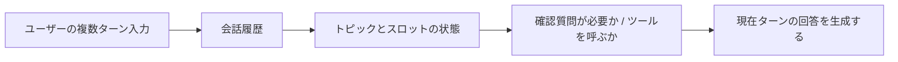

# 8.3.6 対話システムとマルチターン管理

:::tip[この節の位置づけ]
多くの人がチャットアプリを作るとき、最初に考えるのは次のようなことです。

- `history` を管理する
- 履歴をまとめてモデルに渡す

これで最小限のデモは作れますが、本当に使える対話システムにはまだほど遠いです。

この節のポイントは、「マルチターン対話」をきちんと分解して理解することです。
:::
## 学習目標

- 単一ターンのQ&Aとマルチターン対話システムの本質的な違いを理解する
- セッション状態、コンテキストウィンドウ、確認質問といった基本概念を理解する
- 最小限のマルチターン対話マネージャーを読めるようになる
- 対話システムの重要点は履歴を覚えることだけではなく、状態を管理することだと理解する

---

## まずは全体図をつかもう

マルチターン対話を初学者が理解する順番として適しているのは、「履歴を全部入れること」ではなく、まず次をはっきり見ることです。



この節で本当に解決したいのは次の2つです。

- マルチターンシステムが単一ターンQ&Aより難しい理由
- 「履歴があること」と「状態があること」は別だという点

### 初学者向けのたとえ

マルチターン対話システムは、次のように考えるとわかりやすいです。

- 1人のカスタマーサポート担当が、ユーザーと会話し続けている

ユーザーは毎回、背景を最初から説明してくれません。  
だから担当者は次を覚えておく必要があります。

- 今どの話題をしているか
- どの重要情報がもうわかっているか
- まだ足りない情報は何か

会話ログを横に全部置いているだけで、状態をきちんと整理していなければ、  
その担当者はすぐに話を混乱させてしまいます。

## なぜマルチターン対話は単一ターンQ&Aよりずっと難しいのか？

### 単一ターンQ&Aは「1問1答」に近い

たとえば、

- ユーザーが1回質問する
- システムが1回答える

このタイプは、長期的な状態がなくても動かせます。

### マルチターン対話はどこが本当に難しいのか？

後続のターンでは、しばしば情報が省略されるからです。

1. 「返金ポリシーは何ですか？」
2. 「じゃあ、もう30%学習していたら返金できますか？」

2つ目の「じゃあ」は、1つ目の話題を引き継いでいることが前提です。  
システムが前の文脈を覚えていなければ、理解が不完全になります。

つまり、マルチターン対話で本当に難しいのは「メッセージが増えること」ではなく、

> **コンテキスト依存と状態の継続です。**

---

## 対話システムは少なくとも何を管理する必要があるのか？

最低限、ふつうは次を管理します。

- 会話履歴
- 現在のトピック
- ユーザーの確認情報
- 確認質問が必要かどうか

つまり、対話システムは「回答を生成する」だけでなく、次を管理する必要があります。

> **この対話が今どの状態にあるか。**

---

## 最小の対話マネージャーの例

```python
def new_session():
    return {
        "history": [],
        "topic": None
    }

def add_turn(session, role, content):
    session["history"].append({"role": role, "content": content})

session = new_session()
add_turn(session, "user", "返金ポリシーは何ですか？")
add_turn(session, "assistant", "期間について知りたいですか、それとも条件ですか？")

print(session)
```

想定出力：

```text
{'history': [{'role': 'user', 'content': '返金ポリシーは何ですか？'}, {'role': 'assistant', 'content': '期間について知りたいですか、それとも条件ですか？'}], 'topic': None}
```

### このコードは小さいですが、すでに何を教えているのでしょうか？

このコードが教えているのは、

- 対話システムには本質的に状態がある
- その状態には少なくとも履歴と現在のトピックが含まれる

ということです。

これが、「モデルを1回呼ぶ」ことから「対話システムを作る」ことへの第一歩です。

### もう1つ、最小限の「状態の流れ」の例

```python
state = {
    "topic": "refund",
    "slots": {"progress": None},
}

user_message = "もう30%学習したけど、返金できる？"

if "30%" in user_message:
    state["slots"]["progress"] = "30%"

print(state)
```

想定出力：

```text
{'topic': 'refund', 'slots': {'progress': '30%'}}
```

この例は初学者にとても向いています。なぜなら、次のことが見えるからです。

- 対話システムが本当に保持するのは、ただの原文ではない
- 構造化された状態も保持している


:::tip[図の見方]
履歴は元の材料で、state はシステムが今維持している「現在の理解」です。図で topic、slots、last_tool_result、summary を分けているのは、すべてのコンテキストを雑に prompt に詰め込まないためです。
:::
---

## 対話システムは回答するだけでなく、確認質問もできる必要がある

### なぜ確認質問が重要なのか？

ユーザー入力は、途中までしか書かれていないことが多いからです。

たとえば、

- 「天気を調べて」

このとき、システムが勝手に都市を推測すると、体験は悪くなりがちです。  
よりよい方法は、

> **足りない情報を先に補うこと。**

### 最小の確認質問の例

```python
def dialog_step(session, user_message):
    add_turn(session, "user", user_message)

    if "天気" in user_message and "北京" not in user_message and "上海" not in user_message:
        reply = "どの都市の天気を調べたいですか？"
        add_turn(session, "assistant", reply)
        return reply

    reply = f"システムは次を処理しています：{user_message}"
    add_turn(session, "assistant", reply)
    return reply

session = new_session()
print(dialog_step(session, "天気を調べて"))
print(session["history"])
```

想定出力：

```text
どの都市の天気を調べたいですか？
[{'role': 'user', 'content': '天気を調べて'}, {'role': 'assistant', 'content': 'どの都市の天気を調べたいですか？'}]
```

ここには、とても大事な能力が表れています。

> 対話システムは答えるだけでなく、情報の不足を管理する必要があります。 

### なぜ確認質問は「システムが安定している」ことの表れなのか？

初心者はよく、次のように考えがちです。

- できるだけ確認質問が少ない方が賢い

でも実際のプロダクトでは、むしろ逆のことがよくあります。

- 先に確認して条件をそろえる
- その方が、適当に推測するよりずっと信頼できる

---

## なぜ「履歴を全部そのままモデルに入れる」だけでは足りないのか？

### 履歴が長くなると何が起きるか？

- token コストが増える
- 応答が遅くなる
- 関係ない情報がどんどん増える

### だから実際のシステムは選別する

たとえば、

- 直近 N ターンだけ残す
- 現在のトピックは別に状態として持つ
- もっと前の履歴は要約する

つまり、マルチターン管理は「履歴があるかどうか」ではなく、

> **どの履歴を有用な形で残すか。**

という問題です。

---

## 実践：直近ターンを残し、古い履歴を圧縮する

次の小さな練習は、実際のシステムでよく使う考え方をまねています。直近の数ターンは元のメッセージとして残し、それより古い履歴は短い要約にします。

```python
def compact_history(history, keep_last=2):
    older = history[:-keep_last]
    recent = history[-keep_last:]

    if older:
        summary = " | ".join(f"{turn['role']}: {turn['content']}" for turn in older)
    else:
        summary = None

    return {
        "summary": summary,
        "recent": recent
    }


history = [
    {"role": "user", "content": "返金ポリシーは何ですか？"},
    {"role": "assistant", "content": "購入後 7 日以内、かつ学習進度が 20% 未満なら返金可能です。"},
    {"role": "user", "content": "もし 30% 学習済みなら？"},
    {"role": "assistant", "content": "その場合、通常は返金条件を満たしません。"},
]

memory_view = compact_history(history, keep_last=2)
print(memory_view)
```

想定出力：

```text
{'summary': 'user: 返金ポリシーは何ですか？ | assistant: 購入後 7 日以内、かつ学習進度が 20% 未満なら返金可能です。', 'recent': [{'role': 'user', 'content': 'もし 30% 学習済みなら？'}, {'role': 'assistant', 'content': 'その場合、通常は返金条件を満たしません。'}]}
```


これはまだ学習用の例ですが、大事な実装習慣を教えてくれます。prompt を無限に伸ばさず、直近の会話は正確に残し、古い文脈は意図的に要約します。

---

## 少しだけ本格的なマルチターン例

```python
def dialog_reply(session, user_message):
    add_turn(session, "user", user_message)

    if "返金" in user_message:
        session["topic"] = "refund"
        reply = "返金ポリシーは、購入後 7 日以内かつ学習進度が 20% 未満なら返金可能です。期間を知りたいですか、それとも自分が条件を満たすかを確認したいですか？"

    elif "30%" in user_message and session["topic"] == "refund":
        reply = "学習進度が 30% なら、通常は返金条件を満たしません。"

    else:
        reply = "現在のトピックについて、引き続きお手伝いできます。"

    add_turn(session, "assistant", reply)
    return reply

session = new_session()
print(dialog_reply(session, "返金ポリシーは何ですか？"))
print(dialog_reply(session, "じゃあ、もしもう30%学習していたら？"))
print(session)
```

想定出力：

```text
返金ポリシーは、購入後 7 日以内かつ学習進度が 20% 未満なら返金可能です。期間を知りたいですか、それとも自分が条件を満たすかを確認したいですか？
学習進度が 30% なら、通常は返金条件を満たしません。
{'history': [{'role': 'user', 'content': '返金ポリシーは何ですか？'}, {'role': 'assistant', 'content': '返金ポリシーは、購入後 7 日以内かつ学習進度が 20% 未満なら返金可能です。期間を知りたいですか、それとも自分が条件を満たすかを確認したいですか？'}, {'role': 'user', 'content': 'じゃあ、もしもう30%学習していたら？'}, {'role': 'assistant', 'content': '学習進度が 30% なら、通常は返金条件を満たしません。'}], 'topic': 'refund'}
```

### この例は、普通のQ&Aと比べて何が増えたのでしょうか？

増えた重要点は、モデルが強くなったことではなく、

- トピック追跡
- コンテキストの継承

です。

つまり、

> 対話システムの核心は、まず状態設計にあることが多いです。 

### 初学者が最初に覚えるとよい状態表

| 状態の種類 | 何を記録するか |
|---|---|
| history | これまでに言ったこと |
| topic | 今何について話しているか |
| slot | 現在のタスクでまだ不足している重要情報 |
| ツール状態（tool state） | ツールを呼んだか、結果を受け取ったか |

この表は初学者にとても向いています。なぜなら、マルチターン対話の複雑さを、いくつかのわかりやすい箱に分けて見られるからです。

---

## 対話システムによくある状態の種類

### トピック状態（topic state）

今、何について話しているのか。

### スロット状態（slot state）

どの重要情報がすでにわかっていて、何がまだ足りないのか。

たとえば天気システムなら、

- 都市が既知 / 未知
- 日付が既知 / 未知

### ツール状態（tool state）

どのツールをすでに呼んだか、どの結果を受け取ったか。

これは Agent 型の対話で特に重要です。

## もし目標が「知識ベース駆動の SOP 文書アシスタント」なら、どのスロットを管理すべきか？

このタイプのプロジェクトは、普通のチャットと大きく違います。

- ユーザーが要件を一度で全部言わないことが多い

たとえば、最初に次のように言うかもしれません。

- 「返金エスカレーション SOP の Word 文書を作って」

そのあとで、さらに次を補足します。

- 「最新の社内返金ポリシーを使って」
- 「処理済みケースを2件入れて」
- 「最後に一次サポート向けチェックリストを付けて」

だから、最初の段階では、スロットを次のように決めるとよいです。

| スロット | 何を記録するか |
|---|---|
| `topic` | SOP のテーマ |
| `audience` | 対象となるサポート担当 |
| `doc_format` | Word / PPT |
| `case_count` | 入れる処理済みケースの数 |
| `checklist_required` | 最後のチェックリストが必要か |

最小の状態オブジェクトは、まず次のように書けます。

```python
state = {
    "topic": "返金エスカレーション SOP",
    "audience": None,
    "doc_format": "word",
    "case_count": None,
    "checklist_required": None,
}

print(state)
```

想定出力：

```text
{'topic': '返金エスカレーション SOP', 'audience': None, 'doc_format': 'word', 'case_count': None, 'checklist_required': None}
```

この例の一番大きな価値は、

- マルチターン対話が、実際のプロジェクトでどんな情報を補っているか

を初学者に先に理解してもらえることです。

## もっと実際のプロジェクトに近い最小確認質問の例

```python
def next_question(state):
    if not state["audience"]:
        return "この SOP は、主にどのサポート担当向けですか？"
    if not state["case_count"]:
        return "処理済みケースは何件入れますか？"
    if state["checklist_required"] is None:
        return "一次サポート向けチェックリストを付けますか？"
    return "情報はかなりそろいました。SOP ドラフトを作り始められます。"


state = {
    "topic": "返金エスカレーション SOP",
    "audience": None,
    "doc_format": "word",
    "case_count": None,
    "checklist_required": None,
}

print(next_question(state))
state["audience"] = "一次サポート"
print(next_question(state))
```

想定出力：

```text
この SOP は、主にどのサポート担当向けですか？
処理済みケースは何件入れますか？
```

これによって、初学者はとても大事な感覚をつかめます。

- 対話システムの目的は「たくさん雑談すること」ではない
- 生成に必要なパラメータを少しずつ埋めることにある

## 初学者が最初に対話システムを作るときの、いちばん安全な順番

おすすめの順番は次の通りです。

1. まず単一ターンQ&Aを作る
2. 次にトピック状態を追加する
3. 次に確認質問ロジックを追加する
4. 最後にツール状態や、より複雑な記憶を追加する

最初からすべての状態を一気に実装しようとすると、たいてい混乱します。

## これをプロジェクトとして見せるなら、何を見せるのが一番よいか

一番伝わりやすいのは、長いチャットのスクリーンショットではなく、次のようなものです。

1. 文脈を引き継いだ1往復の対話
2. トピック状態がどう変わるか
3. スロットがどう埋まるか
4. いつシステムが確認質問を選ぶか
5. いつシステムがそのまま回答を続けるか

こうすると、見る人にはっきり伝わります。

- あなたが作っているのはマルチターンシステムだ
- 履歴をただつなげてモデルに渡しているだけではない

---

## なぜマルチターン対話は特に「話がそれやすい」のか？

それは、次の影響を受けやすいからです。

- 直前のトピックの残り
- 長すぎる履歴
- ユーザーの表現不足
- 状態の明示的な記録がないこと

そのため、次のことがよくわかります。

> 対話システムでは、「見た目の返答の良さ」より「状態管理」の方がずっと重要なことが多いです。 

---

## 初学者がよくハマる落とし穴

### history だけを管理して、構造化状態を管理しない

システムの制御がどんどん難しくなります。

### 1回でわからないと、すぐ推測する

多くの場合、雑に答えるより確認質問をした方がよいです。

### 履歴を無限に積み続ける

コストもノイズも増えます。

---

## 残す証拠

このページを終えたら、この証拠カードを残します。

```text
要求: 入力、状態、tools/context、期待される出力の契約
検証済み出力：パーサー/スキーマ、または業務ルール確認の結果
追跡記録：モデル呼び出し、ツール/関数呼び出し、文書解析、または対話状態
失敗確認: フォーマット不正、必須フィールド不足、古い状態、または誤ったツール
次の行動：prompt、schema、state、API、または parsing の改善
```

## まとめ

この節で最も大事なのは、「会話できる関数」を作ることではなく、次を理解することです。

> **対話システムの核心は、マルチターンのテキストを生成することではなく、マルチターンの状態を管理することにある。**

この違いを本当に理解できれば、次に学ぶインテリジェントアシスタント、Agent 対話、記憶システムも、かなり理解しやすくなります。

## この節で必ず持ち帰りたいこと

- 対話システムの本質は、まず状態管理である
- 履歴、トピック、スロット、ツール状態はどれも重要になりうる
- 最初はシンプルな状態管理をきちんと作り、その後で少しずつ拡張する方が、一気に大きな記憶システムを作るより安定している

---

## 練習

1. この節の例に、「証明書」トピックの状態を追加してみましょう。
2. 天気検索タスクのために、都市や日付を含む `slot state` を設計してみましょう。
3. 考えてみましょう：「確認質問」が「適当に推測する」よりよい対話戦略であるのはなぜでしょうか？
4. 自分の言葉で説明してみましょう。なぜマルチターン対話の核心は、履歴をつなげることではなく状態管理だと言えるのでしょうか？

<details>
<summary>参考実装と解説</summary>

1. 証明書トピックでは intent、必須 slot、不足情報を聞く質問、tool/action、終了時の返答を定義します。
2. 天気の slot には、city、date、unit、現在の天気か予報か、といった項目が入ります。
3. 必須 slot が足りないとき、確認質問は hallucination と誤った tool call を減らします。
4. 状態管理は intent、slot、ユーザープロフィール、tool 結果、未解決 action を追跡します。生の履歴だけではノイズが多く、コストも高すぎます。

</details>
