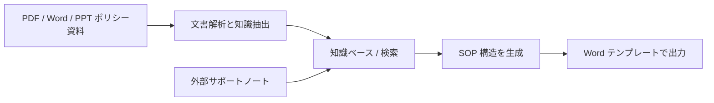
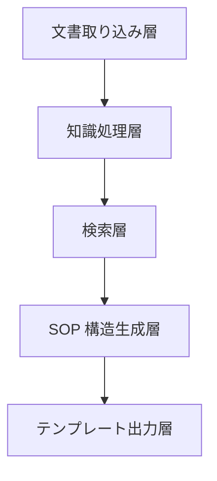

:::tip[この節の位置づけ]
このプロジェクトは、通常の知識ベース Q&A から一歩進んだものです。
質問に答えるだけではなく、実際に次のものを生成します。

- 明確なセクション、出典参照、チェックリスト欄を持つ Word の SOP 文書

そのため、次のシステム能力を組み合わせる練習に向いています。

- 文書解析
- 知識検索
- ポリシーとケースの抽出
- 構造化出力
- テンプレート化した文書生成
:::
## 学習目標

- 「インシデントのテーマ -> ポリシー検索 -> ケース抽出 -> SOP 下書き」を一つの流れとして組み立てられるようになる
- 知識ベース駆動の SOP 文書システムの最小プロジェクト範囲を定義できるようになる
- 内部ポリシー検索と外部サポートノートの補完を分けて設計できるようになる
- このプロジェクトを、製品らしさのあるポートフォリオ品質のシステムに育てられるようになる

## 初学者向けの用語橋渡し

このプロジェクトでは、文書処理、検索、生成、出力が同時に出てきます。まず用語を整理します。

| 用語 | 初学者向けの意味 | このプロジェクトでの役割 |
|---|---|---|
| `ingestion` | ファイルをシステムに取り込み、処理できる状態にすること | PDF / Word / PPT のポリシー資料がここから入る |
| `policy and case extraction` | 文書からポリシー条項、判断ルール、対応ケース、確認チェックリストを見つけること | SOP 下書きには、普通の段落だけでなく運用上の根拠が必要 |
| `schema` | SOP 出力の形を決める安定したデータ構造 | 検索、生成、テンプレート出力を同じ形にそろえる |
| `template rendering` | 構造化された内容を Word や PPT のテンプレートに流し込むこと | 内容生成と文書フォーマットを分離する |
| `source_refs` | 生成された各セクションや項目に残す出典参照 | 最終的な Word 下書きで、内容の出どころを説明できる |
| `internal vs external materials` | 内部資料は信頼できる会社ポリシー、外部資料は補足 | 外部ノートが公式ポリシーを上書きしないようにする |

重要な判断は、モデルに直接「Word ファイルを書かせる」ことではありません。モデルには安定した構造化 SOP オブジェクト作りを手伝わせ、それをテンプレート層で確実に描画します。

---

## まずプロジェクトの地図を作る

このプロジェクトは、「知識の取り込み -> 検索 -> 構造化生成 -> テンプレート出力」と考えると理解しやすくなります。



つまり、このプロジェクトで本当に解きたい問題は次です。

- ユーザーがインシデントのテーマだけを入力したとき、システムはどのようにポリシー資料を探し、ケースとチェックリストを抽出し、テンプレートに沿って書き出すのか？

## プロジェクト範囲はどう絞るべきか？

最初の範囲としてかなり安定しているのは、次の形です。

> **知識ベース駆動のサポート SOP アシスタントを作る。ユーザーがインシデントのテーマを入力すると、システムがポリシー要約、対応ケース、確認チェックリスト、出典メモを含む Word 下書きを自動生成する。**

この範囲が入門に向いている理由は次の通りです。

- テーマが明確
- 資料形式が明確
- ポリシー条項、対応ケース、チェックリスト項目を文書から抽出しやすい
- Word 出力という目標が明確

最初から次のものを狙うのはおすすめしません。

- すべての部門
- すべてのポリシー領域
- Word + PPT + Slack 返信 + 承認チケットの自動生成

そうすると、プロジェクトの主線から外れやすくなります。

## 初学者にとって分かりやすい比喩

このシステムは、次のように考えると分かりやすいです。

- 先にポリシー資料を読み、次に引き継ぎ用の骨組みを整理し、最後に SOP の下書きを作ってくれる運用分析アシスタント

何もないところから勝手に書くのではありません。代わりに、次の順番で動きます。

1. まず内部ポリシーを確認する
2. 必要な場合だけ外部サポートノートで補う
3. 資料からポリシー条項、対応ケース、チェックリスト項目を選ぶ
4. 最後に決まった形式で SOP 文書にまとめる

この比喩が重要なのは、プロジェクトを次のように誤解しにくくするためです。

- 「モデルに Word 文書を書かせればよい」

## 最小のシステムループはどんな形か？

1. 文書を取り込む
2. 本文、見出し、表、判断ルールを解析する
3. ユーザーがインシデントのテーマを入力する
4. システムが内部知識チャンクを検索する
5. 必要なら外部サポートノートで補う
6. 構造化された SOP オブジェクトを生成する
7. テンプレート経由で Word に出力する

この 7 ステップがスムーズに動けば、プロジェクトはかなり実製品に近く見えます。

## まず最小ワークフロー例を動かす

```python
knowledge_base = [
    {
        "topic": "返金エスカレーション",
        "content_type": "policy",
        "text": "返金資格または支払い状態が不明な場合は、担当者による確認にエスカレーションする。",
    },
    {
        "topic": "返金エスカレーション",
        "content_type": "case",
        "text": "カード決済で注文から7日を超えた案件は、返金を約束する前に請求確認へ回す。",
    },
    {
        "topic": "返金エスカレーション",
        "content_type": "checklist",
        "text": "注文日時、支払い状態、利用証跡、過去のサポート記録を確認する。",
    },
]


def retrieve_internal(topic):
    return [item for item in knowledge_base if item["topic"] == topic]


def retrieve_external(topic):
    # 最小シミュレーションのみ
    return [{"topic": topic, "content_type": "note", "text": f"外部補足：{topic} に関する最近のサポート手順メモ。"}]


def build_sop_document(topic):
    internal = retrieve_internal(topic)
    external = retrieve_external(topic)
    all_items = internal + external
    return {
        "title": topic,
        "policies": [x["text"] for x in all_items if x["content_type"] == "policy"],
        "cases": [x["text"] for x in all_items if x["content_type"] == "case"],
        "checklists": [x["text"] for x in all_items if x["content_type"] == "checklist"],
        "notes": [x["text"] for x in all_items if x["content_type"] == "note"],
    }


print(build_sop_document("返金エスカレーション"))
```

想定出力：

```text
{'title': '返金エスカレーション', 'policies': ['返金資格または支払い状態が不明な場合は、担当者による確認にエスカレーションする。'], 'cases': ['カード決済で注文から7日を超えた案件は、返金を約束する前に請求確認へ回す。'], 'checklists': ['注文日時、支払い状態、利用証跡、過去のサポート記録を確認する。'], 'notes': ['外部補足：返金エスカレーション に関する最近のサポート手順メモ。']}
```

### この例で最も重要な価値は何か？

このシステムの本当の価値は、単に次ができることではありません。

- 検索する

検索した内容を、次の形に組み直せることです。

- SOP 文書に必要なセクション構造

## 簡単な構造チェックを追加する

Word に出力する前に、各必須スロットに内容が入っているかを確認します。これにより、見た目は整っているが中身が空の文書をテンプレートが生成してしまうことを避けられます。

```python
sop_doc = build_sop_document("返金エスカレーション")
required_slots = ["policies", "cases", "checklists", "notes"]

for slot in required_slots:
    count = len(sop_doc[slot])
    print(f"{slot}: {count} item(s)", "OK" if count else "CHECK")
```

想定出力：

```text
policies: 1 item(s) OK
cases: 1 item(s) OK
checklists: 1 item(s) OK
notes: 1 item(s) OK
```

## 実プロジェクトらしいシステム分解図

初学者がこの種のプロジェクトを作るとき、最もよくある失敗は「知識ベース、検索、生成、出力」を一つに混ぜてしまうことです。

より安定した進め方は、先に層を分けることです。



シンプルに理解すると次のようになります。

- 取り込み層：資料を読み込む
- 処理層：資料を知識チャンクに変える
- 検索層：関連するポリシーとケースを探す
- 生成層：材料を SOP 文書の構造に組み直す
- 出力層：構造を Word に変える

## このプロジェクトに最も必要な能力は？

システム層ごとに見ると、主要な能力は次の通りです。

### 文書解析

- PDF / DOCX / PPTX の読み取り
- スキャン文書の OCR
- 見出し階層、表、判断ルールの認識

関連コース：
- [8.3.8 文書解析と知識抽出](../ch03-app-dev/07-document-parsing.md)
- [8.1.3 文書処理](../ch01-rag/02-document-processing.md)
- [10.5.4 OCR テキスト認識](../../ch10-computer-vision/ch05-advanced/03-ocr.md)

### 知識ベースと検索

- チャンク分割
- メタデータ
- テーマ検索
- ポリシーとケースの再呼び出し

関連コース：
- [8.1.2 RAG 基礎](../ch01-rag/01-rag-basics.md)
- [8.1.4 ベクトルデータベース](../ch01-rag/03-vector-databases.md)
- [8.1.5 検索戦略](../ch01-rag/04-retrieval-strategies.md)

### 構造化出力とテンプレート生成

- まずアウトラインを生成する
- 次にポリシー要約 / 対応ケース / 確認チェックリストを生成する
- 最後に Word テンプレートで出力する

関連コース：
- [7.5.2 Prompt 基礎](../../ch07-llm-principles/ch05-prompt/01-prompt-basics.md)
- [7.5.4 構造化出力](../../ch07-llm-principles/ch05-prompt/03-structured-output.md)
- [8.3.9 テンプレート化した文書生成（Word / PPT）](../ch03-app-dev/08-template-doc-generation.md)

### ツール呼び出しとワークフロー

- 内部知識ベース検索
- 外部サポートノート補完
- テンプレート描画
- ファイル出力

関連コース：
- [8.3.4 Function Calling 実践](../ch03-app-dev/03-function-calling.md)
- [8.3.6 対話システムとマルチターン管理](../ch03-app-dev/05-dialog-system.md)
- [9.2.5 Plan-and-Execute](../../ch09-agent/ch02-reasoning/04-plan-and-execute.md)

## なぜモデルに直接 Word ファイルを生成させないのか？

直接生成はデモでは速く見えますが、システムのデバッグが難しくなります。最終文書が間違っていたとき、原因が次のどこにあるのか分かりにくくなります。

- 文書パーサー
- 検索器
- プロンプト
- 出力 schema
- Word テンプレート

よりよいプロジェクト構造は次の形です。

```text
documents -> chunks -> retrieved evidence -> SOP schema -> Word template
```

各中間結果を検査できます。これが、単なるプロンプトデモではなく製品らしいシステムに見える理由です。

## 定型 SOP 文書に必要な最小 schema は何か？

schema は最初から複雑である必要はありません。
大事なのは、「SOP 文書がどんな形をしているか」を表すことです。

例えば次のようにします。

```python
sop_schema = {
    "title": "SOP 名",
    "audience": "サポートチーム",
    "document_goal": ["目標 1", "目標 2"],
    "sections": [
        {"type": "policy", "heading": "ポリシー要約", "items": []},
        {"type": "case", "heading": "対応ケース", "items": []},
        {"type": "checklist", "heading": "確認チェックリスト", "items": []},
    ],
    "source_refs": [{"doc_id": "policy_001", "page_or_slide": 3}],
}
```

この schema は、各層に明確な契約を与えます。

- 検索は何の根拠を探すべきか分かる
- 生成はどの構造を埋めればよいか分かる
- テンプレート描画は各ブロックをどこに置くか分かる
- 評価は何を確認すればよいか分かる

## 内部資料と外部資料をどう組み合わせるべきか？

SOP 生成では、内部資料が文書の主構造を決めるべきです。外部資料は空白を補えますが、会社ポリシーを上書きしてはいけません。

| 内容の必要性 | 優先度 |
|---|---|
| 適用条件のルール | まず内部ポリシー |
| エスカレーションケース | まず内部 runbook |
| 最近の例外やサポート手順メモ | 外部ノートを補足として使う |
| 内部資料の不足 | 外部ノートは質問や注意点の下書きに使える |

シンプルなルールは次です。

- 内部ポリシーが骨格を定義する
- 外部ノートは不足している背景や最近の運用文脈だけを補う

これは、コンプライアンスに関わるワークフローでは特に重要です。

## より完全なプロジェクトワークフロー

最小ループが動いたら、全体のワークフローは次の形にできます。

```python
def generate_sop_document(topic):
    parsed_docs = load_parsed_documents()
    internal_hits = retrieve_internal(parsed_docs, topic)
    external_hits = retrieve_external(topic)
    selected = merge_and_rank(internal_hits, external_hits)
    structured = build_sop_schema(topic, selected)
    return export_word(structured)
```

この関数は多くの実装詳細を隠していますが、プロジェクト境界は明確です。

- 入力：テーマと文書ライブラリ
- 中間成果物：解析済みチャンク、検索結果、構造化 schema
- 出力：Word の SOP 文書

## 生産ライン図を読む


この図は生産ラインとして読むのがポイントです。資料の投入、知識チャンクへの解析、テーマと内容タイプによる検索、SOP schema への変換、そして Word の描画までつながっています。途中の産物が残っていない層があると、その後の原因追跡がとても難しくなります。

## このプロジェクトをどう評価するべきか？

最終的な Word ファイルが「見栄えよく見えるか」だけで評価してはいけません。全体の連鎖を確認します。

1. 検索は正しいか
2. ポリシー、ケース、チェックリスト項目の抽出は正しいか
3. 生成された構造はテンプレートに合っているか
4. 出典参照は元資料まで追跡できるか
5. 証拠が不足または矛盾している場合に処理できるか

評価表は次のようにできます。

| 観点 | 確認ポイント |
|---|---|
| 検索品質 | 関連するポリシーとケース資料を見つけられているか |
| 構造の正しさ | ポリシー要約、対応ケース、チェックリスト項目が正しい位置にあるか |
| 引用の追跡可能性 | 重要な項目に出典参照があるか |
| テンプレート品質 | Word 出力の見出し、表、書式が安定しているか |
| 失敗処理 | 証拠不足のときに明確な追加質問や警告を出せるか |

## 推奨バージョンロードマップ

このプロジェクトは、次のバージョンで進めると安定します。

| バージョン | 目標 |
|---|---|
| V0 | 手作業のポリシーチャンク一覧 + 固定 SOP schema |
| V1 | ローカル PDF / Word / PPT 解析 |
| V2 | メタデータフィルター付きベクトル検索 |
| V3 | 外部サポートノート補完 |
| V4 | Word テンプレート出力 |
| V5 | 評価セット、失敗ログ、出典追跡ビュー |

こうすると、最初から完全自動の運用文書 Agent を作ろうとするより、ずっと安定して進められます。

## ポートフォリオ品質のデモで見せるべきもの

このプロジェクトをプロらしく見せたいなら、次を見せます。

1. 入力テーマ
2. 検索された内部ポリシーチャンク
3. 外部補足を使った場合は、そのノート
4. 最終的な SOP 構造がどう組み上がったか
5. 出力された Word ファイル
6. 小さな評価表

これにより、モデルが文章を生成できるだけでなく、信頼できる文書生成ワークフローを作れることを示せます。

## よくある落とし穴

| 落とし穴 | なぜ問題か | よりよい方法 |
|---|---|---|
| モデルに文書全体を直接書かせる | エラーを追跡しにくい | まず構造化 SOP オブジェクトを生成する |
| 出典参照を無視する | 最終出力を信頼しにくい | 重要な項目ごとに `source_refs` を保持する |
| 外部ノートを公式ポリシーとして扱う | 誤った案内につながる可能性がある | 内部ポリシーの優先度を高くする |
| schema より先にテンプレートを設計する | 書式と内容がずれやすい | 先に schema を定義し、次にテンプレートへ対応づける |
| 最終 Word ファイルだけを評価する | 検索や解析のエラーが隠れる | 各層を別々に評価する |

## 関連プロジェクトの変形

この基線を完成させたら、同じ構造を次に応用できます。

- カスタマーサポートの引き継ぎメモ
- コンプライアンスレビュー要約
- インシデント対応 runbook
- 社内オンボーディング手順書
- プロダクトリリース用チェックリスト文書

ドメインは変わっても、核となるパターンは同じです。

```text
document library -> retrieval evidence -> structured document -> template export
```

## この節のまとめ

- このプロジェクトの核心は、「文書知識 -> 構造化された SOP 文書 -> テンプレート出力」という完全な流れです
- 内部ポリシーが主構造を定義し、外部ノートは不足している文脈だけを補うべきです
- モデルは Word 書式を直接操作するのではなく、まず構造化データを生成するべきです
- よいプロジェクトデモは、最終文書だけでなく中間証拠も見せます

<details>
<summary>推論と説明を確認する</summary>

1. このプロジェクトで最も重要なのは「文書の出力」ではなく、「文書知識 -> 構造化された SOP 文書」という全体の連鎖です。
2. 内部資料が信頼できる骨格を決めます。外部資料は補足できますが、公式情報を上書きすべきではありません。
3. 強いポートフォリオデモには、検索根拠、schema 出力、出力された Word ファイル、評価結果が含まれるべきです。

</details>
