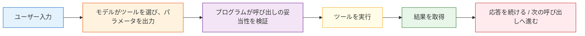

:::tip[この節の位置づけ]
前の節で、Function Calling が「モデルが構造化されたツール呼び出しを出力するもの」だと学びました。  
この節では、単に「呼び出せる」だけで終わらず、本当に大事な問いに進みます：

> **どうすれば関数呼び出しを安定・制御可能・拡張しやすくできるのか？**

これこそが、Agent システムにおける本当の実務価値です。
:::
## 学習目標

- 関数呼び出し の全体的な実務フローを理解する
- より安定したツール スキーマ を設計できるようになる
- パラメータ検証、失敗処理、エラー復旧を理解する
- 複数段階のツール呼び出しの小さな閉ループを読み解く
- 「モデルが判断すること」と「プログラムが実行すること」の役割を区別できるようになる

---

## なぜ 関数呼び出し を単独で深掘りするのか？

### 初級版は「呼べるかどうか」だけを解決する

最もシンプルな関数呼び出しシステムに必要なのは、次の2つだけです。

- モデルが正しいツールを選ぶ
- パラメータがだいたい合っている

デモ段階では、これで十分なことが多いです。

### 本番では、すぐにもっと難しい問題に直面する

例えば：

- ツールが多く、モデルがよく選び間違える
- パラメータに不足があることが多い
- ある呼び出しには権限制御が必要
- ツールが失敗したらどう復旧するのか？
- 多段階呼び出しで無限ループをどう防ぐのか？

つまり、Function Calling は単なる JSON ではなく、ひとつの実務メカニズムです。

---

## まず全体の流れをはっきりさせよう

### 関数呼び出し の標準的な閉ループ



### それぞれの工程は誰が担当するのか？

| 工程 | 担当 |
|---|---|
| ツールを使うべきか判断する | モデル |
| 呼び出し構造を出力する | モデル |
| パラメータが正しいか検証する | プログラム |
| ツールを実行する | プログラム |
| 結果に基づいて次へ進む | モデル / ワークフロー / Agent スケジューラ |

ここには、とても重要な境界があります。

> **モデルは「判断」し、プログラムは「安全かつ安定して実行する」ことを保証します。**


:::tip[図の読み方]
この図は「モデルの出力 = プログラムの実行」ではない、という前提で読みます。モデルは tool call を提案するだけで、プログラムはまず schema 検証、権限チェック、パラメータの整形、エラーの正規化を行い、そのあとで初めて実際のツールを実行します。
:::
---

## なぜ スキーマ 設計がそのまま効果に影響するのか？

### 悪い スキーマ はどんな形？

```python
bad_schema = {
    "name": "search",
    "description": "いろいろ検索する",
    "parameters": {
        "q": {"type": "string"}
    }
}

print(bad_schema)
```

この schema の問題は次の通りです。

- ツール名があいまい
- 説明が不十分
- パラメータの意味がはっきりしない

モデルがこのような schema を受け取ると、かなり混乱しやすくなります。

### もっと良い スキーマ

```python
good_schema = {
    "name": "search_course_policy",
    "description": "返金、証明書、学習順序などのコース規約ドキュメントを検索する",
    "parameters": {
        "keyword": {
            "type": "string",
            "description": "検索したいテーマのキーワード。たとえば 返金 や 証明書"
        }
    },
    "required": ["keyword"]
}

print(good_schema)
```

良い schema は、たいてい次の特徴を持ちます。

- ツール名が明確
- 説明が具体的
- パラメータ名に意味がある
- 必須項目がはっきりしている

---

## パラメータ検証: モデルを「いつでも正しい呼び出し器」と思ってはいけない

### 典型的なエラー

```python
tool_call = {
    "name": "search_course_policy",
    "arguments": {}
}
```

これをそのまま実行すると：

```python
search_course_policy(**tool_call["arguments"])
```

ほぼ確実にエラーになります。

### 最小限の検証器

```python
def validate_tool_call(call):
    if "name" not in call:
        return False, "missing_name"
    if "arguments" not in call:
        return False, "missing_arguments"

    if call["name"] == "search_course_policy":
        args = call["arguments"]
        if "keyword" not in args:
            return False, "missing_keyword"
        if not isinstance(args["keyword"], str):
            return False, "keyword_must_be_string"

    return True, "ok"

print(validate_tool_call({"name": "search_course_policy", "arguments": {"keyword": "返金"}}))
print(validate_tool_call({"name": "search_course_policy", "arguments": {}}))
```

期待される出力：

```text
(True, 'ok')
(False, 'missing_keyword')
```

これは「あると便利」なものではなく、本番システムの基本防御です。

---

## より完全な実行可能バージョン

### まずツールを定義する

```python
import ast
import operator

OPS = {
    ast.Add: operator.add,
    ast.Sub: operator.sub,
    ast.Mult: operator.mul,
    ast.Div: operator.truediv,
}


def safe_calculate(expression):
    def visit(node):
        if isinstance(node, ast.Expression):
            return visit(node.body)
        if isinstance(node, ast.Constant) and isinstance(node.value, (int, float)):
            return node.value
        if isinstance(node, ast.BinOp) and type(node.op) in OPS:
            return OPS[type(node.op)](visit(node.left), visit(node.right))
        if isinstance(node, ast.UnaryOp) and isinstance(node.op, ast.USub):
            return -visit(node.operand)
        raise ValueError("unsupported_expression")

    return visit(ast.parse(expression, mode="eval"))


def search_course_policy(keyword):
    docs = {
        "返金": "コース購入後 7 日以内で、学習進捗が 20% 未満なら返金申請が可能です。",
        "証明書": "必修項目をすべて完了し、修了テストに合格すると証明書を取得できます。"
    }
    return docs.get(keyword, "関連する規約が見つかりませんでした")

def calculate(expression):
    return str(safe_calculate(expression))
```

### スケジューラと検証を定義する

```python
def validate_tool_call(call):
    if "name" not in call or "arguments" not in call:
        return False, "invalid_call_structure"

    if call["name"] == "search_course_policy":
        args = call["arguments"]
        if "keyword" not in args or not isinstance(args["keyword"], str):
            return False, "invalid_policy_arguments"

    if call["name"] == "calculate":
        args = call["arguments"]
        if "expression" not in args or not isinstance(args["expression"], str):
            return False, "invalid_calculate_arguments"

    return True, "ok"

def dispatch(call):
    if call["name"] == "search_course_policy":
        return search_course_policy(**call["arguments"])
    if call["name"] == "calculate":
        return calculate(**call["arguments"])
    return "unknown_tool"
```

### 「モデルがツール呼び出しを決める」ことを模擬する

```python
def mock_model(user_query):
    if "返金" in user_query:
        return {
            "name": "search_course_policy",
            "arguments": {"keyword": "返金"}
        }
    if "証明書" in user_query:
        return {
            "name": "search_course_policy",
            "arguments": {"keyword": "証明書"}
        }
    if "計算" in user_query:
        return {
            "name": "calculate",
            "arguments": {"expression": user_query.replace("計算", "").strip()}
        }
    return None
```

### ひとつの閉ループにつなげる

```python
queries = [
    "返金ポリシーは何ですか？",
    "証明書はどうやってもらえますか？",
    "計算 12 * (3 + 2)"
]

for q in queries:
    print("ユーザーの質問:", q)
    call = mock_model(q)
    print("モデルの出力:", call)

    valid, msg = validate_tool_call(call)
    print("検証結果:", valid, msg)

    if valid:
        result = dispatch(call)
        print("ツール実行結果:", result)
    else:
        print("呼び出しは拒否されました")

    print("-" * 50)
```

期待される出力：

```text
ユーザーの質問: 返金ポリシーは何ですか？
モデルの出力: {'name': 'search_course_policy', 'arguments': {'keyword': '返金'}}
検証結果: True ok
ツール実行結果: コース購入後 7 日以内で、学習進捗が 20% 未満なら返金申請が可能です。
--------------------------------------------------
ユーザーの質問: 証明書はどうやってもらえますか？
モデルの出力: {'name': 'search_course_policy', 'arguments': {'keyword': '証明書'}}
検証結果: True ok
ツール実行結果: 必修項目をすべて完了し、修了テストに合格すると証明書を取得できます。
--------------------------------------------------
ユーザーの質問: 計算 12 * (3 + 2)
モデルの出力: {'name': 'calculate', 'arguments': {'expression': '12 * (3 + 2)'}}
検証結果: True ok
ツール実行結果: 60
--------------------------------------------------
```


この例は、単に `tool_call` を表示するだけのものより、実際のシステムにかなり近いです。

---

## 多段階呼び出しで、本当に難しいのはどこか？

### 難しさは「もう一度呼ぶこと」ではなく、状態管理

たとえば、ユーザーがこう聞いたとします。

> 「まず返金ポリシーを調べて、そのあと証明書の取得条件も調べて。」

このときシステムは次のような流れになるかもしれません。

1. `search_course_policy` を呼ぶ
2. 別のキーワードでもう一度 `search_course_policy` を呼ぶ
3. 最後に結果をまとめて返す

問題は次の通りです。

- 中間結果をどう保存するか
- 次のステップをいつ止めるか
- エラーが起きたらどう処理するか

### 最小の多段階例

```python
def multi_step_agent(query):
    steps = []

    if "返金" in query:
        call_1 = {"name": "search_course_policy", "arguments": {"keyword": "返金"}}
        steps.append(("tool_call", call_1))
        result_1 = dispatch(call_1)
        steps.append(("tool_result", result_1))

    if "証明書" in query:
        call_2 = {"name": "search_course_policy", "arguments": {"keyword": "証明書"}}
        steps.append(("tool_call", call_2))
        result_2 = dispatch(call_2)
        steps.append(("tool_result", result_2))

    return steps

for step in multi_step_agent("まず返金ポリシーを調べて、それから証明書の取得条件を調べる"):
    print(step)
```

期待される出力：

```text
('tool_call', {'name': 'search_course_policy', 'arguments': {'keyword': '返金'}})
('tool_result', 'コース購入後 7 日以内で、学習進捗が 20% 未満なら返金申請が可能です。')
('tool_call', {'name': 'search_course_policy', 'arguments': {'keyword': '証明書'}})
('tool_result', '必修項目をすべて完了し、修了テストに合格すると証明書を取得できます。')
```

だからこそ、Function Calling を学んでいくと、最終的には Agent と結びついていきます。

---

## 失敗処理と復旧がなぜ重要なのか？

### ツール失敗は例外ではなく、日常的に起きる

本番システムでは、ツール失敗はとてもよくあります。

- パラメータが間違っている
- API がタイムアウトする
- ネットワーク異常が起きる
- データが空である

### シンプルな失敗フォールバック

```python
def safe_dispatch(call):
    try:
        valid, msg = validate_tool_call(call)
        if not valid:
            return {"error": msg}
        return {"result": dispatch(call)}
    except Exception as e:
        return {"error": str(e)}

print(safe_dispatch({"name": "calculate", "arguments": {"expression": "2 + 3"}}))
print(safe_dispatch({"name": "calculate", "arguments": {"wrong": "2 + 3"}}))
```

期待される出力：

```text
{'result': '5'}
{'error': 'invalid_calculate_arguments'}
```

成熟したシステムは、1回のツール失敗でそのまま崩壊しません。

---

## 関数呼び出し の深い部分で本当に注目すべきこと

### 大事なのは「呼べるか」ではなく「安定して呼べるか」

本当に重要なのは、次のような点です。

- スキーマ は十分に明確か
- パラメータ検証は十分に厳格か
- ツールの権限は階層化されているか
- 多段階呼び出しはきちんと収束するか
- エラーを再現・追跡できるか

### ツール層は Agent 工学の信頼性の土台

ツール層が不安定だと、次のものもすべて不安定になります。

- 推論チェーン
- 多段実行
- メモリシステム
- 複数 Agent の協調

だから Function Calling は見た目こそ「構造化出力」に見えますが、本質は Agent 工学の重要なインフラです。

---

## 初心者がよくはまる落とし穴

### スキーマ を説明文のように書いてしまう

schema は単なる説明書ではなく、呼び出し境界そのものです。

### 検証せずにそのまま実行する

これは非常に危険です。

### ツール層にログがない

一度呼び出しを間違えたり、パラメータが壊れたり、実行が失敗したりすると、どこで問題が起きたのか分かりません。

---

## ツール設計のチェック表

実際にツールを設計するときは、まず次の表で schema を確認するとよいです。これによって、「モデルがツールを間違えて選ぶ」「パラメータを書き間違える」「プログラムが危険な操作を実行する」といった問題を減らせます。

| チェック項目 | 合格の状態 | よくある問題 |
|---|---|---|
| ツール名 | 動詞 + 対象が明確。たとえば `search_course_policy` | `search`、`process` のように広すぎる |
| 説明 | いつ使うか、いつ使わないかが明確 | 「情報を検索する」だけ |
| パラメータ | 各フィールドに意味、型、制約がある | `q`、`data`、`input` があいまい |
| 必須項目 | required が明確 | モデルが重要なパラメータを渡し忘れる |
| 戻り値 | 成功、失敗、空結果をプログラムが区別できる | 文字列を返すだけで状態が分からない |
| 権限 | 読み取り、書き込み、高リスクツールを分ける | すべてのツール権限が混ざっている |

ツール schema が明確であるほど、モデルは正しい選択をしやすくなります。  
プログラムの検証が厳密であるほど、システムは誤ったパラメータで壊れにくくなります。

## ツールの戻り値にも設計が必要

入力パラメータだけ設計して、戻り値を軽視する人は多いです。ですが、Agent が次にどう動くかは、ツール結果をどれだけ理解できるかに大きく依存します。

より安定した戻り値は、次のような形にできます。

```python
def tool_result(ok, data=None, error=None, retryable=False):
    return {
        "ok": ok,
        "data": data,
        "error": error,
        "retryable": retryable,
    }

print(tool_result(True, data={"text": "コース購入後 7 日以内なら返金申請できます"}))
print(tool_result(False, error="timeout", retryable=True))
```

期待される出力：

```text
{'ok': True, 'data': {'text': 'コース購入後 7 日以内なら返金申請できます'}, 'error': None, 'retryable': False}
{'ok': False, 'data': None, 'error': 'timeout', 'retryable': True}
```

このような構造は、単なる文字列を返すより Agent に向いています。システムは `ok`、`error`、`retryable` を見て、次に進む、再試行する、別のツールを使う、止めてユーザーに説明する、のどれにするかを決められるからです。

## 多段階ツール呼び出しの安全境界

多段階呼び出しで最も起きやすい問題は、「続かない」ことではなく、「止まらない」ことや「やってはいけないことをする」ことです。少なくとも、次の境界が必要です。

| 境界 | 役割 |
|---|---|
| 最大ステップ数 | 無限ループを防ぐ |
| ツールのホワイトリスト | 未許可の機能呼び出しを防ぐ |
| パラメータ検証 | 間違った、または危険なパラメータが実行層に入るのを防ぐ |
| 人間の確認 | 高リスクな書き込み操作は事前確認が必要 |
| エラー分類 | 再試行可能なエラーと再試行不可のエラーを分ける |
| トレース 記録 | 問題が起きたあとに各ステップを再現できる |

まずはこの一文を覚えておきましょう。

> **モデルは動作を提案できるが、境界を制御するのはプログラムである。**

これが、Function Calling がデモから Agent 工学へ進むうえでの重要な分岐点です。

---

## 残す証拠

このページを終えたら、この証拠カードを残します。

```text
ツール契約：名前、説明、入力スキーマ、出力スキーマ
権限：ツールが読み取りまたは変更を許可されている範囲
呼び出しトレース：引数、結果、エラー、再試行、またはフォールバック
失敗確認: 間違ったツール、不適切な引数、危険な操作、または観測不足
安全対策: 検証、確認、サンドボックス化、レート制限、またはロールバック
```

## まとめ

この節で最も大事なのは、`{"name": ..., "arguments": ...}` を書けるようになることではありません。理解すべきなのは次のことです。

> **関数呼び出し の本当の価値は、モデルの判断能力を、工程システムの実行能力につなげるところにある。**

schema 設計、パラメータ検証、失敗復旧、多段階状態管理に意識が向いたとき、初めて本当にツール層の工学に入ったと言えます。

---

## 練習

1. この節のツールシステムに `get_weather(city)` を追加し、対応する スキーマ と検証も作ってください。
2. あえてパラメータが間違った tool call を作り、検証器で止められるか確認してください。
3. `multi_step_agent()` を「最大 3 ステップまで実行する」ように拡張し、無限ループを防いでください。
4. 考えてみてください: なぜ 関数呼び出し は、普通のチャットボットよりも Agent システムでより重要なのでしょうか？

<details>
<summary>参考実装と解説</summary>

1. `get_weather(city)` は必須の文字列 `city` を受け取り、`{ok, data, error}` のような予測しやすい形で返すように定義します。実行前に必ず引数を検証します。
2. validator は、`city` の欠落、文字列でない値、未知のパラメータ、不正な JSON を tool runner の前で止めるべきです。
3. 3 ステップ制限に達したら、黙って続けるのではなく、`stopped: max_steps_reached` のような trace を返して停止します。
4. Function Calling は Agent で特に重要です。ツール呼び出しは外部状態を変えたり、コストを発生させたり、データを漏らしたり、ループを作ったりするからです。schema と validation は、テキストから行動へ移る前の安全境界です。

</details>
