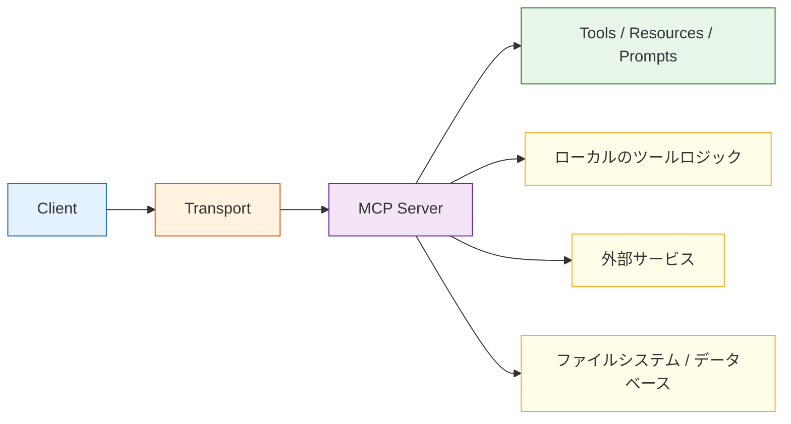

:::tip[この節の位置づけ]
前の節で、MCP は「ツール接続層のための統一プロトコル」だと分かりました。
この節ではさらに一歩進めて、次の問いに答えます。

> **MCP システムは構造的に、いったいどんな姿をしているのか？**

この章で大事なのは、抽象的な合言葉ではなく、次の点です。

- メッセージはどう流れるのか
- 誰が何を担当するのか
- システムはどうやって「ツールの発見」から「実際の実行」へ進むのか
:::
## 学習目標

- MCP システムにおける中心的な役割分担を理解する
- ツールの発見から呼び出しまでの一連の流れを理解する
- transport がアーキテクチャのどこに位置するかを理解する
- 「単一の API」ではなく「プロトコルの流れ」として理解できるようになる

---

## まずは全体のアーキテクチャ図を見よう



この図で一番大事なのは、ノード名そのものではなく、次の点です。

> **クライアントは下層の世界を直接操作するのではなく、MCP サーバーという統一された入口を通して能力を得る。**

---

## クライアントは実際に何をするのか？

クライアントの役割には、通常次のようなものがあります。

- 接続を確立する
- サーバーがどんな能力を公開しているかを見つける
- 今のタスクに応じて呼び出すかどうかを判断する
- リクエストを送って結果を受け取る

クライアントは「利用する側」と考えると分かりやすいです。

実際のシステムでは、たとえば次のようなものがクライアントになります。

- IDE プラグイン
- チャットアシスタント
- デスクトップ Agent
- ワークフローエンジン

クライアントの一番大きな価値は、「自分で全部やること」ではなく、

> **いつ、サーバーにどんな能力を求めるべきかを知っていること。**

---

## サーバーは実際に何をするのか？

サーバーの役割には、通常次のようなものがあります。

- 能力を説明し、公開する
- クライアントのリクエストを受け取る
- ローカルまたは外部のツールを呼び出す
- 構造化された結果を返す

言い換えると、サーバーは「能力の提供側」です。

外部に対して次のように伝える役割があります。

- どんなツールがあるか
- それぞれのツールをどう呼ぶか
- どんなコンテキストオブジェクトをサポートしているか

つまりサーバーは、プロトコルを実際に動かすための中心的な実体です。

---

## なぜ transport を無視してはいけないのか？

初学者は次の 2 つだけに目が行きがちです。

- クライアント
- サーバー

でも、両者がやり取りできるようにしているのは transport です。

### 何を解決しているのか？

簡単に言うと、transport は次の問いに答えます。

> このプロトコルメッセージは、いったいどの経路でやり取りされるのか？

たとえば次のようなものです。

- ローカルプロセス間通信
- 標準入力/標準出力
- ネットワーク接続

### transport が重要な理由

transport は次のような点に影響します。

- レイテンシ
- 信頼性
- デプロイ形態
- デバッグ方法

そのため transport は、単なる「おまけの選択肢」ではなく、アーキテクチャの一部です。

---

## MCP システムでよく使われる 3 種類の能力

みんながよく「ツール」と呼びますが、もう少し正確に見ると、公開される内容は主に次の 3 種類と考えられます。

### ツール（Tools）

実行できる能力です。

たとえば：

- 検索
- ファイルの読み取り
- 天気の確認

### リソース（Resources）

「読み取れる情報源」に近いものです。

たとえば：

- ドキュメントの内容
- 設定データ
- データテーブルのスナップショット

### プロンプト（Prompts）

「再利用できるプロンプトテンプレート」に近いものです。

この 3 つは完全に同じではありませんが、どれも「外部に公開する利用可能な能力」という点では共通しています。

---

## 一連のメッセージの流れはどうなっているのか？

### まずツールを発見する

```python
list_request = {
    "jsonrpc": "2.0",
    "id": 1,
    "method": "tools/list",
    "params": {}
}

list_response = {
    "jsonrpc": "2.0",
    "id": 1,
    "result": {
        "tools": [
            {"name": "search_docs", "description": "コース文書を検索する"},
            {"name": "get_weather", "description": "天気を確認する"}
        ]
    }
}

print(list_request)
print(list_response)
```

想定出力：

```text
{'jsonrpc': '2.0', 'id': 1, 'method': 'tools/list', 'params': {}}
{'jsonrpc': '2.0', 'id': 1, 'result': {'tools': [{'name': 'search_docs', 'description': 'コース文書を検索する'}, {'name': 'get_weather', 'description': '天気を確認する'}]}}
```

### 次にツールを呼び出す

```python
call_request = {
    "jsonrpc": "2.0",
    "id": 2,
    "method": "tools/call",
    "params": {
        "name": "search_docs",
        "arguments": {"query": "返金ポリシー"}
    }
}

call_response = {
    "jsonrpc": "2.0",
    "id": 2,
    "result": {
        "content": [{"type": "text", "text": "コース購入後 7 日以内で、学習進捗が 20% 未満なら返金可能です。"}]
    }
}

print(call_request)
print(call_response)
```

想定出力：

```text
{'jsonrpc': '2.0', 'id': 2, 'method': 'tools/call', 'params': {'name': 'search_docs', 'arguments': {'query': '返金ポリシー'}}}
{'jsonrpc': '2.0', 'id': 2, 'result': {'content': [{'type': 'text', 'text': 'コース購入後 7 日以内で、学習進捗が 20% 未満なら返金可能です。'}]}}
```

### この 2 ステップで何が分かるのか？

MCP は単に「関数を 1 つ呼ぶ」仕組みではなく、まず次の 2 段階があることを示しています。

1. 能力の発見
2. 能力の呼び出し

これにより、クライアントはすべてのツールの詳細を最初から固定で知っている必要がありません。


:::tip[図の読み方]
この図はメッセージの順番で見てください。Host 内のクライアントがまずサーバーに tools/list を送り、能力一覧を受け取ったあとに tools/call を実行します。MCP の価値は、「能力を発見すること」と「能力を呼び出すこと」を統一されたプロトコルでつなぐ点にあります。
:::
---

## なぜ MCP は「デカップリング層」なのか？

### MCP がない場合

クライアントは通常、次のような細部まで直接知る必要があります。

- ツール名の付け方
- パラメータの書き方
- 戻り値の形

これではクライアントとツール提供側が強く結びつきすぎてしまいます。

### MCP がある場合

クライアントが主に依存するのは、次のような共通の仕組みです。

- 統一プロトコル
- 統一された発見方法
- 統一された呼び出し方法

これによって、システムは次のような分かりやすい階層になります。

- 上層はタスクのオーケストレーションを担当する
- 下層は能力の提供を担当する

したがって MCP は、次のように理解できます。

> **ツールエコシステムにおけるアダプタ層であり、デカップリング層。**

---

## 最小構成のアーキテクチャをシミュレートする

以下では、純粋な Python で極めて簡単な MCP 風のやり取りをシミュレーションします。

```python
class MockMCPServer:
    def __init__(self):
        self.tools = {
            "search_docs": lambda query: f"検索結果: {query}"
        }

    def list_tools(self):
        return [{"name": name} for name in self.tools]

    def call_tool(self, name, arguments):
        if name not in self.tools:
            return {"error": "unknown_tool"}
        return {"result": self.tools[name](**arguments)}

class MockMCPClient:
    def __init__(self, server):
        self.server = server

    def discover(self):
        return self.server.list_tools()

    def call(self, name, arguments):
        return self.server.call_tool(name, arguments)

server = MockMCPServer()
client = MockMCPClient(server)

print(client.discover())
print(client.call("search_docs", {"query": "返金ポリシー"}))
```

想定出力：

```text
[{'name': 'search_docs'}]
{'result': '検索結果: 返金ポリシー'}
```

### この例は小さいですが、学習価値はとても高いです

なぜなら、すでに次の 3 層の分担が見えるからです。

- クライアントはリクエストを担当する
- サーバーは能力の公開を担当する
- tool は具体的な実行を担当する

この 3 層の役割分担をしっかり理解できれば、あとでより実際的な MCP システムを見たときも、かなり安定して理解できます。

---

## よくあるアーキテクチャ上の誤解

### サーバーをツールそのものだと思ってしまう

サーバーはツールではありません。
サーバーは次のものです。

> ツールのためのプロトコル化された出口。

### transport はなくてもよいと思ってしまう

transport はデプロイ方法や安定性に直接影響します。

### MCP が権限やポリシーの問題を自動で解決してくれると思ってしまう

そうではありません。
MCP が解決するのは「統一接続」であって、「自動ガバナンス」ではありません。

---

## 残す証拠

このページを終えたら、この証拠カードを残します。

```text
機能：サーバーが公開するリソース、Prompt、またはツール
契約: スキーマ、通信方式、権限、エラー形式
呼び出しトレース：探索、呼び出し、応答、失敗時の処理
失敗確認：互換性のないスキーマ、認証不足、安全でないツール、またはサーバーエラー
統合アクション：自律化を追加する前にサーバー契約を確認する
```

## まとめ

この節で一番大切なのは、クライアント/サーバーという単語を覚えることではなく、次を理解することです。

> **MCP アーキテクチャの核心は、能力の提供側と能力の利用側が、統一されたメッセージの流れと統一された境界を通じて関係を結ぶことにある。**

この流れがはっきり見えていれば、次にサーバー開発、クライアント統合、エコシステム実践を学ぶときも、迷いにくくなります。

---

## 練習

1. 自分の言葉で説明してみましょう。なぜクライアントとサーバーの役割は分ける必要があるのか？
2. 考えてみましょう。transport が変わっても、上位の呼び出しロジックはできるだけ変えない方がよいのはなぜか？
3. `MockMCPServer` に `get_weather` ツールを追加してみましょう。
4. 自分の言葉で説明してみましょう。なぜ MCP は「ツールそのもの」ではなく、「デカップリング層」だと言えるのか？

<details>
<summary>参考実装と解説</summary>

1. client と server を分けるべきなのは、client が orchestration、ユーザー文脈、ポリシーを持ち、server が能力実装と契約を持つからです。混ぜると、新しい tool や transport の変更が全体に波及します。
2. transport は差し替え可能であるべきです。tool 呼び出しの意味は、stdio、HTTP、その他の経路のどれで運ばれるかに依存しないほうがよいからです。よい設計では、呼び出し契約を保ったまま配送方式だけを替えます。
3. よい `get_weather` 追加には、明確な名前、説明、必須の `city` 引数、空文字や文字列でない都市名の検証、入力不正時の安定したエラー形式が含まれます。
4. MCP が decoupling layer と呼ばれるのは、境界を越えて能力を説明し呼び出す方法を定めるからです。MCP 自体が tool なのではなく、天気取得、ファイル読み取り、DB クエリなどの実能力は server 実装の背後にあります。

</details>
