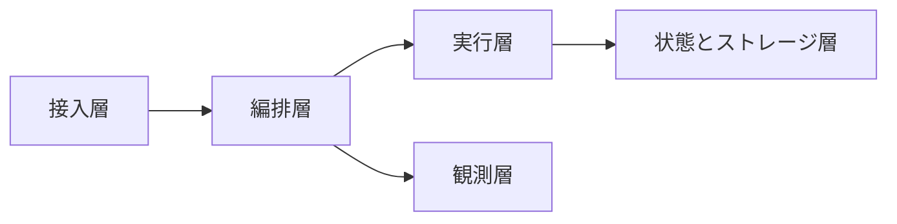
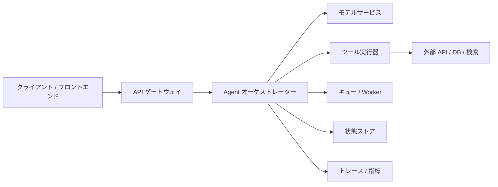

# 9.9.2 Agent デプロイメントアーキテクチャ

:::tip[この節の位置づけ]
多くの Agent プロジェクトは、最初はただのスクリプトから始まります。

- リクエストを受ける
- モデルを呼ぶ
- 答えを出力する

でも、実際に本番へ出すときに必要なのは、たいてい「1本のスクリプト」ではなく、ひとつのアーキテクチャです。

なぜなら、本番では次のような要素を同時に扱わなければならないからです。

- 並行実行
- 状態
- ツール依存
- ログ監査
- 障害復旧

この節で作るのは、まさにそのアーキテクチャの地図です。
:::
## 学習目標

- Agent デプロイメントアーキテクチャの中核モジュールの階層を理解する
- 「モデルサービス」がそのうちの1層にすぎない理由を理解する
- 実行可能な例を通して、リクエストがアーキテクチャ内でどう流れるかをつかむ
- デモから本番システムまでの全体像を持つ

---

## まずは地図を1枚作ろう

Agent デプロイメントアーキテクチャは、「リクエストがどこから入るか、どこで判断するか、状態をどこに保存するか、どう観測するか」で理解するとわかりやすいです。



この節で本当に解決したいのは、次の2つです。

- なぜ1本のスクリプトと、実運用できるシステムの間にこれほど多くの層が必要なのか
- なぜモデルサービスは実行層の一部にすぎないのか

---

## 実運用できる Agent システムには、通常どんな層があるのか？

### 接入層

役割：

- HTTP / WebSocket / 内部 RPC リクエストを受ける
- 認証、レート制限、ルーティングを行う

### 編排層

役割：

- ワークフローを選ぶ
- モデルを呼ぶ
- ツール呼び出しを決める
- タスク状態を管理する

この層は、Agent の「頭脳の外側の外装」のようなものです。

### 実行層

役割：

- 実際のツール呼び出し
- モデル推論サービス
- 検索サービス
- 外部 API 呼び出し

### 状態とストレージ層

役割：

- セッション状態
- 長期記憶
- タスク checkpoint
- ログと監査

### 観測層

役割：

- 指標
- トレース
- エラーアラート

### 初心者向けのわかりやすい全体イメージ

Agent デプロイメントアーキテクチャは、次のように考えると理解しやすいです。

- 会社が顧客を受け付け、仕事を振り分け、社員が実行し、記録を残し、最後に運用レポートを見る

もし全部を1人にやらせたら、  
短期的には動いても、  
並行実行、状態、ツール、障害が増えた瞬間に、すぐ制御不能になります。

このたとえは初心者にとても向いています。なぜなら、次のことを先に押さえられるからです。

- 分層は複雑にするためではない
- それぞれの責任を分けるため

---

## なぜ「モデル API + いくつかのツール」だけではアーキテクチャとは言えないのか？

### 状態の境界がないから

タスクが長くなると、システムは次の問いに明確に答えなければなりません。

- 今どこまで進んだか
- 1つ前の結果は何か
- 失敗したらどう復旧するか

### 実行の境界がないから

モデルにそのまま任せるべきではないものがあります。

- 権限制御
- タイムアウト方針
- ツール監査

これらはアーキテクチャ層が担当するほうが適しています。

### 観測の境界がないから

本番で問題が起きたときに、次のことへ答えられないとします。

- どのツールで止まったか
- どの種類のリクエストが遅いか
- どの経路が壊れやすいか

その場合、システムを長期的に保守するのがとても難しくなります。

---

## まずは最小構成の流れを見てみよう

この例では、実際にサービスを立てるわけではありません。  
ただし、リクエストがアーキテクチャ内をどう流れるかは、とてもはっきりわかります。

1. 接入層がリクエストを受け取る
2. 編排層がツールを選ぶ
3. 実行層がツールを呼ぶ
4. ストレージ層が状態を記録する
5. 観測層が トレース を記録する

```python
def gateway(request):
    return {
        "request_id": request["request_id"],
        "user_id": request["user_id"],
        "message": request["message"],
    }


def orchestrator(envelope):
    if "refund" in envelope["message"]:
        return {"workflow": "refund_flow", "tool": "search_policy"}
    return {"workflow": "default_flow", "tool": "none"}


def tool_executor(tool_name, message):
    if tool_name == "search_policy":
        return {"policy_text": "Refunds must be requested within 7 days and learning progress must be below 20%."}
    return {"note": "no_tool_used"}


def state_store(request_id, workflow, observation):
    return {
        "request_id": request_id,
        "workflow": workflow,
        "observation": observation,
    }


def trace_logger(request_id, stage, payload):
    return {"request_id": request_id, "stage": stage, "payload": payload}


request = {"request_id": "req-001", "user_id": "u-01", "message": "Please tell me the refund rules"}

envelope = gateway(request)
trace = [trace_logger(envelope["request_id"], "gateway", envelope)]

decision = orchestrator(envelope)
trace.append(trace_logger(envelope["request_id"], "orchestrator", decision))

observation = tool_executor(decision["tool"], envelope["message"])
trace.append(trace_logger(envelope["request_id"], "tool_executor", observation))

persisted = state_store(envelope["request_id"], decision["workflow"], observation)
trace.append(trace_logger(envelope["request_id"], "state_store", persisted))

for item in trace:
    print(item)
```

実行結果の例：

```text
{'request_id': 'req-001', 'stage': 'gateway', 'payload': {'request_id': 'req-001', 'user_id': 'u-01', 'message': 'Please tell me the refund rules'}}
{'request_id': 'req-001', 'stage': 'orchestrator', 'payload': {'workflow': 'refund_flow', 'tool': 'search_policy'}}
{'request_id': 'req-001', 'stage': 'tool_executor', 'payload': {'policy_text': 'Refunds must be requested within 7 days and learning progress must be below 20%.'}}
{'request_id': 'req-001', 'stage': 'state_store', 'payload': {'request_id': 'req-001', 'workflow': 'refund_flow', 'observation': {'policy_text': 'Refunds must be requested within 7 days and learning progress must be below 20%.'}}}
```

### このコードで本当に学びたいことは？

「いくつかの関数を書くこと」ではなく、  
頭の中に明確な階層を作ることです。

- リクエストの入口
- 判断ロジック
- ツール実行
- 状態保存
- トレース記録

この層が分かれて見えるようになると、アーキテクチャは安定し始めます。

### なぜ編排層と実行層を分けるのか？

理由は次のとおりです。

- 編排層は「決める」役割
- 実行層は「実際にやる」役割

この2つを混ぜると、あとで次のことがやりにくくなります。

- セキュリティ制御
- 個別のスケール調整
- デバッグ

### なぜ状態ストレージは単なるログではいけないのか？

ログは「何が起きたか」に近いものです。  
一方、実際の状態には次のようなものも含まれます。

- 現在のステップ
- 現在のコンテキスト
- 復旧可能かどうか

つまり、ログよりも「続きから実行できる」ことに近いのです。

### 初学者が最初に覚えるとよい分層表

| 層 | 最初に覚えるべき役割 |
|---|---|
| 接入層 | リクエストを受け、認証とレート制限を行う |
| 編排層 | どの経路に進むかを決める |
| 実行層 | モデルとツールを実際に呼ぶ |
| 状態層 | 現在のタスクがどこまで進んだかを保持する |
| 観測層 | システムのどこに問題があるかを知る |

この表は初心者にとても向いています。  
「アーキテクチャの層が多い」という印象を、5つのはっきりした役割に圧縮できるからです。


:::tip[図の読み方]
この図はリクエストの流れに沿って読むとわかりやすいです。接入層がリクエストを受け、編排層が処理を決め、タスクキューがピークを吸収し、実行層がモデルとツールを呼び、状態層が checkpoint を保存し、観測層が trace とアラートを記録します。
:::
---

## より一般的な本番アーキテクチャはどのようなものか？

通常は、次のような流れに抽象化できます。



この図の重要な点は次のとおりです。

- モデルサービスは実行層の一部にすぎない
- ツールシステムは、たいてい独立した実行層である
- 状態と観測は、独立した支援層として存在すべきである

---

## どんなときにキューと非同期 ワーカー が必要か？

### 長いタスク

たとえば：

- 長文レポートの生成
- 複数段階のデータ整理
- 複数ツールを使う非同期フロー

### ユーザーリクエストをブロックしたくないタスク

たとえば：

- 一括要約
- 週報生成
- 長い分析フロー

### なぜキューが役立つのか？

次のような利点があります。

- 非同期による疎結合
- レート制御のバッファ
- 失敗時の再試行

ただし、代わりに次のようなコストがあります。

- システムがより複雑になる
- 状態管理が難しくなる

### 初めてデプロイ設計をするときの、いちばん安定した順番

より安定した順番は、通常次の通りです。

1. まず、接入・編排・実行の3層を分ける
2. 次に、どこで状態を書き込むかをはっきりさせる
3. その後、トレース と メトリクス を追加する
4. 最後に、本当にキューと非同期 ワーカー が必要かを判断する

こうすると、最初から多くのミドルウェアを入れるよりも、システムの主線をしっかり作りやすくなります。

---

## いちばん起こしやすいアーキテクチャの落とし穴

### 落とし穴1：すべてのロジックを1つのサービスに詰め込む

最初はシンプルですが、後で次のような問題になります。

- ツール実行と編排が密結合になる
- スケールしにくい
- 観測しにくい

### 落とし穴2：データベースがあれば状態アーキテクチャがあると思う

データベースはあくまで保存手段です。  
本当に大事なのは、次の点をどれだけ考えられているかです。

- 何を保存するか
- いつ書き込むか
- 誰が復旧するか

### 落とし穴3：本番に出してから トレース と メトリクス を足す

観測がないと、問題が起きてもほとんど推測に頼るしかありません。

## これをプロジェクトやシステム設計として見せるなら、何を見せるとよいか

よく見せるべきなのは、次のようなものです。

- サービス名をたくさん並べたアーキテクチャ図

ではなく、

1. リクエストが各層をどう通るか
2. どの層が判断し、どの層が実行するか
3. 状態をどこに書き、なぜそこに書くか
4. エラー時に トレース がどう問題特定を助けるか

こう見せると、相手には次のことが伝わりやすくなります。

- ただ図を描いただけではなく、アーキテクチャの分層ロジックを理解している

---

期待される結果：接入、編排、実行、状態、観測の層を分け、1本のリクエストがどこで判断され、どこで実行され、どこに状態を書くか説明できる状態です。

## 残す証拠

このページを終えたら、この証拠カードを残します。

```text
ランタイム: キュー、ワーカー、状態ストア、ツールサービス、モデルエンドポイント
永続化：チェックポイント、イベントログ、メモリストア、復旧パス
運用シグナル：レイテンシ、コスト、エラー率、追跡カバレッジ、飽和度
失敗確認: 停止した実行、重複アクション、部分失敗、またはコスト暴走
復旧アクション：再開、ロールバック、中止、人間への引き継ぎ、または安全に劣化
```

## まとめ

この節でいちばん大事なのは、たくさんの基盤技術名を覚えることではなく、  
本番へ出すための地図をはっきり持つことです。

> **実運用できる Agent システムでは、少なくとも接入、編排、実行、状態、観測の5層を分けて考える必要があります。モデルはそのうちの1層にすぎず、すべてではありません。**

この地図が頭の中にしっかりできていれば、  
その後の runtime、復旧、コスト、運用実践は、ずっと理解しやすくなります。

---

## 練習

1. 例の `search_policy` を、2つのツールを協調させるフローに拡張してみてください。どの層が状態集約に最も向いているかを観察しましょう。
2. 長いタスクを非同期で実行したい場合、キューをどの層に置きますか？ その理由も考えてみましょう。
3. なぜ「モデルサービス」は「Agent アーキテクチャ」と同じではないのでしょうか？
4. 考えてみましょう：あなたの現在のプロジェクトで、いちばん不足しているのは接入層、実行層、それとも観測層ですか？

<details>
<summary>プロジェクト参考とレビュー観点</summary>

1. 2-tool workflow なら、まず policy を retrieve し、次に eligibility check や summary を行います。state aggregation は通常 execution / orchestration layer に置きます。tool results と current task state の両方を見られるからです。
2. queue は access layer と execution layer の間、または execution layer の境界内に置きます。user-facing API を長時間処理から守り、retry、status、cancellation の control point を作れます。
3. model service は依存先の 1 つにすぎません。Agent architecture には tools、state、memory、permissions、queues、traces、retries、safety gates も含まれます。
4. 自分の project に足りない layer は、実ユーザーが来たとき最初に壊れる場所で考えます。request intake、task execution、observability のうち、failure を見えなくしたり回復不能にしたりする layer が不足しています。

</details>
