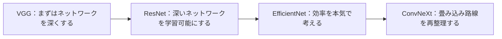

# 10.2.3 現代の分類アーキテクチャ

:::tip[この節の位置づけ]
画像分類では、モデル構造は「新しいほど良い」わけではありません。
むしろ、次のような重要な課題をめぐって進化してきました。

- どうすればネットワークをもっと深くできるか
- どうすれば学習をもっと安定させられるか
- どうすれば計算資源の使い方をもっと良くできるか

この節では、モデル名を暗記するのではなく、
その進化の背景にある考え方をつかむことが目的です。
:::
## 学習目標

- 主要な画像分類アーキテクチャの各世代が、何を解決しようとしていたかを理解する
- 残差接続が、なぜ深いネットワークの学習を変えたのかを理解する
- 効率重視のアーキテクチャがなぜ重要なのかを理解する
- アーキテクチャ選択の基本的な判断基準を身につける

---

## まずは全体像をつかもう

データ拡張を学び終えたばかりなら、この節は自然な続きです。

- 前の節では、「同じ画像をどうやってより安定してモデルに入れるか」を学びました
- この節では、「モデルそのものの骨組みをどう設計すれば、より強く、より安定し、より省エネにできるか」を考えます

つまり、この節はアーキテクチャ名を個別に覚えるためではなく、
画像分類のもう半分を補うためのものです。

- データをどう準備するか
- ネットワークをどう組むか

この節を理解するうえで大事なのは、モデル名を並べて覚えることではなく、
アーキテクチャの進化が何に答えようとしてきたのかを見ることです。



つまり、この節で本当に知りたいのは次の2つです。

- 画像分類ネットワークは、なぜ進化し続けたのか
- それぞれのアーキテクチャは、どんなボトルネックを補っているのか

### 初学者向けのわかりやすい比喩

分類アーキテクチャの進化は、次のように考えると理解しやすいです。

- 工場のラインを何度も改良しているようなもの

それぞれの改良は「見た目を新しくするため」ではなく、
もっと現実的な課題に答えるためのものです。

- ラインをもっと長くできるか
- 機械が不安定にならないか
- 同じ電力でより多く生産できるか

## 一、なぜ画像分類アーキテクチャは進化し続けるのか？

### 「深い」だけで自動的に「良い」わけではないから

初期のネットワークでは、深くするとよく次の問題が起きました。

- 勾配が伝わりにくい
- 最適化が難しい
- 学習が不安定になる

### そのため、進化は本質的に2つの問いへの答えでした

1. どうすれば深いネットワークをよりうまく学習できるか
2. どうすれば性能と効率のバランスを取れるか

### 比喩で考えると

アーキテクチャの進化は、工場のラインを改良し続けるのに似ています。

- 機械を派手にするためではない
- より複雑な生産規模でも安定して動かすため

### 初めてこの節を学ぶとき、まず何をつかむべき？

最初に押さえるべきなのは、モデルの年号やランキングではなく、この一文です。

> **アーキテクチャの進化は本質的に、「より深くをどう学習するか、より強くをどう省くか、より現代的にどう安定させるか」を解決することです。**

この感覚がつかめれば、あとで新しいアーキテクチャを見たときも、自然に次のように考えられます。

- どんなボトルネックを補っているのか？
- 深さ、安定性、効率のどれを改善しているのか？

---

## 二、各世代のアーキテクチャは何を重視していたのか？

### VGG：まず「より深くする」を形にした

特徴：

- 構造が規則的
- 小さな畳み込みだけで構成される
- ネットワークが深い

その意義は、

- 深いネットワークが能力を大きく高められることを示したこと

です。

### ResNet：もっと深いネットワークを本当に学習できるようにした

残差接続の核心的な直感は次の通りです。

- 各層が毎回まったく新しい変換を学ぶ必要はない
- 代わりに、「元の情報に対する追加分」を学べばよい

これにより、深層ネットワークの学習安定性が大きく向上しました。

### なぜ ResNet は画像分類の大きな転換点の一つなのか？

ResNet は、非常に重要な問題をかなり体系的に解決したからです。

- ネットワークは深くしたい
- でも深くすると学習しにくくなる

ResNet の価値は、単に「精度が上がった」ことではありません。
「深いネットワーク」と「学習可能性」を、ようやくしっかり結びつけたことにあります。

### EfficientNet：計算資源の効率を本気で考える

EfficientNet は、「強くできるか」だけではなく、
次の問いも重視します。

- 同じ予算なら、どうすればもっとお得に性能を上げられるか

### ConvNeXt：畳み込みの体系を見直す

Transformer が強くなったあと、
畳み込みベースの路線も再整理され、現代的にアップデートされました。

これは、

- アーキテクチャの進化は一直線に古いものが消える流れではない

ことを示しています。

### 初学者向けの比較表

| アーキテクチャ | まず覚えるべき特徴 | どんな直感を得やすいか |
|---|---|---|
| VGG | 深い、規則的、理解しやすい | なぜ深くすると強くなるのか |
| ResNet | 残差接続 | 深いネットワークをどう安定して学習するか |
| EfficientNet | 性能と効率の両立 | なぜ精度だけ見てはいけないのか |
| ConvNeXt | 畳み込みも現代化できる | アーキテクチャは新旧の二択ではない |

### 初めてアーキテクチャ進化を学ぶとき、どこでつまずきやすい？

つまずきやすいのは、次のような覚え方です。

- モデル名がたくさん出てくる
- 層数がたくさん出てくる
- ランキングの結論だけを見る

でも、本当に価値のある学び方は次の順番です。

- まず動機を見る
- 次に構造の変化を見る
- 最後に、実際のプロジェクトで baseline にする価値があるかを見る

### プロジェクト選択の観点で見るとどうか？

実用的に覚えるなら、次のように考えるとよいです。

- `VGG`：教学的な出発点としてわかりやすく、深さや構造感をつかむのに向いている
- `ResNet`：最も安定しやすい工程上の baseline。多くのプロジェクトで最初に候補になる
- `EfficientNet`：同じ資源でよりお得に性能を出したいときに有力
- `ConvNeXt`：畳み込み路線もまだ現代化できると理解したいときに向いている

### 初学者がまず覚えるとよい選択表

| 目的 | まず考えやすい選択 |
|---|---|
| 初めて画像分類プロジェクトを作る | ResNet |
| 深いネットワークがなぜ安定して学習できるのか知りたい | ResNet |
| 性能と効率を両立したい | EfficientNet |
| 画像アーキテクチャの進化を整理したい | VGG -> ResNet -> ConvNeXt |

この表は、モデル名を「いつ思い出すべきか」という実感に変えてくれるので、初学者にとても向いています。


:::tip[図の見方]
この図はモデルランキングとして見るのではなく、「問題の進化」として見てください。VGG はまず深さの有効性を示し、ResNet は深層の学習可能性を解決し、EfficientNet は効率に注目し、ConvNeXt は畳み込み路線の現代化を表しています。
:::
---

## 三、まずは最小の残差例で直感をつかもう

```python
def block_without_residual(x):
    transformed = x * 0.6 + 0.2
    return transformed


def block_with_residual(x):
    transformed = x * 0.6 + 0.2
    return x + transformed


x = 1.0
print("without residual:", block_without_residual(x))
print("with residual   :", block_with_residual(x))
```

実行結果の例：

```text
without residual: 0.8
with residual   : 1.8
```

### この例で伝えたいことは？

残差接続は、まず次のように理解できます。

- もとの情報を完全に置き換えるのではない
- もとの情報に新しい修正を重ねる

これは深いネットワークの学習でとても重要です。

### なぜ「より深いのに、より安定する」につながるのか？

層が深くなるほど、
表現を完全に作り直すよりも、少しずつ調整していくほうが学習しやすくなるからです。

### 初めて残差接続を見るとき、公式より先に覚えたいこと

残差ブロックは、まず次のように考えるとわかりやすいです。

- 新しい分岐は修正を学ぶ
- 元の経路は既存情報を保つ

この考え方がわかると、深いネットワークを助ける理由も理解しやすくなります。

- 毎層で情報を無理に書き換えなくてよい
- 勾配も戻りやすくなる

### 初学者がこの節で最初に覚えるべきことは？

まず覚えたいのは次の3点です。

1. アーキテクチャの進化は「新しいモデルが古いモデルをただ置き換える」話ではない
2. 多くの改善は、学習の安定性と効率の問題を解決している
3. ResNet が重要なのは強いからだけでなく、「深くしても学習できる」ことを実現したから

---

## 四、現代の分類アーキテクチャはどう選ぶ？

### 入門で baseline を作るなら

まずは次を優先するとよいです。

- ResNet のような定番で強い baseline

### 計算資源にかなり制約があるなら

次のようなものを重視すべきです。

- EfficientNet
- 軽量な畳み込みアーキテクチャ

### 研究や性能比較をしっかりやるなら

そのときにこそ、さまざまな系統を体系的に比較する価値があります。

### 初めて画像分類プロジェクトを作るとき、どう選ぶと安定する？

安定しやすい順序は、だいたい次の通りです。

1. まず ResNet で強い baseline を作る
2. 資源が本当に厳しいなら、EfficientNet のような効率重視路線を見る
3. さらに深く比較したいなら、他の系統も調べる

この流れのほうが、最初から流行の最新アーキテクチャを追うより、プロジェクトをしっかり固めやすいです。

### 初学者向けの実践的な選択表

| シーン | まず選びやすいもの |
|---|---|
| 初めて画像分類プロジェクトを作る | ResNet |
| デバイスの資源が限られている | EfficientNet または軽量な畳み込みネットワーク |
| 畳み込みの進化を理解したい | VGG -> ResNet -> ConvNeXt |
| きちんとアーキテクチャ比較をしたい | さまざまな系統を体系的に比較する |

### アーキテクチャをプロジェクトに入れるときの、最も安定した順番

安定しやすい順番は、通常次の通りです。

1. まず ResNet で強い baseline を作る
2. まずデータと学習フローが安定しているか確認する
3. 資源が本当に厳しいなら、効率重視のアーキテクチャに切り替える
4. 最後にアーキテクチャ家族の比較を行う

このほうが、最初から「最先端の backbone」を追うよりも、
どこで得られた成果なのかを見分けやすくなります。

---

## 五、よくある誤解

### 誤解1：名前だけ覚えて、何を解決しているか覚えない

大切なのは、次の問いに答えられることです。

- それは何のボトルネックを解決しているのか

### 誤解2：最新アーキテクチャのほうが、必ず今のプロジェクトに合う

実際には、成熟した強い baseline のほうが安定することがよくあります。

### 誤解3：ネットワークは深ければ深いほど必ず強い

適切な最適化の仕組みがなければ、深さは負担になりやすいです。

---

## 七、とても実用的な振り返り問題

あるアーキテクチャを学んだら、毎回次の3つを自分に聞いてみましょう。

1. それは主に何を解決しようとしているか？
2. 「表現力」を変えているのか、それとも「学習安定性 / 効率」を変えているのか？
3. 実際のプロジェクトに入れるなら、なぜそれを選ぶのか？

この3つにきちんと答えられれば、この授業は単なるモデル名一覧ではなくなります。

## これをプロジェクトやノートにするなら、何を見せるとよいか

見せると価値が高いのは、たとえば次のような内容です。

- なぜ ResNet を baseline に選んだのか
- なぜより効率重視のアーキテクチャに切り替えることを考えたのか
- どのアーキテクチャが、深さ・安定性・効率のどれを解決しているのか

こうすると、相手には次のことが伝わりやすくなります。

- 単に名前を覚えたのではなく、アーキテクチャ選択の考え方を理解している

---

## 残す証拠

このページを終えたら、この evidence card を残します。

```text
データセット分割: train/test 画像、クラス名、クラスの偏り
予測：ラベル、信頼度、そして少なくとも 1 枚の誤分類画像
指標：accuracy、F1、confusion matrix、およびクラスごとのエラー
失敗確認：拡張がラベルの意味を変える、クラス不均衡、リーク、または過学習
期待される成果: モデル結果の表と保存済みのエラー例
```

## まとめ

この節で一番大事なのは、アーキテクチャ進化を次の視点で見ることです。

> **画像分類アーキテクチャの発展は本質的に、「より深くをどう学習するか、より強くをどう省くか、より現代的にどう安定させるか」を解決してきた流れです。**

この見方があれば、あとで新しいモデルを見ても、名前だけに振り回されません。

## この節で持ち帰るべきこと

- アーキテクチャ名の背後には、必ずボトルネックと設計動機がある
- ResNet は、画像分類アーキテクチャを学ぶ最初の重要な一本線として、とても理解する価値がある
- プロジェクトでは、流行を追うより、安定した baseline を作ることのほうが重要なことが多い

一言でまとめるなら、こうです。

> **現代の分類アーキテクチャで本当に大切なのは、「誰が新しいか」ではなく、「深いネットワークの学習」と「効率向上」という現実の課題を、誰がより明確に解決したかです。**

## 練習

1. 自分の言葉で説明してみましょう。なぜ残差接続があると、深いネットワークは学習しやすくなるのでしょうか？
2. なぜ EfficientNet は「予算最適化」の考え方に近いと言えるのでしょうか？
3. 計算資源が限られたモバイル向け分類器を作るなら、どの系統のアーキテクチャを優先しますか？
4. 考えてみましょう。なぜアーキテクチャ選択は、ランキングだけを見て決めるべきではないのでしょうか？

<details>
<summary>解法と解説</summary>

1. 残差接続があると、ブロックは identity mapping を学びやすくなり、勾配にも短い戻り道ができます。そのため非常に深いネットワークでも最適化しやすくなります。
2. EfficientNet は、depth、width、入力 resolution をまとめて調整する考え方なので、単に深くするだけ・広くするだけではなく、計算予算の最適化に近い発想です。
3. モバイル分類器では、MobileNet 系や EfficientNet 系の軽量な事前学習モデルを優先し、そのうえで対象デバイス上の latency と memory を測るべきです。
4. leaderboard は、自分のデータ量、遅延目標、ハードウェア、前処理コスト、保守性、失敗パターンを反映しません。モデル選択は実プロジェクトの制約で検証します。

</details>
