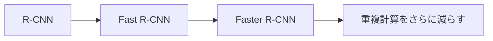

:::tip[この節の位置づけ]
クラシック検出アーキテクチャで本当に学ぶべきなのは「モデル名」ではなく、ずっと同じ問題を解決し続けてきた、という点です。

> **検出の品質を保ちながら、どうやって検出速度を上げるか。**

R-CNN ファミリーの発展史は、本質的には「重複計算を少しずつ減らしてきた歴史」です。
:::
## 学習目標

- R-CNN ファミリーがなぜ重要かを理解する
- region proposal が検出の初期ルートで果たす役割を理解する
- Fast / Faster R-CNN がそれぞれどのボトルネックを改善したかを理解する
- 2段階検出器の基本的な直感を身につける

---

## まず全体図をつかもう

この節では、モデル名を暗記するよりも、同じ問題の流れをどう解決してきたかを見るのがいちばん分かりやすいです。



この節で本当に見たいのは次の点です。

- 初期の検出システムはなぜ遅かったのか
- その後のアーキテクチャはどの層を最適化したのか

### 初心者向けのわかりやすい比喩

クラシック検出アーキテクチャは、大きな observability dashboard から障害サービスを探す場面にたとえられます。

- R-CNN は、怪しそうなパネルを1つずつ開いて丁寧に確認する
- Fast R-CNN は、まず dashboard 全体をざっと見てから、重要なパネルだけを拡大して見る
- Faster R-CNN は、「どのパネルを見るべきか」までシステムに自動で学ばせる

こう考えると、3世代の違いは名前だけではなく、考え方の違いとして見えてきます。

## 一、R-CNN ファミリーは何をしているのか？

### 基本の流れ

2段階検出の典型的な考え方は次の通りです。

1. まず候補領域を提案する
2. その候補領域に対して分類とバウンディングボックス回帰を行う

### なぜこの設計なのか？

画像全体から一度にすべての対象を見つけるのは、簡単ではありません。
まず「対象がありそうな領域」に絞ると、より自然に進められます。

### たとえ話

地図の中から「お店がありそうなエリア」を先に囲って、
そのあとで各エリアが何のお店かを判断するようなものです。

---

## 二、3世代のクラシックアーキテクチャは何を改善したのか？

### R-CNN

良い点：

- 考え方が分かりやすい

弱点：

- 各候補ボックスごとに、特徴抽出を個別に実行する
- とても遅い

### Fast R-CNN

改善点：

- 画像全体の畳み込み特徴を1回だけ抽出する
- 候補ボックスは共有された特徴マップ上で切り出す

効果：

- 速度が大きく向上する

### Faster R-CNN

改善点：

- 候補領域の提案そのものも、ネットワークに学習させる

効果：

- region proposal も end-to-end 学習の流れに入る

### 初心者向けの比較表

| アーキテクチャ | 候補領域の作り方 | 特徴抽出の方法 | 一番覚えておきたい進歩 |
|---|---|---|---|
| R-CNN | 外部の候補ボックス | 各ボックスごとに個別に特徴抽出 | 考え方は分かりやすいが、計算量が最も重い |
| Fast R-CNN | 外部の候補ボックス | 画像全体で特徴を共有 | 重複する畳み込み計算を大きく減らした |
| Faster R-CNN | ネットワークが proposal を生成 | 画像全体で特徴を共有 | proposal も学習可能な流れに入れた |

### なぜこの流れは当時とても重要だったのか？

YOLO のような 1段階手法が広まる前は、検出で大きな課題の1つが

- 対象を見つける
- 分類する
- 速度も実用的に保つ

という3つを同時に満たすことでした。

R-CNN ファミリーは、この問題に少しずつ答えていきました。

- まず動くものを作る
- 次に重複計算を減らす
- さらに proposal そのものも学習可能にする


:::tip[図の見方]
R-CNN ファミリーで一番大事なのは名前ではなく、「重複計算がどのように少しずつ減っていったか」です。各 proposal を個別に特徴抽出するところから、画像全体で特徴を共有し、さらに proposal 自体もネットワークに学習させる流れを見てください。
:::
---

## 三、「共有特徴 vs 重複計算」の小さな例

```python
proposals = ["box1", "box2", "box3", "box4"]


def rcNN_style_cost(num_proposals):
    # 各 proposal ごとに特徴を個別に抽出する
    return num_proposals * 10


def fast_rcnn_style_cost(num_proposals):
    # 画像全体で一度だけ特徴を抽出し、その後 proposal を切り出す
    return 10 + num_proposals * 2


for n in [1, 4, 16]:
    print(
        {
            "proposals": n,
            "rcnn_cost": rcNN_style_cost(n),
            "fast_rcnn_cost": fast_rcnn_style_cost(n),
        }
    )
```

実行結果の例：

```text
{'proposals': 1, 'rcnn_cost': 10, 'fast_rcnn_cost': 12}
{'proposals': 4, 'rcnn_cost': 40, 'fast_rcnn_cost': 18}
{'proposals': 16, 'rcnn_cost': 160, 'fast_rcnn_cost': 42}
```

proposal の数が増えると、R-CNN 風のコストは急に大きくなります。一方、Fast R-CNN 風のコストは、重い特徴抽出を共有するので、ずっとゆるやかに増えます。

### この例でいちばん伝えたいこと

Fast R-CNN のような改善の本質は、「より魔法のようなこと」ではなく、
**計算を共有すること**です。

### なぜこの主題は今でも学ぶ価値があるのか？

初心者が次を理解する助けになるからです。

- 検出システムがどの段階に分かれているのか
- 速度と品質がどうトレードオフになるのか
- なぜその後の 1段階手法が魅力的に見えるのか

これが、検出モデルの効率化の流れを理解するうえでの重要な軸です。

### 最小限の「proposal -> 分類」例をもう一つ見る

```python
proposals = [
    {"id": "p1", "score": 0.91},
    {"id": "p2", "score": 0.36},
    {"id": "p3", "score": 0.77},
]


def keep_proposals(proposals, threshold=0.5):
    return [proposal for proposal in proposals if proposal["score"] >= threshold]


print(keep_proposals(proposals))
```

実行結果の例：

```text
[{'id': 'p1', 'score': 0.91}, {'id': 'p3', 'score': 0.77}]
```

ここでは `p2` が除外されます。スコアが `0.5` 未満だからです。後で検出結果を読むときも、このような実用的なフィルタリングをよく行います。

もちろん、この例は本物の検出器よりずっと単純です。
それでも初心者にとっては、次の流れをつかむ助けになります。

- 2段階検出器は、まず「どの領域を詳しく見る価値があるか」を選ぶ
- その後で、より細かい分類やバウンディングボックス回帰を行う

---

## 四、2段階検出器は今でも価値があるのか？

もちろんあります。
特に次のような場面では、今でも強いです。

- 高精度な検出
- 高品質なバウンディングボックス位置推定
- 小さな対象や複雑なシーン

ただし、リアルタイム性が重視される多くの場面では、
YOLO のような 1段階手法のほうがよく使われます。

### では、なぜこの節でいきなり YOLO に進まないのか？

クラシックな2段階ルートは、「検出システムがどのように段階的に分解され、最適化されてきたか」を理解するのにとても適しています。
この流れを理解していないと、後で YOLO を学ぶときにも「ただ速い」という印象だけで終わってしまいがちです。

---

## 五、よくある誤解

### 誤解1：クラシック検出アーキテクチャはもう学ぶ必要がない

違います。
検出問題がどのように分解されてきたかを理解するのに、とても役立ちます。

### 誤解2：2段階は必ず遅くて、価値がない

多くの場合、品質の面で今でも強みがあります。

### 誤解3：Faster R-CNN は少し速くなっただけ

本当に重要なのは、候補領域の生成を学習可能な仕組みに組み込んだことです。

## クラシック検出アーキテクチャを最初に学ぶときの、いちばん安定した順番

おすすめの順番は次の通りです。

1. まず、2段階検出器が何を2段階に分けているのかを理解する
2. 次に、R-CNN がなぜ遅いのかを見る
3. そのあとで、Fast R-CNN がどうやって重複する畳み込みを減らしたかを理解する
4. 最後に、Faster R-CNN がどうやって proposal を学習に取り込んだかを見る

この順番のほうが、モデル名をただ暗記するよりも、流れをつかみやすくなります。

## ノートや作品にするなら、何を見せるとよいか

いちばん見せる価値があるのは、単に

- アーキテクチャ図を1枚貼って終わり

にすることではありません。

むしろ次のような点です。

1. 3世代の比較表
2. それぞれがどの工程を改善したのか
3. なぜ共有特徴マップで速くなるのか
4. なぜ proposal 学習が重要な転換点なのか

こうすると、見る人にすぐ伝わります。

- あなたは進化のロジックを理解している
- 単に用語を覚えているだけではない

## 残す証拠

このページを終えたら、この evidence card を残します。

```text
入力画像：正解または期待される対象を含む検出サンプル
予測：バウンディングボックス、ラベル、信頼度スコア、IoU、しきい値設定
指標：precision/recall、mAP、false positives、false negatives
失敗確認: 小さな物体、重なり、NMS、ラベル品質の低さ、または信頼度閾値
期待される成果：注釈付き画像と、検出メトリクスまたはエラーバケット
```

## まとめ

この節でいちばん大切なのは、次の進化の見方です。

> **R-CNN ファミリーの発展は、本質的には重複計算を少しずつ減らしながら、検出を「できる」段階から「より効率よくできる」段階へ進めてきた、ということです。**

ここが見えるようになると、後で YOLO を学ぶときにも、2つの路線を比較しやすくなります。

---

## この節で持ち帰るべきこと

- R-CNN ファミリーは、ばらばらの3モデルではなく、効率化の流れとして理解する
- 核心はいつも「重複計算を減らすこと」と「proposal をより学習可能にすること」
- クラシックアーキテクチャの最大の学習価値は、検出システムがどのように工学的に分解されるかを理解できること

---

## 練習

1. 共有特徴マップが検出コストを大きく下げるのはなぜか、考えてみましょう。
2. 自分の言葉で、Faster R-CNN が Fast R-CNN より多く解決した点を説明してみましょう。
3. どんなときに 2段階検出器を選びたくなるでしょうか？
4. なぜクラシックアーキテクチャは、検出タスクを理解するうえで今でも価値があるのでしょうか。

<details>
<summary>解法と解説</summary>

1. feature map を共有すると、各 proposal ごとに重い CNN を最初から実行する必要がなくなり、高価な特徴計算を再利用できます。
2. Faster R-CNN は、遅い外部 proposal 生成を RPN に置き換え、Fast R-CNN の proposal ボトルネックを解決します。
3. リアルタイム性よりも位置精度、小物体、丁寧な誤差分析が重要な場合は、二段階 detector を優先する価値があります。
4. 古典的な detector は、proposal、anchor、ROI feature、分類/回帰 head、NMS を理解する土台になります。これらは現代の detector でも重要です。

</details>
