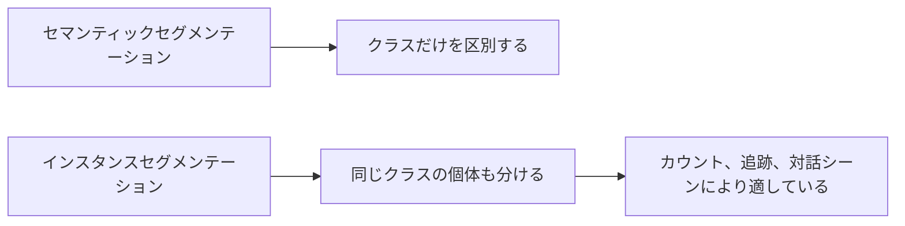

# 10.4.3 インスタンスセグメンテーション

:::tip[この節の位置づけ]
セマンティックセグメンテーションでは、もう次のことに答えられます。

- どのピクセルが「人」に属するか

ただし、画像の中に3人いたら、それだけではまだ足りません。
インスタンスセグメンテーションはさらに一歩進んで、

> **どのピクセルがどのクラスに属するかだけでなく、どの具体的なインスタンスに属するかも知る。**
:::
## 学習目標

- インスタンスセグメンテーションとセマンティックセグメンテーションの違いを理解する
- 「クラス」と「インスタンス」がなぜ2つの階層なのかを理解する
- 実行できるサンプルを通してインスタンス mask の感覚をつかむ
- インスタンスセグメンテーションがなぜ実際の視覚シーンにより近いのかを理解する

---

## まずは地図を作ろう

インスタンスセグメンテーションを初心者が理解する最適な順序は、「また1つ分割タスクが増えた」と考えることではなく、まず次の点をはっきり見ることです。



この節で本当に解決したいのは、次のことです。

- なぜ「クラスが合っている」だけでは足りないのか
- なぜ「同じクラスの個体を分ける」とタスクの難しさが大きく上がるのか

## 一、インスタンスセグメンテーションはセマンティックセグメンテーションに何が加わるのか？

セマンティックセグメンテーション:

- クラスだけを区別する

インスタンスセグメンテーション:

- クラス + 個体の区別

つまり、画像の中に2つの「person」があるなら、それらを1つにまとめてはいけません。

### 初心者がまず分けて覚えるべき3つのこと

初めてインスタンスセグメンテーションを学ぶとき、まず覚える価値があるのは次の3つです。

1. セマンティックセグメンテーションは「これは何クラスか」に答える
2. インスタンスセグメンテーションはさらに「これは何番目の個体か」にも答える
3. だから後者は、自然と現実のマルチオブジェクト場面により近い

### 初心者向けのわかりやすい比較表

多くの初心者は、最初にここへ来ると分類、検出、セマンティックセグメンテーション、インスタンスセグメンテーションがごちゃごちゃになりやすいです。
一番安定した方法は、まず同じ表で見比べることです。

| タスク | 何を出力するか | いちばん大事な問い |
|---|---|---|
| 分類 | 画像1枚につき1クラス | この画像全体は何か |
| 検出 | クラス + बॉक्स | 物体はどこにあるか |
| セマンティックセグメンテーション | クラス mask | どのピクセルがどのクラスか |
| インスタンスセグメンテーション | クラス mask + 個体の区別 | 同じクラスの物体をどう1つずつ分けるか |

この表はとても大事です。なぜなら、これを見るとすぐにわかるからです。

- インスタンスセグメンテーションは「セマンティックセグメンテーションを少し細かくしたもの」ではない
- 実際には「ピクセルレベルの理解」と「個体レベルの区別」を同時に扱っている

---

## 二、まず最小のインスタンス mask の例を見よう

```python
instance_map = [
    [0, 1, 1, 0],
    [0, 1, 1, 2],
    [0, 0, 0, 2],
]


def pixels_of_instance(instance_map, target_id):
    pixels = []
    for r, row in enumerate(instance_map):
        for c, value in enumerate(row):
            if value == target_id:
                pixels.append((r, c))
    return pixels


print("instance 1:", pixels_of_instance(instance_map, 1))
print("instance 2:", pixels_of_instance(instance_map, 2))
```

実行結果の例：

```text
instance 1: [(0, 1), (0, 2), (1, 1), (1, 2)]
instance 2: [(1, 3), (2, 3)]
```

この2つの instance ID はクラスラベルではなく、個別の物体 ID です。同じクラスに属していても、システムはそれぞれを分けて扱う必要があります。

### この例でいちばん重要な点は何か？

これは、インスタンスセグメンテーションがクラス番号を出すだけではなく、
さらに次のように区別することを示しています。

- 1番目のインスタンス
- 2番目のインスタンス

これは、カウント、追跡、対話シーンでとても重要です。

### なぜインスタンスセグメンテーションは防犯や自動運転に特に向いているのか？

これらのシーンでは、システムが気にするのは単に

- 画面に人がいるかどうか

だけではありません。むしろ重要なのは、

- 何人いるか
- どの物体同士が近接しているか
- その後も個体ごとに追跡できるか

という点です。

つまり、インスタンスセグメンテーションは自然と「後続の判断のための視覚表現」に近くなります。

### もう1つの最小「カウント + 面積」例

インスタンスセグメンテーションが実際のシステムでとても価値があるのは、
「いくつあるか」を教えるだけでなく、
さらに次の計算にもつなげやすいからです。

- 各物体の面積
- どの物体が境界により近いか
- どの物体が重なっているか

次の例では、まず最小限の方法でこの「個体レベルの統計」を体験してみましょう。

```python
instance_map = [
    [0, 1, 1, 0, 2],
    [0, 1, 1, 0, 2],
    [0, 0, 0, 0, 2],
]


def instance_area(instance_map, target_id):
    area = 0
    for row in instance_map:
        for value in row:
            if value == target_id:
                area += 1
    return area


for target_id in [1, 2]:
    print(target_id, "area =", instance_area(instance_map, target_id))
```

実行結果の例：

```text
1 area = 4
2 area = 3
```

各物体に独立した mask があれば、数を数えたり面積を計算したりできます。これが、検査・追跡・計画システムでインスタンスセグメンテーションが役立つ理由の1つです。

この例でまずつかむべきなのは、コードそのものよりも次の点です。

- 個体を分けると
- その後の多くの統計や判断が自然にできるようになる


:::tip[読み取りのヒント]
セマンティックセグメンテーションは「どのピクセルが人か」だけを見ますが、インスタンスセグメンテーションは「第1の人、第2の人」まで区別します。図を見るときは、なぜ隣り合う同じクラスの対象がくっつきやすいのか、そして個体を分けたあとにどうやってカウントや面積の統計を続けるのかに注目してください。
:::
---

## 三、いちばんつまずきやすいポイント

### 隣り合う同クラスのインスタンスはくっつきやすい

これは、インスタンスセグメンテーションでとてもよくあるエラーです。

### 小さいインスタンスほど難しい

個体が小さく、混み合っているほど、区別は難しくなります。

### 評価はセマンティックセグメンテーションより複雑

なぜなら、今は mask の品質を見るだけでなく、
インスタンスが正しく分かれているかも確認する必要があるからです。

## 四、初めてインスタンスセグメンテーションプロジェクトをやるときの、いちばん安定した順序

初めてインスタンスセグメンテーションをプロジェクトに入れるなら、
次の順序で進めるのがおすすめです。

1. まず、タスクに本当に「同クラスの個体を分ける」必要があるか確認する
2. 少量のサンプルを手で見て、インスタンス境界が明確か確認する
3. まず可視化ベースラインを作り、インスタンスがくっついていないか見る
4. そのあとで、mask の品質と個体分割が両立しているか確認する
5. 最後に、より複雑なモデルやより細かい評価を検討する

この進め方は、最初から複雑なネットワークを追うよりずっと安定しています。
なぜなら、インスタンスセグメンテーションで本当に怖いのは、しばしば「モデルが複雑ではない」ことではなく、

- アノテーションの境界自体が不明確
- タスク要件がはっきり定義されていない

ことだからです。

## 五、この節を初めて学ぶときの正しい期待値

この節で大事なのは、今日すぐに複雑なインスタンスセグメンテーションネットワークを覚えることではありません。
まず本当に見分けるべきなのは、次の点です。

- なぜセマンティックセグメンテーションとインスタンスセグメンテーションは別物なのか
- なぜ隣り合う同じクラスの対象が本当の難所になるのか
- なぜこのタスクがうまくいくと、カウント、対話、追跡にとても価値があるのか

---

## 残す証拠

このページを終えたら、この evidence card を残します。

```text
入力画像：元画像とターゲットマスクまたはクラスマップ
予測：予測マスク、重ね合わせ可視化、境界の例
指標：IoU、Dice、クラス別スコア、境界の失敗メモ
失敗確認：アノテーション品質、境界が薄い、領域が小さい、またはクラス混同
期待される成果：マスク重ね合わせとセグメンテーションメトリクス要約
```

## まとめ

この節で最も大事なのは、次の判断を持つことです。

> **インスタンスセグメンテーションは、セマンティックセグメンテーションに加えて「同じクラスの対象をどう区別するか」という1層を解決するので、より実際のマルチオブジェクト視覚シーンに近い。**

## この節で持ち帰るべきこと

- インスタンスセグメンテーションは、セマンティックセグメンテーションの上に「個体分割」を足したもの
- 難しさはクラスよりも、隣り合う同クラス対象の境界にあることが多い
- 後続のタスクでカウント、追跡、対話が必要なら、インスタンスセグメンテーションはとても価値がある

---

## 練習

1. もっと大きい `instance_map` を自分で作って、3つのインスタンスに印をつけてみましょう。
2. なぜインスタンスセグメンテーションはセマンティックセグメンテーションより難しいのでしょうか？
3. 2つの隣り合う対象がいつも1つのインスタンスとしてくっついてしまうなら、まず何を疑いますか？
4. インスタンスセグメンテーションが自動運転や防犯でなぜ特に価値があるのか、考えてみましょう。

<details>
<summary>解法と解説</summary>

1. 正しい `instance_map` では、通常 `0` を背景にし、各物体インスタンスに異なる整数 id を割り当てます。3 つの物体なら 3 つの異なる id が必要です。
2. instance segmentation が難しいのは、画素を分類するだけでなく、同じクラスの別々の物体も分離しなければならないからです。
3. 隣り合う物体がいつも 1 つに結合される場合、まず境界 annotation、画像 resolution、後処理、またはモデルに分離の手がかりが足りているかを疑います。
4. 個々の物体を数える、追跡する、または操作する必要がある場合、instance segmentation は特に価値があります。歩行者、車両、荷物、警備シーンの人物などが例です。

</details>
