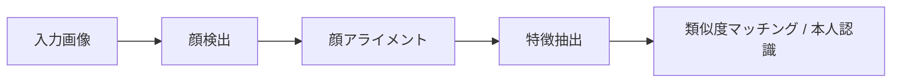

# 10.5.2 顔検出と認識【選択】

:::tip[本節の位置づけ]
顔タスクは一見すると「特別な対象を検出するだけ」に見えますが、
実際のシステムには通常、少なくとも次の要素が含まれます。

- 顔を見つける
- アライメントする
- 特徴を抽出する
- 類似度を比較する

そのため、この節で大事なのは次の理解です。

> **顔システムは単一のモデルではなく、たいていは一連のパイプラインである。**
:::
## 学習目標

- 顔検出、アライメント、認識の違いを理解する
- 実行可能な例を通して特徴比較の直感をつかむ
- 顔システムが誤認識とプライバシー問題を特に重視する理由を理解する
- 顔タスク全体のパイプライン感覚を身につける

---

## まずは全体像をつかもう

顔タスクを初学者が理解するうえで最もよいのは、「1つのモデルで顔を認識する」と考えるのではなく、まず完全なパイプラインを見ることです。



この流れを理解できれば、顔システムを「特別な1クラスを検出するだけ」と誤解しなくなります。

### 初学者向けのたとえ

顔システムは、空港のチェックインの3段階だと考えると分かりやすいです。

1. まず、その人が誰かを見つける
2. 次に、身分証をまっすぐ整える
3. 最後に、システム内の記録と照合する

こう考えると、顔認識は次のような神秘的な存在ではなくなります。

- 「誰かを当てる不思議なモデル」

むしろ次のように見えてきます。

- 入力を整えてから比較するパイプライン

## 顔認識システムには、通常どんな手順があるのか？

1. 検出: まず顔がどこにあるかを見つける
2. アライメント: 角度や姿勢をできるだけ正規化する
3. 表現: 顔ベクトルを抽出する
4. マッチング: ベクトルの類似度を比較する

### なぜ「アライメント」は見落とされやすいのか？

初学者は自然と次のように考えがちだからです。

- 顔を枠で囲めば十分

しかし実際のシステムでは、顔の角度、姿勢、切り出し範囲が大きくずれると、
その後の embedding がかなり不安定になります。

そのため、アライメントの役割は次のようなものです。

> **まず入力を、比較しやすい状態に戻す。**

---

## まずは最小限の類似度比較の例を見よう

```python
from math import sqrt

face_a = [0.9, 0.2, 0.1]
face_b = [0.88, 0.22, 0.12]
face_c = [0.1, 0.8, 0.9]


def cosine(a, b):
    dot = sum(x * y for x, y in zip(a, b))
    na = sqrt(sum(x * x for x in a))
    nb = sqrt(sum(x * x for x in b))
    return dot / (na * nb)


print("a vs b:", round(cosine(face_a, face_b), 4))
print("a vs c:", round(cosine(face_a, face_c), 4))
```

実行結果の例：

```text
a vs b: 0.9994
a vs c: 0.3034
```

`face_a` と `face_b` は非常に近く、`face_c` は embedding 空間でかなり離れています。実際のシステムでは、このスコアを閾値と拒否ポリシーと一緒に扱います。

### この例でいちばん大事な直感

顔認識は、多くの場合、名前を直接分類するのではなく、
次のように考えます。

- 2つの顔の表現が十分近いかどうかを見る

### 初めて学ぶとき、まず何を覚えるべきか？

最初に覚えるべきなのは、実は次の点です。

- 検出は「まず顔を見つける」役割
- アライメントは「姿勢を比較しやすくする」役割
- 認識は多くの場合、名前を直接出すのではなく embedding を比較すること

### なぜ閾値はシステム体験に直結するのか？

閾値は本質的に、次を決めるからです。

- どれくらい似ていれば同一人物とみなすか

閾値がゆるすぎると、

- 誤認識しやすい

閾値が厳しすぎると、

- 見逃しやすい

この種の問題は、モデルだけの問題ではなく、システム設定の問題でもあります。

### 「閾値が結果をどう変えるか」の最小例をもう1つ見よう

```python
similarities = [0.93, 0.81, 0.68]
threshold = 0.8


def match_results(scores, threshold):
    return ["same_person" if score >= threshold else "different_person" for score in scores]


print(match_results(similarities, threshold))
```

実行結果の例：

```text
['same_person', 'same_person', 'different_person']
```

閾値が `0.8` の場合、最初の2つのスコアは同一人物として受け入れられ、最後の1つは拒否されます。閾値を上げると、中央のケースは「受け入れ」から「拒否」に変わる可能性があります。

この例は小さいですが、初学者がシステムの感覚をつかむのに役立ちます。

- 顔認識は「モデルが答えを直接教えてくれる」ものではなく
- 「モデルがスコアを出し、システムが閾値で判断する」もの


:::tip[図の読み方]
顔システムは1つのモデルではありません。検出でまず顔を見つけ、アライメントで入力を比較可能にし、embedding で類似度を表し、閾値で same / different を決めます。閾値がゆるすぎると誤認識し、厳しすぎると見逃しが増えます。
:::
---

## 残す証拠

このページを終えたら、この evidence card を残します。

```text
シナリオ境界: face、video、OCR、3D、medical、または別の vision シナリオ
入力サンプル：ソース画像／フレーム／文書と期待される出力タイプ
結果成果物：抽出テキスト、追跡イベント、深度の手がかり、診断フラグ、またはレビュー注記
失敗確認: プライバシー、照明、時間的ドリフト、レイアウト、キャリブレーション、またはドメインリスク
期待される成果: 指標または人手レビューのメモを含むシナリオ固有のアーティファクト
```

## よくある誤解

### 検出だけ見て、アライメントを見ない

アライメントは、その後の認識の安定性に直接影響することがあります。

### 類似度だけ見て、閾値リスクを見ない

閾値が広すぎると誤認識しやすく、
厳しすぎると見逃しやすくなります。

### プライバシーと法令順守を無視する

顔タスクには、もともと高い法令順守要件が伴いやすいです。

### 成功した認識だけを示し、誤認識や拒否を示さない

次のようなものだけを見せると、

- 誰を正しく認識できたか

それはデモに近く、システムとは言いにくいです。
本当のプロジェクトに近い見せ方では、次のものも含めるべきです。

- 正しく認識できた例
- 誤ってマッチした例
- 本来は拒否すべきなのに、閾値がゆるくて通ってしまった例
- 本来は認識すべきなのに、閾値で弾かれた例

## なぜこの節は「システム思考」の訓練に特に向いているのか？

この節では、次のことに気づかされるからです。

- 単一モデルの結果は、完全なシステム能力と同じではない
- 閾値、誤認識、見逃し、法令順守が最終判断に入ってくる

これは多くの実際の CV システムにも共通しています。

### 初学者がそのまま真似しやすい学習順序

より安定した順序は、通常次の通りです。

1. まず検出を理解する
2. 次にアライメントを理解する
3. 次に embedding の類似度を理解する
4. 最後に閾値とシステムリスクを見る

最初から認識モデルだけを追うと、かえって全体の流れが見えにくくなります。

### これをプロジェクトにするなら、何を最初に見せるべきか

本当のプロジェクトに近い見せ方の順番は、通常次の通りです。

1. 元画像内の検出ボックス
2. アライメント前後の比較
3. 2枚の顔の embedding 類似度
4. さまざまな閾値でのマッチ結果
5. 誤認識 / 見逃し / 拒否の例

こうすると、読者は一目で次のどこに問題があるか分かります。

- 検出か
- アライメントか
- それとも閾値そのものか

---

## これをプロジェクトにするなら、何を見せるのがよいか

- 検出結果
- アライメント前後の比較
- embedding 類似度の比較
- さまざまな閾値での誤認識 / 見逃しの変化

こうした見せ方のほうが、単に「認識成功のスクリーンショット」を貼るより、ずっと実際のプロジェクトらしくなります。

---

## まとめ

この節でいちばん大事なのは、次のシステム的な理解を持つことです。

> **顔検出と認識は単一モデルの問題ではなく、検出からマッチングまでの完全なパイプラインである。**

## この節で必ず持ち帰りたいこと

- 顔認識システムの本質はパイプラインにある
- embedding と閾値が、その後のマッチング体験を決める
- こうしたシステムは、普通の画像認識タスクよりも、リスクと法令順守を強く考える必要がある

## 練習

1. 自分でいくつかベクトルを作り、類似度の閾値がマッチ判定にどう影響するかを確認してみましょう。
2. なぜ顔認識システムは閾値設定に特に依存するのでしょうか？
3. アライメントはなぜ認識精度に影響するのでしょうか？
4. 考えてみましょう: 顔認識システムがプライバシーを特に重視しなければならないのはなぜでしょうか？

<details>
<summary>解法と解説</summary>

1. 類似度しきい値を高くすると false accept は減りますが、false reject は増えます。低くすると一致しやすくなりますが、誤一致やなりすましのリスクが上がります。
2. 顔システムがしきい値に強く依存するのは、最終判断がモデルの class label ではなく、類似度スコアが境界を越えるかどうかで決まることが多いからです。
3. alignment は姿勢や crop のばらつきを減らし、embedding が顔の位置ではなく identity を比較しやすくするため、認識品質を上げます。
4. 顔システムでは biometric data を扱うため、特に privacy に注意が必要です。同意、保存、保持期間、アクセス制御、公平性を明確にします。

</details>
