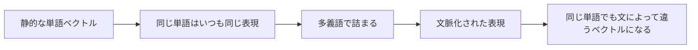

# 11.2.3 コンテキスト付き埋め込み


:::tip[この節の位置づけ]
前の節では、単語埋め込みによって単語を意味空間に写せることを学びました。
しかし、すぐにぶつかる大きな問題があります。

> **同じ単語でも、文脈が違えばまったく別の意味になることがある。**

もし各単語がいつも同じ固定ベクトルしか持てないなら、この問題はかなり扱いにくくなります。

これが「文脈化された表現」が登場した理由です。
:::
## 学習目標

- 固定された単語ベクトルだけでは不十分な理由を理解する
- 文脈化された表現の核心的な考え方を理解する
- 動かせる例を通して「同じ単語でも違うベクトルになる」感覚をつかむ
- これが、従来の NLP から現代の事前学習モデルへ進む重要な転換点であることを理解する

---

## まず全体像をつかもう

文脈化された表現を学ぶとき、新人にとっていちばん理解しやすい順番は、「ただの強い単語ベクトル」だと思うことではありません。まず次をはっきりさせることが大切です。



この節で本当に解決したいのは次の2つです。

- なぜ固定された単語ベクトルでは、いずれ足りなくなるのか
- なぜ「語義は文脈によって決まる」という考え方が NLP 全体を変えたのか

### 新人向けの、より分かりやすい比喩

静的な単語ベクトルと文脈化された表現は、こんなふうに考えられます。

- 静的な単語ベクトルは、辞書に載っている「固定の顔写真」のようなもの
- 文脈化された表現は、俳優が場面ごとに見せる「役柄の状態」のようなもの

同じ俳優は同じ人ですが、
場面が変わると表情も動きも役割も変わります。
同じように、

- 同じ単語でも、文が変われば
- いつも同じベクトルである必要はありません

## 一、固定された単語ベクトルの根本的な限界は何か？

### 1つの単語に複数の意味がある

典型例は `bank` です。

これは次の意味を持ちます。

- 銀行
- 川岸

もし常に1つの固定ベクトルしか持てないなら、
そのベクトルはどちらの意味に近づけばよいのでしょうか？

### だから固定された単語ベクトルは多義語に弱い

静的 embedding がどれだけ良くても、
次の2つを同じベクトルとして扱ってしまいます。

- “open a bank account”
- “sit on the river bank”

どちらにも `bank` が入っていますが、意味はまったく違います。

### 比喩で考える

固定された単語ベクトルは、全員に一生変わらない証明写真を配るようなものです。
文脈化された表現は、今いる場面に応じた動的な仕事用写真を出すようなものです。

- 銀行で働くときの写真
- 川辺を散歩するときの写真

---

## 二、文脈化された表現は、実際に何をしているのか？

### 核心的な考え方

「単語ごとに1つのベクトル」ではなく、
次のように考えます。

- その単語は、今の文の中で1つのベクトルを持つ

つまり、
表現は単語そのものだけで決まるのではなく、
周囲の文脈によっても決まります。

### なぜこれが重要なのか？

NLP の本当の難しさは、いつも「その単語が何か」だけではなく、

- この文の中で、その単語は何を意味しているのか

にあります。

### 何が変わるのか？

この一歩によって、表現学習は次のように変わります。

- 静的な参照表から探す方式

から

- 動的な意味のエンコード

へ進みます。

これが、現代の事前学習モデルが多くのタスクで強い理由の1つです。

---

## 三、まずは「同じ単語でも違うベクトルになる」感覚をつかむ

次の例は、実際の BERT を実装するものではありません。
ただし、「単語ベクトル + 文脈による補正」という考え方をとても分かりやすく再現しています。

```python
base_embeddings = {
    "bank": [0.5, 0.5],
    "money": [0.9, 0.1],
    "river": [0.1, 0.9],
}

context_shifts = {
    "finance": [0.3, -0.2],
    "nature": [-0.2, 0.3],
}


def contextualize(word, context_type):
    base = base_embeddings[word]
    shift = context_shifts[context_type]
    return [round(base[0] + shift[0], 3), round(base[1] + shift[1], 3)]


bank_in_finance = contextualize("bank", "finance")
bank_in_nature = contextualize("bank", "nature")

print("finance における bank:", bank_in_finance)
print("nature における bank :", bank_in_nature)
```

実行結果の例：

```text
finance における bank: [0.8, 0.3]
nature における bank : [0.3, 0.8]
```

同じ `bank` でも、金融文脈では1つ目の軸が強くなり、自然文脈では2つ目の軸が強くなります。ここでは小さな足し算だけですが、「文脈が token 表現を動かす」という核心を観察できます。

### このコードはもちろん本物の文脈モデルではない

それでも、いちばん大事な直感はつかめます。

- 単語そのものには基本表現がある
- 文脈によって、その表現が別の方向へ動く

### なぜこの直感が大切なのか？

この先で BERT、GPT、T5 を学ぶとき、
何度も同じ事実に出会います。

- 最終的な token の表現は、文全体の文脈で決まる

### この節を最初に学ぶとき、何を覚えるべきか？

まず覚えるべきことは次の3つです。

1. 静的 embedding は、多義語に対して本質的に弱い
2. 文脈化された表現は、「この単語はこの文で何を意味するのか」に答える
3. これこそが、現代の事前学習モデルが強くなった重要な一歩である

### さらに、最小限の「文脈の窓が表現に影響する」例を見る

```python
sentences = [
    ("bank", ["open", "account", "money"], "finance"),
    ("bank", ["river", "water", "shore"], "nature"),
]


def explain_representation(word, context_words, sense):
    return {
        "word": word,
        "context": context_words,
        "sense": sense,
    }


for word, context_words, sense in sentences:
    print(explain_representation(word, context_words, sense))
```

実行結果の例：

```text
{'word': 'bank', 'context': ['open', 'account', 'money'], 'sense': 'finance'}
{'word': 'bank', 'context': ['river', 'water', 'shore'], 'sense': 'nature'}
```

この出力は、単語だけでなく周囲の語も一緒に見ないと語義を決めにくいことを示しています。本物の文脈モデルは、この「周囲を見る」処理を大規模なニューラルネットワークで学習します。

この例も神経ネットワークではありません。
それでも、新人が次の重要な感覚をつかむ助けになります。

- 単語の表現は、周囲の文脈と一緒に見なければならない

そうしないと、
その単語が今どの意味なのかを説明しにくくなります。

---

## 四、文脈化された表現は、何を実際に変えたのか？

### 多義語の処理が自然になる

モデルは、同じ単語でも文によって違う表現を持てるようになります。

### 文や段落の理解が強くなる

単語の表現が孤立せず、文脈の手がかりがすでに混ざっているからです。

### 転移学習の効果が高くなる

多くの下流タスクでは、複雑な表現をゼロから学び直す必要が減り、
文脈化された隠れ状態をそのまま利用できます。

### なぜこれで多くのタスクの上限が変わるのか？

NLP の多くのタスクで本当に難しいのは、
次のようなことです。

- この単語はだいたい何を意味するか

ではなく、

- この文脈で、この単語は何を表しているのか

です。

表現の段階でこの違いを扱えるようになると、
分類、抽出、質問応答などのタスクが自然に安定しやすくなります。

### 具体的に、どんな場面で価値が見えやすいか？

文脈化された表現の価値は、特に次の場面で感じやすいです。

1. 多義語の分類
2. 固有表現認識
3. 質問応答
4. 機械翻訳

なぜなら、これらのタスクで本当に難しいのは、よくある辞書的な意味ではなく、

- その文の中で、何の役割を持っているのか

だからです。

---

## 五、静的な単語ベクトルとの関係は？

### 完全な置き換えではなく、能力のアップグレード

静的な単語ベクトルにも学習上の価値はありますし、軽量なタスクでは今でも役立つことがあります。
ただし、現代 NLP の主流では、文脈化された表現のほうが通常は強力です。

### ひとことでまとめると

- 静的 embedding: 単語レベルで固定された表現
- 文脈化された表現: 文の中で変化する token の表現

---

## 六、よくある誤解

### 誤解1: 文脈化された表現は「もっと大きい単語ベクトル」なだけ

違います。
重要なのは次です。

- 表現が文脈に依存すること

### 誤解2: 同じ単語でも違うベクトルになるのは細かい改善にすぎない

そうではありません。
これは多くのタスクの上限を本当に変える一歩です。

### 誤解3: 文脈化された表現があれば、上位のモデリングはもう不要

文脈化された表現はとても強力ですが、
それでも具体的なタスクやモデルの中で使う必要があります。

## これを学習ノートやプロジェクトにするなら、何を見せるとよいか

学習ノートやプロジェクトでいちばん見せる価値が高いのは、たいてい次のようなものです。

- 「BERT は強い」と一言で終わらせること

ではなく、

1. 同じ単語が文によってどう違う意味になるかの比較
2. 静的 embedding と文脈化された表現の違い
3. どんなタスクがこの能力に強く依存するか
4. なぜこれが現代 NLP の分かれ目になったのか

こうすると、見る人はすぐに次のことが分かります。

- 理解しているのは「なぜ強くなるのか」
- モデル名を覚えただけではない

## 残す証拠

このページを終えたら、この evidence card を残します。

```text
表現: BoW、TF-IDF、静的 embedding、文脈的 embedding、または言語モデルのスコア
比較：最も近いテキスト、類似度スコア、または次トークン/ログ確率形式の出力
解釈：この表現が何を捉え、何を捉え損ねるか
失敗確認: 多義性、ドメイン不一致、短文、トークン化、または意味のずれ
期待される成果: 少なくとも1つの意外な結果を含む小さな比較表
```

## まとめ

この節で最も大事なのは、次の判断基準を持つことです。

> **固定された単語ベクトルは「その単語はだいたい何に似ているか」しか答えられない。
> 文脈化された表現は「この単語はこの文の中で本当は何を意味するのか」に答え始める。**

ここが、現代 NLP が本格的に事前学習の時代へ入るための重要な関門です。

---

## この節で持ち帰るべきこと

- 文脈化された表現は「もっと大きい単語ベクトル」ではなく、「文によって変わる表現」
- これは従来の NLP から現代の事前学習モデルへ進む重要な転換点
- この先 BERT、GPT、T5 を学ぶときも、この流れを意識して理解することが大切

---

## 練習

1. 例に `apple` を追加し、「果物」と「会社」の場面で表現がどう変わるかをそれぞれシミュレーションしてみよう。
2. 自分の言葉で説明してみよう。なぜ固定された単語ベクトルは多義語の処理が苦手なのか？
3. なぜ文脈化された表現によって、多くの下流タスクがやりやすくなるのか？
4. 考えてみよう。表現が文脈に依存するなら、そもそも「単語そのもの」はまだ重要だろうか？ なぜそう言えるのか？

<details>
<summary>参考実装と解説</summary>

1. `apple` は fruit 文脈なら food 系の語に近づき、company 文脈なら technology や product 系の語に近づくのが自然です。
2. 固定 vector が polysemy に弱いのは、どの文に出ても同じ stored representation を使うからです。
3. contextualized representation は、分類、抽出、検索の前に周辺語から意味を分けられるため、下流タスクを楽にします。
4. 単語そのものも anchor token として重要です。ただし最終 representation は token identity と context を合わせて作るべきです。

</details>
