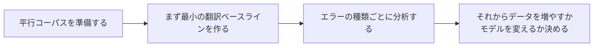

# 11.5.4 機械翻訳の実践【選択】


:::tip[図の見方]
翻訳プロジェクトでは、1文の結果が自然かどうかだけを見ればよいわけではありません。図を見るときは、平行コーパス、baseline、訳抜け、誤訳、語順の問題、用語の一貫性、そして人手評価をつなげて見ると、システムのどこが伸びているのか本当に分かります。
:::
:::tip[この節の位置づけ]
翻訳は Seq2Seq のいちばん代表的なタスクです。
「入力テキスト -> 出力テキスト」という一連のプロジェクトの流れを練習するのにとても向いています。

この授業では、いきなり大規模モデルの学習をするのではなく、
まずは最重要のプロジェクト構造をはっきりさせます。

- データペアはどんな形か
- 最小翻訳システムはどう動かすか
- エラーをどう見るか
:::
## 学習目標

- 翻訳プロジェクトの最小構成を理解する
- 平行コーパスからデータを整理する方法を学ぶ
- 実行できる例を通して最小翻訳ベースラインを作る
- 簡単な翻訳エラー分析を学ぶ

---

## まずは全体図を作る

機械翻訳の実践で、初心者にいちばん分かりやすい順番は「先により強いモデルへ置き換える」ことではなく、まずプロジェクト全体の流れを見えるようにすることです。



なので、この節で本当に解決したいのは次の2つです。

- 翻訳プロジェクトをどう進めるべきか
- なぜエラー分析は、むやみに大規模モデルを使うことより大事なのか

### 初心者向けの、よりイメージしやすい比喩

機械翻訳プロジェクトは、こんなふうに考えると分かりやすいです。

- 2人でバイリンガルの対訳ノートを作っている

片方に原文、もう片方に訳文を書きます。
本当に難しいのは、単に「対応する単語を探す」ことではなく、次のような点です。

- どう並べ替えるか
- どの単語は逐語訳してはいけないか
- どの表現は文脈を見ないと分からないか

こう考えると、翻訳タスクがなぜ Seq2Seq にとても向いているのか、直感的に分かります。

## 一、機械翻訳タスクで最も重要な入出力は何か？

### 入力

- 原言語の文

### 出力

- 目標言語の文

### なぜこの種類のタスクは Seq2Seq に特に向いているのか？

理由は次の通りです。

- 入力と出力の長さが固定ではない
- 両者の間に順序と意味の対応がある

これこそが Seq2Seq の典型的な場面です。

---

## 二、まずは最小の平行コーパスを見てみよう

```python
parallel_data = [
    ("hello", "こんにちは"),
    ("world", "世界"),
    ("i love ai", "私は AI が好きです"),
    ("study hard", "一生懸命 勉強する"),
]

for src, tgt in parallel_data:
    print(src, "->", tgt)
```

実行結果の例：

```text
hello -> こんにちは
world -> 世界
i love ai -> 私は AI が好きです
study hard -> 一生懸命 勉強する
```

各行は、1つの対応した学習例として読みます。原文と訳文が同じ意味を表していないと、モデルはノイズを学習してしまいます。

### なぜ平行コーパスが翻訳プロジェクトの土台なのか？

モデルが最終的に学ぶ必要があるのは、

- 原言語 -> 目標言語

という対応だからです。

このような対応データがなければ、翻訳タスクは始めようがありません。

### 初心者が最初に翻訳プロジェクトを作るとき、どんなデータを選ぶと安定しやすいか？

安定して始めるなら、一般的には次のような方針がよいです。

- まず短い文を使う
- まずテーマが比較的狭いコーパスを使う
- まず高品質な小規模データで閉ループを作る

こうすると、いきなり大きくて雑多なコーパスを使うより、問題点を見つけやすくなります。

### 初心者がそのまま使えるデータ確認チェックリスト

最初に翻訳プロジェクトを作るとき、特に確認したいのは次の点です。

1. 原文と訳文が本当に1対1で対応しているか
2. 文の長さが極端に違いすぎないか
3. テーマが雑多すぎないか
4. 同じ単語やフレーズに、矛盾する訳し方が多すぎないか

これらを最初に見ておかないと、
後でデータの問題をモデルの問題だと勘違いしやすくなります。

---

## 三、まずは最小の翻訳ベースラインを動かしてみる

```python
parallel_data = [
    ("hello", "こんにちは"),
    ("world", "世界"),
    ("i", "私"),
    ("love", "愛する"),
    ("study", "勉強する"),
]

phrase_table = {src: tgt for src, tgt in parallel_data}


def translate(sentence):
    tokens = sentence.split()
    output = [phrase_table.get(tok, "<unk>") for tok in tokens]
    return " ".join(output)


tests = [
    "hello world",
    "i love study",
    "love ai",
]

for sent in tests:
    print(sent, "->", translate(sent))
```

実行結果の例：

```text
hello world -> こんにちは 世界
i love study -> 私 愛する 勉強する
love ai -> 愛する <unk>
```

ここで重要なのは `<unk>` です。baseline には `ai` の対応がないため、その単語を訳せません。これは語彙カバー率の問題であり、decoder のバグではありません。

### それでもこの例をやる価値があるのはなぜか？

この例は、翻訳プロジェクトの最も基本的な形を先に見せてくれるからです。

- データペア
- 対応ルール
- 出力品質

### 限界もとてもはっきりしています

- 語順の違いを扱えない
- 多義語を扱えない
- 未知語に出会うと `<unk>` になる

こうした限界がはっきりしているからこそ、
なぜ後でより強いモデルが必要になるのかを理解しやすくなります。

### なぜ最小ベースラインはかえって教育的価値が高いのか？

それは、次の問題を本当に見えるようにしてくれるからです。

- 語順の問題
- 未知語の問題
- 文脈の曖昧さの問題

これらは、後で注意機構や Transformer が解決していく重要ポイントです。

### 初めて翻訳プロジェクトを作るとき、なぜ baseline が弱いからといって気にしすぎないほうがよいのか？

baseline がシンプルであるほど、エラーの原因を説明しやすいからです。

たとえば次のように見られます。

- `<unk>` が多いなら、語彙のカバー範囲が足りない
- 語順が乱れるなら、モデルが系列対応を本当に学べていない
- 逐語訳っぽさが強いなら、文脈理解が足りない

これは、最初から複雑なモデルを使うより、プロジェクトを判断する力を育てるのに役立ちます。

### もうひとつの最小「翻訳プロジェクト確認表」の例

```python
project_status = {
    "parallel_data_ready": True,
    "baseline_ready": True,
    "error_buckets_defined": False,
    "evaluation_examples_selected": False,
}


def next_step(status):
    if not status["parallel_data_ready"]:
        return "まず平行コーパスをきれいに整理しましょう。"
    if not status["baseline_ready"]:
        return "まず最小の baseline を作りましょう。"
    if not status["error_buckets_defined"]:
        return "まずエラーの種類を、訳抜け・誤訳・語順の問題に分けましょう。"
    if not status["evaluation_examples_selected"]:
        return "まず見せる例を一組選びましょう。"
    return "モデルのアップグレードに進めます。"


print(next_step(project_status))
```

実行結果の例：

```text
まずエラーの種類を、訳抜け・誤訳・語順の問題に分けましょう。
```

これにより、プロジェクトの進め方が実践的になります。モデルを変える前に、翻訳エラーをどう名付けて確認するかを決めます。

この例はとても小さいですが、初心者にはとても向いています。なぜなら、次のことを思い出させてくれるからです。

- プロジェクトは「モデルを変える」だけでは進まない
- データ、エラー分析、見せ方の骨組みも必要

---

## 四、翻訳プロジェクトのエラー分析はどうやるのか？

### よくあるエラー1：訳抜け

たとえば、ある単語がまったく訳されていない場合です。

### よくあるエラー2：誤訳

たとえば、ある単語が別の意味で訳されてしまう場合です。

### よくあるエラー3：語順が不自然

これは、最小の辞書ベースラインで特に起こりやすい問題です。

### ごく簡単なエラーチェック

```python
parallel_data = [
    ("hello", "こんにちは"),
    ("world", "世界"),
    ("i", "私"),
    ("love", "愛する"),
    ("study", "勉強する"),
]

phrase_table = {src: tgt for src, tgt in parallel_data}


def translate(sentence):
    tokens = sentence.split()
    output = [phrase_table.get(tok, "<unk>") for tok in tokens]
    return " ".join(output)


gold = {
    "hello world": "こんにちは 世界",
    "i love study": "私は勉強が好きです",
}

for src, expected in gold.items():
    pred = translate(src)
    print({
        "src": src,
        "pred": pred,
        "gold": expected,
        "match": pred == expected,
    })
```

実行結果の例：

```text
{'src': 'hello world', 'pred': 'こんにちは 世界', 'gold': 'こんにちは 世界', 'match': True}
{'src': 'i love study', 'pred': '私 愛する 勉強する', 'gold': '私は勉強が好きです', 'match': False}
```

2つ目の例は、最小 baseline の典型的な限界を示しています。逐語訳は意味の手がかりにはなりますが、自然な訳文や文脈に合った表現には届かないことがあります。

### 初心者向けのエラー分析フレームワーク

翻訳のエラー分析は、まず次の3つに分けると考えやすいです。

1. 訳抜け
2. 誤訳
3. 語順または表現の不自然さ

こうすると、次のどちらが原因か見分けやすくなります。

- データの問題か
- モデルの表現力の問題か

### ポートフォリオで見せるのに向いている比較方法

次のように並べて見せるのがおすすめです。

- 原文
- baseline の出力
- 目標出力
- エラー種類のラベル

こうすると、ただ「モデルを動かした」だけではなく、プロジェクト全体がとても分かりやすくなります。

### 初めて翻訳プロジェクトを作るなら、いちばん安定したエラー分類は何か？

まずは次の3つだけに絞るのが安定です。

1. 訳抜け
2. 誤訳
3. 語順または表現の不自然さ

初心者にとっては、この3つだけでも十分に次の判断ができます。

- データを増やすべきか
- 表現方法を変えるべきか
- それともより強いモデルに変えるべきか

---

## 五、この最小プロジェクトから先、どうアップグレードしていくか？

### 平行コーパスをもっと増やす

### 注意機構とニューラル Seq2Seq を入れる

### さらに進めて Transformer に移る

つまり、この小さなプロジェクトの意味は、それ自体が強いことではなく、
次のように翻訳の基本構造を見えるようにしてくれる点にあります。

- 翻訳プロジェクトの基本骨格

### 最初のアップグレードで、まず何を補うのがよいか？

一般的には、まず次の順で補うのがおすすめです。

1. データのカバレッジ
2. エラー分析
3. 注意機構やより強いモデル

これは、最初から大きいモデルをむやみに変えるよりずっと安定しています。

### いつデータを補うべきで、いつモデルを変えるべきか？

もし問題の主因が次のようなものなら、

- 語彙のカバー範囲がかなり足りない
- 学習サンプルが少なすぎる
- ある表現がほとんど見えていない

その場合は、まずモデルを変えるよりも、データを補うべきことが多いです。

## これをプロジェクトとして見せるなら、何を見せるとよいか

一番見せる価値があるのは、たいてい次のようなものです。

- 「どのモデルを使ったか」だけ

ではなく、次のような流れです。

1. 平行コーパスの例
2. baseline の出力
3. gold の出力
4. エラー種類のラベル
5. 次にどうアップグレードするか

こうすると、見る人には次のことが伝わりやすくなります。

- きちんとした翻訳プロジェクトを作っている
- ただ翻訳デモを動かしただけではない

---

## 六、よくある誤解

### 誤解1：翻訳は辞書引きと同じ

実際の翻訳は、単語を1対1で置き換えるよりずっと複雑です。

### 誤解2：きれいな例を1、2個見るだけで十分

本当のプロジェクトでは、系統的なエラー分析のほうが大切です。

### 誤解3：最初から大きなモデルをそのまま学習すればよい

より安定した方法は、まずデータと baseline の構造を整理することです。

## 残す証拠

このページを終えたら、この evidence card を残します。

```text
ソースとターゲット: ソーステキスト、ターゲットテキスト、タスク種別
復号出力：生成要約、翻訳、書き起こし、または系列結果
整合メモ: attention、CTC パス、coverage、またはコピー元の証拠
失敗確認: 抜け、繰り返し、ハルシネーション、誤った整合、または評価の弱さ
期待される成果：事実性または整合性のレビュー नोट付き生成テキスト
```

## まとめ

この節でいちばん大事なのは、翻訳プロジェクトを次のように見ることです。

> **平行コーパス、対応学習、エラー分析を中心に進む、典型的な Seq2Seq プロジェクト。**

まずこの流れをきちんと回せるようになると、後でモデルをアップグレードするときに、ただ「もっと大きいモデルに変える」だけではない考え方ができます。

---

## この節で特に持ち帰ってほしいこと

- 機械翻訳プロジェクトは、まずデータペアとエラー分析のプロジェクトである
- 最小の辞書ベースラインは弱いが、プロジェクトの見方を身につけるのにとても役立つ
- まずエラーの種類を見極めてからアップグレード方法を決めるほうが、実際のプロジェクトに近い

---

## 練習

1. 自分でさらに5組の単語ペアを追加して、この小さな辞書ベースラインを拡張してみましょう。
2. なぜ最小の翻訳ベースラインは、語順の問題が特に起こりやすいのでしょうか？
3. 考えてみましょう。どんなエラーは、辞書ベースラインではどうしても解決しにくいでしょうか？
4. このプロジェクトをアップグレードするなら、最初にデータを補いますか、それともモデルを変えますか？ なぜですか？

<details>
<summary>プロジェクト参考とレビュー観点</summary>

1. word pair を増やすと coverage は上がりますが、dictionary baseline だけでは grammar、agreement、context-dependent translation は安定して解けません。
2. word-order 問題が起きるのは、target sentence structure を model 化せず token を独立に訳すからです。
3. idiom、ambiguity、morphology、long-distance context は、孤立した辞書項目を増やしても dictionary baseline では難しいです。
4. まず data と evaluation examples を増やし、failure type を明確にします。その後で model change が必要か判断します。

</details>
