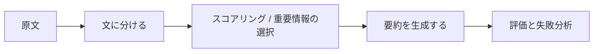

:::tip[図の見方]
要約プロジェクトでは、評価を見落としやすいです。図を見るときは extractive summary、generative summary、coverage、faithfulness、length control、そして手動評価をまとめて見て、まずは事実を落とさない要約を優先し、そのあとで表現の自然さを高めましょう。
:::
:::tip[この節の位置づけ]
要約プロジェクトはポートフォリオにとても向いています。なぜなら、次のようなとても現実的な問いに答える必要があるからです。

- 何を重要情報とみなすのか
- 長文をどう短くするのか
- 要約が本当に良いかどう判断するのか

この節では、「数文を抜き出せる」だけで終わらず、作品として見せるうえで本当に大事な部分まで整理します。
:::
## 学習目標

- 要約プロジェクトの最小限の一連の流れを定義できるようになる
- 抽出型 baseline を説明可能なシステムにできるようになる
- 最小限の評価と失敗分析を設計できるようになる
- この題材を、ひとまとまりの NLP プロジェクトとしてまとめられるようになる

---

## まずは全体像をつかもう

テキスト要約プロジェクトを新人が理解するうえで、いきなり「もっと強いモデルを追う」よりも、まずはプロジェクト全体の流れを見るほうが大切です。



この節で本当に解決したいのは、次の2つです。

- 「主線を保つ」とはどういうことか
- 要約プロジェクトをどう評価し、どう見せるか

### 新人により合うたとえ

テキスト要約は、次のように考えるとイメージしやすいです。

- 長い文章から読書カードを作る

本当に難しいのは、単に文字数を減らすことではありません。

- 主線を消してしまわないこと
- 端の情報だけが残らないこと
- そして、最終的な要約が自然に読めること

## 一、プロジェクト題材をどう絞るか？

練習用としては、たとえば次のような題材がよいです。

> **授業の長文紹介文から 2 文の要約を生成する。**

この題材の良いところは次のとおりです。

- 分野がはっきりしている
- テキストの長さがちょうどよい
- 要約の目的がわかりやすい

### 最初の要約プロジェクトで、どう題材を選ぶと安定するか？

より安定した出発点には、次のような特徴があります。

- 元の文章の構造がわかりやすい
- 主線の情報がまとまっている
- 「重要点が抜けていないか」を読者が判断しやすい

そのため、次のような文章は練習題材に向いています。

- 授業紹介
- ニュースの要約
- 会議メモ

### 新人が最初に覚えておくとよい見方

最初の要約プロジェクトでまず選ぶべきなのは、

- 読者が「どれが重要か」を判断しやすい文章

です。なぜなら、要約で一番難しいのは最終的に、

- 重要情報は何か

を見極めることだからです。

---

## 二、作品レベルの要約プロジェクトの最小構成

1. テキスト集合を選ぶ
2. 文に分ける
3. 文をスコアリングする
4. top-k 文を選ぶ
5. 手動評価を行う
6. 失敗パターンをまとめる

### 初学者がまず確認するとよいチェック表

| 項目 | まず何を確認するべきか |
|---|---|
| 文に分ける | 文の境界が安定しているか |
| スコアリング | 何を基準に「重要」と判断しているか |
| 要約生成 | top-k 文で主線を保てているか |
| 評価 | 「読みやすさ」だけでなく「重要点が抜けていないか」も見ているか |

この表は新人にとても向いています。なぜなら、要約プロジェクトを「数文抜き出して終わり」ではなく、確認できる一連の流れとして見直せるからです。

## 三、おすすめの進め方

新人には、次の順番が比較的安定しています。

1. まず抽出型 baseline を作る
2. 次に最小限の手動評価を加える
3. そのあと失敗事例分析を行う
4. 最後に生成型要約との比較を考える

この順番だと、要約システムが何を改善したのかを理解しやすくなります。

---

## 四、まずは少しまとまった抽出型要約システムを作る

```python
import re

article = """
AI 学習コースの学習経路は、通常、基礎段階と応用段階に分かれます。
基礎段階には、Python プログラミング、データ分析、機械学習が含まれます。
学習者がこれらを身につけてはじめて、深層学習や大規模モデルのアプリ開発に、より安定して進めます。
多くの人は最初から大規模モデルを学びたくなりますが、基礎が固まっていないためにすぐつまずきます。
学習目標が AI アプリエンジニアリングであれば、データ処理、モデル学習、システムデプロイの理解も重要です。
""".strip()


def split_sentences(text):
    parts = re.split(r"[。！？\n]+", text)
    return [p.strip() for p in parts if p.strip()]


def sentence_score(sentence, all_sentences):
    # 超シンプルな語頻度スコアリング：文中に高頻度の文字が多いほどスコアを高くする
    tokens = "".join(all_sentences)
    return sum(tokens.count(ch) for ch in sentence if ch.strip())


def summarize(text, top_k=2):
    sentences = split_sentences(text)
    scored = [
        (sentence_score(sent, sentences), idx, sent)
        for idx, sent in enumerate(sentences)
    ]
    top = sorted(sorted(scored, reverse=True)[:top_k], key=lambda x: x[1])
    return "。".join(item[2] for item in top) + "。", scored


summary, scored = summarize(article, top_k=2)
print("summary:", summary)
print("top scored:", sorted(scored, reverse=True)[:2])
```

想定出力：

```text
summary: 学習者がこれらを身につけてはじめて、深層学習や大規模モデルのアプリ開発に、より安定して進めます。学習目標が AI アプリエンジニアリングであれば、データ処理、モデル学習、システムデプロイの理解も重要です。
top scored: [(173, 4, '学習目標が AI アプリエンジニアリングであれば、データ処理、モデル学習、システムデプロイの理解も重要です'), (163, 2, '学習者がこれらを身につけてはじめて、深層学習や大規模モデルのアプリ開発に、より安定して進めます')]
```

スコアを絶対的な正解として扱わないでください。これはデバッグ信号です。選ばれた文が不自然なら、モデルを変える前にスコアリング規則を確認します。

### なぜこの例は「プロジェクトらしい」のか？

結果だけでなく、次も残しているからです。

- 文に分けた結果
- スコアリング結果

これによって、次のことができます。

- 説明する
- デバッグする
- 失敗を分析する

### なぜ要約プロジェクトでは途中のスコアを見せるとよいのか？

要約の良し悪しは、どうしても主観が入りやすいからです。
途中のスコアを見ることで、相手は次の点を理解しやすくなります。

- どのように選んだのか

### 最小限の「要約長さの制御」を見る例

```python
for k in [1, 2, 3]:
    summary_k, _ = summarize(article, top_k=k)
    print(f"top_k={k} -> {summary_k}")
```

想定出力：

```text
top_k=1 -> 学習目標が AI アプリエンジニアリングであれば、データ処理、モデル学習、システムデプロイの理解も重要です。
top_k=2 -> 学習者がこれらを身につけてはじめて、深層学習や大規模モデルのアプリ開発に、より安定して進めます。学習目標が AI アプリエンジニアリングであれば、データ処理、モデル学習、システムデプロイの理解も重要です。
top_k=3 -> 学習者がこれらを身につけてはじめて、深層学習や大規模モデルのアプリ開発に、より安定して進めます。多くの人は最初から大規模モデルを学びたくなりますが、基礎が固まっていないためにすぐつまずきます。学習目標が AI アプリエンジニアリングであれば、データ処理、モデル学習、システムデプロイの理解も重要です。
```

この例は初学者にとても向いています。なぜなら、次の感覚をつかみやすいからです。

- 要約は文が多ければ多いほど良いわけではない
- かといって、短ければ短いほど優れているわけでもない

大切なのは、

- 長さの制約の中で、できるだけ主線を保つこと

です。

---

## 五、最小限の手動評価表はどうあるべきか？

```python
eval_cases = [
    {
        "text": article,
        "gold_focus": ["基礎段階", "深層学習や大規模モデル", "システムデプロイ"],
    }
]

for case in eval_cases:
    pred_summary, _ = summarize(case["text"], top_k=2)
    covered = [item for item in case["gold_focus"] if item in pred_summary]
    print({
        "summary": pred_summary,
        "covered_focus": covered,
        "coverage_ratio": round(len(covered) / len(case["gold_focus"]), 4),
    })
```

想定出力：

```text
{'summary': '学習者がこれらを身につけてはじめて、深層学習や大規模モデルのアプリ開発に、より安定して進めます。学習目標が AI アプリエンジニアリングであれば、データ処理、モデル学習、システムデプロイの理解も重要です。', 'covered_focus': ['深層学習や大規模モデル', 'システムデプロイ'], 'coverage_ratio': 0.6667}
```

カバレッジが満点でないことも、この練習の大事な学びです。素朴な baseline は自然に読めても、重要な学習経路の情報を落とすことがあります。

### この評価がシンプルでも役立つ理由

この評価は、次の問いを強く意識させてくれます。

- 要約は主線をちゃんと保てているか

これは、「読みやすいか」だけを見るよりも、ずっと具体的です。

---

## 六、要約プロジェクトで特に見せる価値がある失敗事例

たとえば、次のようなものです。

- 同じ内容の文を選んでしまう
- 重要情報が抜ける
- 文の並びが自然でない

### なぜこれらを見せる価値があるのか？

抽出型要約の典型的な弱点が、そのまま表れているからです。

### 新人向けの失敗分析フレーム

まずは次の3つに分けるとよいです。

1. 主線情報が抜ける
2. 文の重複や冗長さがある
3. それぞれの文は正しくても、全体として自然でない

こうすると、単に「この要約はあまり良くない」で終わらず、次の改善につなげやすくなります。

### そのまま使えるエラーカテゴリ表

| エラー種別 | 次にまず直しやすいもの |
|---|---|
| 主線情報の欠落 | 文のスコアリング規則 |
| 文の重複 | 冗長性を減らす方法 |
| 全体の不自然さ | 文の並び順、または生成型での言い換え |

この表は、「要約がいまひとつ」を具体的な改善点に戻すのに役立ちます。

---

## 七、このプロジェクトをさらに作品レベルへ進めるには？

### 生成型要約との比較を加える

### テキストの種類を増やす

たとえば、次のようなものです。

- ニュース
- 授業紹介
- 会議メモ

### before / after の 1 ページを作る

たとえば、次の構成です。

- 原文
- baseline 要約
- 調整後の要約
- 失敗分析

---

## 納品時にぜひ補っておきたい内容

- 原文と要約の対応表
- 中間の文スコア表
- 失敗した要約の例
- 「何を重要情報とみなすか」の定義説明

## ポートフォリオに入れるなら、何を強調すべきか

よく強調したほうがよいのは、次のような点です。

- 「要約モデルを作りました」だけではありません
- 1. baseline でどう文を選んだか
- 2. 「主線を保つ」とどう定義したか
- 3. 中間スコアをどう見せたか
- 4. どんなエラーが多かったか

こうすると、見る人に次のことが伝わります。

- あなたは要約プロジェクトの判断基準を理解している
- ただ文章を短くしただけではない

## さらに発展させるなら、何を足すとよいか

優先して足すとよいのは、次のようなものです。

1. より安定した文スコアリングの特徴量
2. より良い手動評価基準
3. 抽出型と生成型要約の比較ページ

こうしていくと、プロジェクトは「動く」だけでなく、「比較できる・説明できる・見せられる」ものになります。

---

## 残す証拠

このページを終えたら、この evidence card を残します。

```text
タスク出力：ラベル、entity fields、要約、回答、retrieval 結果、または semantic graph
成果物: 生テキスト、処理済みテキスト、予測、metrics、失敗ケース
指標：accuracy/F1、precision/recall、検索ヒット率、忠実性、またはスキーマ妥当性
失敗確認: 不明確なラベル、過度なクリーニング、境界エラー、ハルシネーション、または裏付けのない回答
期待される成果: 指標と例を含む再現可能なテキストパイプラインフォルダ
```

## まとめ

この節で一番大事なのは、作品レベルの見方を持つことです。

> **要約プロジェクトの本質は、何文抜き出せるかだけではなく、「文に分ける・スコアリングする・生成する・評価する・失敗を分析する」という流れを、説明可能な一連の閉環として見せられるかどうかです。**

この閉環がはっきりしていれば、テキスト要約プロジェクトはとても成熟した NLP 作品に見えます。


## バージョンの進め方のおすすめ

| バージョン | 目標 | 納品の重点 |
|---|---|---|
| 基礎版 | 最小限の一連の流れを通す | 入力・処理・出力ができ、サンプルも残す |
| 標準版 | 見せられるプロジェクトにする | 設定、ログ、エラー処理、README、スクリーンショットを追加する |
| チャレンジ版 | ポートフォリオ品質に近づける | 評価、比較実験、失敗サンプル分析、次の改善方針を追加する |

まずは基礎版を完成させましょう。最初から何でも入れようとしないことが大切です。バージョンを 1 つ上げるたびに、「何が増えたか」「どう確認したか」「まだ何が問題か」を README に書いていきましょう。

## 練習

1. `top_k` を 1 と 3 に変えて、要約内容がどう変わるか観察しましょう。
2. なぜ要約プロジェクトでは「途中のスコア結果」を見せる価値が高いのでしょうか？
3. 考えてみましょう。抽出型要約で最も起こりやすい失敗はどれでしょうか？
4. このプロジェクトをポートフォリオに入れるなら、あなたはまずどの 4 つを見せますか？

<details>
<summary>プロジェクト参考とレビュー観点</summary>

1. `top_k=1` では summary は短くなりますが context を落としやすいです。`top_k=3` では evidence が増えますが冗長になりやすいです。
2. intermediate scoring を見せる価値は、各文が選ばれた理由を説明し、failure analysis を可能にする点です。
3. extractive summarization は、cross-sentence context の欠落、redundant sentences の選択、必要条件の omission でよく失敗します。
4. portfolio では source text、scoring table、selected summary、factuality check、failure/improvement notes を見せます。

</details>
