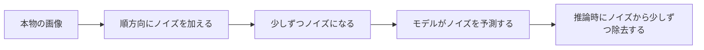

# 12.2.2 拡散モデルの原理


:::tip[この節の位置づけ]
生成モデルにはいろいろな道があります。

- GAN は一気に生成したい
- VAE は潜在空間の分布を学びたい

拡散モデルは、かなり特別な考え方を取ります。

> **まず本物のサンプルを少しずつ汚し、それから少しずつきれいに戻せるように学ぶ。**

この考え方は、その後の画像生成でとても重要な主軸になりました。
:::
## 学習目標

- 画像生成がなぜ難しい問題なのかを理解する
- 拡散モデルの「ノイズ付与」と「ノイズ除去」の2つの方向を理解する
- 最小限の順方向ノイズ付与の例を読めるようにする
- モデルが学習時に本当に何を学んでいるのかを理解する
- 拡散モデル全体の流れについて、安定した直感を身につける

## 歴史的背景：拡散モデルはどう主流になったのか？

拡散モデルが一晩で主流になったわけではありません。初心者にとって、まず知っておくべきなのはこの2つの節目です。

| 年 | 論文 | 主要著者 | 最も重要に解決したこと |
|---|---|---|---|
| 2020 | *Denoising Diffusion Probabilistic Models (DDPM)* | Ho ら | 拡散モデルを高品質で安定した生成手法にした |
| 2022 | *High-Resolution Image Synthesis with Latent Diffusion Models* | Rombach ら | 拡散をピクセル空間から潜在空間へ移し、コストを大きく下げて Stable Diffusion の主流になった |

初心者にとって、まず覚えておく価値があるのは次のことです。

> **拡散モデルが重要なのは、「画像がきれいだから」だけではなく、多くの GAN 系よりも安定していて制御しやすい生成の主軸を提供したからです。**

そして Latent Diffusion は、さらに次の問題を解決しました。

- 画像空間が大きすぎて、直接拡散するとコストが高すぎる

そのため、今日見かける多くの text-to-image システムは、基本的にこの歴史の流れの上にあります。

---

## まず地図を作ろう

もしあなたがすでに「画像生成は分類ではない」という前提を受け入れているなら、この節の自然な続きは次です。

- これまでに、システムが「入力を理解する」段階から「出力を構成する」段階へ移ってきたことを知った
- この節では、拡散モデルがなぜ画像生成で特に重要な主軸になったのかを説明する

つまり、この節で本当に大事なのは、たくさんの数式そのものではなく、まず次の流れを立てることです。

- 「ノイズを加える -> ノイズ除去を学ぶ -> ノイズからサンプルする」

拡散モデルを学ぶとき、初心者に最も合っている理解順序は「まず公式を暗記する」ことではなく、先に次をはっきり見ることです。



つまり、この節が本当に解決したいのは次のことです。

- なぜ拡散モデルはデータをまず「汚す」のか
- 学習時にモデルは何を学んでいるのか
- なぜ推論時はノイズから始めるのか

## なぜ画像生成はこんなに難しいのか？

### まず分類と生成の違いを見よう

分類では、あなたはこう問いかけます。

- この画像は猫ですか？

生成では、あなたはこう問いかけます。

- 猫っぽい画像を生成してください。

この2つのタスクは一見少し違うだけに見えますが、難しさはまったく同じレベルではありません。

### 本当の難しさはどこにあるのか？

理由は、画像空間があまりにも大きいからです。
適当にピクセルを並べると、ほとんどは「自然な画像」ではなく、ただのノイズに見えます。

つまり、生成モデルが本当に学ばなければならないのは次です。

> **ほぼ無限にあるピクセルの組み合わせの中から、「本物の画像らしい領域」にたどり着く方法。**

拡散モデルのすごいところは、一発でやろうとせず、この問題をもっと小さなノイズ除去のステップに分けたことです。

### 初めて拡散モデルを学ぶとき、何を先に押さえるべきか？

先に押さえるべきなのは数式ではなく、この一文です。

> **拡散モデルは、直接「どう描くか」を学ぶのではなく、「どうやってノイズを少しずつ構造に戻すか」を学んでいる。**

この感覚がしっかりすると、あとで出てくる次の話がずっと自然になります。

- 順方向過程
- 逆方向過程
- ノイズ予測
- サンプリング

---

## 拡散モデルの最も重要な直感

### 順方向過程：画像に少しずつノイズを加える

本物の画像があれば、そこにノイズを加え続けるだけでよいです。

- 最初はまだ構造が見える
- だんだんぼやける
- 最後はほぼ純粋なノイズになる

この過程はとても定義しやすいです。

### 逆方向過程：少しずつノイズを除去することを学ぶ

難しいのは逆方向です。

- ノイズのある画像が与えられる
- その中からノイズを少し取り除く方法を予測する必要がある

これを何回も繰り返すと、最後にはノイズから構造のある画像を復元できる可能性があります。

### 覚えやすい比喩

こう考えるとわかりやすいです。

- 順方向：きれいな写真に少しずつインクを塗っていく
- 逆方向：そのインクを少しずつ消していく方法を学ぶ

本当に難しいのは、汚すことではなく、元に戻すことです。

### なぜこの分け方は生成タスクに特に有効なのか？

もともと非常に難しい「一度で生成する」問題を、たくさんの小さな局所問題に分けられるからです。

- 今回のステップではどれだけノイズを消すべきか
- 今の画像にはどれくらい構造が残っているか

これが、拡散モデルが「より安定だが遅い」と言われる理由のひとつです。

---

## 最小の順方向ノイズ付与の実行例

まずは画像ではなく、1次元ベクトルで「少しずつノイズを加える」流れを見てみましょう。

```python
import numpy as np

np.random.seed(42)

x0 = np.array([1.0, 0.5, -0.5, -1.0], dtype=np.float32)
print("x0 =", x0)

x = x0.copy()
for step in range(1, 6):
    noise = np.random.randn(*x.shape).astype(np.float32) * 0.2
    x = 0.8 * x + noise
    print(f"step {step}: {np.round(x, 3)}")
```

期待される出力：

```text
x0 = [ 1.   0.5 -0.5 -1. ]
step 1: [ 0.899  0.372 -0.27  -0.495]
step 2: [ 0.673  0.251  0.099 -0.243]
step 3: [ 0.444  0.309 -0.013 -0.287]
step 4: [ 0.404 -0.135 -0.355 -0.342]
step 5: [ 0.12  -0.045 -0.466 -0.556]
```

実行したら、上から下へ各行を読んでください。値はいきなり完全なランダムノイズになるのではなく、元の信号が少しずつ弱まり、新しいノイズが混ざっていきます。これが順方向拡散の直感です。


:::tip[各行をプロセスとして読む]
出力を6つの無関係な配列として見ないでください。各行は前の signal にもう一度 controlled noise を混ぜた状態なので、1つの値より変化の流れが重要です。
:::
### このコードは何を教えているのか？

これは、次の2つのとても重要な事実を教えてくれます。

1. 各ステップで元の構造の一部は残る
2. 各ステップで新しいノイズの一部が混ざる

ステップ数が増えるほど、構造はだんだん見えにくくなります。

これが順方向拡散の直感的なイメージです。

---

## なぜ順方向は簡単で、逆方向は難しいのか？

### 順方向は自分で定義できるから

あなたは完全にわかっています。

- このステップでどれだけノイズを加えたか
- 元の信号がどれだけ減衰したか

つまり、順方向はほとんど「人間が制御できる」過程です。

### なぜ逆方向は難しいのか？

ノイズのあるサンプルだけを見ても、あなたにはわかりません。

- どの部分が元の構造なのか
- どの部分が後から混ざったノイズなのか

これは、汚れた紙を渡されても、元の絵が何だったのかわからないのと同じです。

だから、モデルが本当に学ぶべきことは次です。

> **ノイズのある状態から、ノイズ成分を予測する方法。**

---

## 学習時にモデルは何を学んでいるのか？

### とても重要な点

拡散モデルの学習では、普通はモデルに直接「絵を描け」と学ばせるのではなく、次のことを学ばせます。

> ノイズのあるサンプルが与えられたとき、その中のノイズを予測する。

### なぜこれは賢いのか？

学習時のノイズは自分で加えているので、教師信号が自然に得られるからです。

- 元のサンプルはわかっている
- ノイズもわかっている

そのため、問題はかなり明確な教師あり学習になります。

### これが拡散モデル理解の重要な転換点なのはなぜか？

初学者は最初、こう誤解しがちです。

- モデルは「画像全体の正しい姿」を直接学んでいる

しかし、より正確にはこう考えるのがよいです。

- 学習時のモデルは、条件付きのノイズ除去器を学んでいるようなもの

この見方が安定すると、Stable Diffusion、条件付き生成、画像編集の理解がかなり楽になります。

### 最小の「学習目標」のイメージ

```python
import numpy as np

x_clean = np.array([1.0, -0.5, 0.8], dtype=np.float32)
noise = np.array([0.2, -0.1, 0.3], dtype=np.float32)
x_noisy = 0.9 * x_clean + noise

print("clean =", x_clean)
print("noise =", noise)
print("noisy =", x_noisy)
```

期待される出力：

```text
clean = [ 1.  -0.5  0.8]
noise = [ 0.2 -0.1  0.3]
noisy = [ 1.1  -0.55  1.02]
```


学習時には `clean` も `noise` も既知です。ノイズ付きサンプルは自分で作っているからです。だから拡散モデルの学習は、「ノイズ付きサンプルから、加えたノイズを予測する」教師あり学習として組み立てられます。

もしモデルが `x_noisy` から `noise` を予測できるようになれば、
推論時に少しずつノイズを取り除けるようになります。

---

## サンプリング時に純粋なノイズから始めるのはなぜか？

### 推論時には元画像がないから

生成時には `x0` はありません。あるのはノイズだけです。

そのため、システムは普通、次のものから始めます。

- ランダムなノイズの塊

そして何度も次を繰り返します。

1. 今のノイズを予測する
2. 少しノイズを取り除く
3. もう少しきれいな状態を得る

### 一歩ずつのノイズ除去と一発生成の違い

GAN はどちらかというと、

- 一度で直接生成する

というイメージです。

一方、拡散モデルは、

- 少しずつ彫刻する

というイメージに近いです。

そのため、拡散モデルは「より安定だが遅い」と感じられやすいのです。

---

## なぜこの手法はあとで強くなったのか？

### 学習が安定しやすい

多くの GAN のような対抗学習の不安定さと比べると、拡散モデルの学習は比較的安定しやすいです。

### 条件付けが自然にできる

ノイズ除去の過程に条件情報を入れられるようになると、次のようなことができます。

- text-to-image
- 画像編集
- 局所修復

これが、拡散モデルが急速に強くなった大きな理由です。

### 初学者が最初に覚えるべきこと

まず覚えるべきなのは次の3つです。

1. 順方向過程は簡単に定義できる
2. 学習時のモデルは主に「ノイズ予測」を学ぶ
3. 推論時にはノイズを少しずつ消していく

### なぜこれが後の Stable Diffusion の主流につながるのか？

後の多くの具体的なシステムは構造がもっと複雑ですが、底にある直感は変わりません。

- まだノイズの過程がある
- まだノイズ除去ネットワークがある
- まだ条件付き生成をしている

だからこそ、この節では「拡散型生成」の骨組みをまず立てることが本当に重要です。

---

## 拡散モデルの代償は何か？

### サンプリングが遅い

一発で生成するのではなく、たくさんのステップでノイズを除去するからです。

### 計算コストが高い

特に高解像度画像では、コストがかなり大きくなります。

### そのため、後でみんなが取り組んだことは？

主に次の2つです。

- サンプリング効率を上げる
- 拡散操作の空間コストを下げる

ここから次の節につながります。

> Stable Diffusion は、なぜ拡散を latent space に置く必要があったのか。

---

## 残す証拠

このページを終えたら、この evidence card を残します。

```text
プロンプト記録：プロンプト、否定条件、参照、seed/model、バージョン番号
候補出力：生成結果またはシミュレーション結果と選択理由
技術メモ：diffusion step、latent、cross-attention、LoRA、またはアプリケーションモード
失敗確認: プロンプトのずれ、文体不一致、成果物、著作権、肖像、またはレビュー失敗
期待される成果: 選定した画像/版の記録と却下候補のメモ
```

## まとめ

この節で最も重要なのは、数式を暗記することではなく、この主線をつかむことです。

> **拡散モデルは、直接「描き方」を学ぶのではなく、「ノイズのあるサンプルを少しずつノイズ除去して、構造のある姿に戻す方法」を学ぶ。**

この直感がしっかりすれば、次に Stable Diffusion の構造を見るときも、ずっと自然に理解できます。

## この節で持ち帰るべきこと

- 拡散モデルは一度に生成するのではなく、少しずつノイズを除去していく
- その学習目標は、多くの人が思うよりも教師あり学習に近い
- これが、画像生成で主流の手法になった大きな理由である

---

## 練習

1. この節の例で使った減衰係数 `0.8` を変えて、構造が消える速さの変化を観察してみましょう。
2. 自分の言葉で説明してみましょう。なぜ拡散モデルの学習は「直接絵を描く」のではなく、「ノイズ除去を学ぶ」に近いのでしょうか？
3. 考えてみましょう。なぜ拡散モデルは、一発生成の方法より遅いことが多いのでしょうか？
4. 誰かに拡散モデルを説明するとしたら、「まず汚してからきれいにする」という比喩をどう使いますか？

<details>
<summary>参考実装と解説</summary>

1. 減衰係数が大きいほど構造は長く残り、小さいほど早く消えます。この実験から、denoising モデルが各ノイズ段階でどれだけ信号が残っているかを学ぶ必要があることが分かります。
2. 学習時のモデルは、多くの場合「ノイズ付きサンプル + ノイズ量または時刻条件」を受け取り、ノイズやきれいな方向を予測します。つまり、一度で絵を描くのではなく、修復の連続手順を学んでいます。
3. diffusion が遅くなりやすいのは、生成が反復的だからです。多くの denoising ステップでサンプルを更新します。一方、one-shot 型の方法は 1 回の forward pass で出力を作ろうとします。
4. たとえるなら、まず制御されたノイズで画像を汚した状態を見せ、その後で少しずつきれいにする方法を学ばせます。生成時はほぼノイズから始め、学んだ清掃ルールを何度も適用して、一貫した画像へ近づけます。

</details>
