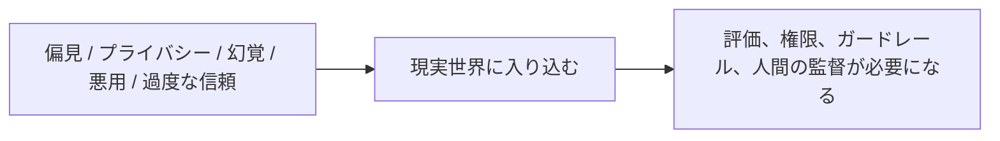

# 12.4.3 AI 倫理と安全


:::tip[画像の読み方]
倫理と安全は抽象的なスローガンではなく、データ、モデル、プロンプト、出力審査、人手による確認、異議申し立ての仕組みまで落とし込めるエンジニアリング上のガードレールです。図を見るときは、まずリスクがどのように発見、遮断、追跡されるかを見てください。
:::
:::tip[本節の位置づけ]
倫理と安全を扱うと、どうしても抽象的になりがちです。
この節では、「責任を持つべきだ」といった話で終わらせず、本当に次の点をはっきり理解できるようにします。

> **AIGC システムは、どこで人を傷つけ、誤解させ、あるいは制御不能になるのか。**

問題が見えて初めて、その後のエンジニアリング対策が地に足のついたものになります。
:::
## 学習目標

- AIGC システムでよくある倫理・安全リスクの種類を理解する
- リスクを偏見、プライバシー、虚偽コンテンツ、悪用などのカテゴリに分けて考えられるようにする
- なぜ「人間の監督」が多くの高リスク場面でなお重要なのかを理解する
- 「倫理の問題は必ずエンジニアリング対策まで落とし込む」という視点を身につける

---

## まずは地図を作ろう

AI の倫理と安全は、「リスクの種類 -> 現実の結果 -> エンジニアリング対策」という流れで理解するのが分かりやすいです。



この節で本当に解きたいのは、次の点です。

- なぜ倫理の問題は抽象的なスローガンではないのか
- なぜ最終的にはシステム設計に戻ってくるのか

---

## 一、なぜ AIGC の倫理と安全の問題は特に目立つのか？

AIGC が生成するのは、次のようなものだからです。

- テキスト
- 画像
- 音声
- 動画

これらはそのまま、次のような場所に入り込みやすいです。

- ユーザーの認識
- 世論の拡散
- 意思決定の流れ

つまり、内部で数値を計算しているだけではなく、現実世界に直接影響します。

そのため、リスクは単なる「問題に答え間違える」ことではなく、次のような形で現れることがあります。

- 誤った助言
- 誤解を招く情報
- ディープフェイク
- プライバシー漏えい

### 初心者向けの、より分かりやすい全体のたとえ

AIGC システムは、次のように考えると理解しやすいです。

- 大量のコンテンツを自動生成する機械

普通のソフトウェアは、内部ロジックを処理することが多いですが、
AIGC はもっと直接的に、次のようなものを作ります。

- 人が見る
- 人が信じる
- 人が共有する
- 人がそれをもとに判断するコンテンツ

だからこそ、倫理と安全のリスクが大きく見えやすいのです。

---

## 二、第一のリスク：偏見と不公平

### なぜ偏見が起こるのか？

モデルは、過去のデータからパターンを学習します。
そして、その過去のデータ自体に次のような偏りが含まれていることがあります。

- 性別による偏見
- 地域による偏見
- 職業に関する固定観念

### いちばん直感的な理解

訓練データの中で、ある集団とあるラベルが長い間ひも付けられていると、モデルはその偏りを学んでしまうことがあります。

つまり、

> モデルは自動的に人間より公平になるわけではなく、既存の偏りを引き継ぎ、場合によっては増幅してしまいます。

### 初学者がまず覚えておくとよいリスク表

| リスクの種類 | まず何を問うべきか |
|---|---|
| 偏見 | システムは、特定の集団に対して体系的に不公平になっていないか？ |
| プライバシー | 見せてはいけない情報、保持してはいけない情報、出力してはいけない情報を漏らしていないか？ |
| 幻覚 | 「分からない」を「とても確か」に見せかけていないか？ |
| 悪用 | 明らかに有害な目的に使われる可能性はないか？ |
| 過度な信頼 | ユーザーは、それが人間のように見えることで信じすぎていないか？ |

この表は初心者にとても役立ちます。なぜなら、「倫理と安全」を、具体的に確認できるいくつかの問いに戻せるからです。

### なぜこの問題は難しいのか？

多くの場合、これは「目立つエラー」として現れるのではなく、次のような形で起こります。

- 目立たないが続く
- 大量に出力される

そのため、評価と監視がとても重要になります。

---

## 三、第二のリスク：プライバシーと機密情報の漏えい

### なぜ AIGC はこの問題に特に触れやすいのか？

AIGC がよく扱うのは、次のような情報だからです。

- ユーザーがアップロードした内容
- 企業内部の文書
- 会話履歴

これらの中には、次のような情報が含まれている可能性があります。

- 個人情報
- 医療情報
- 企業秘密

### とても重要なエンジニアリング上の直感

プライバシーの問題は、「モデルが訓練データを覚えてしまうかどうか」だけではありません。次のような点も含まれます。

- 検索で権限外の情報に触れていないか
- ログに誤って保存していないか
- 出力で機微なフィールドを漏らしていないか

つまり、プライバシーの問題はしばしば、

> モデル + システム + プロセス の複合問題です。

---

## 四、第三のリスク：虚偽コンテンツと幻覚

### なぜ生成システムにはこのリスクがもともとあるのか？

モデルの目標は、通常、

- 真実だけを出力すること

ではなく、

- もっともらしい回答を生成すること

だからです。

このため、幻覚の問題が起こります。

### なぜ AIGC の場面ではより危険なのか？

生成されるものが次のような場合、誤りの影響が大きくなるからです。

- ニュース要約
- 医療アドバイス
- 法律の説明
- 合成動画

そのため、幻覚は「モデルの小さな不具合」ではなく、多くの場面で高リスクの問題です。

---

## 五、第四のリスク：悪用と悪意のある使用

### なぜこの問題はとても現実的なのか？

AIGC は正当な利用者を助ける一方で、次のような用途にも使われうるからです。

- 詐欺文面の大量生成
- ディープフェイク
- 自動化された攻撃スクリプト
- 虚偽の宣伝

### これは何を意味するのか？

安全の問題は、単に「モデル自身が暴走するかどうか」だけではありません。
次の問いも重要です。

> このシステムは、人によって何に使われるのか。

そのため、多くの場合、防御の重点は次のようなところに置かれます。

- 権限
- しきい値
- コンテンツ審査
- 出力制限

---

## 六、第五のリスク：過度な人間らしさの印象と誤った信頼

多くのユーザーは、次の特徴を見ただけで、ついそう思ってしまいます。

- 話せる
- 説明できる
- とても自信ありげに見える

それを次のように誤解してしまうのです。

- 本当に理解している
- 必ず信頼できる

これは、デジタルヒューマン、音声アシスタント、マルチモーダルシステムで特に起こりやすいです。

そのため、とても重要なのは「モデルが話せるか」だけではなく、

> ユーザーがそれを「人間らしい」と感じることで、誤った信頼を持ってしまわないか。

という点です。
これも倫理の観点で非常に大切なリスクです。

## 七、なぜ「人間の監督」が今でも重要なのか？

高リスクの場面では、最終判断を生成システムに完全に任せることはできないからです。

たとえば、次のような領域です。

- 医療
- 法律
- 金融
- 高リスクな企業プロセス

このとき、より安全な考え方はたいてい次のようになります。

- モデルがまず提案する
- 人間が最終確認する

したがって、とても実用的な判断基準は次の通りです。

> **高リスクの場面では、AIGC は完全な代替ではなく補助に向いている。**

### 初学者がまず覚えるとよい階層的な考え方

ガバナンスは、まず次の 3 層で考えると分かりやすいです。

1. まずリスクを分類する
2. 次にシステムのガードレールを作る
3. 最後に高リスク場面では人間の確認を残す

最初から「モデルを信じる」か「モデルには一切やらせない」かの二択にすると、
たいていは最適なエンジニアリング方針になりません。

---

## 八、とても実用的なリスクの分解例

```python
risk_map = {
    "bias": "固定観念や不公平な傾向を含む出力",
    "privacy": "機微情報の漏えい、または権限外アクセス",
    "hallucination": "本当ではないのにもっともらしく見える内容の生成",
    "misuse": "詐欺、偽造、攻撃などの悪意ある場面での利用",
    "overtrust": "ユーザーがシステムの能力を誤って信じること"
}

for k, v in risk_map.items():
    print(k, "->", v)
```

期待される出力：

```text
bias -> 固定観念や不公平な傾向を含む出力
privacy -> 機微情報の漏えい、または権限外アクセス
hallucination -> 本当ではないのにもっともらしく見える内容の生成
misuse -> 詐欺、偽造、攻撃などの悪意ある場面での利用
overtrust -> ユーザーがシステムの能力を誤って信じること
```

これはリスク台帳の最初の形として使えます。分類が見えてから、担当者、確認項目、緩和策を決めていきます。

この例は、リスクを解決するためのものではありません。
次のことを学ぶためのものです。

> リスクはまず、きちんと分類しなければいけない。そうして初めて、その後のエンジニアリング対策を考えられる。

---

## 九、本当に大事な点：倫理の問題はエンジニアリングの問題に落とし込むこと

倫理について話すとき、次のような言葉だけで終わると、どうしても空中戦になりがちです。

- 公平
- 責任
- 透明性

本当に価値があるのは、さらに次のように問い続けることです。

- このリスクはどのモジュールで起きるのか？
- 評価で抑えるのか、権限で抑えるのか、ログで追うのか、人手で確認するのか？

つまり、

> 倫理の問題は、最終的に実行可能なシステム設計に落とし込めて初めて意味を持ちます。

## これをプロジェクトやガバナンス文書にするなら、何を見せるべきか

見せる価値が高いのは、たいてい次のような点です。

- 「倫理を大事にしています」という宣言
ではなく、
1. どの種類のリスクを識別したか
2. それぞれにどんなエンジニアリング対策を取るか
3. どの場面で人間の確認を残したか
4. どの問題を継続的な評価と監視の対象にしたか

こうすると、相手には次のことが伝わりやすくなります。

- あなたが理解しているのは倫理ガバナンスの閉ループである
- 単なる価値観の表明ではない

---

## 残す証拠

このページを終えたら、この evidence card を残します。

```text
リスク範囲: フロンティア能力、倫理問題、規制、または製品ポリシーの境界
エンジニアリング規則：何を記録し、遮断し、レビューし、開示し、またはエスカレーションするか
テストケース：ルールを試す 1 つの現実的な入出力例
失敗確認: プライバシー、著作権、肖像、バイアス、安全性、出典、またはコンプライアンスの欠落
期待される成果: レビュー用チェックリストまたは製品要件をエンジニアリング上の行動に翻訳したもの
```

## まとめ

この節で本当に大切なのは、いくつかのリスク名を暗記することではなく、次の点を理解することです。

> **AIGC の倫理と安全の核心は、「モデルが間違うかどうか」だけではなく、「その間違いがシステムを通じて現実世界に入り、結果を生むかどうか」にある。**

リスクを「モデル + データ + システム + ユーザー」の複合問題として見られるようになると、ガバナンスもはじめて本当に実装できるようになります。

---

## 練習

1. ふだん知っている AIGC 製品を 1 つ選び、偏見、プライバシー、幻覚、悪用の中から 2 つのリスクを選んで分析してみましょう。
2. 「モデルが人間らしく見える」と、なぜユーザーの誤った信頼のリスクが高くなるのか考えてみましょう。
3. 自分の言葉で説明してみましょう。なぜ高リスクの場面では「モデルの補助 + 人間の確認」が向いているのでしょうか？
4. 1 つの倫理リスクを、「ログのマスキング」「権限管理」「人手による承認」のような具体的なエンジニアリング問題に言い換えてみましょう。

<details>
<summary>解法と解説</summary>

1. 有用な答えでは、各リスクを証拠と制御に変換します。たとえば顔編集アプリなら、肌の色ごとの bias test、アップロード、保存、削除に関する privacy control が必要になります。
2. 人間らしい出力は信頼を高めます。ユーザーが社会的な期待をシステムに当てはめるからです。モデルが実際以上に理解し、記憶し、検証していると思い込む可能性があります。
3. 高リスク場面では人間の確認が必要です。モデルは下書きや検出を支援できますが、責任、文脈判断、最終承認は責任ある人間が担うべきです。
4. 倫理リスクは、要件として書くと engineering work になります。log anonymization、role-based access control、同意記録、高リスク export の manual approval、安全でない prompt の block などです。

</details>
