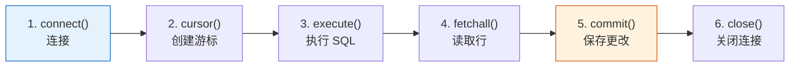

:::tip[本节定位]
很多学习者到这里会开始疑惑：

- 我已经会写 SQL 了
- 我也已经会写 Python 了

那为什么还要单独学习“Python 数据库操作”？

答案很简单：

> **这一节讲的是应用代码怎样真正和数据库协作。**

你不是在重学 SQL，而是在学习真实工具背后的工程闭环：

- 用 Python 连接数据库
- 安全发送 SQL
- 把行数据读回 Python
- 把筛选后的数据交给 Pandas 分析
- 必要时把清洗结果或汇总结果写回数据库
:::
## 学习目标

- 使用 Python 内置的 `sqlite3` 模块完成 CRUD 操作
- 使用参数化查询避免 SQL 注入
- 用 `read_sql_query` 把数据库结果读入 Pandas
- 用 `to_sql` 把 DataFrame 结果写回数据库
- 理解什么时候需要 SQLAlchemy

---

## 先建立一张地图

Python 数据库操作可以理解成一条流程：


在全栈或 AI 工程项目里，这就是应用从“我有一张表”走向“我能做功能、报表、看板或数据管道”的关键一步。


### 先把这些缩写看懂

| 术语 | 英文全称 | 实用理解 |
|---|---|---|
| `DB` | Database | 长期存放结构化数据的地方 |
| `SQL` | Structured Query Language | 用来向表格提问的语言 |
| `CRUD` | Create, Read, Update, Delete | 大多数应用都会用到的增、查、改、删 |
| `SQLite` | SQLite database engine | 存在单个文件里的轻量数据库，适合学习、原型和本地工具 |
| `ORM` | Object-Relational Mapping | 用 Python 对象操作数据库记录，减少手写 SQL 的方式 |
| `SQL injection` | SQL injection attack | 不安全输入改变 SQL 语义造成的安全问题 |

现在先抓住一条安全主线：Python 连接数据库，发送参数化 SQL，接收行数据，再把有用的子集交给 Pandas。

## sqlite3 标准库

Python 自带 `sqlite3` 模块，不需要额外安装。

### 一个更贴近工作的类比

想象一个客户支持工具：

- 数据库存放工单、客户、优先级和状态
- Python 是创建、更新、查询这些记录的应用逻辑
- Pandas 是汇总未解决工单、响应时间或工作量的分析层

这一节真正的价值在于：代码和数据库终于可以作为一个系统协作。

### 基本工作流程



### 完整示例

这个例子使用一个小型客户支持工单表。它更接近后台管理、数据看板、内部工具和 AI 客服辅助系统里会遇到的数据库流程。

```python
import sqlite3

# ========== 连接 ==========
# 连接到文件数据库。文件不存在时会自动创建。
conn = sqlite3.connect("example.db")

# 也可以使用内存数据库做快速测试。
# conn = sqlite3.connect(":memory:")

cursor = conn.cursor()

# ========== 创建表 ==========
cursor.execute("""
    CREATE TABLE IF NOT EXISTS tickets (
        id INTEGER PRIMARY KEY AUTOINCREMENT,
        customer TEXT NOT NULL,
        issue_type TEXT NOT NULL,
        status TEXT NOT NULL,
        priority TEXT NOT NULL,
        first_reply_minutes INTEGER CHECK(first_reply_minutes >= 0)
    )
""")

# ========== 插入数据 ==========
# 方式 1：用于固定演示数据的直接插入
cursor.execute("""
    INSERT INTO tickets (customer, issue_type, status, priority, first_reply_minutes)
    VALUES ('Acme Co', 'login', 'open', 'high', 18)
""")

# 方式 2：参数化插入（推荐）
cursor.execute(
    """
    INSERT INTO tickets (customer, issue_type, status, priority, first_reply_minutes)
    VALUES (?, ?, ?, ?, ?)
    """,
    ("Northwind", "billing", "pending", "medium", 42)
)

# 方式 3：批量插入
tickets = [
    ("Globex", "api", "open", "high", 64),
    ("Initech", "billing", "closed", "low", 35),
    ("Umbrella", "login", "open", "medium", 27),
    ("Hooli", "api", "pending", "high", 51),
]
cursor.executemany(
    """
    INSERT INTO tickets (customer, issue_type, status, priority, first_reply_minutes)
    VALUES (?, ?, ?, ?, ?)
    """,
    tickets
)

conn.commit()

# ========== 查询数据 ==========
cursor.execute("SELECT * FROM tickets")
all_rows = cursor.fetchall()
print("所有工单：", all_rows)

cursor.execute("SELECT * FROM tickets WHERE customer = 'Acme Co'")
one_row = cursor.fetchone()
print("Acme Co：", one_row)

cursor.execute("""
    SELECT customer, issue_type, first_reply_minutes
    FROM tickets
    WHERE status != 'closed'
    ORDER BY first_reply_minutes DESC
""")
slow_open_tickets = cursor.fetchmany(3)
print("响应较慢的未关闭工单：", slow_open_tickets)

# ========== 获取列名 ==========
cursor.execute("SELECT * FROM tickets")
col_names = [desc[0] for desc in cursor.description]
print("列名：", col_names)
# ['id', 'customer', 'issue_type', 'status', 'priority', 'first_reply_minutes']

conn.close()
```

### 最值得先记住什么？

先记住顺序：

1. 连接数据库
2. 创建游标
3. 执行 SQL
4. 取回结果
5. 修改数据时提交更改

不用一开始记住所有方法，先掌握这条闭环。

---

## 参数化查询：防止 SQL 注入

:::danger[什么是 SQL 注入？]
SQL 注入是一类安全漏洞：不安全的用户输入改变了 SQL 语句原本的含义。
:::
### 错误写法（危险）

```python
# 不要用这种方式拼接 SQL 字符串。
user_input = "Acme Co"
sql = f"SELECT * FROM tickets WHERE customer = '{user_input}'"
cursor.execute(sql)

# 如果输入是：  ' OR '1'='1
# SQL 会变成：SELECT * FROM tickets WHERE customer = '' OR '1'='1'
# 这可能返回所有行。
```

### 正确写法（安全）

```python
# 使用 ? 占位符。
user_input = "Acme Co"
cursor.execute("SELECT * FROM tickets WHERE customer = ?", (user_input,))

# 多个参数。
cursor.execute(
    "SELECT * FROM tickets WHERE status = ? AND priority = ?",
    ("open", "high")
)
```

:::tip[一句话记住]
**值用占位符传入，不要用 f-string 或字符串拼接把外部输入塞进 SQL。**
:::
### 一个很适合初学者的判断

如果你正在写：

- `f"SELECT ... {user_input} ..."`

请停一下，把它改成参数化查询。

---

## 使用 with 语句管理连接

`with` 语句能让连接管理更安全。代码块成功结束时会提交；如果出现异常，SQLite 会回滚事务。

```python
import sqlite3

with sqlite3.connect("example.db") as conn:
    cursor = conn.cursor()

    cursor.execute("SELECT * FROM tickets WHERE status = ?", ("open",))
    results = cursor.fetchall()

    for row in results:
        print(row)
```

---

## Row 工厂：像字典一样访问结果

默认情况下，查询结果是元组，需要用 `row[0]` 这样的索引访问。`sqlite3.Row` 可以让你按列名访问。

```python
import sqlite3

conn = sqlite3.connect("example.db")
conn.row_factory = sqlite3.Row

cursor = conn.cursor()
cursor.execute("SELECT * FROM tickets WHERE customer = ?", ("Acme Co",))
row = cursor.fetchone()

print(row["customer"])  # Acme Co
print(row["status"])    # open
print(dict(row))

conn.close()
```

当查询结果有很多列时，这种写法尤其有用，因为你的代码不需要依赖列的位置。

---

## Pandas + 数据库：很强的组合

Pandas 可以直接读写数据库。真实工作里常见流程是：

1. 先用 SQL 筛出正确的行
2. 再用 Pandas 做分析、报表或可视化

### 从数据库读取到 DataFrame

```python
import pandas as pd
import sqlite3

conn = sqlite3.connect("example.db")

# 方式 1：read_sql_query（优先推荐）
df = pd.read_sql_query("SELECT * FROM tickets", conn)
print(df)
#    id   customer issue_type   status priority  first_reply_minutes
# 0   1    Acme Co      login     open     high                   18
# 1   2  Northwind    billing  pending   medium                   42
# 2   3     Globex        api     open     high                   64
# ...

# 方式 2：带条件查询
df_open = pd.read_sql_query(
    """
    SELECT customer, issue_type, priority, first_reply_minutes
    FROM tickets
    WHERE status = ?
    ORDER BY first_reply_minutes DESC
    """,
    conn,
    params=("open",)
)
print(df_open)

conn.close()
```

:::tip[为什么这里不直接用 `read_sql_table()`？]
`pd.read_sql_query()` 可以直接配普通 `sqlite3` 连接使用，是初学者最稳的第一选择。`pd.read_sql_table()` 需要 SQLAlchemy engine。
:::
### DataFrame 写入数据库

```python
import pandas as pd
import sqlite3

df_new = pd.DataFrame({
    "customer": ["Stark Industries", "Wayne Labs", "Wonka Factory"],
    "issue_type": ["api", "login", "billing"],
    "status": ["open", "pending", "closed"],
    "priority": ["high", "medium", "low"],
    "first_reply_minutes": [22, 40, 31],
})

conn = sqlite3.connect("example.db")

df_new.to_sql(
    "new_tickets",
    conn,
    if_exists="replace",
    index=False
)

df_check = pd.read_sql_query("SELECT * FROM new_tickets", conn)
print(df_check)

conn.close()
```

### 实际工作流：数据库 -> Pandas -> 分析

```python
import pandas as pd
import sqlite3

conn = sqlite3.connect("example.db")

# 1. 先用 SQL 做初步筛选。
df = pd.read_sql_query("""
    SELECT customer, issue_type, status, priority, first_reply_minutes
    FROM tickets
    WHERE status != 'closed'
    ORDER BY first_reply_minutes DESC
""", conn)

# 2. 再用 Pandas 做分析。
print("按状态和优先级统计未关闭工作量：")
print(df.groupby(["status", "priority"]).size())

print("\n首次响应时间分布：")
print(df["first_reply_minutes"].describe())

conn.close()
```

:::tip[最佳实践]
- **大表过滤**：先用 SQL 的 `WHERE` 减少传输的数据量
- **分析**：SQL 筛选后，用 Pandas 做分组、图表和报告
- **写回**：用 `to_sql()` 保存干净的数据抽取或汇总表
:::
## 一个可以直接照抄的数据库协作顺序

第一次让 Python 和数据库协作时，可以按这个顺序：

1. 连接数据库
2. 执行最简单的查询
3. 把查询改成参数化查询
4. 把结果读进 Pandas
5. 把一个小的结果表写回数据库

### 实用选择表

| 你想做什么 | 更稳的第一选择 |
|---|---|
| 筛选大表 | SQL |
| 分析、分组或绘图 | Pandas |
| 保存清洗结果或报告表 | `to_sql()` |

---

## SQLAlchemy 简介

SQLAlchemy 是很流行的 Python 数据库工具库。它支持多种数据库，也为 Web 应用提供 ORM 能力。

```python
# 安装
# python -m pip install --upgrade sqlalchemy

from sqlalchemy import create_engine
import pandas as pd

engine = create_engine("sqlite:///example.db")

# SQLite:  sqlite:///文件路径
# MySQL:   mysql+pymysql://用户:密码@主机:端口/数据库
# PostgreSQL: postgresql://用户:密码@主机:端口/数据库

df = pd.read_sql("SELECT * FROM tickets", engine)
print(df)

df.to_sql("tickets_backup", engine, if_exists="replace", index=False)
```

:::note[什么时候用 SQLAlchemy？]
- 只用 SQLite 时，`sqlite3` 就够了
- 需要连接 MySQL 或 PostgreSQL 时，用 SQLAlchemy
- 做 Web 应用时，SQLAlchemy 的 ORM 能力会很有用
:::
## 留下的证据

学完这一页，至少保留这张证据卡：

```text
schema: tickets 表、主键、字段和约束
query: 使用过的参数化 SQL 或 Python 数据库代码
output: 返回行、行数、保存的数据抽取，或汇总表
failure_check: 不安全查询、缺少 commit、过滤条件错误，或 schema 不匹配
expected_output: 查询、结果表和一条数据质量说明
```

## 这节最该带走什么

- Python 数据库操作是应用代码、持久化数据和分析之间的桥梁
- 只要出现外部输入，就优先使用参数化查询
- 一个可靠流程是：先用 SQL 筛选，再用 Pandas 分析，最后只把真正需要的结果写回

---

## 完整实战：客户支持工单日志

```python
import sqlite3
import pandas as pd


class TicketDB:
    """一个小型客户支持工单数据库。"""

    def __init__(self, db_path="tickets.db"):
        self.conn = sqlite3.connect(db_path)
        self.conn.row_factory = sqlite3.Row
        self._create_table()

    def _create_table(self):
        self.conn.execute("""
            CREATE TABLE IF NOT EXISTS tickets (
                id INTEGER PRIMARY KEY AUTOINCREMENT,
                customer TEXT NOT NULL,
                issue_type TEXT NOT NULL,
                status TEXT NOT NULL,
                priority TEXT NOT NULL,
                first_reply_minutes INTEGER CHECK(first_reply_minutes >= 0)
            )
        """)
        self.conn.commit()

    def add_ticket(self, customer, issue_type, status, priority, first_reply_minutes):
        """添加一条支持工单。"""
        self.conn.execute(
            """
            INSERT INTO tickets (customer, issue_type, status, priority, first_reply_minutes)
            VALUES (?, ?, ?, ?, ?)
            """,
            (customer, issue_type, status, priority, first_reply_minutes)
        )
        self.conn.commit()

    def query_by_status(self, status):
        """返回指定状态的工单。"""
        cursor = self.conn.execute(
            "SELECT * FROM tickets WHERE status = ? ORDER BY priority",
            (status,)
        )
        return [dict(row) for row in cursor.fetchall()]

    def mark_closed(self, ticket_id):
        """按 id 关闭一条工单。"""
        self.conn.execute(
            "UPDATE tickets SET status = ? WHERE id = ?",
            ("closed", ticket_id)
        )
        self.conn.commit()

    def priority_summary(self):
        """按优先级汇总工作量。"""
        return pd.read_sql_query("""
            SELECT priority AS Priority,
                   COUNT(*) AS Ticket_Count,
                   ROUND(AVG(first_reply_minutes), 1) AS Avg_First_Reply_Minutes
            FROM tickets
            GROUP BY priority
            ORDER BY Ticket_Count DESC
        """, self.conn)

    def close(self):
        self.conn.close()


db = TicketDB(":memory:")

for ticket in [
    ("Acme Co", "login", "open", "high", 18),
    ("Northwind", "billing", "pending", "medium", 42),
    ("Globex", "api", "open", "high", 64),
    ("Initech", "billing", "closed", "low", 35),
    ("Umbrella", "login", "open", "medium", 27),
    ("Hooli", "api", "pending", "high", 51),
]:
    db.add_ticket(*ticket)

print("\n未解决工单：")
print(db.query_by_status("open"))

print("\n优先级汇总：")
print(db.priority_summary())

db.mark_closed(1)
print("\n关闭 1 号工单后的未解决工单：")
print(db.query_by_status("open"))

db.close()
```

---

## 小结

| 方法 | 适用场景 | 特点 |
|------|---------|------|
| `sqlite3` | SQLite 数据库 | Python 自带，零依赖 |
| `pd.read_sql_query()` | SQL -> DataFrame | 分析方便 |
| `df.to_sql()` | DataFrame -> 数据库 | 把 DataFrame 写入表 |
| `SQLAlchemy` | 多种数据库和 Web 应用 | 更通用，支持 engine 和 ORM |

**核心原则：**

- 值用占位符传入，不要把外部输入拼进 SQL
- 用 `with` 或明确的 `commit()` / `close()` 管理连接
- 先用 SQL 筛选，再用 Pandas 分析筛出的数据

---

## 动手练习

### 练习 1：工单 CRUD

```python
# 创建一个 SQLite 数据库。
# 创建 tickets 表，字段包括 customer、issue_type、status、priority、first_reply_minutes。
# 插入 5 条工单。
# 查询 open 且 high priority 的工单。
# 把某条工单状态更新为 closed。
# 删除一条 cancelled 或 duplicate 的测试工单。
```

### 练习 2：Pandas 协作

```python
# 1. 用 pd.read_sql_query 把 open 工单读入 DataFrame。
# 2. 用 Pandas 计算不同 status 和 priority 下的工单数量。
# 3. 按 priority 计算平均 first_reply_minutes。
# 4. 用 to_sql 把汇总结果写回 ticket_summary 表。
```

### 练习 3：扩展类

```python
# 扩展上面的 TicketDB 示例：
# - 增加 assign_ticket(ticket_id, assignee) 方法
# - 增加 add_message(ticket_id, author, body) 方法
# - 查询分配给某个人的 open 工单
# - 导出一个小型看板汇总表
```

<details>
<summary>参考实现与讲解</summary>

代码类练习的参考答案应展示可运行模式，而不只是给一个最终数字。

```python
import sqlite3
import pandas as pd

with sqlite3.connect(":memory:") as conn:
    conn.execute("""
        CREATE TABLE tickets (
            id INTEGER PRIMARY KEY AUTOINCREMENT,
            customer TEXT NOT NULL,
            issue_type TEXT NOT NULL,
            status TEXT NOT NULL,
            priority TEXT NOT NULL,
            first_reply_minutes INTEGER CHECK(first_reply_minutes >= 0)
        )
    """)

    conn.executemany(
        """
        INSERT INTO tickets (customer, issue_type, status, priority, first_reply_minutes)
        VALUES (?, ?, ?, ?, ?)
        """,
        [
            ("Acme Co", "login", "open", "high", 18),
            ("Northwind", "billing", "pending", "medium", 42),
            ("Globex", "api", "open", "high", 64),
            ("Initech", "billing", "cancelled", "low", 35),
            ("Umbrella", "login", "open", "medium", 27),
        ]
    )

    rows = conn.execute(
        "SELECT * FROM tickets WHERE status = ? AND priority = ?",
        ("open", "high")
    ).fetchall()
    print(rows)

    conn.execute("UPDATE tickets SET status = ? WHERE customer = ?", ("closed", "Acme Co"))
    conn.execute("DELETE FROM tickets WHERE status = ?", ("cancelled",))

    df = pd.read_sql_query("SELECT * FROM tickets WHERE status != ?", conn, params=("closed",))
    summary = (
        df.groupby(["status", "priority"])
        .agg(
            ticket_count=("id", "count"),
            avg_first_reply_minutes=("first_reply_minutes", "mean"),
        )
        .reset_index()
    )
    summary.to_sql("ticket_summary", conn, if_exists="replace", index=False)

    print(pd.read_sql_query("SELECT * FROM ticket_summary", conn))
```

讲解：

- CRUD 部分要通过 `UPDATE` 和 `DELETE` 前后的查询证明状态确实变化。
- 所有外部值都通过 `?` 占位符传入。
- SQL 先把行数缩小到有用范围，然后 Pandas 再做统计。
- 更好的类封装会把连接设置、建表、插入/更新方法、报告方法分开。

</details>
