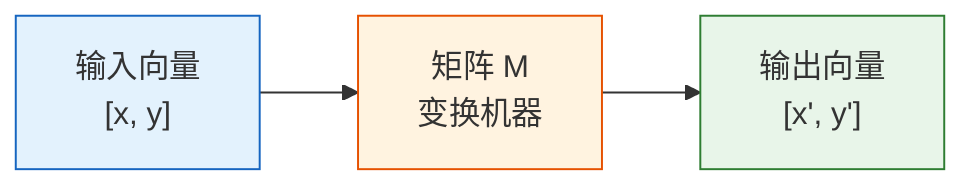
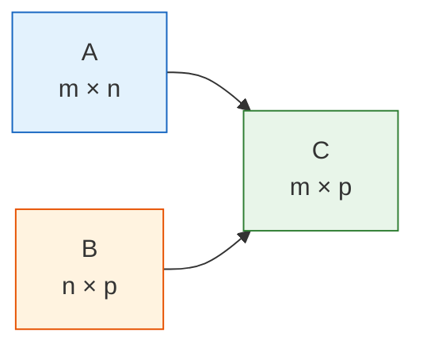
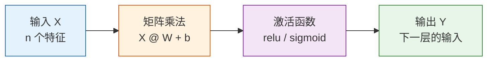

## 学习目标

- 直觉理解矩阵是什么（一张表格 / 一批操作）
- 掌握矩阵乘法的含义和计算
- 理解转置、逆矩阵的直觉
- 理解为什么神经网络的每一层都是矩阵乘法
- 用 NumPy 实现矩阵运算

## 先说一个很重要的学习预期

这一节不是要把矩阵论学完，而是先把最常在 AI 里见到的三层感觉稳住：

- 矩阵可以装一批数据
- 矩阵也可以表示一种批量变换
- 矩阵乘法会在后面模型里反复出现

---

## 先建立一张地图

矩阵这节如果只把它看成“数字表格”，很容易越学越抽象。更适合新人的看法是：


所以这节最重要的不是死背矩阵定义，而是弄明白：

- 为什么一批数据会自然写成矩阵
- 为什么矩阵乘法能一次处理一批样本
- 为什么深度学习代码里到处是 `X @ W`

## 随手查的术语和代码前提

| 术语 | 含义 | 为什么这里重要 |
|---|---|---|
| `batch` | 批量，一组一起处理的样本 | 矩阵常常存一批数据：行是样本，列是特征。 |
| `feature` | 特征，例如面积、年龄、距离等输入列 | 矩阵的列通常对应不同特征。 |
| `shape` | NumPy 对数组大小的描述 | 矩阵乘法只有内部维度匹配时才能运行。 |
| `bias` / `b` | 偏置，乘法后再加上的可学习偏移量 | `X @ W + b` 让模型不只是旋转或缩放，还能平移输出。 |
| `ReLU` | Rectified Linear Unit，修正线性单元激活函数 | 它把负数变成 `0`、正数保持不变，为网络加入非线性。 |
| `determinant` | 行列式，用来判断方阵是否把空间压扁 | 如果它等于 `0`，矩阵就没有逆。 |
| `singular matrix` | 奇异矩阵，也就是没有逆的矩阵 | 它在变换时丢失信息，因此无法还原原输入。 |

除非代码片段特别说明，否则默认需要先写 `import numpy as np`。画图示例还需要 `import matplotlib.pyplot as plt`。

## 一、矩阵是什么？

### 两种理解方式

**理解一：矩阵就是一张表格**

### 一个更适合新人的类比

如果向量像“一张对象的信息卡片”，
那矩阵就可以先理解成：

- 一摞排整齐的信息卡片

这就是为什么在机器学习里：

- 一条样本是向量
- 一批样本就很自然地变成矩阵

你已经很熟悉了——Pandas 的 DataFrame 本质上就是一个矩阵。

```python
import numpy as np

# 3 个学生的 4 门成绩
scores = np.array([
    [85, 92, 78, 90],   # 学生 1
    [72, 88, 95, 85],   # 学生 2
    [90, 76, 88, 92],   # 学生 3
])
print(f"形状: {scores.shape}")  # (3, 4) → 3 行 4 列
```

**理解二：矩阵是一种"变换机器"**

给矩阵一个向量，它会输出一个新的向量——就像一个函数，输入 → 变换 → 输出。



这就是线性代数最核心的思想：**矩阵 = 变换**。

### 矩阵的基本属性

```python
M = np.array([
    [1, 2, 3],
    [4, 5, 6],
])

print(f"形状 (shape): {M.shape}")      # (2, 3) → 2 行 3 列
print(f"行数: {M.shape[0]}")           # 2
print(f"列数: {M.shape[1]}")           # 3
print(f"元素总数: {M.size}")            # 6
print(f"数据类型: {M.dtype}")           # int64
print(f"第 0 行: {M[0]}")              # [1 2 3]
print(f"第 1 行第 2 列: {M[1, 2]}")    # 6
```

### 从“一个样本”到“一批样本”

如果你已经学过向量，可以把矩阵理解成：

> **把很多个向量按统一格式堆起来。**

```python
import numpy as np

# [面积, 房龄, 距离地铁距离]
house_1 = np.array([88, 5, 1.2])
house_2 = np.array([120, 8, 0.5])
house_3 = np.array([75, 2, 1.8])

X = np.array([
    house_1,
    house_2,
    house_3,
])

print(X)
print("形状:", X.shape)  # (3, 3)
```

这里的含义是：

- 每一行是一个样本
- 每一列是一个特征

这正是机器学习和深度学习里最常见的数据组织方式。

---

## 二、矩阵的基本运算

### 矩阵加法和数乘

和向量一样——**对应位置相加/乘**：

```python
A = np.array([[1, 2], [3, 4]])
B = np.array([[5, 6], [7, 8]])

print("加法:\n", A + B)     # [[6, 8], [10, 12]]
print("数乘:\n", 3 * A)     # [[3, 6], [9, 12]]
```

### 矩阵乘法——最重要的运算

矩阵乘法和普通数字乘法**完全不同**！规则是：

**结果的每个元素 = 左矩阵某行 与 右矩阵某列 的点积**

```python
A = np.array([[1, 2],
              [3, 4]])   # 2×2

B = np.array([[5, 6],
              [7, 8]])   # 2×2

# 矩阵乘法
C = A @ B    # 推荐写法
# C = np.dot(A, B)  # 等价写法

print("A @ B =")
print(C)
# [[19, 22],     ← 1*5+2*7=19, 1*6+2*8=22
#  [43, 50]]     ← 3*5+4*7=43, 3*6+4*8=50
```

**手算验证**：
- C[0,0] = 1×5 + 2×7 = 5 + 14 = 19
- C[0,1] = 1×6 + 2×8 = 6 + 16 = 22
- C[1,0] = 3×5 + 4×7 = 15 + 28 = 43
- C[1,1] = 3×6 + 4×8 = 18 + 32 = 50

### 矩阵乘法的尺寸规则




**关键规则：左矩阵的列数 = 右矩阵的行数**，结果的形状 = (左矩阵的行数, 右矩阵的列数)。

```python
A = np.array([[1, 2, 3],
              [4, 5, 6]])   # 2×3

B = np.array([[1, 2],
              [3, 4],
              [5, 6]])       # 3×2

C = A @ B                    # 2×2 ✓（3 == 3）
print(f"A({A.shape}) @ B({B.shape}) = C({C.shape})")
print(C)
# [[22, 28],
#  [49, 64]]
```

:::caution[矩阵乘法不满足交换律]
`A @ B` 和 `B @ A` 通常**不相等**！甚至形状可能都不同。这和数字乘法（3×5 = 5×3）不一样，初学时要特别注意。
:::
```python
A = np.array([[1, 2], [3, 4]])
B = np.array([[5, 6], [7, 8]])

print("A @ B =\n", A @ B)
print("B @ A =\n", B @ A)
print("A@B == B@A?", np.array_equal(A @ B, B @ A))  # False
```

### 手算一次“样本矩阵 × 权重矩阵”

这是新人最值得吃透的一步，因为它直接连接后面的神经网络。

```python
X = np.array([
    [1, 2],
    [3, 4],
    [5, 6],
])  # 3×2

W = np.array([
    [0.1, 1.0],
    [0.2, 0.5],
])  # 2×2

Z = X @ W
print(Z.round(2))
```

预期输出：

```text
[[0.5 2. ]
 [1.1 5. ]
 [1.7 8. ]]
```

你可以把它逐行理解成：

- 第 1 行输出 = 第 1 个样本 `[1, 2]` 和权重矩阵做变换
- 第 2 行输出 = 第 2 个样本 `[3, 4]` 和权重矩阵做变换
- 第 3 行输出 = 第 3 个样本 `[5, 6]` 和权重矩阵做变换

矩阵乘法的强大之处就在于：

> **它不是只算一个样本，而是一次把一批样本全算了。**

### 新人最需要的 shape 检查四步

当你写矩阵乘法总报错时，先不要慌，先检查这四件事：

1. 左边矩阵的形状是什么
2. 右边矩阵的形状是什么
3. 左边的列数是否等于右边的行数
4. 你期望的输出形状是什么

```python
print("X.shape =", X.shape)
print("W.shape =", W.shape)
print("Z.shape =", (X @ W).shape)
```

---

## 三、矩阵作为"变换"——直觉可视化

### 旋转变换

矩阵可以对向量做**旋转、缩放、剪切**等变换。下面演示用矩阵旋转一组二维点。

```python
import matplotlib.pyplot as plt
plt.rcParams['font.sans-serif'] = ['Arial Unicode MS']
plt.rcParams['axes.unicode_minus'] = False

# 定义一个正方形的 4 个顶点 + 回到起点
square = np.array([
    [0, 0],
    [1, 0],
    [1, 1],
    [0, 1],
    [0, 0],  # 回到起点，方便画闭合图形
]).T  # 转置成 2×5，方便做矩阵乘法

# 45° 旋转矩阵
theta = np.radians(45)  # 角度转弧度
R = np.array([
    [np.cos(theta), -np.sin(theta)],
    [np.sin(theta),  np.cos(theta)]
])
print(f"旋转矩阵:\n{R.round(3)}")

# 应用旋转
rotated = R @ square  # 矩阵乘法！

fig, axes = plt.subplots(1, 2, figsize=(12, 5))

# 变换前
axes[0].plot(square[0], square[1], 'b-o', linewidth=2, markersize=8)
axes[0].fill(square[0], square[1], alpha=0.2, color='steelblue')
axes[0].set_xlim(-1.5, 1.5)
axes[0].set_ylim(-0.5, 1.8)
axes[0].set_aspect('equal')
axes[0].grid(True, alpha=0.3)
axes[0].set_title('变换前（原始正方形）')

# 变换后
axes[1].plot(square[0], square[1], 'b--', alpha=0.3, linewidth=1)
axes[1].plot(rotated[0], rotated[1], 'r-o', linewidth=2, markersize=8)
axes[1].fill(rotated[0], rotated[1], alpha=0.2, color='coral')
axes[1].set_xlim(-1.5, 1.5)
axes[1].set_ylim(-0.5, 1.8)
axes[1].set_aspect('equal')
axes[1].grid(True, alpha=0.3)
axes[1].set_title('变换后（旋转 45°）')

plt.suptitle('矩阵变换 = 旋转', fontsize=14)
plt.tight_layout()
plt.show()
```

**关键洞察**：一个 2×2 矩阵乘以一个 2D 向量，就完成了一次空间变换。这个思想可以推广到任意维度。

### 多种变换效果

```python
fig, axes = plt.subplots(1, 4, figsize=(18, 4))

# 原始形状
triangle = np.array([
    [0, 0], [1, 0], [0.5, 1], [0, 0]
]).T

transforms = [
    (np.eye(2), '原始（单位矩阵）'),
    (np.array([[2, 0], [0, 2]]), '缩放 2 倍'),
    (np.array([[1, 0.5], [0, 1]]), '水平剪切'),
    (np.array([[-1, 0], [0, 1]]), '水平翻转'),
]

for ax, (M, title) in zip(axes, transforms):
    transformed = M @ triangle
    ax.plot(triangle[0], triangle[1], 'b--', alpha=0.3)
    ax.fill(triangle[0], triangle[1], alpha=0.1, color='blue')
    ax.plot(transformed[0], transformed[1], 'r-o', linewidth=2, markersize=6)
    ax.fill(transformed[0], transformed[1], alpha=0.2, color='coral')
    ax.set_xlim(-2.5, 2.5)
    ax.set_ylim(-0.5, 2.5)
    ax.set_aspect('equal')
    ax.grid(True, alpha=0.3)
    ax.set_title(title)

plt.tight_layout()
plt.show()
```

---

## 四、转置和逆矩阵

### 转置（Transpose）

**转置 = 行列互换**。原来的第 i 行变成第 i 列。

```python
A = np.array([
    [1, 2, 3],
    [4, 5, 6],
])
print(f"A 的形状: {A.shape}")      # (2, 3)
print(f"A 的转置:\n{A.T}")
print(f"转置后形状: {A.T.shape}")   # (3, 2)
```

输出：
```
A 的转置:
[[1 4]
 [2 5]
 [3 6]]
```

**什么时候用转置？**
- 数据处理：把"行是样本、列是特征"转换成"行是特征、列是样本"
- 矩阵运算：某些公式需要转置来让矩阵尺寸匹配

### 特殊矩阵

```python
# 单位矩阵（对角线全是 1）
I = np.eye(3)
print("单位矩阵:\n", I)
# [[1. 0. 0.]
#  [0. 1. 0.]
#  [0. 0. 1.]]

# 单位矩阵的性质：A @ I = I @ A = A
A = np.array([[1, 2], [3, 4]])
print("A @ I == A?", np.allclose(A @ np.eye(2), A))  # True
```

:::tip[单位矩阵就像数字 1]
数字运算中，任何数乘以 1 还是它本身。矩阵运算中，任何矩阵乘以单位矩阵也是它本身。
:::
### 逆矩阵（Inverse）

如果说矩阵 A 是一种"变换"，那逆矩阵 A⁻¹ 就是**"反变换"**——撤销 A 的操作。

```python
A = np.array([[2, 1],
              [1, 1]])

# 计算逆矩阵
A_inv = np.linalg.inv(A)
print("A 的逆矩阵:\n", A_inv)

# 验证：A @ A_inv = 单位矩阵
print("A @ A_inv =\n", (A @ A_inv).round(10))
# [[1. 0.]
#  [0. 1.]]  → 单位矩阵！
```

**直觉**：如果 A 把向量旋转了 45°，那 A⁻¹ 就把它转回来。如果 A 把向量放大了 2 倍，那 A⁻¹ 就缩小 2 倍。

```python
# 可视化：变换 → 逆变换 = 回到原点
v = np.array([1, 2])

transformed = A @ v           # 用 A 变换
recovered = A_inv @ transformed  # 用 A_inv 还原

print(f"原始: {v}")
print(f"变换后: {transformed}")
print(f"还原后: {recovered}")   # 和原始一样！
```

:::caution[不是所有矩阵都有逆]
如果矩阵的行列式（determinant）为 0，就没有逆矩阵。
```python
# 这个矩阵没有逆
singular = np.array([[1, 2], [2, 4]])
try:
    np.linalg.inv(singular)
except np.linalg.LinAlgError as e:
    print(f"错误: {e}")  # Singular matrix
```
直觉：这种矩阵会把二维空间"压扁"成一条线，信息丢失了，无法还原。
:::
---

## 五、矩阵与神经网络

### 神经网络的本质

这是整节课最重要的洞察：**神经网络的每一层，本质上就是一次矩阵乘法 + 一个激活函数。**



### 从单个神经元公式到矩阵公式

如果你只看单个样本，神经网络一层其实就是：

`输出 = 输入向量 · 权重向量 + 偏置`

```python
import numpy as np

x = np.array([1.0, 0.5, -0.3])
w = np.array([0.2, -0.4, 0.6])
b = 0.1

y = x @ w + b
print(round(y, 4))
```

预期输出：

```text
-0.08
```

如果我们不只算 1 个样本，而是一次算一批样本，就会自然变成：

`Z = X @ W + b`

这里：

- `X` 是样本矩阵
- `W` 是权重矩阵
- `b` 是偏置
- `Z` 是线性输出

### 用代码模拟一层神经网络

```python
# 模拟一层神经网络的前向传播

# 输入：3 个样本，每个有 4 个特征
X = np.array([
    [1.0, 0.5, -0.3, 0.8],
    [0.2, -0.1, 0.7, 0.3],
    [0.9, 0.4, 0.1, -0.5],
])
print(f"输入 X: {X.shape}")  # (3, 4)

# 权重矩阵：从 4 个特征映射到 2 个输出
rng = np.random.default_rng(seed=42)
W = rng.normal(size=(4, 2)) * 0.5
print(f"权重 W: {W.shape}")  # (4, 2)

# 偏置
b = np.zeros(2)

# 前向传播：矩阵乘法 + 偏置
Z = X @ W + b               # (3, 4) @ (4, 2) = (3, 2)
print(f"线性输出 Z: {Z.shape}")

# 激活函数（ReLU：负数变 0，正数不变）
def relu(x):
    return np.maximum(0, x)

output = relu(Z)
print(f"激活后输出: {output.shape}")  # (3, 2)
print(f"\n最终输出:\n{output.round(3)}")
```

使用 `seed=42` 时的预期输出：

```text
输入 X: (3, 4)
权重 W: (4, 2)
线性输出 Z: (3, 2)
激活后输出: (3, 2)

最终输出:
[[0.684 0.   ]
 [0.    0.   ]
 [0.158 0.   ]]
```

**解读**：
- 3 个样本（3 行），每个有 4 个特征（4 列）
- 权重矩阵 W 是 4×2，把 4 维特征映射到 2 维
- 矩阵乘法一次处理所有样本——这就是**批量计算**的威力
- 偏置 `b` 的形状是 `(2,)`。NumPy 会自动把它加到 `Z` 的每一行上，这叫广播（broadcasting）。

### 多层网络 = 矩阵连乘

```python
# 模拟 3 层神经网络
rng = np.random.default_rng(seed=42)

X = rng.normal(size=(5, 10))  # 5 个样本，10 个特征

# 第 1 层：10 → 8
W1 = rng.normal(size=(10, 8)) * 0.3
h1 = relu(X @ W1)
print(f"第 1 层输出: {h1.shape}")  # (5, 8)

# 第 2 层：8 → 4
W2 = rng.normal(size=(8, 4)) * 0.3
h2 = relu(h1 @ W2)
print(f"第 2 层输出: {h2.shape}")  # (5, 4)

# 第 3 层（输出层）：4 → 2
W3 = rng.normal(size=(4, 2)) * 0.3
output = h2 @ W3  # 输出层通常不用 ReLU
print(f"最终输出:   {output.shape}")  # (5, 2)
```

### 新人最容易犯的 3 个矩阵错误

1. 把逐元素乘法 `A * B` 误写成矩阵乘法
   真正的矩阵乘法要用 `A @ B`。

2. 不先看形状就开始乘
   只要 `shape` 不对，后面一定会报错。

3. 看不懂“每一行代表什么”
   只要记住“每一行常常是一条样本”，你会容易很多。

:::note[为什么不能只用矩阵乘法？]
如果没有激活函数（relu），多层矩阵乘法可以合并成一次：
- `(X @ W1) @ W2 = X @ (W1 @ W2)`
- 多层和单层没有区别！

激活函数引入了**非线性**，让网络能学习复杂的模式。这就是为什么每层都要"矩阵乘法 + 激活函数"。
:::
---

## 六、实用场景：解线性方程组

矩阵的一个经典应用是求解线性方程组。

```
2x + y = 5
x + 3y = 7
```

写成矩阵形式：A @ x = b

```python
# 系数矩阵
A = np.array([[2, 1],
              [1, 3]])
# 右边的常数
b = np.array([5, 7])

# 解方程
x = np.linalg.solve(A, b)
print(f"解: x = {x[0]:.2f}, y = {x[1]:.2f}")
# 解: x = 1.60, y = 1.80

# 验证
print(f"验证: A @ x = {A @ x}")  # [5. 7.] ✓
```

---

## 七、NumPy 矩阵操作汇总

```python
import numpy as np

# ========== 创建矩阵 ==========
A = np.array([[1, 2], [3, 4]])
B = np.array([[5, 6], [7, 8]])
I = np.eye(2)                          # 单位矩阵
Z = np.zeros((3, 4))                   # 全零矩阵
rng = np.random.default_rng(seed=42)
R = rng.normal(size=(3, 4))            # 随机矩阵

# ========== 基本运算 ==========
print("加法:\n", A + B)
print("数乘:\n", 2 * A)
print("逐元素乘:\n", A * B)            # 注意：这不是矩阵乘法！

# ========== 矩阵乘法 ==========
print("矩阵乘法:\n", A @ B)            # 推荐
print("矩阵乘法:\n", np.dot(A, B))     # 等价
print("矩阵乘法:\n", np.matmul(A, B))  # 等价

# ========== 转置 ==========
print("转置:\n", A.T)

# ========== 逆矩阵 ==========
print("逆矩阵:\n", np.linalg.inv(A))

# ========== 行列式 ==========
print("行列式:", np.linalg.det(A))      # -2.0

# ========== 解方程 ==========
b = np.array([1, 2])
x = np.linalg.solve(A, b)
print("方程解:", x)
```

---

## 学到这里，下一节该带着什么问题走？

看完矩阵以后，最值得带去下一节的问题是：

1. 矩阵让大多数向量怎样变化？
2. 有没有某些特别的方向，在变换后依然保持原方向？
3. 为什么这些“特殊方向”会直接连到 PCA 和降维？

这几个问题，正好会把你自然带到：

- [4.1.4 特征值与特征向量](/zh-cn/ch04-ai-math/ch01-linear-algebra/03-eigenvalues/)

:::note[连接后续]
- **下一节**：特征值与特征向量——矩阵变换中"不改变方向"的特殊向量
- **神经网络**：每一层都是矩阵乘法 + 激活函数
- **图像处理**：卷积操作的底层也是矩阵运算
:::
---

## 留下的证据

学完这一页，至少保留这张证据卡：

```text
数学对象：向量、矩阵、特征值、基或向量空间概念
数值示例：用于计算它的简单数字或 NumPy 片段
可视化或输出：形状、变换后的点、相似度分数、特征方向或投影
AI 关联：这里出现在 embeddings、批次、PCA、神经层或注意力中
期望产出：计算过程，以及一句把它和 AI 操作联系起来的话
```

## 小结

| 概念 | 直觉理解 | NumPy 实现 |
|------|---------|-----------|
| 矩阵 | 一张表格 / 一种变换 | `np.array([[1,2],[3,4]])` |
| 矩阵乘法 | 行与列的点积组合 | `A @ B` |
| 转置 | 行列互换 | `A.T` |
| 单位矩阵 | "什么都不做"的变换 | `np.eye(n)` |
| 逆矩阵 | 撤销变换 | `np.linalg.inv(A)` |
| 解方程 | Ax = b → x = ? | `np.linalg.solve(A, b)` |

## 这节最该带走什么

- 矩阵一方面在装“一批数据”，另一方面也在表示“一次变换”
- 矩阵乘法最值得先理解成“批量点积”
- 这就是为什么后面 AI 代码里到处会看到 `X @ W`

## 动手练习

### 练习 1：矩阵乘法手算验证

给定：
```python
A = np.array([[1, 0, 2],
              [0, 3, 1]])    # 2×3

B = np.array([[2, 1],
              [0, 4],
              [3, 2]])        # 3×2
```

1. 先手算 A @ B 的结果
2. 再用 NumPy 验证

### 练习 2：旋转变换

用旋转矩阵把一个三角形旋转 90°，并画出变换前后的对比图。

提示：90° 旋转矩阵为 `[[0, -1], [1, 0]]`

### 练习 3：模拟两层神经网络

创建一个两层网络，输入 100 个样本（每个 5 个特征），第一层输出 3 个值，第二层输出 1 个值。打印每层的输入输出形状。


<details>
<summary>参考实现与讲解</summary>

- 给定矩阵手算结果应为 `A @ B = [[8, 5], [3, 14]]`；NumPy 验证应完全一致。
- 90 度旋转矩阵 `[[0,-1],[1,0]]` 会把 `(x,y)` 映射成 `(-y,x)`。三角形应保持大小和形状，只是逆时针旋转。
- 两层网络的 shape 应类似 `(100,5) @ (5,3) -> (100,3)`，再 `(100,3) @ (3,1) -> (100,1)`。shape 证据是这题最好的安全检查。

</details>
