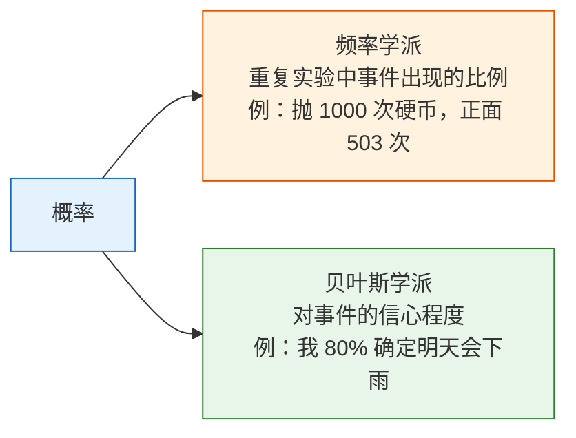
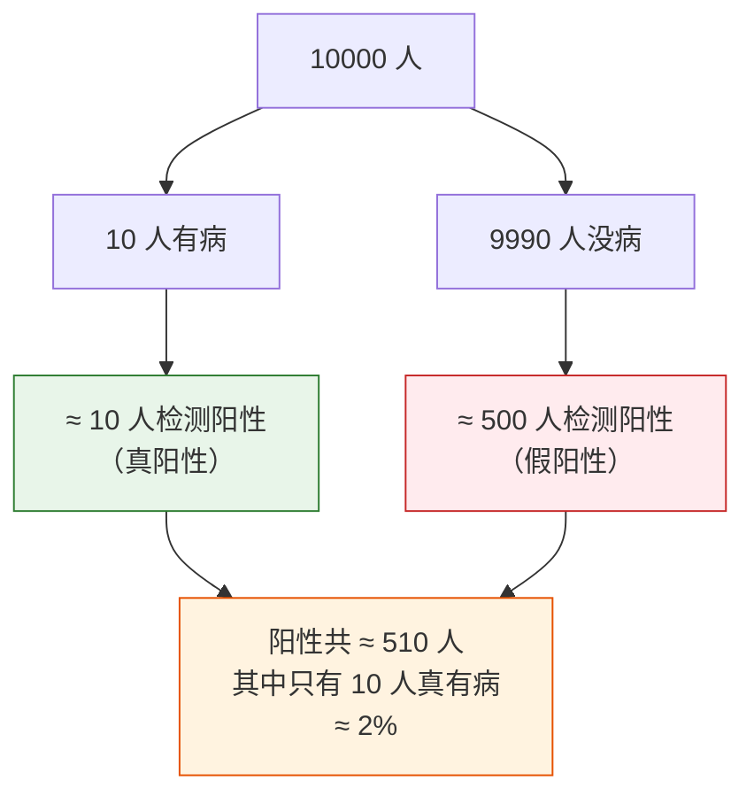
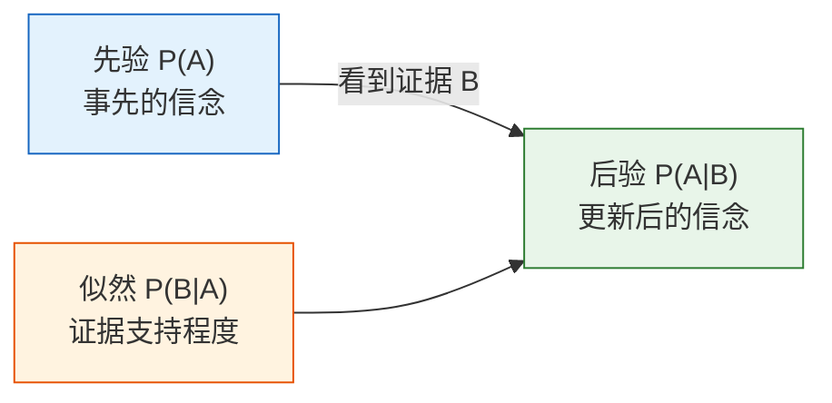

:::tip[为什么学概率？]
AI 本质上就是在"不确定性"中做决策。模型输出的不是"这张图一定是猫"，而是"这张图有 95% 的概率是猫"。概率论就是处理不确定性的数学工具。
:::
## 学习目标

- 理解概率的两种理解方式（频率 vs 信念）
- 掌握条件概率和联合概率
- 用经典案例理解贝叶斯定理
- 用 Python 模拟验证概率公式

## 先把公式里的术语看懂

概率符号真正吓人的地方，往往不是计算，而是不知道每个符号在说什么：

| 术语 | 含义 | 本节里先怎么读 |
|---|---|---|
| `P(A)` | 事件 A 的概率 | 在没有额外信息时，A 有多可能发生？ |
| `P(A\|B)` | 条件概率 | 已知 B 后，A 有多可能发生？ |
| `P(A 且 B)` | 联合概率 | A 和 B 同时发生的可能性有多大？ |
| `prior` | 先验概率 | 看到新证据之前，我们原来的判断 |
| `likelihood` | 似然 | 如果某个假设是真的，看到这个证据有多合理？ |
| `posterior` | 后验概率 | 结合先验和证据之后，更新后的判断 |
| `normalization` | 归一化 | 让概率结果加起来仍然等于 1 的分母 |
| `Monte Carlo` | 随机抽样模拟 | 用大量随机试验检查公式是否符合直觉 |

本节代码主要依赖 **NumPy**。画图示例还会用到 **Matplotlib**。为了让新人更容易直接运行，下面的联合概率表示例只用 NumPy，不额外引入 `pandas` 依赖。

## 历史背景：贝叶斯法则从哪里来？

这一节最值得知道的历史节点是：

| 年份 | 节点 | 它最重要地解决了什么 |
|---|---|---|
| 1763 | Bayes' Theorem（后由 Price 整理发表） | 奠定了“有了新证据以后，怎样更新判断”这条概率推断主线 |

对新人来说，最值得先记的不是原始论文细节，而是：

> **贝叶斯法则最大的价值，不是一个公式本身，而是它把“先验判断 + 新证据 = 更新后的判断”这件事说清楚了。**

这也是为什么后面机器学习里：

- 垃圾邮件判断
- 医疗检测
- 朴素贝叶斯

都会反复回到这条更新逻辑上。

### 为什么贝叶斯会一直让很多初学者觉得“很有意思”？

因为它不像很多公式那样只是在算数，
它更像是在回答一个很像现实生活的问题：

- 我原来怎么判断
- 新证据来了以后，我该不该改主意

这件事特别容易让人产生代入感。
比如医学检测、垃圾邮件判断、风控、推荐系统，
本质上都不是“绝对知道答案”，而是在做：

- 一边看证据
- 一边更新把握

所以贝叶斯法则之所以一直被人记住，
往往不是因为它“优雅”，
而是因为它特别像真实世界里人做判断的方式。

### 这件事为什么会让后人一直记住？

因为它第一次非常清楚地告诉人们：

- 推理不是“有了结论就结束”
- 推理其实可以随着证据不断更新

这听起来今天很自然，但在历史上它很重要。
你可以把贝叶斯法则想成一句特别朴素、但影响很深的话：

> **我原来怎么想不重要，重要的是拿到新证据后，我愿不愿意更新判断。**

这也是为什么它不只是一条数学公式，
而更像一整种看待不确定世界的方式。

## 先说一个很重要的学习预期

这一节不会把概率论所有内容都讲完。
它更现实的目标是：

- 先让你知道“概率不是玄学，而是在描述不确定”
- 先让你知道“有了新信息以后，判断会更新”
- 先让你知道“模型输出概率”背后到底在说什么

所以你这一节最重要的目标，不是把每个公式背到滚瓜烂熟，
而是先把：

- 事件
- 条件
- 更新

这三件事看顺。

---

## 先建立一张地图

这一节最好先把它放回整章里理解：


这节真正要学的，不只是几个公式，而是：

- 世界里很多判断都不是 0 或 1
- 有了新证据后，我们的判断会更新
- 这正是 AI 模型输出概率时的基本思路

## 一、概率是什么？

### 两种理解方式



在 AI 中，两种理解都用到：
- **训练模型**时：用频率学派的方法（大量数据统计规律）
- **模型推断**时：用贝叶斯的方法（根据观测更新信念）

### 一个更适合新人的类比

可以先把概率想成两种不同语境下的“把握程度”：

- 频率学派：像反复做实验后的统计结论
- 贝叶斯学派：像拿到证据后对一件事的主观把握更新

### 用 Python 体验"频率即概率"

```python
import numpy as np
import matplotlib.pyplot as plt

plt.rcParams['font.sans-serif'] = ['Arial Unicode MS']
plt.rcParams['axes.unicode_minus'] = False

# 模拟抛硬币
rng = np.random.default_rng(seed=42)
n_flips = 10000
results = rng.choice(['正面', '反面'], size=n_flips)

# 随着抛的次数增加，正面比例趋近 0.5
cumulative_ratio = np.cumsum(results == '正面') / np.arange(1, n_flips + 1)

plt.figure(figsize=(10, 5))
plt.plot(cumulative_ratio, color='steelblue', linewidth=1)
plt.axhline(y=0.5, color='red', linestyle='--', label='理论概率 0.5')
plt.xlabel('抛掷次数')
plt.ylabel('正面出现的比例')
plt.title('大数定律：抛的次数越多，比例越接近真实概率')
plt.legend()
plt.xscale('log')
plt.grid(True, alpha=0.3)
plt.show()
```

可以额外打印一个检查值：

```python
print(f"抛 {n_flips} 次后，正面最终比例: {cumulative_ratio[-1]:.4f}")
```

使用 `seed=42` 时，示例输出：

```text
抛 10000 次后，正面最终比例: 0.5061
```

**大数定律**：实验次数越多，频率越接近真实概率。这就是为什么深度学习需要"大数据"。

---

## 二、条件概率——"在已知某些信息时"

### 直觉理解

**条件概率 P(A|B)** = 在已知 B 发生的前提下，A 发生的概率。

### 为什么条件概率这么像 AI 的思考方式？

因为现实里的判断几乎总是在“有上下文”的情况下发生。

也就是说，条件概率最重要的不是符号，而是这句话：

> **一旦知道了更多信息，原来的判断就应该更新。**

:::tip[生活例子]
- P(迟到 | 堵车) = 在堵车的情况下迟到的概率（远高于平时）
- P(及格 | 认真复习) = 认真复习了及格的概率（也远高于平时）
- P(是垃圾邮件 | 包含"免费") = 包含"免费"这个词的邮件是垃圾邮件的概率
:::
### 公式与计算

**P(A|B) = P(A 且 B) / P(B)**

用一个直观的例子：

```python
# 一个班 100 个学生
# 60 人喜欢数学，50 人喜欢编程，30 人两者都喜欢

n_total = 100
n_math = 60
n_code = 50
n_both = 30

# P(喜欢编程 | 喜欢数学) = P(两者都喜欢) / P(喜欢数学)
p_code_given_math = n_both / n_math
print(f"喜欢数学的人中，也喜欢编程的比例: {p_code_given_math:.1%}")  # 50%

# P(喜欢数学 | 喜欢编程)
p_math_given_code = n_both / n_code
print(f"喜欢编程的人中，也喜欢数学的比例: {p_math_given_code:.1%}")  # 60%
```

预期输出：

```text
喜欢数学的人中，也喜欢编程的比例: 50.0%
喜欢编程的人中，也喜欢数学的比例: 60.0%
```

**注意**：P(A|B) 和 P(B|A) 通常不相等！

### 这是新人最容易踩的坑之一

很多人第一次学到这里，会下意识把：

- “在喜欢数学的人里，有多少人喜欢编程”

和

- “在喜欢编程的人里，有多少人喜欢数学”

混成一件事。
但它们问的分母不一样，所以本质上就是两个不同问题。

### 联合概率与边缘概率

```python
# 用 NumPy 模拟数据
rng = np.random.default_rng(seed=42)
n = 10000

# 天气：晴(0.7) / 雨(0.3)
weather = rng.choice(['晴', '雨'], n, p=[0.7, 0.3])

# 带伞概率取决于天气
umbrella = np.where(
    weather == '雨',
    rng.choice(['带', '不带'], n, p=[0.8, 0.2]),  # 下雨时 80% 会带伞
    rng.choice(['带', '不带'], n, p=[0.1, 0.9])   # 晴天时 10% 会带伞
)

# 不额外依赖 pandas，用 NumPy 直接计算联合概率表
weather_labels = ['晴', '雨']
umbrella_labels = ['带', '不带']
joint = np.array([
    [((weather == w) & (umbrella == u)).mean() for u in umbrella_labels]
    for w in weather_labels
])

print("联合概率表：")
print("        带     不带")
for label, row in zip(weather_labels, joint):
    print(f"{label:>4}   {row[0]:.3f}   {row[1]:.3f}")
print(f"\n边缘概率 P(雨): {(weather == '雨').mean():.3f}")
print(f"边缘概率 P(带伞): {(umbrella == '带').mean():.3f}")
```

使用 `seed=42` 时，预期输出：

```text
联合概率表：
        带     不带
   晴   0.068   0.637
   雨   0.235   0.059

边缘概率 P(雨): 0.294
边缘概率 P(带伞): 0.304
```

| | 带伞 | 不带 | 合计（边缘概率） |
|---|------|------|---------|
| 晴 | 0.07 | 0.63 | 0.70 |
| 雨 | 0.24 | 0.06 | 0.30 |
| 合计 | 0.31 | 0.69 | 1.00 |

因为这是模拟结果，所以会和理论表有一点点差异。样本越多，结果会越接近理论值。

---

## 三、贝叶斯定理——AI 最重要的概率公式

### 引入：医院检查的故事

一种罕见疾病的发病率是 0.1%（1000 人中 1 人有病）。医院有一个检测方法：
- 如果你有病，检测出阳性的概率是 99%（灵敏度）
- 如果你没病，检测出阳性的概率是 5%（假阳率）

**问题：如果你检测出了阳性，你真正有病的概率是多少？**

很多人直觉会说"99%"——但答案会让你大吃一惊。

### 贝叶斯公式

**P(有病 | 阳性) = P(阳性 | 有病) × P(有病) / P(阳性)**

```python
# 已知条件
p_disease = 0.001       # 先验概率：发病率 0.1%
p_positive_if_disease = 0.99    # 有病 → 阳性的概率
p_positive_if_healthy = 0.05    # 没病 → 阳性的概率（假阳率）

# P(阳性) = P(阳性|有病)×P(有病) + P(阳性|没病)×P(没病)
p_positive = (p_positive_if_disease * p_disease +
              p_positive_if_healthy * (1 - p_disease))
print(f"P(阳性): {p_positive:.4f}")

# 贝叶斯公式
p_disease_if_positive = (p_positive_if_disease * p_disease) / p_positive
print(f"P(有病|阳性): {p_disease_if_positive:.4f}")  # ≈ 0.0194
print(f"约等于 {p_disease_if_positive:.1%}")           # ≈ 1.9%
```

预期输出：

```text
P(阳性): 0.0509
P(有病|阳性): 0.0194
约等于 1.9%
```

**结果：只有约 2%！** 即使检测阳性，你有病的概率也只有 2%。

### 为什么这么低？

因为发病率太低了（0.1%），绝大多数阳性结果其实是假阳性。

```python
# 用 10000 人模拟
n_people = 10000
n_sick = int(n_people * p_disease)        # 10 人有病
n_healthy = n_people - n_sick             # 9990 人没病

true_positive = n_sick * p_positive_if_disease    # 有病且检测阳性: ≈ 10
false_positive = n_healthy * p_positive_if_healthy # 没病但检测阳性: ≈ 500

total_positive = true_positive + false_positive

print(f"10000 人中：")
print(f"  有病的人: {n_sick}")
print(f"  检测阳性的人: {total_positive:.0f}")
print(f"    其中真阳性: {true_positive:.0f}")
print(f"    其中假阳性: {false_positive:.0f}")
print(f"  阳性中真有病的比例: {true_positive/total_positive:.1%}")
```

预期输出：

```text
10000 人中：
  有病的人: 10
  检测阳性的人: 509
    其中真阳性: 10
    其中假阳性: 500
  阳性中真有病的比例: 1.9%
```



### 贝叶斯定理的核心思想



**后验 = 先验 × 似然 / 归一化因子**

这就是贝叶斯的核心：**不断用新证据更新你的信念**。

### 用模拟验证贝叶斯定理

```python
# 蒙特卡洛模拟
rng = np.random.default_rng(seed=42)
n_sim = 1_000_000

# 1. 每个人是否有病
has_disease = rng.random(n_sim) < p_disease

# 2. 每个人的检测结果
test_positive = np.where(
    has_disease,
    rng.random(n_sim) < p_positive_if_disease,  # 有病
    rng.random(n_sim) < p_positive_if_healthy    # 没病
)

# 3. 在检测阳性的人中，有病的比例
positive_people = test_positive.sum()
positive_and_sick = (test_positive & has_disease).sum()

simulated_probability = positive_and_sick / positive_people
print(f"模拟结果 P(有病|阳性): {simulated_probability:.4f}")
print(f"公式计算: {p_disease_if_positive:.4f}")
print(f"两者差距: {abs(simulated_probability - p_disease_if_positive):.6f}")
```

使用 `seed=42` 时，预期输出：

```text
模拟结果 P(有病|阳性): 0.0194
公式计算: 0.0194
两者差距: 0.000012
```

模拟不是用来替代公式的，而是一个学习工具：它能让你看到，大量随机试验后的结果确实会贴近公式。

---

## 四、贝叶斯定理在 AI 中的应用

### 朴素贝叶斯分类器

垃圾邮件过滤就是贝叶斯定理的经典应用：

```python
# 简化的垃圾邮件分类
# P(垃圾邮件 | 包含"免费") = P(包含"免费"|垃圾邮件) × P(垃圾邮件) / P(包含"免费")

p_spam = 0.3                      # 30% 的邮件是垃圾邮件
p_free_given_spam = 0.8           # 垃圾邮件中 80% 包含"免费"
p_free_given_ham = 0.05           # 正常邮件中 5% 包含"免费"

# P(包含"免费")
p_free = p_free_given_spam * p_spam + p_free_given_ham * (1 - p_spam)

# 贝叶斯
p_spam_given_free = p_free_given_spam * p_spam / p_free
print(f"包含'免费'的邮件是垃圾邮件的概率: {p_spam_given_free:.1%}")
# ≈ 87.3%
```

预期输出：

```text
包含'免费'的邮件是垃圾邮件的概率: 87.3%
```

### 更多 AI 应用

| 应用 | 先验 | 似然 | 后验 |
|------|------|------|------|
| 垃圾邮件过滤 | 邮件是垃圾邮件的概率 | 垃圾邮件包含某词的概率 | 给定词后是垃圾邮件的概率 |
| 医学诊断 | 疾病的发病率 | 有病时检测阳性的概率 | 阳性后真有病的概率 |
| 推荐系统 | 用户喜欢某类型的概率 | 喜欢该类型的人看某电影的概率 | 用户会看这部电影的概率 |
| 语言模型 | 某个词出现的概率 | 前文给定后该词出现的概率 | 最可能的下一个词 |

---

## 五、独立性——简化计算的利器

### 什么是独立？

两个事件**独立**，意味着一个事件的发生不影响另一个事件的概率。

**P(A 且 B) = P(A) × P(B)**  （仅当 A、B 独立时）

```python
# 抛两次硬币——两次是独立的
p_head = 0.5

# 两次都是正面
p_both_heads = p_head * p_head
print(f"两次都正面: {p_both_heads}")  # 0.25

# 模拟验证
rng = np.random.default_rng(seed=42)
n = 100000
coin1 = rng.random(n) < 0.5
coin2 = rng.random(n) < 0.5
both = (coin1 & coin2).mean()
print(f"模拟结果: {both:.4f}")  # ≈ 0.25
```

预期输出：

```text
两次都正面: 0.25
模拟结果: 0.2512
```

### AI 中的独立性假设

朴素贝叶斯之所以叫"朴素"，就是因为它**假设所有特征独立**（虽然实际中往往不独立，但效果依然不错）。

这个假设在自然语言里并不严格成立，比如“免费”和“中奖”经常一起出现。但这个假设能让计算大幅简化，而且作为一个 **baseline（基线模型）** 经常足够有用。基线模型就是一个简单的第一版模型，用来判断更复杂方法到底有没有真的变好。

```python
# 朴素贝叶斯：假设各个词独立出现
# P(垃圾|"免费","中奖","点击") ∝ P(垃圾) × P("免费"|垃圾) × P("中奖"|垃圾) × P("点击"|垃圾)

p_spam = 0.3
words = {
    "免费": (0.8, 0.05),    # (P(词|垃圾), P(词|正常))
    "中奖": (0.6, 0.01),
    "点击": (0.7, 0.1),
}

# 计算分子
score_spam = p_spam
score_ham = 1 - p_spam

for word, (p_word_spam, p_word_ham) in words.items():
    score_spam *= p_word_spam
    score_ham *= p_word_ham

# 归一化
p_spam_given_words = score_spam / (score_spam + score_ham)
print(f"邮件包含 '免费'+'中奖'+'点击' 是垃圾邮件的概率: {p_spam_given_words:.1%}")
```

预期输出：

```text
邮件包含 '免费'+'中奖'+'点击' 是垃圾邮件的概率: 100.0%
```

这个结果接近 100%，是因为示例概率被故意设得比较夸张，方便教学。真实系统通常需要做平滑、用验证集评估，并避免把某一次概率输出当成绝对结论。

---

## 学到这里，下一节该带着什么问题走？

看完概率基础以后，最值得带去下一节的问题是：

1. 如果一次事件可以用概率描述，那很多次随机结果整体会长什么样？
2. 为什么有些现象总像钟形曲线，有些现象却更像计数分布？
3. 模型里的噪声、初始化和误差，为什么总爱和某些分布绑在一起？

这三个问题，正好会把你自然带到：

- [4.2.3 概率分布：数据背后的规律](/zh-cn/ch04-ai-math/ch02-probability/02-distributions/)

:::note[连接后续]
- **下一节**：概率分布——数据背后的规律
- **5 机器学习入门到实战**：朴素贝叶斯分类器直接基于贝叶斯定理
- **5 机器学习入门到实战**：逻辑回归的输出就是条件概率 P(y=1|x)
- **7 大模型原理、Prompt 与微调**：大语言模型生成下一个 token 的概率分布
:::
---

## 留下的证据

学完这一页，至少保留这张证据卡：

```text
随机过程：事件、分布、样本、似然、熵，或 Bayes 更新
模拟或公式：用来让不确定性可见的代码或公式
输出：概率、样本统计量、区间、熵，或更新后的信念
失败检查：基率混淆、p 值误用、样本偏差或把概率和确定性混为一谈
期望产出：数值结果加通俗解释
```

## 小结

| 概念 | 直觉 | 公式/代码 |
|------|------|----------|
| 概率 | 不确定性的度量（0~1） | `rng.random() < p` |
| 条件概率 | 已知 B 发生时 A 的概率 | P(A\|B) = P(A且B) / P(B) |
| 联合概率 | A 和 B 同时发生的概率 | NumPy 布尔掩码，例如 `(A & B).mean()` |
| 贝叶斯定理 | 用证据更新信念 | 后验 = 先验 × 似然 / 归一化 |
| 独立性 | 互不影响 | P(A且B) = P(A) × P(B) |

## 这节最该带走什么

- 概率是在描述不确定，不是在假装绝对确定
- 条件概率最重要的直觉是“信息一变，判断就该变”
- 贝叶斯最值得先记的是“先验 + 证据 -> 更新后的判断”
- 这就是为什么 AI 里的很多输出天然是概率，而不是绝对结论

## 动手练习

### 练习 1：条件概率

一副 52 张扑克牌，随机抽一张：
1. P(红心) = ?
2. P(红心 | 红色) = ?（已知是红色牌）
3. P(A | 红心) = ?（已知是红心）

用 Python 模拟 100000 次验证。

参考实现：

```python
rng = np.random.default_rng(seed=42)
n_trials = 100000

suits = np.array(['红心', '方块', '梅花', '黑桃'])
ranks = np.array(['A', '2', '3', '4', '5', '6', '7', '8', '9', '10', 'J', 'Q', 'K'])
deck = [(suit, rank) for suit in suits for rank in ranks]

indices = rng.integers(0, len(deck), size=n_trials)
draws = [deck[i] for i in indices]

is_hearts = np.array([suit == '红心' for suit, rank in draws])
is_red = np.array([suit in {'红心', '方块'} for suit, rank in draws])
is_ace = np.array([rank == 'A' for suit, rank in draws])

print(f"P(红心): {is_hearts.mean():.3f}")
print(f"P(红心 | 红色): {(is_hearts & is_red).sum() / is_red.sum():.3f}")
print(f"P(A | 红心): {(is_ace & is_hearts).sum() / is_hearts.sum():.3f}")
```

使用 `seed=42` 时，预期输出：

```text
P(红心): 0.250
P(红心 | 红色): 0.501
P(A | 红心): 0.076
```

### 练习 2：贝叶斯更新

一个工厂有 A、B 两条生产线，A 生产 60% 的产品，B 生产 40%。A 的次品率是 2%，B 的次品率是 5%。

如果随机取一个产品发现是次品，它来自 B 生产线的概率是多少？

参考实现：

```python
p_a = 0.6
p_b = 0.4
p_defective_given_a = 0.02
p_defective_given_b = 0.05

p_defective = p_defective_given_a * p_a + p_defective_given_b * p_b
p_b_given_defective = p_defective_given_b * p_b / p_defective

print(f"P(B 生产线 | 次品): {p_b_given_defective:.1%}")
```

预期输出：

```text
P(B 生产线 | 次品): 62.5%
```

### 练习 3：模拟贝叶斯定理

修改疾病检测的例子，改为发病率 1%（而不是 0.1%），看看阳性后有病的概率变成多少。用模拟和公式两种方法验证。

公式检查：

```python
p_disease = 0.01
p_positive_if_disease = 0.99
p_positive_if_healthy = 0.05

p_positive = (p_positive_if_disease * p_disease +
              p_positive_if_healthy * (1 - p_disease))
p_disease_if_positive = p_positive_if_disease * p_disease / p_positive

print(f"发病率为 1% 时，P(有病|阳性): {p_disease_if_positive:.1%}")
```

预期输出：

```text
发病率为 1% 时，P(有病|阳性): 16.7%
```

这比 1.9% 高很多，因为先验概率不再那么小。贝叶斯定理对先验很敏感，这也是为什么现实诊断和风险评分中特别重视基础发生率。


<details>
<summary>操作参考与检查点</summary>

- 纸牌问题中，`P(hearts)=13/52=0.25`，`P(hearts | red)=13/26=0.5`，`P(A | hearts)=1/13≈0.0769`。模拟结果应接近但不必完全相等。
- 工厂 Bayes 问题中，`P(defective)=0.6*0.02+0.4*0.05=0.032`，所以 `P(B | defective)=0.02/0.032=62.5%`。
- 如果疾病发生率从 `0.1%` 改成 `1%`，阳性后的后验概率会明显升高。核心 lesson 是：同样的检测结果，会被 base rate 改写含义。

</details>
