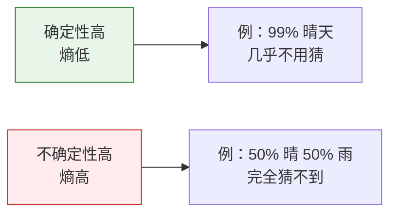
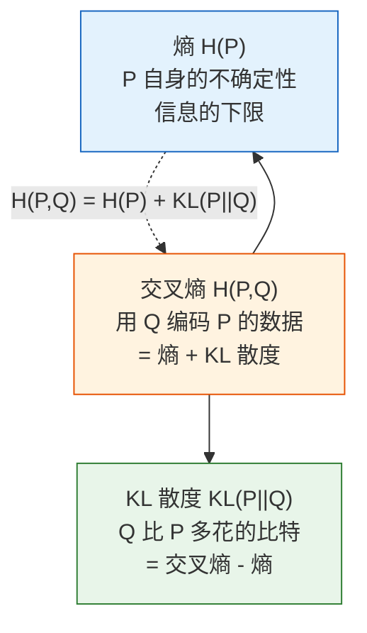

:::tip[为什么学信息论？]
你在训练分类模型时用的 `CrossEntropyLoss`（交叉熵损失），名字里就有"熵"。信息论告诉你**这个损失函数到底在度量什么**，以及为什么它对分类任务这么有效。
:::
## 学习目标

- 理解信息量和熵——不确定性的度量
- 理解交叉熵——衡量两个分布的差异
- 理解 KL 散度——一个分布到另一个分布的"距离"
- 用 Python 计算和可视化

## 先把公式前的术语看懂

信息论术语听起来很抽象，但大多数其实都在回答很具体的问题：

| 术语 | 含义 | 新人可以先这样问 |
|---|---|---|
| `bit` | 使用 `log2` 时的信息单位 | 这条信息相当于几个是/否问题？ |
| `nat` | 使用自然对数 `ln` 时的信息单位 | 深度学习损失函数内部最常用的单位 |
| `log2` | 以 2 为底的对数 | 想用 bit 表示信息量时使用 |
| `entropy` | 一个分布的平均不确定性 | 看到答案前，平均有多拿不准？ |
| `cross-entropy` | 真实分布是 P 时，使用预测分布 Q 的代价 | 用模型预测解释真实答案有多贵？ |
| `KL divergence` | 用 Q 替代 P 带来的额外代价 | 模型分布错了以后，多付出多少代价？ |
| `logits` | 转成概率前的模型原始分数 | 神经网络在 softmax 前输出的未归一化分数 |
| `softmax` | 把 logits 转成概率 | 把类别分数变成总和为 1 的概率分布 |
| `perplexity` | 交叉熵使用 bit 时的 `2 ** cross_entropy` | 语言模型困惑度，越低通常表示模型越不困惑 |
| `RLHF` / `PPO` | Reinforcement Learning from Human Feedback / Proximal Policy Optimization | 用 KL 约束微调模型不要偏离太远的训练相关方法 |

本节为了建立信息论直觉，会使用 `log2`，单位是 **bit**。很多深度学习库内部使用自然对数，因此损失值单位是 **nat**。曲线形状和优化含义是一样的，只是单位不同。

## 历史背景：信息论这一节最关键的起点是什么？

这一节最值得知道的历史节点是：

| 年份 | 论文 | 关键作者 | 它最重要地解决了什么 |
|---|---|---|---|
| 1948 | *A Mathematical Theory of Communication* | Claude Shannon | 系统提出了信息量、熵和现代信息论主线 |

对新人来说，最值得先记的是：

> **香农让“信息到底有多少”第一次可以被严格度量。**

所以你这一节看到的：

- 信息量
- 熵
- 交叉熵

不是散碎概念，而是都站在同一条信息论主线上。

## 先说一个很重要的学习预期

这一节对新人来说最容易卡住的点是：

- 名字听起来很抽象
- 公式看起来像“数学中的数学”

但这里真正最重要的，不是先把所有定义背熟，而是先看懂：

- 为什么“越意外，信息量越大”
- 为什么“越不确定，熵越大”
- 为什么分类损失最后会和这些量连在一起

你可以把这节先理解成：

> **给“模型到底有多确定、预测到底差多远”找一套更精确的语言。**

---

## 先建立一张地图

这一节看起来最不像“概率课”，但它和模型训练其实联系非常紧。


所以这节课真正想讲的是：

- 为什么“越意外的事，信息量越大”
- 为什么一个分布越不确定，熵越大
- 为什么交叉熵会成为分类任务的核心损失函数

## 一、信息量——"惊讶程度"

### 直觉

一条消息包含的**信息量** = 它有多**出人意料**。

- "太阳从东边升起" → 信息量 ≈ 0（完全不意外）
- "今天北京下雪了"（夏天） → 信息量很大（非常意外）
- "今天北京下雪了"（冬天） → 信息量中等

**概率越低的事件，发生时带来的信息量越大。**

### 一个更适合新人的类比

你可以先把信息量想成：

- “这件事有多值得我惊讶一下”

比如：

- 太阳明天升起，不值得惊讶
- 夏天下雪，就很值得惊讶

所以信息量最值得先记的，不是公式，而是：

> **越不常见的事，一旦发生，带来的信息就越多。**

### 数学定义

**信息量 = -log2(概率)**

```python
import numpy as np
import matplotlib.pyplot as plt

plt.rcParams['font.sans-serif'] = ['Arial Unicode MS']
plt.rcParams['axes.unicode_minus'] = False

# 不同概率对应的信息量
probs = np.linspace(0.01, 1, 100)
info = -np.log2(probs)

plt.figure(figsize=(8, 5))
plt.plot(probs, info, color='steelblue', linewidth=2)
plt.xlabel('事件概率')
plt.ylabel('信息量（比特）')
plt.title('信息量 = -log₂(概率)')
plt.grid(True, alpha=0.3)

# 标注几个关键点
for p, label in [(1.0, '必然事件'), (0.5, '抛硬币'), (0.01, '罕见事件')]:
    i = -np.log2(p)
    plt.annotate(f'{label}\np={p}, info={i:.1f}bit',
                 xy=(p, i), fontsize=10,
                 xytext=(p+0.15, i+0.5),
                 arrowprops=dict(arrowstyle='->', color='gray'))

plt.show()
```

| 事件概率 | 信息量 | 直觉 |
|---------|--------|------|
| 1.0 | 0 bit | 必然发生，没有信息 |
| 0.5 | 1 bit | 抛一次硬币，1 比特信息 |
| 0.25 | 2 bit | 猜中一个两位二进制数 |
| 0.01 | 6.64 bit | 很意外，信息量大 |

如果你直接运行公式：

```python
for p in [1.0, 0.5, 0.25, 0.01]:
    print(f"p={p:>4}: 信息量={-np.log2(p):.4f} bits")
```

预期输出：

```text
p= 1.0: 信息量=-0.0000 bits
p= 0.5: 信息量=1.0000 bits
p=0.25: 信息量=2.0000 bits
p=0.01: 信息量=6.6439 bits
```

---

## 二、熵——平均不确定性

### 直觉

**熵（Entropy）= 一个分布的"平均信息量"= 系统的"平均不确定性"。**

### 熵最值得先记住的，不是定义，而是“混乱程度”

可以先把熵想成：

- 你在做判断前到底有多拿不准

如果一个系统总是几乎确定：

- 熵就低

如果一个系统每次都很难猜：

- 熵就高

所以熵的最朴素意义，其实就是：

> **平均不确定性有多大。**



### 公式与计算

**H(X) = -Σ p(x) × log2(p(x))**

```python
def entropy(probs):
    """计算熵（以比特为单位）"""
    probs = np.array(probs)
    # 避免 log(0)
    probs = probs[probs > 0]
    return -np.sum(probs * np.log2(probs))

# 例 1：公平硬币（最大不确定性）
h1 = entropy([0.5, 0.5])
print(f"公平硬币的熵: {h1:.3f} bit")  # 1.0

# 例 2：不公平硬币
h2 = entropy([0.9, 0.1])
print(f"不公平硬币(0.9, 0.1)的熵: {h2:.3f} bit")  # 0.469

# 例 3：必然事件（无不确定性）
h3 = entropy([1.0, 0.0])
print(f"必然事件的熵: {h3:.3f} bit")  # 0.0

# 例 4：公平骰子
h4 = entropy([1/6]*6)
print(f"公平骰子的熵: {h4:.3f} bit")  # 2.585
```

预期输出：

```text
公平硬币的熵: 1.000 bit
不公平硬币(0.9, 0.1)的熵: 0.469 bit
必然事件的熵: -0.000 bit
公平骰子的熵: 2.585 bit
```

`-0.000` 是浮点数舍入造成的显示现象，概念上它就是 0。

### 可视化：硬币的熵随 p 变化

```python
p_values = np.linspace(0.001, 0.999, 1000)
entropies = [-p * np.log2(p) - (1-p) * np.log2(1-p) for p in p_values]

plt.figure(figsize=(8, 5))
plt.plot(p_values, entropies, color='steelblue', linewidth=2)
plt.xlabel('正面概率 p')
plt.ylabel('熵 H (bit)')
plt.title('二元分布的熵：p=0.5 时最大（最不确定）')
plt.axvline(x=0.5, color='red', linestyle='--', alpha=0.5, label='p=0.5（最大熵）')
plt.legend()
plt.grid(True, alpha=0.3)
plt.show()
```

**关键洞察**：p = 0.5 时熵最大（最不确定），p = 0 或 1 时熵为 0（完全确定）。

### 熵在 AI 中的应用

| 应用 | 说明 |
|------|------|
| 决策树 | 用**信息增益**（熵的减少量）选择最佳分割特征 |
| 模型输出 | 分类模型输出概率分布的熵越低，模型越"自信" |
| 数据压缩 | 熵是数据压缩的理论下限 |
| 语言模型 | 困惑度(Perplexity) = 2^(交叉熵)，衡量模型好坏 |

---

## 三、交叉熵——衡量"预测有多准"

### 直觉

**交叉熵 = 用分布 Q 来编码分布 P 的数据，平均每个样本需要多少比特。**

### 一个更适合新人的说法

你也可以暂时把交叉熵理解成：

- 预测分布和真实分布到底差得有多离谱

这对初学者来说已经足够有用了。
因为后面你在分类模型里真正关心的也是：

- 模型到底有没有把正确类别放到更高概率上

如果 Q 和 P 完全一样 → 交叉熵 = P 的熵（最小值）
如果 Q 和 P 差异大 → 交叉熵远大于 P 的熵

### 公式与计算

**H(P, Q) = -Σ p(x) × log2(q(x))**

```python
def cross_entropy(p, q):
    """计算交叉熵"""
    p, q = np.array(p), np.array(q)
    # 避免 log(0)
    q = np.clip(q, 1e-10, 1)
    return -np.sum(p * np.log2(q))

# 真实分布 P
P = [0.7, 0.2, 0.1]  # 三分类问题

# 预测分布 Q（不同质量的预测）
Q_good = [0.65, 0.25, 0.10]   # 好预测
Q_bad  = [0.33, 0.33, 0.34]   # 差预测（均匀猜）
Q_wrong = [0.1, 0.1, 0.8]     # 错误预测

print(f"P 的熵:        {entropy(P):.4f}")
print(f"好预测交叉熵:   {cross_entropy(P, Q_good):.4f}")
print(f"差预测交叉熵:   {cross_entropy(P, Q_bad):.4f}")
print(f"错误预测交叉熵: {cross_entropy(P, Q_wrong):.4f}")
```

预期输出：

```text
P 的熵:        1.1568
好预测交叉熵:   1.1672
差预测交叉熵:   1.5952
错误预测交叉熵: 3.0219
```

### 交叉熵作为损失函数

在分类任务中，**最小化交叉熵 = 让模型预测尽可能接近真实分布**。

```python
# 二分类的交叉熵损失
def binary_cross_entropy(y_true, y_pred):
    """二分类交叉熵（和 PyTorch 的 BCELoss 等价）"""
    y_pred = np.clip(y_pred, 1e-10, 1 - 1e-10)
    return -np.mean(
        y_true * np.log(y_pred) + (1 - y_true) * np.log(1 - y_pred)
    )

# 真实标签
y_true = np.array([1, 0, 1, 1, 0])

# 不同质量的预测
predictions = {
    "完美预测":   np.array([1.0, 0.0, 1.0, 1.0, 0.0]),
    "好预测":     np.array([0.9, 0.1, 0.8, 0.9, 0.2]),
    "差预测":     np.array([0.6, 0.4, 0.6, 0.6, 0.4]),
    "完全错误":   np.array([0.1, 0.9, 0.1, 0.1, 0.9]),
}

for name, y_pred in predictions.items():
    loss = binary_cross_entropy(y_true, y_pred)
    print(f"{name:10s} → 交叉熵损失 = {loss:.4f}")
```

输出：
```text
完美预测   → 交叉熵损失 ≈ 0.0000
好预测     → 交叉熵损失 ≈ 0.1525
差预测     → 交叉熵损失 ≈ 0.5108
完全错误   → 交叉熵损失 ≈ 2.3026
```

这段代码使用的是 `np.log`，也就是自然对数，所以单位是 nat。这和大多数深度学习框架里的交叉熵损失保持一致。

### 可视化：预测准确度 vs 损失

```python
# 真实标签 y=1 时，预测值 p 和损失的关系
p_pred = np.linspace(0.01, 0.99, 100)

# 当 y=1 时，loss = -log(p)
loss_y1 = -np.log(p_pred)

# 当 y=0 时，loss = -log(1-p)
loss_y0 = -np.log(1 - p_pred)

fig, axes = plt.subplots(1, 2, figsize=(14, 5))

axes[0].plot(p_pred, loss_y1, color='steelblue', linewidth=2)
axes[0].set_xlabel('模型预测 P(y=1)')
axes[0].set_ylabel('损失')
axes[0].set_title('真实标签 y=1 时的损失\n预测越接近 1，损失越小')
axes[0].grid(True, alpha=0.3)

axes[1].plot(p_pred, loss_y0, color='coral', linewidth=2)
axes[1].set_xlabel('模型预测 P(y=1)')
axes[1].set_ylabel('损失')
axes[1].set_title('真实标签 y=0 时的损失\n预测越接近 0，损失越小')
axes[1].grid(True, alpha=0.3)

plt.tight_layout()
plt.show()
```

**解读**：交叉熵损失有一个很好的性质——当预测错误时（比如 y=1 但模型输出 0.01），损失会**急剧增大**，对错误预测施加强烈惩罚。

### 一个更适合初学者的分类直觉

可以先把交叉熵理解成：

- 你给正确答案押了多少信心

如果正确类别明明是 `猫`，你却把大部分概率押给了 `狗`，
那交叉熵就会很大。
如果你把概率主要押给了正确类别，
交叉熵就会变小。

所以交叉熵最值得先抓住的，不是公式长什么样，而是这句：

> **模型越把概率押在正确答案上，损失通常就越小。**

### 再看一个最小“单个样本交叉熵”示例

```python
labels = ["猫", "狗", "鸟"]
true_label = "狗"
pred_probs = [0.1, 0.7, 0.2]

true_index = labels.index(true_label)
loss = -np.log(pred_probs[true_index])

print("正确类别:", true_label)
print("模型预测:", dict(zip(labels, pred_probs)))
print("交叉熵损失:", round(loss, 4))
```

预期输出：

```text
正确类别: 狗
模型预测: {'猫': 0.1, '狗': 0.7, '鸟': 0.2}
交叉熵损失: 0.3567
```

这个例子特别适合新人，因为它把抽象的分布语言，重新拉回了最熟悉的分类问题：

- 正确答案是谁
- 你到底给了它多少概率
- 这会直接变成多大的损失

---

## 四、KL 散度——两个分布的"距离"

### 直觉

**KL 散度（KL Divergence）= 用分布 Q 替代真实分布 P，会"多花"多少比特。**

### KL 散度为什么老让人发虚？

因为它看起来像“分布之间的距离”，
但又不是对称的。

对新人更稳的第一步理解通常是：

- KL 不是普通几何距离
- 它更像“如果我拿错了一个分布来近似真实分布，会额外多付出多少代价”

这个直觉其实已经够支撑你理解它在：

- VAE
- 蒸馏
- RLHF

里的作用了。

**KL(P || Q) = 交叉熵(P, Q) - 熵(P)**

```python
def kl_divergence(p, q):
    """计算 KL 散度"""
    p, q = np.array(p), np.array(q)
    q = np.clip(q, 1e-10, 1)
    p = np.clip(p, 1e-10, 1)
    return np.sum(p * np.log2(p / q))

P = [0.7, 0.2, 0.1]
Q1 = [0.65, 0.25, 0.10]  # 接近 P
Q2 = [0.33, 0.33, 0.34]  # 远离 P

print(f"KL(P || Q1): {kl_divergence(P, Q1):.4f} (Q1 接近 P)")
print(f"KL(P || Q2): {kl_divergence(P, Q2):.4f} (Q2 远离 P)")
print(f"KL(P || P):  {kl_divergence(P, P):.4f} (P 和自己)")
```

预期输出：

```text
KL(P || Q1): 0.0105 (Q1 接近 P)
KL(P || Q2): 0.4384 (Q2 远离 P)
KL(P || P):  0.0000 (P 和自己)
```

### KL 散度的性质

| 性质 | 说明 |
|------|------|
| 非负性 | KL(P \|\| Q) ≥ 0，等号当且仅当 P = Q |
| 不对称 | KL(P \|\| Q) ≠ KL(Q \|\| P)，不是真正的"距离" |
| P=Q 时为 0 | 两个分布完全一样时，KL 散度为 0 |

```python
# 验证不对称性
P = [0.7, 0.2, 0.1]
Q = [0.33, 0.33, 0.34]

print(f"KL(P || Q) = {kl_divergence(P, Q):.4f}")
print(f"KL(Q || P) = {kl_divergence(Q, P):.4f}")
print("两者不相等！")
```

预期输出：

```text
KL(P || Q) = 0.4384
KL(Q || P) = 0.4807
两者不相等！
```

### 可视化：KL 散度随分布差异变化

```python
# 二元分布：P = [0.8, 0.2]，让 Q 从 [0.01, 0.99] 到 [0.99, 0.01] 变化
p = 0.8
q_values = np.linspace(0.01, 0.99, 200)

kl_values = [kl_divergence([p, 1-p], [q, 1-q]) for q in q_values]

plt.figure(figsize=(8, 5))
plt.plot(q_values, kl_values, color='steelblue', linewidth=2)
plt.axvline(x=p, color='red', linestyle='--', label=f'q = p = {p}（KL=0）')
plt.xlabel('q 的值')
plt.ylabel('KL(P || Q)')
plt.title(f'KL 散度：P=[{p}, {1-p}]，Q=[q, 1-q]')
plt.legend()
plt.grid(True, alpha=0.3)
plt.show()
```

### KL 散度在 AI 中的应用

| 应用 | 说明 |
|------|------|
| VAE | 让隐变量的分布接近标准正态分布：KL(q(z\|x) \|\| N(0,1)) |
| 知识蒸馏 | 让小模型的输出分布接近大模型：最小化 KL 散度 |
| RLHF | 限制微调后的模型不要偏离原始模型太远 |
| 策略优化 | PPO 算法中限制策略更新幅度 |

:::tip[KL 散度在 RLHF 中的关键作用]
大语言模型微调（RLHF）时，需要在"满足人类偏好"和"不偏离原始模型太远"之间平衡。KL 散度就是那个"不偏离太远"的约束。
:::
---

## 五、三者的关系



**核心关系：交叉熵 = 熵 + KL 散度**

```python
P = [0.7, 0.2, 0.1]
Q = [0.5, 0.3, 0.2]

h = entropy(P)
ce = cross_entropy(P, Q)
kl = kl_divergence(P, Q)

print(f"熵 H(P):        {h:.4f}")
print(f"交叉熵 H(P,Q):  {ce:.4f}")
print(f"KL 散度:        {kl:.4f}")
print(f"H(P) + KL =     {h + kl:.4f}")  # = 交叉熵 ✓
```

预期输出：

```text
熵 H(P):        1.1568
交叉熵 H(P,Q):  1.2796
KL 散度:        0.1228
H(P) + KL =     1.2796
```

:::note[为什么分类用交叉熵而不是 KL 散度？]
因为在训练时，真实分布 P 是固定的（标签不变），所以 H(P) 是常数。最小化交叉熵 H(P,Q) 等价于最小化 KL(P||Q)。但交叉熵的计算更简单——不需要知道 H(P)。
:::
### 一个很适合初学者先记的对比表

| 概念 | 最值得先记住的问法 |
|------|------|
| 信息量 | 这件事有多意外？ |
| 熵 | 整体平均有多不确定？ |
| 交叉熵 | 预测和真实到底差多远？ |
| KL 散度 | 如果我拿错了分布，会额外多付出多少代价？ |

这个表特别适合新人，因为它能把这一章从“公式堆”重新变回一张直觉地图。

---

## 学到这里，下一步最值得带去哪里？

如果你把概率与统计整章读到这里，最值得带去后面的不是更多公式，而是这几个问题：

1. 概率、交叉熵和 KL 散度最后会怎样真的长进 loss？
2. 模型为什么总在输出概率，而不是绝对结论？
3. 这些“不确定性语言”在机器学习里会怎样变成训练和评估工具？

最适合接着看的通常是：

- [5 第 5 站首页](/zh-cn/ch05-machine-learning/)
- [5.2.3 逻辑回归](/zh-cn/ch05-machine-learning/ch02-supervised/02-logistic-regression/)
- [5.4.2 评估指标](/zh-cn/ch05-machine-learning/ch04-evaluation/01-metrics/)

:::note[本章回顾]
概率与统计四节课，你学到了：
1. **概率基础**：条件概率、贝叶斯定理——用证据更新信念
2. **概率分布**：正态分布无处不在，中心极限定理
3. **统计推断**：MLE 就是交叉熵损失的来源，MAP 就是正则化
4. **信息论**（本节）：熵度量不确定性，交叉熵是分类损失，KL 散度约束分布差异

这些概念会在机器学习、深度学习、大语言模型中反复出现。

**融合学习跳转**：建议现在就去看**第 5 站·2.2 逻辑回归 + 2.3 决策树**——用刚学的概率和信息论知识理解分类算法的损失函数和信息增益。
:::
---

## 留下的证据

学完这一页，至少保留这张证据卡：

```text
随机过程：事件、分布、样本、似然、熵，或 Bayes 更新
模拟或公式：用来让不确定性可见的代码或公式
输出：概率、样本统计量、区间、熵，或更新后的信念
失败检查：基率混淆、p 值误用、样本偏差或把概率和确定性混为一谈
期望产出：数值结果加通俗解释
```

## 小结

| 概念 | 直觉 | 值域 |
|------|------|------|
| 信息量 | 一个事件有多"意外" | ≥ 0 |
| 熵 | 一个分布有多"不确定" | ≥ 0 |
| 交叉熵 | 预测分布和真实分布差多少 | ≥ H(P) |
| KL 散度 | 两个分布的"距离" | ≥ 0 |

## 这节最该带走什么

- 信息量最重要的直觉是“越意外，信息越大”
- 熵最重要的直觉是“平均有多不确定”
- 交叉熵最重要的直觉是“预测和真实差多远”
- KL 散度最重要的直觉是“用错分布要多付出多少代价”

## 动手练习

### 练习 1：计算熵

计算以下分布的熵，解释哪个最"不确定"：
1. [0.25, 0.25, 0.25, 0.25]（四面骰子）
2. [0.97, 0.01, 0.01, 0.01]（几乎确定）
3. [0.4, 0.3, 0.2, 0.1]（不均匀）

参考实现：

```python
distributions = [
    [0.25, 0.25, 0.25, 0.25],
    [0.97, 0.01, 0.01, 0.01],
    [0.4, 0.3, 0.2, 0.1],
]

for probs in distributions:
    print(f"{probs} -> entropy={entropy(probs):.4f} bits")
```

预期输出：

```text
[0.25, 0.25, 0.25, 0.25] -> entropy=2.0000 bits
[0.97, 0.01, 0.01, 0.01] -> entropy=0.2419 bits
[0.4, 0.3, 0.2, 0.1] -> entropy=1.8464 bits
```

第一个分布最不确定，因为四个结果出现的概率完全一样。

### 练习 2：交叉熵损失

三分类问题：真实标签是第 2 类（one-hot: [0, 1, 0]），模型输出 softmax 概率为 [0.1, 0.7, 0.2]。计算交叉熵损失。如果模型输出变成 [0.05, 0.9, 0.05]，损失会怎么变？

参考实现：

```python
P = np.array([0, 1, 0])
Q1 = np.array([0.1, 0.7, 0.2])
Q2 = np.array([0.05, 0.9, 0.05])

loss1 = -np.sum(P * np.log(Q1))
loss2 = -np.sum(P * np.log(Q2))

print(f"Loss with [0.1, 0.7, 0.2]: {loss1:.4f} nats")
print(f"Loss with [0.05, 0.9, 0.05]: {loss2:.4f} nats")
```

预期输出：

```text
Loss with [0.1, 0.7, 0.2]: 0.3567 nats
Loss with [0.05, 0.9, 0.05]: 0.1054 nats
```

第二个预测把更多概率给了正确类别，所以损失变小。

### 练习 3：可视化 KL 散度

画一张图，展示当真实分布 P = [0.6, 0.3, 0.1] 固定时，让 Q 沿着某个参数变化（如 q1 从 0.1 到 0.9），KL(P||Q) 的变化曲线。

参考实现：

```python
P = np.array([0.6, 0.3, 0.1])
q1_values = np.linspace(0.1, 0.9, 200)
kl_values = []

for q1 in q1_values:
    # 剩余概率保持 3:1 的比例分给后两个类别。
    Q = np.array([q1, (1 - q1) * 0.75, (1 - q1) * 0.25])
    kl_values.append(kl_divergence(P, Q))

plt.figure(figsize=(8, 5))
plt.plot(q1_values, kl_values, color="steelblue", linewidth=2)
plt.axvline(x=0.6, color="red", linestyle="--", label="Q = P")
plt.xlabel("q1")
plt.ylabel("KL(P || Q)")
plt.title("KL 散度在 Q 匹配 P 时最小")
plt.legend()
plt.grid(alpha=0.3)
plt.show()

for q1 in [0.1, 0.6, 0.9]:
    Q = np.array([q1, (1 - q1) * 0.75, (1 - q1) * 0.25])
    print(f"q1={q1:.1f}, Q={Q.round(3)}, KL={kl_divergence(P, Q):.4f}")
```

预期输出：

```text
q1=0.1, Q=[0.1   0.675 0.225], KL=1.0830
q1=0.6, Q=[0.6 0.3 0.1], KL=-0.0000
q1=0.9, Q=[0.9   0.075 0.025], KL=0.4490
```


<details>
<summary>操作参考与检查点</summary>

- 三个熵值应为 `2.0000`、约 `0.2419`、约 `1.8464` bits。四个结果均匀分布时最不确定，因为没有哪个结果更被偏好。
- 三分类交叉熵例子中，loss 约为 `0.3567` 和 `0.1054` nats。给真实类别更高概率，loss 就会下降。
- 好的解释会连接到训练：交叉熵奖励对正确类别的校准置信度，并惩罚把高概率放到错误类别上。

</details>
