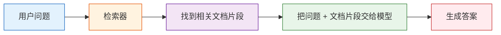
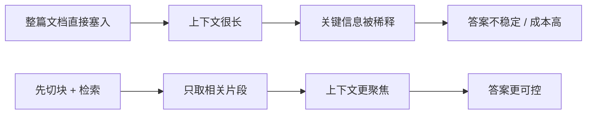

:::tip[本节定位]
RAG 最容易被误解成：

- 接个向量库就行

但它真正更像：

- 让系统先查资料，再决定怎么答

所以这节最重要的不是记住组件名，而是先建立一个判断：

> **RAG 的核心不是“多一个模块”，而是“把知识接入链路做对”。**
:::
## 学习目标

完成本节后，你将能够：

- 理解为什么光靠大模型参数记忆不够
- 说清楚 RAG 的标准工作流程
- 跑通一个最小可运行的检索增强示例
- 理解 RAG 适合什么场景、不适合什么场景

---

## 新人先掌握 / 进阶再理解

如果你是新人，这一节先抓一句话：RAG 不是让模型“记住更多”，而是让模型回答前先查到合适资料。先理解“问题 -> 检索 -> 片段 -> 拼上下文 -> 生成答案”这条链路。

如果你已经做过大模型应用，可以进一步关注：切块策略、召回质量、重排、元数据、引用来源、检索日志和错例分析。RAG 项目的成熟度，往往体现在这些工程细节上。

---

## 先建立一张地图

### 先看一个故事：闭卷答题和开卷查资料

想象你问一个同学：“课程多久内可以退款？”如果他不翻规则，只凭印象回答，可能说得很流畅，但未必准确。更可靠的做法是：先打开课程规则，找到退款条款，再根据条款回答。

RAG 做的就是把这个习惯系统化。模型仍然负责理解问题和组织语言，但关键事实先从知识库里查出来。这样答案就更容易及时、可控、可追溯。

如果你刚学完 Prompt 和微调的判断逻辑，可以先把这节理解成：

- Prompt 解决的是“任务怎么表达”
- 微调更像“行为怎么塑形”
- RAG 解决的是“知识不够新 / 不够全时，怎样先查再答”

所以这节真正重要的不是“又一个名词”，而是：

- 它在大模型系统里，专门负责外部知识接入

### 一个更适合新人的总类比

你可以把 RAG 理解成：

- 让一个很聪明的人，回答问题前先去翻手册

如果不翻手册，他可能：

- 凭印象回答
- 回答得流畅，但并不一定准

而有了 RAG 之后，系统就更像：

- 先找证据
- 再基于证据回答


这张图就是你在本章里会反复看到的主线：提问、检索、检查证据、带来源作答。

## 一、为什么需要 RAG？

你可以把大模型想成一个“读过很多书的人”。
但即使读过很多书，也会遇到三个问题：

1. 某些信息太新，训练时还没出现
2. 某些信息太专，模型记得不牢
3. 某些回答必须严格基于你自己的私有文档

这时候就需要 RAG：

> **先查资料，再回答。**

类比一下：

- 纯模型回答：闭卷考试
- RAG 回答：开卷考试

### 第一次学 RAG，最该先抓住什么？

最该先抓住的不是向量库，而是这句：

> **RAG 的本质不是“把模型变聪明”，而是“让答案先建立在可更新资料之上”。**

这句话一旦稳住，后面你再看：

- 切块
- 检索
- 重排
- 上下文拼接

就会更自然地知道它们都在服务哪条主线。

---

## 二、RAG 的标准流程



拆开看就是：

1. 文档先被切成小块
2. 用户提问时，从知识库里检索相关块
3. 把这些块作为上下文交给模型
4. 模型基于上下文生成答案

### 为什么这条流程不能只盯最后一步生成？

因为很多 RAG 问题真正出在前面：

- 文档切得不好
- 检索召回不准
- 重排没做好
- 上下文拼得不合理

所以 RAG 的核心不是“生成前多塞点字”，而是：

- 让正确资料在正确时机进入模型上下文

### 一个很适合新人先记的故障定位表

| 现象 | 更可能先查哪里 |
|---|---|
| 完全答偏 | 检索没召回相关片段 |
| 答案像是半对半错 | 文档片段不完整或切块不好 |
| 明明有文档却答不出来 | 检索分数、排序或上下文拼接有问题 |
| 有证据但总结错 | 生成阶段没有正确利用证据 |

这个表很重要，因为它会帮初学者少走很多弯路：

- RAG 出问题时，不要默认都是模型的问题


:::tip[读图提示]
先顺着图从左到右问三件事：正确资料有没有被切成可检索的块、有没有进入 top-k、有没有被放进最终 context。只有这三层都没问题时，才优先怀疑生成模型本身。
:::
---

## 三、一个最小可运行的迷你 RAG

为了保证代码直接能跑，下面不用向量数据库，先用最简单的关键词重叠来模拟“检索”。

```python
import re
from collections import Counter

documents = [
    {
        "id": 1,
        "title": "退款政策",
        "content": "课程购买后 7 天内，如果学习进度低于 20%，可以申请退款。"
    },
    {
        "id": 2,
        "title": "证书说明",
        "content": "完成所有必修项目并通过结课测试后，可以获得课程结业证书。"
    },
    {
        "id": 3,
        "title": "学习方式",
        "content": "课程支持按阶段学习，建议先完成 Python、数据分析和机器学习基础。"
    }
]

STOPWORDS = {"吗", "呢", "的", "了", "我", "你", "怎么", "哪些", "可以", "能"}

def tokenize(text):
    words = re.findall(r"[a-zA-Z0-9_]+", text.lower())
    cjk_chars = re.findall(r"[\u4e00-\u9fff\u3040-\u30ff]", text)
    cjk_bigrams = ["".join(cjk_chars[i:i + 2]) for i in range(len(cjk_chars) - 1)]
    return [token for token in words + cjk_bigrams if token not in STOPWORDS]

def overlap_score(query, doc_text):
    query_tokens = tokenize(query)
    doc_tokens = tokenize(doc_text)
    query_count = Counter(query_tokens)
    doc_count = Counter(doc_tokens)
    return sum(min(query_count[t], doc_count[t]) for t in query_count)

def retrieve(query, documents, top_k=2):
    scored = []
    for doc in documents:
        score = overlap_score(query, doc["content"] + " " + doc["title"])
        scored.append((score, doc))
    scored.sort(key=lambda x: x[0], reverse=True)
    return [doc for score, doc in scored[:top_k] if score > 0]

def answer_with_rag(query):
    hits = retrieve(query, documents, top_k=1)
    if not hits:
        return "知识库里没有找到足够相关的信息。"

    best = hits[0]
    context = "\\n".join([f"- {doc['title']}：{doc['content']}" for doc in hits])
    return (
        f"根据知识库检索结果：\\n{context}"
        f"\\n\\n回答草稿：{best['content']}"
        f"\\n来源：{best['title']}"
    )

query = "课程多久内可以退款？"
print(answer_with_rag(query))
```

预期输出：

```text
根据知识库检索结果：
- 退款政策：课程购买后 7 天内，如果学习进度低于 20%，可以申请退款。

回答草稿：课程购买后 7 天内，如果学习进度低于 20%，可以申请退款。
来源：退款政策
```

这个例子虽然简化了，但已经完整体现了 RAG 的结构。

:::tip[为什么这里的 tokenizer 稍微多写了几行？]
这个 `tokenize()` 同时处理英文单词和中日文相邻字符 bigram。这样三语代码都能直接跑，也顺手提醒一个真实 RAG 细节：分词质量会影响检索质量。
:::
### 再看一个最小“检索日志”示例

```python
query = "课程多久内可以退款？"
hits = retrieve(query, documents, top_k=2)

for doc in hits:
    print({"query": query, "hit_title": doc["title"], "content": doc["content"]})
```

预期输出：

```text
{'query': '课程多久内可以退款？', 'hit_title': '退款政策', 'content': '课程购买后 7 天内，如果学习进度低于 20%，可以申请退款。'}
{'query': '课程多久内可以退款？', 'hit_title': '证书说明', 'content': '完成所有必修项目并通过结课测试后，可以获得课程结业证书。'}
```

第二条命中偏弱，这正好说明了后面为什么还要学习分数阈值、重排和人工相关性标注。初版 RAG 先把日志打印出来，才知道该优化哪里。

这个日志非常适合初学者，因为它能帮你先回答一个关键问题：

- 系统到底查到了什么

很多 RAG 错误，其实在看见这个日志时就已经能定位一半。

---

## 四、RAG 真正提升的是什么？

RAG 主要提升的是三件事：

### 时效性

资料可以随时更新，不必重新训练大模型。

### 可控性

回答基于你指定的知识库，不是完全靠模型自由发挥。

### 可追溯性

你可以把“参考了哪些文档片段”展示给用户看。

这在企业场景里尤其重要。

### 为什么这三点比“模型参数大不大”更像工程价值？

因为它们都直接关系到系统可用性：

- 时效性决定知识更新效率
- 可控性决定答案是否贴业务边界
- 可追溯性决定系统能不能被信任和审计

### 第一次做 RAG 项目时，最稳的默认顺序

更稳的顺序通常是：

1. 先把知识范围收窄
2. 先做最简单检索 基线
3. 先把检索日志看明白
4. 再接模型生成
5. 最后再补重排和更复杂策略

这样会比一开始就追复杂向量库和 reranker 更容易做出一个可解释系统。

---

## 五、RAG 不等于“问什么都不会幻觉”

这是一个特别常见的误解。

RAG 虽然能降低幻觉，但不能彻底消灭。
它还是可能在这些地方出问题：

- 检索错了
- 检索不全
- 文档切块不好
- 模型拿到证据后仍然总结错

所以 RAG 不是银弹，它是一种“让答案更有根据”的工程方法。

---

## 六、RAG 最适合哪些场景？

### 很适合

- 企业知识库问答
- 政策 / 制度 / FAQ 查询
- 基于产品文档的客服系统
- 基于代码库 / 文档库的检索问答

### 不太适合

- 纯开放创作类任务
- 根本没有知识库的场景
- 需要精确数值计算但文档本身又不稳定的场景

---

## 七、RAG 和微调是什么关系？

很多新人会把它们混在一起。

### 检索增强生成（RAG）

- 不改模型参数
- 靠“外部资料注入上下文”

### 微调

- 修改模型参数
- 让模型长期学会某种风格或能力

类比一下：

- RAG：考试时带资料
- 微调：考前长期训练

两者不是互斥的，很多系统会一起用。

---

## 八、一个更像“产品”的小例子

你可以把上面的迷你 RAG 稍微包装成“课程助手”：

```python
questions = [
    "结业证书怎么拿？",
    "应该先完成哪些基础？",
    "我能退款吗？"
]

for q in questions:
    print("=" * 50)
    print("用户问题:", q)
    print(answer_with_rag(q))
```

预期输出：

```text
==================================================
用户问题: 结业证书怎么拿？
根据知识库检索结果：
- 证书说明：完成所有必修项目并通过结课测试后，可以获得课程结业证书。

回答草稿：完成所有必修项目并通过结课测试后，可以获得课程结业证书。
来源：证书说明
==================================================
用户问题: 应该先完成哪些基础？
根据知识库检索结果：
- 学习方式：课程支持按阶段学习，建议先完成 Python、数据分析和机器学习基础。

回答草稿：课程支持按阶段学习，建议先完成 Python、数据分析和机器学习基础。
来源：学习方式
==================================================
用户问题: 我能退款吗？
根据知识库检索结果：
- 退款政策：课程购买后 7 天内，如果学习进度低于 20%，可以申请退款。

回答草稿：课程购买后 7 天内，如果学习进度低于 20%，可以申请退款。
来源：退款政策
```

这就是很多 AI 问答产品的最小原型。

---

## 九、如果你的目标是“知识库驱动的 SOP 文档助手”，这节最该先抓什么？

对这类项目来说，RAG 最关键的不是“查到一些相关文本”，
而是查到：

- 相关政策条款
- 相关处理案例
- 相关复核清单
- 以及它们分别来自哪份资料、哪一页

也就是说，你的知识块最好不要只是：

- 一段文字

而更应该至少带这些字段：

```python
sop_chunk = {
    "topic": "退款升级",
    "content_type": "case",
    "source_type": "docx",
    "page_or_slide": 3,
    "text": "如果退款窗口已过，但已确认重复扣费，应带着证据升级给 billing support。",
}

print(sop_chunk)
```

预期输出：

```text
{'topic': '退款升级', 'content_type': 'case', 'source_type': 'docx', 'page_or_slide': 3, 'text': '如果退款窗口已过，但已确认重复扣费，应带着证据升级给 billing support。'}
```

这会直接影响后面能不能：

- 按主题召回处理案例
- 把政策、案例、清单分开组织
- 在最终 Word 里保留来源说明

## 十、内部资料和外部资料在 RAG 里应该怎么分工？

如果你的系统既查内部知识库，又补外部资料，
最稳的默认原则通常是：

| 资料类型 | 更适合负责什么 |
|---|---|
| 内部资料 | 官方政策表述、升级规则、已确认的处理案例 |
| 外部资料 | 公开背景、市场说明，或只作为补充的参考案例 |

也就是说，RAG 在这种项目里很重要的一层判断是：

> **内部资料负责主骨架，外部资料负责补空白。**

如果这条线不清，系统很容易出现：

- 内部文档明明有标准写法，最后却被外部内容带偏

## 十一、初学者常见误区

### 以为 RAG 的核心是“调用一下向量库”

不是。
RAG 的核心是：**让正确资料在正确时机进入模型上下文。**

### 以为检索和生成可以完全分开看

不行。
检索质量会直接决定生成质量。

### 以为文档原样塞进去就行

实际效果很大程度取决于切块、清洗、元数据和召回策略。

## 十二、如果把它做成项目，最值得展示什么

最值得展示的通常不是：

- “我接了一个向量库”

而是：

1. 一条用户问题
2. 系统命中的文档片段
3. 最终答案
4. 一组典型错例
5. 错例是检索错、切块错，还是生成错

这样别人会更容易看出：

- 你理解的是完整 RAG 链路
- 不只是知道几个组件名

## 十三、一个常见错误：把整篇文档直接塞进 prompt

很多新人第一次做 RAG，会想：既然模型需要资料，那我把整篇文档都塞进去不就好了？

这通常会带来几个问题：上下文窗口被浪费，关键信息被埋住，模型更难聚焦，长文成本也更高。RAG 的价值不是“塞更多字”，而是“把更相关的片段放到更合适的位置”。



这个错例特别值得记住：RAG 不是“长 prompt 技巧”，而是一套资料选择和证据组织机制。

---

## 十四、RAG 项目的交付物模板

如果你把 RAG 做成作品集项目，建议至少交付这些内容：

| 交付物 | 说明 |
|---|---|
| 知识库样例 | 展示原始文档、切块结果和元数据字段 |
| 检索日志 | 展示用户问题命中了哪些片段、分数是多少 |
| 答案与引用 | 最终回答要能追溯到来源片段 |
| 错例分析 | 至少列出 3 个失败案例，并说明是检索、切块还是生成问题 |
| 改进记录 | 比较 基线、优化切块、加入重排后的效果变化 |

这样别人看到你的项目时，会知道你理解的是完整链路，而不只是“接了一个向量库”。

---

## 十五、这一节的学习闭环

学完这一节后，可以用下面这张表检查自己：

| 层次 | 你应该能做到什么 |
|---|---|
| 直觉 | 能解释为什么 RAG 像“开卷答题” |
| 代码 | 能跑通一个最小检索增强示例，并打印检索日志 |
| 工程 | 能区分切块问题、检索问题、生成问题 |
| 项目 | 能设计带引用、错例分析和改进记录的 RAG 示例 |

---

## RAG 最小闭环检查表

第一次做 RAG，不要先追求框架完整，而是先确保下面 5 步都能被你看见和解释。

| 步骤 | 最小产出 | 如果失败，优先怀疑 |
|---|---|---|
| 准备资料 | 至少 3 条带标题的文档片段 | 知识范围不清、文档质量差 |
| 检索片段 | 能打印命中的标题、内容和分数 | 查询、切块、检索策略 |
| 拼上下文 | 能看到最终交给模型的 上下文 | top-k、上下文过长、顺序混乱 |
| 生成答案 | 答案明确基于 上下文 | prompt 约束不足、证据不足 |
| 记录日志 | 保存 查询、hits、answer | 无法复盘失败 |

这个检查表的意义是：RAG 项目不要只展示最终答案。你要能展示“系统到底查到了什么、为什么这么答、失败时是哪一层出问题”。

## RAG 最小调试输出

在接入真实 LLM 之前，建议先把调试输出做出来。哪怕最终答案还很简单，只要能打印检索过程，后面优化就有抓手。

```python
def debug_rag(query):
    hits = retrieve(query, documents, top_k=2)
    print("用户问题:", query)
    print("命中文档:")
    for idx, doc in enumerate(hits, start=1):
        print(f"{idx}. {doc['title']} -> {doc['content']}")

    if not hits:
        print("回答: 知识库里没有找到足够相关的信息。")
        return

    context = "\n".join([doc["content"] for doc in hits])
    print("最终上下文:", context)
    print("回答: 请根据上面的命中文档组织答案，并保留来源。")

debug_rag("课程多久内可以退款？")
```

预期输出：

```text
用户问题: 课程多久内可以退款？
命中文档:
1. 退款政策 -> 课程购买后 7 天内，如果学习进度低于 20%，可以申请退款。
2. 证书说明 -> 完成所有必修项目并通过结课测试后，可以获得课程结业证书。
最终上下文: 课程购买后 7 天内，如果学习进度低于 20%，可以申请退款。
完成所有必修项目并通过结课测试后，可以获得课程结业证书。
回答: 请根据上面的命中文档组织答案，并保留来源。
```


这个函数不是最终产品代码，而是调试工具。真实项目里，你至少应该在日志中保留这些字段：`query`、`retrieved_chunks`、`scores`、`context_length`、`answer`、`source_refs`。

## 典型失败样本分析

| 失败现象 | 可能原因 | 下一步动作 |
|---|---|---|
| 知识库里明明有答案，但没有命中 | chunk 太大、关键词不匹配、embedding 不适合 | 打印 top-k，检查 查询 和 chunk 文本 |
| 命中了正确文档，但答案漏掉关键条件 | chunk 不完整、上下文 顺序不合理、prompt 约束弱 | 增加 overlap，调整 上下文组装，要求引用条件 |
| 答案引用了来源，但来源不支持结论 | 生成阶段幻觉、引用拼接错误 | 做 citation check，逐句核对证据 |
| 多个文档互相冲突，答案混乱 | 缺少版本、日期、来源优先级 | 加 metadata filter 和来源优先级规则 |

这些失败样本应该写进项目 README 或实验记录。RAG 项目的含金量不只在“能答对”，也在于你能解释“为什么答错”。


> **RAG 的本质，是让模型回答问题前先去查资料。**

它不是替代模型，而是给模型补上“外部记忆”和“可更新知识”。

下一节我们就继续看：
这些资料到底该怎么清洗、切块和向量化。

---

## 这节最该带走什么

- RAG 不是在替代模型，而是在补外部知识链路
- 真正的难点往往不在“调用模型”，而在“资料到底有没有被正确送进去”
- 后面所有知识库、企业问答、助手系统，都会建立在这条主线上

---

## 留下的证据

学完这一页，至少保留这张证据卡：

```text
查询：一个用户问题或测试用例
已检索分块：分块 ID、分数和来源标题
答案：带引用或来源说明的最终回答
失败检查：缺少证据、切分错误、文档过时或论断无依据
下一步动作：分块、embedding、重排、Prompt 或评估改动
```

## 练习

1. 给 `documents` 再加两条文档，试着查询新的问题。
2. 修改 `retrieve()` 的 `top_k`，观察回答上下文会怎么变化。
3. 思考：如果文档里写的是“14 天可退款”，而模型回答成“7 天”，可能是哪一步出了问题？

<details>
<summary>参考实现与讲解</summary>

1. 好的新增文档应该能测试检索是否区分相似主题，例如退款政策、转课规则和证书规则。好的查询应返回真正包含答案的文档，而不只是有重叠词的文档。
2. 更大的 `top_k` 会给生成器更多上下文，但也可能带入干扰材料。更小的 `top_k` 更干净，但可能漏掉必要的支持 chunk。
3. 错误可能来自检索没命中正确文档、context packing 丢掉了正确句子、prompt 允许模型无依据猜测，或模型忽略了检索证据。RAG 调试应分层检查。

</details>
