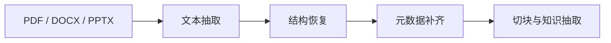

# 8.3.8 文档解析与知识抽取

:::tip[本节定位]
很多知识库项目一开始最容易犯的错是：

- 先想着向量化
- 先想着怎么问答

但如果文档根本没被解析对，后面检索和生成都会一起歪。

所以这节最重要的不是先讲向量库，而是先建立一个判断：

> **文档要先被解析成“可理解、可切块、可追溯”的知识对象。**
:::
## 学习目标

- 理解为什么 PDF / Word / PPT 不能只抽纯文本
- 理解扫描版 PDF 和图片页为什么会把 OCR 拉进链路
- 学会把文档解析成“正文 + 层级 + 元数据 + 证据角色”这类结构
- 看懂一个最小的文档解析与知识抽取流程

---

## 先建立一张地图

文档解析更适合按“文件 -> 结构 -> 知识块”来理解：



所以这节真正想解决的是：

- 为什么知识库项目不是“把文件内容抠出来就结束”
- 为什么标题层级、页码、小节和证据角色都会影响后面检索质量

## 为什么文档解析经常比想象中更难？

因为不同文档格式的问题完全不一样：

- `PDF` 可能只是“视觉排版结果”，段落顺序并不天然稳定
- `DOCX` 结构通常更清楚，但样式、标题层级不一定统一
- `PPTX` 常常是碎片化要点，不像连续文章
- 扫描版 PDF 则连正文文字都不一定能直接拿到

这意味着真正可用的知识库通常要先回答：

1. 文本抽出来了吗？
2. 顺序对了吗？
3. 标题、页码、章节还在吗？
4. 哪些内容是政策、案例、检查清单、定义、正文、备注？

## 一个更适合新人的总类比

你可以把文档解析理解成：

- 先把一大箱资料整理成可翻阅的卡片盒

如果你只是把所有纸随便倒出来，
后面当然也能翻，但会很乱。
更稳的做法是先把它们整理成：

- 主题
- 章节
- 标题
- 证据角色
- 来源

这样后面系统问“我要找哪个主题的政策和案例证据”时，才有可能真的找得准。

## 不同文件类型最常见的问题

| 文件类型 | 最常见的问题 |
|---|---|
| PDF | 顺序错、页眉页脚混进正文、两栏排版打乱 |
| Word | 标题层级不统一、表格和正文混在一起 |
| PPT | 一页信息少但碎，常需要保留“页”这个概念 |
| 扫描版 PDF / 图片页 | 需要 OCR，且容易识别错字和顺序 |

这张表特别适合新人，因为它会提醒你：

- 文档处理不是“一个解析器走天下”


:::tip[读图提示]
文件进入系统后先路由：文本 PDF、扫描 PDF、DOCX、PPTX 的问题不同。真正入库前要恢复正文顺序、标题层级、页码和内容类型，而不是只抽一大段纯文本。
:::
## 一个最小文档解析工作流示例

下面这个例子不依赖真实第三方库，
但会把“不同文档类型走不同解析路线”这件事先讲清楚。

```python
from pathlib import Path


def route_parser(filename):
    suffix = Path(filename).suffix.lower()
    if suffix == ".pdf":
        return "pdf_text_or_ocr"
    if suffix == ".docx":
        return "word_parser"
    if suffix == ".pptx":
        return "ppt_parser"
    return "unsupported"


files = [
    "refund_policy.pdf",
    "handled_cases.docx",
    "escalation_checklist.pptx",
]

for file in files:
    print(file, "->", route_parser(file))
```

预期输出：

```text
refund_policy.pdf -> pdf_text_or_ocr
handled_cases.docx -> word_parser
escalation_checklist.pptx -> ppt_parser
```

这个示例最重要的价值是：

- 先让你脑子里有“路由”这件事

也就是说，文件一进系统，不是直接统一塞进一个函数，
而是先判断：

- 这是什么文件
- 该走哪条解析链

## 一个更像真实系统的知识块长什么样？

真正送进知识库的，不应该只是：

- 一段裸文本

而更应该像下面这样：

```python
chunks = [
    {
        "doc_id": "word_001",
        "source_type": "docx",
        "section_title": "退款升级案例复盘",
        "page_or_slide": 3,
        "content": "用户因配送失败和账户复核结果申请升级退款。",
        "content_type": "case",
    },
    {
        "doc_id": "ppt_002",
        "source_type": "pptx",
        "section_title": "一线客服检查清单",
        "page_or_slide": 8,
        "content": "核对订单状态、退款窗口、历史沟通和审批负责人。",
        "content_type": "checklist",
    },
]

for chunk in chunks:
    print(chunk)
```

预期输出：

```text
{'doc_id': 'word_001', 'source_type': 'docx', 'section_title': '退款升级案例复盘', 'page_or_slide': 3, 'content': '用户因配送失败和账户复核结果申请升级退款。', 'content_type': 'case'}
{'doc_id': 'ppt_002', 'source_type': 'pptx', 'section_title': '一线客服检查清单', 'page_or_slide': 8, 'content': '核对订单状态、退款窗口、历史沟通和审批负责人。', 'content_type': 'checklist'}
```

这个例子特别适合初学者，因为它会帮助你先看到：

- 真正有价值的不是“只拿到字”
- 而是把字放回来源、章节、页码和内容类型里

## 一个更像真实项目的解析结果 结构约束

第一次做这类系统时，最容易少掉的是：

- 文档级元数据
- 章节级结构
- 知识块级内容

更稳的做法通常是把解析结果分成三层：

| 层次 | 你最少要保留什么 |
|---|---|
| 文档层 | `doc_id / 文件名 / 来源类型 / 创建时间 / 业务域` |
| 小节层 | `section_id / 标题 / 小节路径 / 页码范围` |
| 知识块层 | `chunk_id / 文本 / 内容类型 / 来源页 / 证据角色` |

你可以先把它想成：

- 文档层像文档的封面卡
- 小节层像目录
- 知识块层像真正拿去检索和生成的卡片

下面这个最小结构很适合新人先抄着做：

```python
parsed_doc = {
    "doc_id": "sop_pdf_001",
    "source_type": "pdf",
    "title": "退款升级 SOP",
    "domain": "support operations",
    "sections": [
        {
            "section_id": "s1",
            "section_title": "退款升级规则",
            "page_range": [1, 2],
            "chunks": [
                {
                    "chunk_id": "c1",
                    "content_type": "policy",
                    "page_or_slide": 1,
                    "text": "超过标准窗口的退款需要主管审批。",
                },
                {
                    "chunk_id": "c2",
                    "content_type": "case",
                    "page_or_slide": 2,
                    "text": "用户因配送失败和账户复核结果申请升级退款。",
                },
            ],
        }
    ],
}

print(parsed_doc["sections"][0]["chunks"][1]["text"])
```

预期输出：

```text
用户因配送失败和账户复核结果申请升级退款。
```

这个 schema 的意义不是“设计得特别漂亮”，而是：

- 后面检索时有东西可筛
- 后面生成 SOP 草稿时知道哪里是政策、哪里是案例
- 后面做引用回溯时知道内容从哪一页来

## 为什么“内容类型”特别重要？

因为你的项目不是普通问答，
而是要做：

- 按主题找政策条款
- 找相关已处理案例
- 再按固定格式生成 Word SOP 草稿

这时系统如果能分清：

- `policy`
- `case`
- `checklist`
- `definition`

后面生成 SOP 草稿时就会稳很多。

## 一个最小“证据类型分类”示例

对你的项目来说，只知道一段话属于哪一页还不够，
还要尽量分清：

- 这是不是政策规则
- 这是不是已处理案例
- 这是不是检查清单或定义

第一次做时不用一上来就上复杂模型，
可以先用最小规则版建立闭环。

```python
def guess_content_type(text):
    if "政策" in text or "审批" in text:
        return "policy"
    if "案例" in text or "复盘" in text:
        return "case"
    if "检查清单" in text or "核对" in text:
        return "checklist"
    if "定义" in text:
        return "definition"
    return "paragraph"


samples = [
    "政策：超过标准窗口的退款需要主管审批。",
    "案例复盘：用户因配送失败和账户复核结果申请升级退款。",
    "检查清单：核对订单状态、退款窗口、历史沟通和审批负责人。",
]

for sample in samples:
    print(guess_content_type(sample), "->", sample)
```

预期输出：

```text
policy -> 政策：超过标准窗口的退款需要主管审批。
case -> 案例复盘：用户因配送失败和账户复核结果申请升级退款。
checklist -> 检查清单：核对订单状态、退款窗口、历史沟通和审批负责人。
```

这个最小规则版虽然不完美，
但特别适合新人理解：

- 证据分类不是魔法
- 它本质上是在做文档内容分类

## 动手做：把模拟页面转换成知识块

现在把路由、章节识别、元数据和内容类型串成一个可运行的小管线。这里仍然用模拟页面文本，但输出结构已经接近真正 embedding 前应该保存的形状。

```python
def guess_content_type(text):
    if "政策" in text or "审批" in text:
        return "policy"
    if "案例" in text or "复盘" in text:
        return "case"
    if "检查清单" in text or "核对" in text:
        return "checklist"
    if "定义" in text:
        return "definition"
    return "paragraph"


def build_chunks(doc_id, source_type, pages):
    chunks = []
    section_title = "未命名章节"

    for page_no, lines in pages:
        for line in lines:
            line = line.strip()
            if not line:
                continue
            if line.startswith("#"):
                section_title = line.lstrip("#").strip()
                continue

            chunks.append({
                "chunk_id": f"{doc_id}_c{len(chunks) + 1}",
                "doc_id": doc_id,
                "source_type": source_type,
                "section_title": section_title,
                "page_or_slide": page_no,
                "content": line,
                "content_type": guess_content_type(line),
            })

    return chunks


pages = [
    (1, ["# 退款升级规则", "政策：超过标准窗口的退款需要主管审批。"]),
    (2, ["案例复盘：用户因配送失败和账户复核结果申请升级退款。"]),
]

for chunk in build_chunks("sop_doc_001", "docx", pages):
    print(chunk)
```

预期输出：

```text
{'chunk_id': 'sop_doc_001_c1', 'doc_id': 'sop_doc_001', 'source_type': 'docx', 'section_title': '退款升级规则', 'page_or_slide': 1, 'content': '政策：超过标准窗口的退款需要主管审批。', 'content_type': 'policy'}
{'chunk_id': 'sop_doc_001_c2', 'doc_id': 'sop_doc_001', 'source_type': 'docx', 'section_title': '退款升级规则', 'page_or_slide': 2, 'content': '案例复盘：用户因配送失败和账户复核结果申请升级退款。', 'content_type': 'case'}
```


:::tip[读图提示]
把标题行当成状态更新，而不是输出行：它只更新 `section_title`。真正生成 chunk 的是政策行和案例行，并且每个 chunk 都带着同一份文档元数据，方便后续检索。
:::
这就是最小可用的入库闭环：每个 chunk 都带着内容、结构、来源、页码和类型。这个形状稳定之后，后面的检索和 SOP 草稿生成都会容易很多。

<details>
<summary>操作参考与检查点</summary>

一个好的结果应该生成 2 个 chunk，而不是 3 个。标题行只负责把 `section_title` 更新成 `退款升级规则`，政策行会生成 `policy` chunk，案例行会生成 `case` chunk。

这里最重要的工程点是：chunking 不只是切文本。每个 chunk 都应该带着后续可用的元数据，例如 source type、document id、页码或幻灯片号、小节标题、原始内容和粗粒度内容类型。缺少这些字段时，检索结果可能看起来还能用，但后续生成 SOP 草稿时会更难引用、调试和过滤。

如果要加强这个练习，可以再加一页包含 `检查清单：` 的模拟页面。预期行为是生成第 3 个 chunk，`content_type` 为 `"checklist"`；如果前面没有新标题，它应该继续沿用当前 section title。

</details>

## 扫描件为什么会把 OCR 拉进来？

因为扫描版 PDF 或图片页本质上不是文字文件，而是：

- 文字长得像图片

所以你需要先做：

- OCR 识字

再继续做：

- 结构恢复
- 标题层级识别
- 证据类型分类

如果你后面要处理很多扫描 SOP、检查清单、截图或拍照资料，这一步会非常关键。

对应课程可以回看：
- [10.5.4 OCR 文字识别](../../ch10-computer-vision/ch05-advanced/03-ocr.md)

## 第一次做这个模块时，最稳的范围控制

第一次开发时，最容易失败的原因不是技术太难，
而是支持范围一下子开太大。

更稳的最小版本通常是：

1. 先只支持文本型 `DOCX`
2. 再支持文本型 `PDF`
3. 再支持 `PPTX`
4. 最后再补扫描件 OCR

这个顺序的好处是：

- 你可以先把结构和 结构约束 跑顺
- 不会一开始就被 OCR 识别问题拖住

## 一个新人可直接照抄的解析检查表

第一次做知识库文档解析时，最稳的检查表通常是：

1. 文字有没有被完整抽出来？
2. 标题和正文顺序对不对？
3. 章节层级有没有保住？
4. 页码 / 幻灯片页号有没有保留？
5. 能不能区分正文、政策、案例和检查清单？
6. 扫描件有没有 OCR 错字？

这 6 项比“先上向量库”更优先。

## 如果把它做成项目，最值得展示什么？

最值得展示的通常不是：

- “我们支持 PDF / Word / PPT”

而是：

1. 原始文档长什么样
2. 解析后的结构化知识块长什么样
3. 政策、案例和检查清单是怎么被识别出来的
4. OCR 或结构恢复在哪些地方容易出错

这样别人会更容易看出：

- 你理解的是知识入库链路
- 不只是会“读文件”

## 留下的证据

学完这一页，至少保留这张证据卡：

```text
请求：输入、状态、工具/上下文，以及期望输出契约
已验证输出：parser / schema 或业务规则检查的结果
追踪记录：模型调用、tool/function 调用、文档解析或对话状态
失败检查：格式无效、字段缺失、状态过时或工具错误
下一步动作：Prompt、schema、状态、API 或解析改进
```

## 小结

- 文档解析真正要解决的是“把文件变成结构化知识对象”
- 结构约束 设计决定了后面的检索、引用和 SOP 草稿生成能不能稳
- 第一次做时，先把 `DOCX / 文本 PDF / 证据类型分类规则版` 跑顺，比一上来全支持更现实

## 这节最该带走什么

- 文档解析不是把字抠出来就结束，而是要恢复结构和来源
- 真正有价值的知识块，应该带标题、页码、内容类型等元数据
- 如果你的知识库来自大量 PDF / Word / PPT / 扫描件，这一步就是整条链最关键的入口之一
