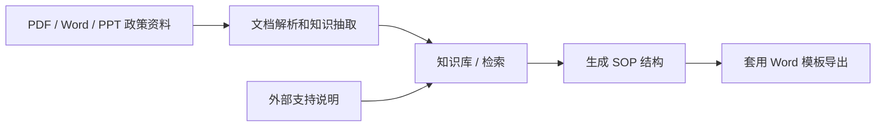
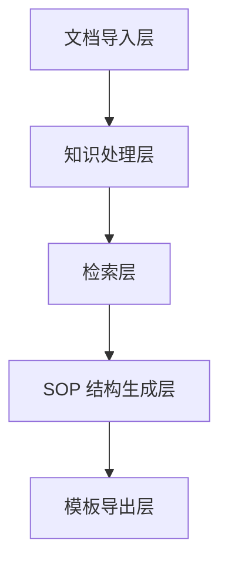

# 8.5.5 项目：知识库驱动的 SOP 文档助手


:::tip[本节定位]
这个项目比普通知识库问答再往前走一步。
它不只是回答问题，而是实际生成：

- 一份带有清晰章节、来源引用和检查清单字段的 Word SOP 文档

所以它特别适合训练这些系统能力的组合：

- 文档解析
- 知识检索
- 政策和案例抽取
- 结构化输出
- 模板化文档生成
:::
## 学习目标

- 学会把“事件主题 -> 政策检索 -> 案例抽取 -> SOP 草稿”组织成完整流程
- 学会定义一个知识库驱动 SOP 文档系统的最小项目边界
- 学会把内部政策检索和外部支持说明补充分开设计
- 学会把这个项目做成有产品感的作品集系统

## 新手概念桥梁

这个项目会同时跨过文档处理、检索、生成和导出。先把几个词说清楚：

| 术语 | 新手理解 | 在本项目中的作用 |
|---|---|---|
| `ingestion` | 把文件放进系统，并准备好后续处理 | PDF / Word / PPT 政策资料从这里进入链路 |
| `policy and case extraction` | 从文档中识别政策条款、判断规则、已处理案例和复核清单 | SOP 草稿需要运营证据，不只是普通段落 |
| `schema` | 稳定的数据结构，规定 SOP 输出长什么样 | 让检索、生成和模板导出对齐 |
| `template rendering` | 把结构化内容填进 Word 或 PPT 模板 | 把内容生成和文档格式分开 |
| `source_refs` | 每个生成章节或条目保留的来源引用 | 让最终 Word 草稿能说明内容来自哪里 |
| `internal vs external materials` | 内部资料是可信公司政策，外部资料只是补充 | 避免外部说明覆盖正式政策 |

核心判断是：模型不应该直接“写一个 Word 文件”。它应该帮助生成稳定的结构化 SOP 对象，再交给模板层可靠渲染。

---

## 先建立项目地图

这个项目最好理解成“知识入库 -> 检索 -> 结构化生成 -> 模板导出”：



所以，这个项目真正要解决的是：

- 当用户只给出一个事件主题时，系统如何自动找到政策资料，抽取案例和清单，再按模板写出来？

## 项目范围应该怎么收窄？

一个非常稳的起点通常是：

> **做一个知识库驱动的支持 SOP 助手。用户输入事件主题后，系统自动生成一份 Word 草稿，里面包含政策摘要、处理案例、复核清单和来源说明。**

为什么这个范围适合入门？

- 主题清楚
- 资料格式清楚
- 政策条款、已处理案例和清单项都可以从文档中抽取
- Word 输出目标明确

不建议一开始就做：

- 所有部门
- 所有政策场景
- 自动生成 Word + PPT + Slack 回复 + 审批工单

那样很容易偏离主线。

## 给新手一个更好的类比

你可以把这个系统想成：

- 一个运营分析助手，先读政策资料，再整理交接大纲，最后帮你起草 SOP

它不是凭空写作，而是：

1. 先查内部政策
2. 需要时再补充外部支持说明
3. 再从资料中选择政策条款、已处理案例和清单项
4. 最后按固定格式写进 SOP 文档

这个类比很重要，因为它能帮新手避免把项目理解成：

- “让模型直接写一个 Word 文档就行”

## 最小系统闭环长什么样？

1. 导入文档
2. 解析正文、标题、表格和判断规则
3. 用户输入事件主题
4. 系统检索内部知识块
5. 如果需要，再补充外部支持说明
6. 生成结构化 SOP 对象
7. 通过模板导出 Word

只要这 7 步能顺畅跑通，项目就已经很接近真实产品。

## 先跑一个最小工作流例子

```python
knowledge_base = [
    {
        "topic": "退款升级",
        "content_type": "policy",
        "text": "当退款资格或支付状态不清楚时，需要升级给人工复核。",
    },
    {
        "topic": "退款升级",
        "content_type": "case",
        "text": "银行卡支付且下单超过 7 天的订单，承诺退款前应先进入账务复核。",
    },
    {
        "topic": "退款升级",
        "content_type": "checklist",
        "text": "检查订单时间、支付状态、使用证据和历史支持记录。",
    },
]


def retrieve_internal(topic):
    return [item for item in knowledge_base if item["topic"] == topic]


def retrieve_external(topic):
    # 这里只做最小模拟
    return [{"topic": topic, "content_type": "note", "text": f"外部补充：{topic} 的近期支持流程说明。"}]


def build_sop_document(topic):
    internal = retrieve_internal(topic)
    external = retrieve_external(topic)
    all_items = internal + external
    return {
        "title": topic,
        "policies": [x["text"] for x in all_items if x["content_type"] == "policy"],
        "cases": [x["text"] for x in all_items if x["content_type"] == "case"],
        "checklists": [x["text"] for x in all_items if x["content_type"] == "checklist"],
        "notes": [x["text"] for x in all_items if x["content_type"] == "note"],
    }


print(build_sop_document("退款升级"))
```

预期输出：

```text
{'title': '退款升级', 'policies': ['当退款资格或支付状态不清楚时，需要升级给人工复核。'], 'cases': ['银行卡支付且下单超过 7 天的订单，承诺退款前应先进入账务复核。'], 'checklists': ['检查订单时间、支付状态、使用证据和历史支持记录。'], 'notes': ['外部补充：退款升级 的近期支持流程说明。']}
```

### 这个例子最重要的价值是什么？

它说明这个系统真正有价值的地方不只是：

- 会检索

而是能把检索到的内容重新组织成：

- SOP 文档需要的章节结构

## 加一个快速结构检查

在导出 Word 前，先检查每个必填槽位是否有内容。这样可以避免模板渲染器生成一份很好看但空洞的文档。

```python
sop_doc = build_sop_document("退款升级")
required_slots = ["policies", "cases", "checklists", "notes"]

for slot in required_slots:
    count = len(sop_doc[slot])
    print(f"{slot}: {count} item(s)", "OK" if count else "CHECK")
```

预期输出：

```text
policies: 1 item(s) OK
cases: 1 item(s) OK
checklists: 1 item(s) OK
notes: 1 item(s) OK
```

## 更像真实项目的系统分层图

新手做这类项目时，最容易犯的错误是把“知识库、检索、生成、导出”混在一起。

更稳的做法是先拆出层次：



可以简单理解为：

- 导入层：把资料读进来
- 处理层：把资料变成知识块
- 检索层：找到相关政策和案例
- 生成层：把材料重新组织成 SOP 文档结构
- 导出层：把结构变成 Word

## 这个项目最需要哪些能力？

按系统层看，核心能力包括：

### 文档解析

- PDF / DOCX / PPTX 读取
- 扫描件 OCR
- 标题层级、表格和判断规则识别

相关课程：
- [8.3.8 文档解析与知识提取](../ch03-app-dev/07-document-parsing.md)
- [8.1.3 文档处理](../ch01-rag/02-document-processing.md)
- [10.5.4 OCR 文本识别](../../ch10-computer-vision/ch05-advanced/03-ocr.md)

### 知识库与检索

- 切分
- 元数据
- 主题检索
- 政策和案例召回

相关课程：
- [8.1.2 RAG 基础](../ch01-rag/01-rag-basics.md)
- [8.1.4 向量数据库](../ch01-rag/03-vector-databases.md)
- [8.1.5 检索策略](../ch01-rag/04-retrieval-strategies.md)

### 结构化输出与模板生成

- 先生成大纲
- 再生成政策摘要 / 处理案例 / 复核清单
- 最后套 Word 模板导出

相关课程：
- [7.5.2 Prompt 基础](../../ch07-llm-principles/ch05-prompt/01-prompt-basics.md)
- [7.5.4 结构化输出](../../ch07-llm-principles/ch05-prompt/03-structured-output.md)
- [8.3.9 模板化文档生成（Word / PPT）](../ch03-app-dev/08-template-doc-generation.md)

### 工具调用和工作流

- 内部知识库检索
- 外部支持说明补充
- 模板渲染
- 文件导出

相关课程：
- [8.3.4 Function Calling 实战](../ch03-app-dev/03-function-calling.md)
- [8.3.6 对话系统与多轮管理](../ch03-app-dev/05-dialog-system.md)
- [9.2.5 Plan-and-Execute](../../ch09-agent/ch02-reasoning/04-plan-and-execute.md)

## 为什么不要让模型直接生成 Word 文件？

直接生成看起来演示很快，但系统会很难调试。最终文档出错时，你很难判断问题来自：

- 文档解析器
- 检索器
- 提示词
- 输出 schema
- Word 模板

更好的项目架构是：

```text
documents -> chunks -> retrieved evidence -> SOP schema -> Word template
```

每个中间结果都可以检查。这才让系统像产品，而不只是提示词演示。

## 定型 SOP 文档需要什么最小 schema？

schema 一开始不需要复杂。
关键是它要描述“SOP 文档应该长什么样”。

例如：

```python
sop_schema = {
    "title": "SOP 名称",
    "audience": "支持团队",
    "document_goal": ["目标 1", "目标 2"],
    "sections": [
        {"type": "policy", "heading": "政策摘要", "items": []},
        {"type": "case", "heading": "处理案例", "items": []},
        {"type": "checklist", "heading": "复核清单", "items": []},
    ],
    "source_refs": [{"doc_id": "policy_001", "page_or_slide": 3}],
}
```

这个 schema 给每一层一个清晰契约：

- 检索知道要找什么证据
- 生成知道要填什么结构
- 模板渲染知道每个块放在哪里
- 评估知道要检查什么

## 内部资料和外部资料应该怎么结合？

对 SOP 生成来说，内部资料应该决定主结构。外部资料可以补空白，但不能覆盖公司政策。

| 内容需求 | 优先级 |
|---|---|
| 资格规则 | 内部政策优先 |
| 升级案例 | 内部 runbook 优先 |
| 最近例外或支持流程说明 | 外部说明作为补充 |
| 内部资料缺口 | 外部说明可帮助起草问题或提醒 |

一个简单规则是：

- 内部政策定义骨架
- 外部说明只补充缺失背景或近期运营语境

在合规敏感的流程里，这点尤其重要。

## 一个更完整的项目流程

当最小闭环跑通后，整个流程可以变成：

```python
def generate_sop_document(topic):
    parsed_docs = load_parsed_documents()
    internal_hits = retrieve_internal(parsed_docs, topic)
    external_hits = retrieve_external(topic)
    selected = merge_and_rank(internal_hits, external_hits)
    structured = build_sop_schema(topic, selected)
    return export_word(structured)
```

这个函数隐藏了很多实现细节，但项目边界很清楚：

- 输入：主题和文档资料库
- 中间产物：解析后的 chunks、检索结果、结构化 schema
- 输出：Word SOP 文档

## 读懂生产线图


这张图要当成生产线来读：资料进入系统，被解析成知识块，再按主题和内容类型检索，转换成 SOP schema，最后渲染成 Word。哪一层没有中间产物，后面就很难排查问题。

## 这个项目应该怎么评估？

不要只看最终 Word 文件“好不好看”。要检查整条链路：

1. 检索是否正确
2. 政策、案例和清单项抽取是否正确
3. 生成结构是否符合模板
4. 来源引用能否追溯到原始资料
5. 系统能否处理缺失或冲突证据

评估表可以这样设计：

| 维度 | 检查点 |
|---|---|
| 检索质量 | 能找到相关政策和案例材料 |
| 结构正确性 | 政策摘要、处理案例、清单项放在正确位置 |
| 引用可追溯性 | 每个重要条目都有来源引用 |
| 模板质量 | Word 输出标题、表格和格式稳定 |
| 失败处理 | 缺失证据时给出明确追问或警告 |

## 建议的版本路线

可以按版本推进：

| 版本 | 目标 |
|---|---|
| V0 | 手工政策片段列表 + 固定 SOP schema |
| V1 | 本地 PDF / Word / PPT 解析 |
| V2 | 带元数据过滤的向量检索 |
| V3 | 外部支持说明补充 |
| V4 | Word 模板导出 |
| V5 | 评估集、失败日志和来源追踪视图 |

这样比一开始就做“完全自动化运营文档 Agent”稳得多。

## 一个有作品集质量的演示应该展示什么？

如果想让这个项目显得专业，建议展示：

1. 输入主题
2. 检索到的内部政策块
3. 如果使用了外部补充，也展示外部说明
4. 最终 SOP 结构如何形成
5. 导出的 Word 文件
6. 一张小型评估表

这能证明你不仅会让模型生成文字，也能搭建可靠的文档生成工作流。

## 常见坑

| 坑 | 为什么有问题 | 更好的做法 |
|---|---|---|
| 直接让模型写完整文档 | 错误很难追踪 | 先生成结构化 SOP 对象 |
| 不保留来源引用 | 最终输出难以信任 | 每个重要条目保留 `source_refs` |
| 把外部说明当成正式政策 | 可能产生错误指导 | 让内部政策优先级更高 |
| 先设计模板再设计 schema | 格式和内容容易漂移 | 先定义 schema，再映射到模板 |
| 只评估最终 Word 文件 | 会隐藏检索和解析错误 | 分层评估每个环节 |

## 相关项目变体

完成这个基线后，同一架构可以迁移到：

- 客服交接记录
- 合规复核摘要
- 事故响应 runbook
- 内部新人上手手册
- 产品发布检查清单文档

领域会变，但核心模式不变：

```text
document library -> retrieval evidence -> structured document -> template export
```

## 本节小结

- 这个项目的核心是“文档知识 -> 结构化 SOP 文档 -> 模板导出”的完整链路
- 内部政策应该定义主骨架，外部说明只补充缺失语境
- 模型应该先生成结构化数据，而不是直接操纵 Word 格式
- 好的项目演示要展示中间证据，不只是最终文档

<details>
<summary>检查推理与解释</summary>

1. 这个项目最重要的不是“输出文档”，而是“文档知识 -> 结构化 SOP 文档”这整条链路。
2. 内部资料决定可靠骨架。外部资料可以补充，但不应覆盖正式来源。
3. 一个强作品集演示应该包含检索证据、schema 输出、导出的 Word 文件和评估结果。

</details>
