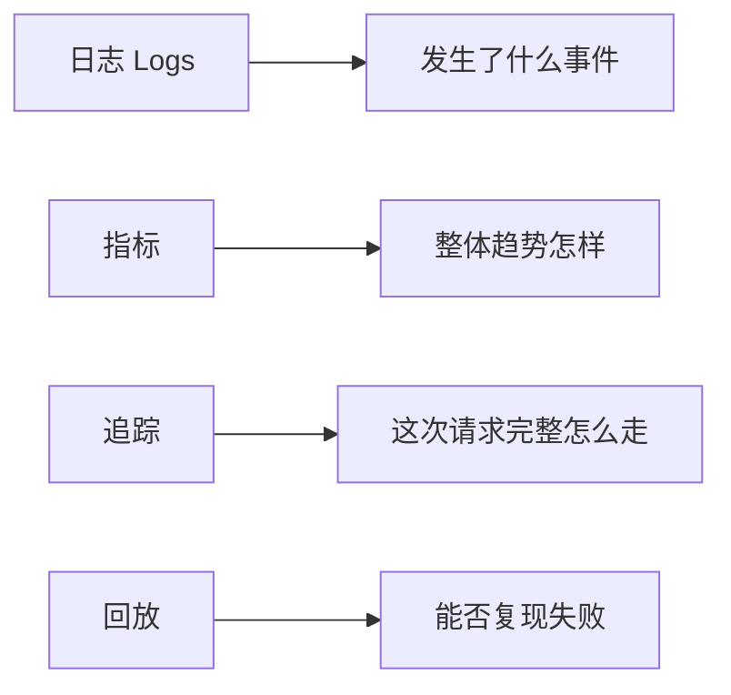
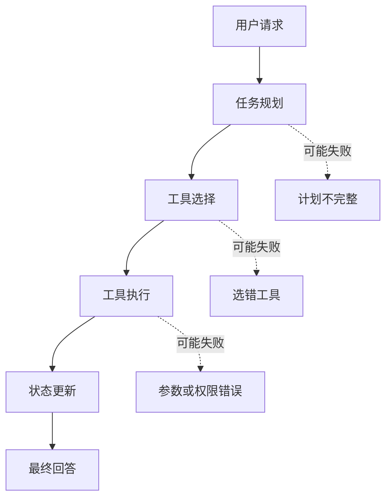

# 9.8.6 Agent 可观测性

:::tip[本节定位]
Agent 系统如果没有可观测性，很多问题会变成“看起来怪怪的，但不知道哪一步怪”。这节的核心是让系统内部过程可以被看见、被定位、被回放。
:::
## 学习目标

- 理解日志、指标、追踪 和回放分别解决什么问题
- 知道为什么 Agent 比普通接口更需要轨迹级观测
- 能设计一个最小 Agent 追踪结构
- 能用观测数据定位工具调用、检索、规划和成本问题

---

## 先建立一张地图



普通接口通常只要知道请求成功还是失败、耗时多少、错误码是什么。Agent 不一样，一次请求可能包含多轮推理、多次检索、多个工具、状态变更和人工确认。如果只保存最终回答，你几乎无法解释它为什么答错、为什么调用错工具、为什么成本突然升高。

## Agent 为什么特别需要可观测性

Agent 的失败经常不是单点失败，而是链路失败。比如用户问“帮我整理 RAG 复习资料”，系统可能先拆任务，再查课程文档，再生成计划，再调用文件工具。如果最后结果不好，原因可能是任务拆错、检索错、工具参数错、上下文丢失，也可能是模型在最后生成时忽略了来源。



所以 Agent 可观测性的目标不是“多打印几行日志”，而是能重建一次任务的执行轨迹。

## 四类最重要的观测对象

日志回答“发生了什么事件”，例如开始检索、调用工具、工具报错。指标回答“整体趋势怎样”，例如平均耗时、成功率、token 成本、工具失败率。追踪记录回答“这次请求完整链路怎么走”，例如每一步输入、输出、状态变化。回放回答“能不能复现失败”，也就是保留足够上下文让你重新运行或人工分析。

| 类型 | 关注点 | 典型字段 |
|---|---|---|
| 日志（Logs） | 单个事件 | timestamp、level、event、message |
| 指标（指标） | 聚合趋势 | success_rate、延迟_ms、cost、tool_error_rate |
| 追踪记录 | 请求链路 | request_id、步骤_id、node、input、output、status |
| 回放 | 复现失败 | 原始输入、检索结果、工具返回、模型参数、最终输出 |

## 一个最小 追踪 结构约束

第一次做 Agent 可观测性时，不需要马上接复杂平台。先让每次请求留下结构化轨迹即可。

```python
from dataclasses import dataclass, asdict


@dataclass
class TraceStep:
    request_id: str
    step_id: int
    node: str
    input_summary: str
    output_summary: str
    status: str
    latency_ms: int
    cost_tokens: int = 0


def run_agent(query):
    request_id = "req_rag_review_001"
    trace = []

    plan = "先检索课程文档，再生成复习计划"
    trace.append(TraceStep(request_id, 1, "planner", query, plan, "ok", 0))

    docs = ["RAG 包含切分、向量化、检索、生成和引用检查"]
    trace.append(TraceStep(request_id, 2, "retriever", "RAG 复习", str(docs), "ok", 0))

    answer = "建议按：基础概念 -> 检索优化 -> 评估集 -> 项目复盘来复习。"
    trace.append(TraceStep(request_id, 3, "generator", str(docs), answer, "ok", 0, cost_tokens=120))

    return answer, [asdict(step) for step in trace]


answer, trace = run_agent("帮我准备 RAG 阶段复习")
print(answer)
for step in trace:
    print(step)
```

预期输出：

```text
建议按：基础概念 -> 检索优化 -> 评估集 -> 项目复盘来复习。
{'request_id': 'req_rag_review_001', 'step_id': 1, 'node': 'planner', 'input_summary': '帮我准备 RAG 阶段复习', 'output_summary': '先检索课程文档，再生成复习计划', 'status': 'ok', 'latency_ms': 0, 'cost_tokens': 0}
{'request_id': 'req_rag_review_001', 'step_id': 2, 'node': 'retriever', 'input_summary': 'RAG 复习', 'output_summary': "['RAG 包含切分、向量化、检索、生成和引用检查']", 'status': 'ok', 'latency_ms': 0, 'cost_tokens': 0}
{'request_id': 'req_rag_review_001', 'step_id': 3, 'node': 'generator', 'input_summary': "['RAG 包含切分、向量化、检索、生成和引用检查']", 'output_summary': '建议按：基础概念 -> 检索优化 -> 评估集 -> 项目复盘来复习。', 'status': 'ok', 'latency_ms': 0, 'cost_tokens': 120}
```


这个例子最重要的不是代码复杂度，而是它把每一步都变成可检查对象。后面无论你用 LangGraph、LlamaIndex、CrewAI，还是自己写函数，底层都应该保留类似轨迹。

## 排查问题时怎么看 追踪

当 Agent 输出质量差时，不要先改 Prompt。更稳的排查顺序是：先看计划是否正确，再看检索或工具结果是否正确，再看模型是否正确使用了这些结果，最后才看最终表达。

| 现象 | 优先看哪里 | 可能原因 |
|---|---|---|
| 回答跑题 | 规划器 / 检索器 | 任务理解错、检索 查询 错 |
| 编造来源 | 检索器 / 生成器 | 没有命中文档、生成时未引用检索结果 |
| 工具没执行 | 工具选择 / 工具调用 | 工具描述不清、权限不足、参数 结构约束 错 |
| 成本突然升高 | 指标 / 追踪 | 循环调用、上下文过长、重试过多 |
| 偶发失败 | 回放样本 | 输入边界、外部服务波动、状态未持久化 |

## 最值得先记录的字段

如果只能先做最小版本，建议至少保留：request_id、user_query、plan、selected_tools、tool_inputs、tool_outputs、retrieved_docs、final_answer、latency_ms、token_usage、status、error_message。这些字段能覆盖大多数调试需求。

对于高风险 Agent，还应该记录 human_approval、permission_scope、rollback_action 和 audit_log。凡是涉及发消息、改文件、删数据、付款、发邮件的动作，都不能只留最终结果。

## 和现有工具的关系

真实项目里可以使用 LangSmith、OpenTelemetry、Arize Phoenix、Helicone 或云厂商日志系统来承载观测数据。课程里不要求你绑定某个工具，但要理解这些工具共同解决的是同一件事：把模型调用、检索、工具、状态和成本串成可查询的执行轨迹。

更重要的是，不要把工具当成可观测性的全部。即使用了平台，如果你的事件命名混乱、字段缺失、request_id 没有贯穿全链路，排障仍然会很困难。

## 常见误区

第一个误区是只记录最终答案。最终答案只能说明结果，不说明过程。第二个误区是只打自然语言日志，不保留结构化字段；这样后续很难统计和筛选。第三个误区是只在报错时记录，成功样本同样重要，因为你需要对比成功和失败链路的差异。第四个误区是没有成本指标，导致系统能跑但不可持续。

## AI 应用统一观测字段

虽然这一节重点是 Agent，但前面的 LLM API、Prompt、RAG 和工具调用也都需要观测。更好的做法是让所有 AI 应用共享一个 request_id，然后分层记录。

| 层级 | 必记字段 | 用来排查什么 |
|---|---|---|
| LLM 调用层 | model、prompt_version、input_preview、output_preview、tokens、延迟、error | 模型输出、成本、延迟、格式漂移 |
| Prompt 层 | prompt_version、结构约束_version、parse_status、validation_error | 结构化输出是否稳定 |
| RAG 层 | 查询、rewritten_查询、top_k、scores、source_ids、上下文_length | 是否找到了正确资料，上下文 是否合理 |
| Agent 层 | goal、步骤、action、arguments、observation、next_decision | 为什么选择这个动作，为什么继续或停止 |
| 工具层 | tool_name、permission_scope、arguments、result_status、retry_count | 工具是否选对、参数是否正确、是否失败 |
| 安全层 | risk_level、human_approval、blocked_reason、rollback_action | 高风险动作是否被确认和审计 |

这张表可以作为所有 AI 项目的日志设计起点。不要等系统出问题后才想起补日志；没有 request_id 和结构化字段，后面很难把一次失败串起来。


:::tip[读图提示]
看这张图时，抓住 request_id 这根线：一次用户请求会穿过规划器、检索器、工具、LLM、安全层等多个 span。只有链路能串起来，排障才不会靠猜。
:::
## 一次请求的跨层 追踪 示例

下面是一个“课程学习助手”的跨层 trace。它同时经过了 RAG、LLM 和 Agent 工具层。

```json
{
  "request_id": "req_001",
  "user_query": "帮我制定 RAG 三天复习计划",
  "rag": {
    "query": "RAG 三天复习计划",
    "top_k": 3,
    "source_ids": ["rag-basics", "retrieval-strategies", "rag-evaluation"],
    "context_length": 820
  },
  "llm": {
    "model": "demo-chat-model",
    "prompt_version": "study_plan_v2",
    "prompt_tokens": 520,
    "completion_tokens": 180,
    "latency_ms": 1200,
    "parse_status": "ok"
  },
  "agent": {
    "steps": [
      {"step": 1, "action": "retrieve_course_docs", "status": "ok"},
      {"step": 2, "action": "build_study_plan", "status": "ok"}
    ],
    "final_status": "ok"
  }
}
```

这个例子最值得注意的是：它不是把所有日志混成一段文字，而是分层记录。这样当答案不好时，你可以先判断是 RAG 没找对、Prompt 没约束好、LLM 输出不稳定，还是 Agent 工具步骤出了问题。

## 观测数据怎么进入作品集

作品集不需要展示所有原始日志，但应该展示你如何使用日志改进系统。

| README 模块 | 可以展示什么 |
|---|---|
| 调试日志样例 | 一次成功请求和一次失败请求的 追踪 摘要 |
| 指标面板 | 平均延迟、失败率、token 成本、检索命中率 |
| 失败归因 | 失败样本对应到 LLM、RAG、Agent、工具或安全层 |
| 改进记录 | 改动前后指标变化和代价 |
| 安全审计 | 高风险动作如何确认、拒绝和记录 |

这会让项目显得更成熟：你不仅能做出功能，还能观察它、评估它、解释它，并持续改进它。

## 最小日志文件设计

如果暂时没有接入专业观测平台，可以先用 JSONL 文件记录。每一行是一条事件或一次 trace。

```text
logs/
├── llm_calls.jsonl
├── retrieval_logs.jsonl
├── agent_traces.jsonl
├── tool_calls.jsonl
└── safety_audit.jsonl
```

每个文件都应该带 request_id。这样你可以用同一个 request_id 把一次用户请求从模型调用、检索、工具执行、安全确认一路串起来。

---

## 留下的证据

学完这一页，至少保留这张证据卡：

```text
评估用例：固定任务和期望的安全行为
评分卡：任务成功、工具正确性、trace 质量和安全性
护栏：策略、权限、验证或人工确认
失败检查：工具使用不安全、提示注入、隐藏状态或未被观测的动作
下一步动作：添加案例、护栏、日志、回滚或拒绝路径
```

## 练习

1. 给上面的 追踪 示例补充 `error_message` 和 `retry_count` 字段。
2. 设计一个 RAG Agent 的 追踪 结构约束，至少包含检索 查询、命中文档、引用检查结果。
3. 找一个你之前写过的 LLM 示例，补上 request_id 和 延迟_ms。
4. 思考：如果一个 Agent 可以删除文件，追踪 中必须额外记录哪些安全字段？

## 过关标准

学完这一节后，你应该能解释日志、指标、trace、replay 的区别，能写出一个最小 Agent trace schema，能根据 trace 判断错误发生在规划、检索、工具还是生成阶段，并能把可观测性写进自己的 Agent 项目 README。

<details>
<summary>项目交付参考与讲解</summary>

1. 某一步失败时加入 `error_message`，同一逻辑步骤每重试一次就递增 `retry_count`。这两个字段应写在 trace row 里，而不只放在 console log。
2. RAG Agent trace 应包含 request_id、retrieval_query、filters、matched_doc_ids、scores、selected_context、citation_check、generation_status、latency_ms，以及任何 refusal 或 fallback reason。
3. LLM 调用要在开始时挂上 `request_id`，并围绕真实模型请求记录 `latency_ms`。日志、指标、trace 和评估记录应使用同一个 id。
4. 如果 Agent 能删除文件，必须记录目标路径、权限范围、dry-run 结果、人工批准、backup/checkpoint id、删除结果、rollback status，以及允许或阻止该动作的 policy。

</details>
