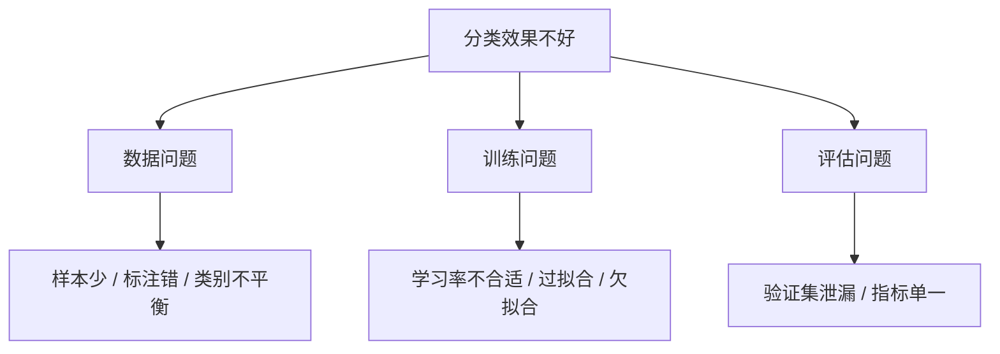

# 10.2.4 图像分类训练技巧

:::tip[本节定位]
图像分类项目不是模型一换就好。很多时候，真正决定效果的是训练细节：数据增强是否合理、学习率是否稳定、验证集是否可信、错误样本有没有被分析。
:::
## 学习目标

- 能判断训练不收敛、过拟合、欠拟合的常见原因
- 理解学习率、batch size、数据增强和正则化的作用
- 知道类别不平衡和数据泄漏会怎样影响分类结果
- 能用错误样本分析指导下一轮改进

---

## 先看训练问题地图



## 一、学习率是最先检查的旋钮

学习率太大，loss 可能震荡甚至发散；学习率太小，训练会非常慢，模型看起来像没学到东西。初学时可以先从一个常见默认值开始，再观察训练曲线。

先用不依赖框架的小例子理解调度思想。下面这段模拟常见的 `StepLR` 策略：学习率保持几轮后，再乘以 `gamma`。

```python
initial_lr = 1e-3
step_size = 5
gamma = 0.1

for epoch in [1, 5, 6, 10, 11]:
    lr = initial_lr * (gamma ** ((epoch - 1) // step_size))
    print(f"epoch={epoch:02d} lr={lr:.5f}")
```

预期输出：

```text
epoch=01 lr=0.00100
epoch=05 lr=0.00100
epoch=06 lr=0.00010
epoch=10 lr=0.00010
epoch=11 lr=0.00001
```

如果训练 loss 和验证 loss 都很高，可能是欠拟合或学习率不合适。如果训练 loss 很低但验证 loss 很高，通常是过拟合或数据划分有问题。

## 二、数据增强要符合真实场景

数据增强不是越多越好，而是模拟真实世界可能出现的变化。猫狗分类可以水平翻转，但数字识别随便旋转 180 度可能改变语义；医学影像也不能随意做不符合成像逻辑的增强。

```python
augmentation_policy = [
    {"name": "RandomResizedCrop", "label_safe": True, "reason": "主体通常仍可识别"},
    {"name": "HorizontalFlip", "label_safe": True, "reason": "左右方向不是标签的一部分"},
    {"name": "Rotate180", "label_safe": False, "reason": "可能改变数字或方向敏感标签"},
]

for rule in augmentation_policy:
    status = "use" if rule["label_safe"] else "avoid"
    print(f"{status}: {rule['name']} - {rule['reason']}")
```

预期输出：

```text
use: RandomResizedCrop - 主体通常仍可识别
use: HorizontalFlip - 左右方向不是标签的一部分
avoid: Rotate180 - 可能改变数字或方向敏感标签
```

增强的原则是：训练集做增强，验证集不做随机增强；增强应该保留标签语义；增强后最好人工抽查几张图。

## 三、过拟合和欠拟合怎么区分

| 现象 | 可能原因 | 优先处理 |
|---|---|---|
| 训练和验证都差 | 模型太弱、训练不够、学习率问题 | 增加训练轮数、调学习率、换 backbone |
| 训练好验证差 | 过拟合、数据少、增强不足 | 加强增强、正则化、早停、更多数据 |
| 训练波动大 | batch 太小、学习率偏大 | 降学习率、增大 batch、检查数据 |
| 验证分数异常高 | 数据泄漏 | 检查重复图片、同一主体是否跨集合 |


:::tip[读图提示]
这张图把训练问题拆成数据、训练、评估三条线。看到分类效果不好时，先别急着换模型，先看 loss 曲线、验证集泄漏、类别不平衡和错误样本。
:::
## 四、类别不平衡要看混淆矩阵

准确率在类别不平衡时很容易骗人。比如 95% 图片都是正常样本，模型全预测正常也有 95% 准确率，但它完全不会识别异常。

```python
labels = ["normal", "scratch", "stain"]
y_true = ["normal", "normal", "scratch", "scratch", "stain", "stain"]
y_pred = ["normal", "normal", "normal", "scratch", "normal", "stain"]

index = {label: i for i, label in enumerate(labels)}
matrix = [[0 for _ in labels] for _ in labels]

for truth, pred in zip(y_true, y_pred):
    matrix[index[truth]][index[pred]] += 1

print("confusion_matrix:")
for label, row in zip(labels, matrix):
    print(label, row)

print("\nrecall_by_class:")
for label, row in zip(labels, matrix):
    recall = row[index[label]] / sum(row)
    print(label, round(recall, 2))
```

预期输出：

```text
confusion_matrix:
normal [2, 0, 0]
scratch [1, 1, 0]
stain [1, 0, 1]

recall_by_class:
normal 1.0
scratch 0.5
stain 0.5
```

类别不平衡可以考虑重采样、class weight、focal loss 或补充少数类数据。选择哪种方法，要看少数类样本是否足够可靠。

## 五、错误样本分析

每次训练后至少抽查 20 个错误样本。把它们分成几类：标注错误、图像质量差、类别边界模糊、模型关注错区域、训练集中类似样本太少。错误样本分析比盲目换模型更能指导下一步。

## 六、最小训练记录模板

README 或实验记录里建议保留：数据集版本、训练/验证划分方式、模型结构、输入尺寸、增强策略、学习率、batch size、epoch、最佳指标、混淆矩阵、错误样本截图和下一步计划。

## 留下的证据

学完这一页，至少保留这张证据卡：

```text
数据集划分：训练/测试图像、类别名和类别平衡
预测：标签、置信度和至少一张分类错误的图像
指标：准确率、F1、混淆矩阵和类别级错误
失败检查：增强改变标签含义、类别不平衡、数据泄漏或过拟合
期望产出：模型结果表和保存的错误示例
```

## 常见误区

第一个误区是只看 accuracy，不看类别级指标。第二个误区是验证集也用了随机增强。第三个误区是同一对象或同一视频帧同时出现在训练和验证，造成泄漏。第四个误区是一遇到效果差就换模型，而不先检查数据和训练曲线。

## 练习

1. 训练一个小型分类模型，画出 train loss 和 val loss 曲线。
2. 对同一模型分别使用弱增强和强增强，比较验证集效果。
3. 输出混淆矩阵，找出最容易混淆的两个类别。
4. 整理 10 张错误样本，给每张写一句可能原因。

<details>
<summary>解题思路与讲解</summary>

1. 看 loss 曲线时，train loss 下降但 val loss 上升通常说明过拟合；两者都很高多半是欠拟合；剧烈震荡常见于学习率或数据问题。
2. 弱增强可能压不住过拟合；强增强可能让训练过难，甚至改变标签语义。决定前要同时看验证指标和增强样本可视化。
3. 混淆矩阵应能看出哪两类最容易混淆。如果类别不平衡，归一化比例通常比原始数量更容易解释。
4. 10 个错误样本最好按原因归类：标签问题、模糊、遮挡、类别本身相似、背景捷径、预处理不一致等。

</details>

## 过关标准

学完本节后，你应该能根据训练曲线判断常见问题，能设计合理的数据增强，能用混淆矩阵分析类别问题，并能把错误样本分析写进图像分类项目 README。
