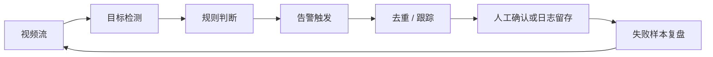

# 10.6.2 项目：智能安防系统

:::tip[本节定位]
安防项目很容易做成“检测到人就画框”的演示。
但真正能交付的安防系统，关注的通常不是框本身，而是：

- 告警准不准
- 会不会重复报警
- 时延够不够低
- 误报会不会把人烦死

所以这节课的重点是把它做成一个**作品级系统项目**，而不是单次检测展示。
:::
## 学习目标

- 学会定义一个可交付的安防检测任务边界
- 学会把检测、规则、告警和去重串成一条闭环
- 学会设计最基础的评估与失败分析
- 学会把这个项目做成有说服力的作品集展示

---

## 一、先把项目题目定义清楚

一个适合练手、又很像真实业务的题目可以是：

> **做一个“禁区入侵告警系统”，输入监控帧序列，输出“是否触发告警 + 告警发生在哪一帧”。**

这个题目好在：

- 目标简单
- 业务意义清楚
- 很容易解释误报和漏报

### 为什么不建议一开始就做很大？

例如：

- 同时做烟火检测、摔倒检测、安全帽检测、车辆识别

这种范围太大，项目容易只剩功能堆叠，没有一个清楚主线。

---

## 二、作品级安防项目最小闭环长什么样？

1. 定义监控目标和禁区
2. 做检测
3. 把检测框映射成告警逻辑
4. 做去重 / 跟踪
5. 评估告警质量
6. 展示成功与失败案例

如果只做前两步，那更像模型演示；
做到后面几步，才更像一个系统项目。

### 一张更像真实系统的告警闭环图



这张图很重要，因为它提醒你：

- 安防系统真正交付的是告警体验
- 不是单张图上的框


:::tip[读图提示]
安防项目的输出不是“画框”，而是可信告警。读图时重点看检测结果如何进入规则判断，track_id 如何避免重复报警，最后再进入人工确认、日志和失败复盘。
:::
---

## 三、先跑一个“检测 -> 告警 -> 去重”的最小闭环

下面这个示例会做三件非常关键的事：

1. 读取逐帧检测结果
2. 判断是否进入危险区域
3. 对同一目标的连续多帧命中做告警去重

```python
detections = [
    {"frame": 1, "track_id": 101, "label": "person", "box": (40, 40, 80, 120)},
    {"frame": 2, "track_id": 101, "label": "person", "box": (42, 42, 82, 122)},
    {"frame": 3, "track_id": 101, "label": "person", "box": (44, 45, 84, 125)},
    {"frame": 4, "track_id": 202, "label": "person", "box": (150, 150, 180, 210)},
]

danger_zone = (30, 30, 100, 140)


def is_inside(box, zone):
    bx1, by1, bx2, by2 = box
    zx1, zy1, zx2, zy2 = zone
    return bx1 >= zx1 and by1 >= zy1 and bx2 <= zx2 and by2 <= zy2


def build_alerts(detections, zone):
    active_tracks = set()
    alerts = []

    for det in detections:
        inside = det["label"] == "person" and is_inside(det["box"], zone)
        if inside and det["track_id"] not in active_tracks:
            alerts.append(
                {
                    "frame": det["frame"],
                    "track_id": det["track_id"],
                    "alert": "intrusion",
                }
            )
            active_tracks.add(det["track_id"])
        elif not inside and det["track_id"] in active_tracks:
            active_tracks.remove(det["track_id"])

    return alerts


alerts = build_alerts(detections, danger_zone)
print(alerts)
```

预期输出：

```text
[{'frame': 1, 'track_id': 101, 'alert': 'intrusion'}]
```

只有 `101` 这条轨迹第一次进入危险区域时会触发告警。第 2、3 帧不会重复告警，因为同一条轨迹已经处于 active 状态。

### 这个例子为什么比“检测到人就报警”强得多？

因为它已经体现了安防系统里最重要的一层工程判断：

- 同一个人连续 3 帧都在禁区
- 不能报警 3 次

### 为什么 `track_id` 很重要？

没有跟踪信息，你很难判断：

- 这是同一个人
- 还是三个不同的人

所以安防项目从“检测”走向“系统”，
往往就卡在这一层。

---

## 四、一个作品级项目最该怎么评估？

### 不是只看检测精度

安防项目更应该至少拆成两层评估：

1. 检测层
   目标有没有找到
2. 告警层
   告警触发是否合理

### 最小告警评估示例

```python
pred_alerts = [
    {"frame": 1, "track_id": 101, "alert": "intrusion"},
]

gold_alerts = [
    {"frame": 1, "track_id": 101, "alert": "intrusion"},
    {"frame": 8, "track_id": 303, "alert": "intrusion"},
]


def alert_recall(pred_alerts, gold_alerts):
    gold_set = {(x["frame"], x["track_id"], x["alert"]) for x in gold_alerts}
    pred_set = {(x["frame"], x["track_id"], x["alert"]) for x in pred_alerts}
    hit = len(gold_set & pred_set)
    return hit / len(gold_set) if gold_set else 1.0


print("alert_recall:", round(alert_recall(pred_alerts, gold_alerts), 4))
```

预期输出：

```text
alert_recall: 0.5
```

系统只命中了 2 个应触发告警中的 1 个。这也是为什么告警层指标能暴露单张检测截图看不出来的问题。

### 为什么“告警层指标”比 mAP 更像项目价值？

因为实际交付给用户的不是框，而是：

- 告警

如果检测很准但告警策略很糟，
项目实际体验仍然会很差。

### 再看一个最小“告警疲劳”示例

```python
alerts_per_hour = [1, 2, 18, 3, 21]


def alert_fatigue(hours):
    too_many = sum(1 for x in hours if x >= 10)
    return "告警过密，用户很可能开始忽略系统" if too_many >= 2 else "告警密度初步可接受"


print(alert_fatigue(alerts_per_hour))
```

预期输出：

```text
告警过密，用户很可能开始忽略系统
```

这一步把告警数量变成了用户体验信号。告警太多时，系统可能技术上还在运行，但实际已经没人愿意相信它。

这个例子想强调的不是精确公式，而是一个很真实的系统问题：

- 告警不是越多越好
- 误报太多会让用户逐渐不相信系统

---

## 五、安防项目最值得展示的失败案例

### 误报

例如：

- 背景人像海报被识别成真人

### 漏报

例如：

- 光线很暗时漏掉入侵者

### 重复报警

例如：

- 同一个目标每帧都触发一次

### 为什么这些要单独展示？

因为这类失败恰好最能体现：

- 系统设计是否成熟

---

## 六、怎么把这个项目做成作品级展示？

建议页面至少展示：

1. 任务定义
2. 危险区域示意图
3. 检测结果和告警结果的对比
4. 一条连续视频片段中的告警轨迹
5. 误报 / 漏报 / 重复报警分析

这样它就不再像“检测演示”，而更像完整安防系统。

### 第一次做这类项目时，最稳的默认顺序

更稳的顺序通常是：

1. 先把目标收窄成一种告警
2. 先做单摄像头、单场景 baseline
3. 先把禁区和规则画清楚
4. 再补去重和简单跟踪
5. 最后再做告警质量分析

这样会比一开始就做：

- 多摄像头
- 多告警类型
- 多规则联动

更容易把项目做完整。

### 如果把它做成作品集，最值得强调什么

最值得强调的通常不是：

- 模型有多花哨

而是：

1. 你的告警规则为什么这样设计
2. 你怎么处理重复报警
3. 误报和漏报主要来自哪里
4. 你的系统边界是什么

这会让项目更像真实业务系统，而不是一个视觉演示。

---

## 七、最常见误区

### 只看模型精度，不看告警体验

### 没有去重逻辑

### 只展示成功视频

---

## 留下的证据

学完这一页，至少保留这张证据卡：

```text
任务输出：分类标签、检测框、分割掩膜、OCR 文本或视频事件
工件：原始图像、处理后图像、预测叠加图、指标文件和失败样本
指标：准确率/F1、mAP、IoU、Dice、延迟或场景特定审查分数
失败检查：数据质量、标签错误、预处理不匹配、阈值或部署约束
期望产出：一个可复现的运行文件夹，包含可视化输出和简短失败报告
```

## 小结

这节最重要的是建立一个作品级判断：

> **安防系统的价值，不在于它能画出多少框，而在于它能否把检测结果稳定、低误报地转成可信告警。**

只要这一层做扎实，这个项目就会非常像真实业务系统。

## 这节最该带走什么

- 安防项目真正交付的是告警，而不是检测框
- 去重、跟踪和规则判断，往往和模型本身一样重要
- 一个像样的作品级安防项目，必须展示误报、漏报和告警体验

---


## 版本路线建议

| 版本 | 目标 | 交付重点 |
|---|---|---|
| 基础版 | 跑通最小闭环 | 能输入、能处理、能输出，并保留一组示例 |
| 标准版 | 形成可展示项目 | 增加配置、日志、错误处理、README 和截图 |
| 挑战版 | 接近作品集质量 | 增加评估、对比实验、失败样本分析和下一步路线 |

建议先完成基础版，不要一开始就追求大而全。每提升一个版本，都要把“新增了什么能力、怎么验证、还有什么问题”写进 README。

## 练习

1. 给示例再加一个 `helmet` 类别，并设计“未戴安全帽”告警。
2. 想一想：为什么安防项目比普通检测项目更需要跟踪和去重？
3. 如果误报很多，你会先查数据、模型还是告警逻辑？为什么？
4. 如果把这个项目做成作品集，你最想突出哪一条完整视频 trace？

<details>
<summary>项目交付参考与讲解</summary>

1. 简单的 `helmet` 规则可以先检测 `person` 和 `helmet`，再判断某个人头部附近连续多帧没有重叠 helmet 区域时触发 `no_helmet` 报警。
2. 安防项目需要 tracking 和去重，因为同一个事件会出现在很多帧里。没有这些逻辑，一个人可能触发几十条重复报警。
3. 误报很多时，先按错误类型拆开看。框本身错就查数据和模型；框基本合理但报警很吵，就查阈值和报警逻辑。
4. 最有说服力的作品集证据是一段完整视频轨迹：原始帧、检测框、tracking ID、报警决策、误报、漏报，以及 README 里说明如何降低噪声。

</details>
