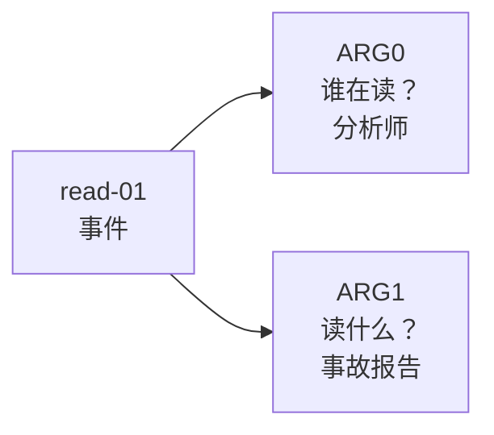

:::tip[本节定位]
文本不只是一串词。很多时候，我们真正想要的是句子背后的结构化含义。

AMR 这类语义图路线想回答的问题是：

> **能不能把一句话变成“谁做了什么、对谁做、在什么条件下做”的结构图？**
:::
## 一、为什么需要语义图？

普通文本表示常常像这样：

```text
乔布斯创立了苹果公司。
```

但信息抽取和知识库系统更想要这样的结构：

```text
人物：乔布斯
关系：创立
组织：苹果公司
```

如果再复杂一点，句子里可能有时间、地点、因果、条件、否定和指代。
这时简单的关键词匹配就不够了。

语义图的目标是：

> **把自然语言里的含义，变成机器更容易操作的图结构。**

## 二、AMR 是什么？

AMR 是 Abstract Meaning Representation，可以先理解为一种抽象语义图表示。

它不只是标出实体，还会尝试表示事件和角色关系。

例如“分析师阅读事故报告”可以想象成：

```text
read-01
  ARG0: 分析师
  ARG1: 事故报告
```

这个结构表达的是：

- 核心事件是阅读
- 谁在阅读：分析师
- 阅读对象是什么：事故报告

这比单纯分词更接近“句子真正想说什么”。

对初学者来说，最容易的读法是：



`ARG0` 和 `ARG1` 不是“第一个词”和“第二个词”，而是语义角色。在很多简单事件句里，可以先这样理解：

- `ARG0`：动作的发出者
- `ARG1`：动作影响的对象

这个小转变很重要：语义图不只看词序，更关心含义。

## 三、语义图和信息抽取有什么关系？

信息抽取通常先做比较具体的任务：

- 抽实体
- 抽关系
- 抽事件
- 抽属性

语义图更像把这些结果组织成一张更完整的含义结构。

| 任务 | 输出更像什么 |
|---|---|
| NER | 哪些词是人名、组织、地点 |
| 关系抽取 | A 和 B 有什么关系 |
| 事件抽取 | 谁在什么时间做了什么 |
| AMR / 语义图 | 整句话背后的角色和语义结构 |

## 四、为什么它对 RAG 和知识库项目有用？

你前面提到的“根据知识库自动写 Word 课件”项目，语义图思路很有帮助。

因为课程材料里常常有：

- 定义
- 例题
- 步骤
- 条件
- 注意事项
- 前后因果

如果系统只做向量检索，可能会找到相似段落，但不一定理解结构。
如果能抽出结构化关系，就可以更稳地组织课件：

```text
知识点 -> 定义 -> 例题 -> 解题步骤 -> 常见错误 -> 练习题
```

这就是语义图和信息抽取对知识库系统的价值。

## 五、和句法解析、递归神经网络的关系

在 Transformer 成为主流之前，NLP 有很长时间都在研究句法结构和语义结构。

其中包括：

- 依存句法分析
- 成分句法分析
- 语义角色标注
- 递归神经网络用于树结构表示的探索

这些工作共同说明一件事：

> **文本理解不只是词向量相似，还包括结构关系。**

今天很多大模型已经能隐式处理大量结构，但在严肃知识库、法律、医学和 SOP 文档生成里，显式结构仍然很有价值。

## 六、一个最小结构化抽取示例

下面不是完整 AMR，只是模拟“把句子改写成结构”的感觉：

```python
sentence = "吴恩达教授讲授机器学习课程"

semantic_graph = {
    "event": "讲授",
    "teacher": "吴恩达教授",
    "topic": "机器学习课程",
}

for role, value in semantic_graph.items():
    print(role, "=>", value)
```

预期输出：

```text
event => 讲授
teacher => 吴恩达教授
topic => 机器学习课程
```

先把它当成角色表来看：句子不再只是一串文本，而是一个事件和参与者。

它的重点是让你先看懂：

- 文本可以被拆成角色
- 角色可以连接成图
- 图结构可以服务后续生成和检索

## 七、从一句话到 SOP 文档结构

如果目标是从知识库生成 SOP 文档，语义图可以成为“检索段落”和“最终 Word 文档”之间的一层中间结构。

看一个很小的例子：

```python
sentence = "返金エスカレーション規則は、一線対応が標準期間のあとでどう処理するかを助ける。"

semantic_graph = {
    "policy": "退款升级",
    "function": "判断怎么处理",
    "scenario": "一线客服",
    "condition": "标准窗口之后",
}

sop_block = {
    "title": semantic_graph["policy"],
    "summary": "用于说明标准窗口之后的退款处理规则。",
    "why_it_matters": f"它帮助{semantic_graph['scenario']}{semantic_graph['function']}。",
    "draft_hint": f"可以把它讲成{semantic_graph['condition']}的明确处理规则。",
}

for key, value in sop_block.items():
    print(f"{key}: {value}")
```

预期输出：

```text
title: 退款升级
summary: 用于说明标准窗口之后的退款处理规则。
why_it_matters: 它帮助一线客服判断怎么处理。
draft_hint: 可以把它讲成标准窗口之后的明确处理规则。
```

这就是语义结构的实用价值：角色一旦明确，后面的模板就能稳定复用这些字段。

流程会变得更清楚：


所以，即使你暂时不实现完整 AMR 解析器，AMR 也能训练你问更结构化的问题：

- 这里讲的概念是什么？
- 这里描述了什么动作或关系？
- 哪些对象参与了这个关系？
- 有没有条件、原因或结果？

## 八、把历史节点分配到课程章节

| 历史节点 | 解决的问题 | 对应课程章节 |
|---|---|---|
| 句法解析 / 递归神经网络探索 | 树结构语言表示 | 7.5 本节、5.2 Seq2Seq 背景 |
| AMR | 把句子含义表示成语义图 | 7.5 本节、7.4 信息抽取项目 |
| 语义角色标注 | 谁对谁做了什么 | 7.4 信息抽取、知识图谱扩展 |
| Knowledge Graph | 把抽取结果组织成可查询知识 | 第 8 章 RAG、知识库系统 |

## 九、学完这一节应该形成的直觉

向量检索告诉你“哪段文本相似”，语义图更关心“这段文本里有哪些角色和关系”。

如果你要做教育课件、知识库问答或自动生成 Word 文档，这个区别非常重要：

- 向量检索帮你找资料
- 信息抽取帮你抓要点
- 语义图帮你组织结构
- 大模型帮你按模板生成内容

这也是现代知识库应用越来越重视“检索 + 结构化 + 生成”的原因。

## 留下的证据

学完这一页，至少保留这张证据卡：

```text
任务输出：标签、实体字段、摘要、答案、检索结果或语义图
工件：原始文本、处理后文本、预测、指标和失败案例
指标：准确率/F1、精确率/召回率、检索命中率、忠实度或 schema 有效性
失败检查：标签不清、过度清洗、边界错误、幻觉或答案无依据
期望产出：可复现的文本流程文件夹，包含指标和示例
```

<details>
<summary>复盘要点与通过标准</summary>

- 有用的语义图不是更漂亮的摘要，而是能暴露角色、关系、条件和缺失字段，并让下游模板复用。
- 把一段原文、抽取出的语义图、生成后的内容块并排检查。任何字段如果无法回溯到原文，就要标成无依据。
- 至少保留一个关系丢失或关系被编造的失败案例。这个案例通常就是下一轮 Prompt 或 schema 改进的入口。
- 当同一组语义图字段能驱动课件块、问答答案或知识库记录，而不用重写整条流程时，本页就算通过。

</details>
