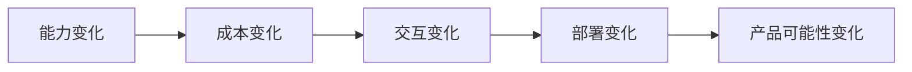

:::tip[读图提示]
前沿趋势要从“模型能力、成本效率、产品形态、合规边界、工作流整合”一起判断。只看榜单容易焦虑，看系统变化才更容易知道下一步该学什么。
:::
:::tip[本节定位]
讲“趋势”最怕两种情况：

- 只列名词
- 只追热点

这一节更想做的是另一件事：

> **给你一套看趋势的框架。**

这样你以后即使面对新的模型名、新的产品形态，也更容易判断它到底是在延续哪条主线。
:::
## 学习目标

- 理解 AIGC 当前几个最重要的演进方向
- 学会用“能力、成本、产品形态、部署方式”几个维度看趋势
- 建立一种不只追热点、而是判断长期主线的习惯

---

## 先建立一张地图

### 先看一个场景：为什么同一个模型能力会变成不同产品？

想象三家公司都拿到了同样强的多模态模型。

第一家公司把它做成截图问答助手，用户上传界面截图就能问“这个按钮是什么意思”。第二家公司把它做成视频剪辑工具，用户说一句话就能生成粗剪版本。第三家公司把它塞进手机端，让用户离线处理私人相册。

模型底座可能相似，但产品方向完全不同。原因不在于“谁的模型名字更潮”，而在于它们分别抓住了不同变化：输入入口变了，工作流变了，成本结构变了，部署位置也变了。

所以看 AIGC 趋势，不能只追模型榜单，而要问：这个变化到底改变了哪一层。

前沿趋势这节最适合新人的理解顺序不是“记住今年最火的名字”，而是先看清：



所以这节真正想解决的是：

- 趋势应该怎么判断
- 为什么前沿不等于只看模型榜单

### 一个更适合新人的总类比

你可以把“看趋势”理解成：

- 看城市到底在修什么路，而不是只看今天哪辆车跑得最快

模型榜单更像：

- 今天哪辆车快了一点

趋势判断更像：

- 这座城市接下来会更偏高铁、地铁，还是更多高速公路

这个类比很适合新人，因为它会帮助你先抓住：

- 趋势真正重要的是长期主线
- 不是短期热词

## 一、为什么 AIGC 趋势不能只看模型榜单？

因为真正决定行业变化的，往往不只是：

- 模型参数变大了多少
- 某个榜单又刷新了多少分

而是这些更底层的变化：

- 能力边界有没有变
- 交互形态有没有变
- 成本结构有没有变
- 部署方式有没有变

所以你看趋势时，真正要问的是：

> **这个变化，到底改变了什么样的应用可能性？**

---

## 二、六条趋势放在一张图里

在进入具体趋势之前，可以先把它们放进同一个框架：

```course-map
  root((AIGC 前沿趋势))
    能力边界
      多模态
      更强理解与生成
    工作流形态
      生成内容
      生成工作流
      Agent 化
    成本效率
      小模型
      蒸馏
      更低延迟
    交互速度
      实时生成
      流式输出
    部署位置
      云端
      端侧
      本地化
    系统组织
      模型
      检索
      工具
      安全护栏
```

这张图的作用不是让你背名词，而是帮你判断：一个新热点到底落在哪条长期主线上。

---

## 三、第一条大趋势：多模态越来越成为默认能力

过去很多系统主要处理：

- 纯文本

但现在越来越多系统开始同时处理：

- 文本
- 图像
- 音频
- 视频

这不是小变化，而是输入世界本身被打开了。

### 为什么这很重要？

因为真实世界天然就是多模态的。
一旦模型能吃进去更多种输入，应用形态就会大幅扩展：

- 截图助手
- 看图问答
- 视频总结
- 语音驱动助手

所以：

> 多模态不是“锦上添花”，而是在重新定义交互入口。

### 一个很适合初学者先记的判断

如果一个方向打开了新的输入入口，
那它往往就不只是“模型能力增加一点点”，而是在改：

- 用户怎样把问题交给系统

---

## 四、第二条趋势：从“生成内容”走向“生成工作流”

早期 AIGC 更多是：

- 生成一张图
- 生成一段文案

而现在越来越多系统在做的是：

- 生成 + 检索
- 生成 + 工具调用
- 生成 + 评审
- 生成 + 多轮交互

这意味着：

> AIGC 正在从“单次输出”走向“持续工作流系统”。

这也是为什么 Agent 和 AIGC 之间越来越紧密。

---

## 五、第三条趋势：从大模型竞赛走向成本效率竞赛

### 只堆大模型不再是唯一方向

行业在继续追大模型能力的同时，也越来越重视：

- 推理成本
- 延迟
- 端侧可运行性
- 小模型能力

### 为什么这会成为趋势？

因为真正做产品时，你必须面对：

- 用户量
- 预算
- 部署环境

一个更强但贵十倍的模型，不一定更适合业务。

所以未来很重要的一条线是：

> **更强不再只等于更大，也越来越等于更高效。**

---

## 六、第四条趋势：实时生成越来越重要

用户对 AIGC 的期待正在从：

- “能生成”

变成：

- “能不能尽快生成”

尤其在：

- 对话
- 语音
- 视频
- 交互创作

这些场景里，实时性会越来越关键。

这会推动整个领域继续关注：

- 更快采样
- 更轻量推理
- 更流式生成

---

## 七、第五条趋势：端侧和本地化能力越来越重要

过去很多生成和推理都默认在云端。
但现在越来越多人关注：

- 本地运行
- 边缘部署
- 隐私友好
- 离线能力

这尤其会在这些场景变得重要：

- 企业内部系统
- 隐私敏感数据
- 移动端助手
- 低网络依赖场景

所以未来一个非常重要的问题会是：

> **哪些能力应该在云端，哪些能力应该往端侧走？**

---

## 八、第六条趋势：从单模型能力走向系统能力

很多年前，竞争重点更像：

- 单个模型谁更强

而现在越来越像：

- 模型 + 检索
- 模型 + 工具
- 模型 + 工作流
- 模型 + 安全护栏

这意味着真正的竞争点正在从：

- 模型本身

扩展到：

- 整个系统怎样组织起来

所以你以后做 AIGC 项目时，不能只盯着模型。

---

## 九、一个很实用的趋势判断框架

看一个新方向时，可以先问四个问题：

1. 它是让能力更强了，还是只是换了包装？
2. 它是让成本更低了，还是让部署更灵活了？
3. 它打开了新的交互入口吗？
4. 它会影响产品工作流吗？

一个非常简单的示意：

```python
trend_check = {
    "multimodal": {"ability": 9, "cost_impact": 6, "new_interaction": 9, "workflow_change": 8},
    "small_models": {"ability": 6, "cost_impact": 9, "new_interaction": 5, "workflow_change": 7},
    "real_time_generation": {"ability": 7, "cost_impact": 8, "new_interaction": 9, "workflow_change": 8}
}

for trend, scores in trend_check.items():
    total = sum(scores.values())
    strongest = max(scores, key=scores.get)
    print(f"{trend}: total={total}, strongest_change={strongest}")
```

预期输出：

```text
multimodal: total=32, strongest_change=ability
small_models: total=27, strongest_change=cost_impact
real_time_generation: total=32, strongest_change=new_interaction
```

不要把总分当成客观排行榜。它更适合用来快速判断：这个趋势主要改变了哪一层。

这个例子不是在算一个客观排名，而是在训练一种判断习惯：每次看到新趋势，都把它拆到具体维度里看。

如果你想让这个小工具更实用，可以继续加上：

```python
trend_check = {
    "multimodal": {"ability": 9, "cost_impact": 6, "new_interaction": 9, "workflow_change": 8},
    "small_models": {"ability": 6, "cost_impact": 9, "new_interaction": 5, "workflow_change": 7},
    "real_time_generation": {"ability": 7, "cost_impact": 8, "new_interaction": 9, "workflow_change": 8}
}

advice = {
    "ability": "优先看它能做什么新任务",
    "cost_impact": "优先看它是否降低大规模使用成本",
    "new_interaction": "优先看它是否改变用户入口",
    "workflow_change": "优先看它是否重组产品流程"
}

for trend, scores in trend_check.items():
    strongest = max(scores, key=scores.get)
    print(trend, "->", advice[strongest])
```

预期输出：

```text
multimodal -> 优先看它能做什么新任务
small_models -> 优先看它是否降低大规模使用成本
real_time_generation -> 优先看它是否改变用户入口
```

这个版本是自包含的：复制到新的 Python 文件里也能直接运行。

这个例子不是在算分，而是在提醒你：

> 不要只看“新不新”，要看“改变了哪一层”。

### 一个更适合初学者先记的趋势判断表

| 维度 | 你最该先问什么 |
|---|---|
| 能力 | 它到底多做了什么以前做不到的事？ |
| 成本 | 它让什么变便宜了，还是反而更贵了？ |
| 交互 | 用户和系统的交互入口变了吗？ |
| 工作流 | 它会让产品流程变短、变快，还是更复杂？ |

这个表很适合新人，因为它会把“趋势”从抽象判断重新压回几个可以落地的问题。

---

## 十、第一次看前沿趋势时，最稳的顺序

更建议这样看：

1. 先看它改变了哪种能力
2. 再看它改变了多少成本结构
3. 再看它是否打开了新交互或新工作流
4. 最后才看它是不是短期热点

这样更容易区分“真正主线”和“短期噪声”。

## 十一、如果把它做成笔记或项目判断，最值得展示什么

最值得展示的通常不是：

- 一串热门方向列表

而是：

1. 你用哪四个维度在看趋势
2. 某个方向具体改变了哪一层
3. 它会怎样影响未来的产品形态

这样别人会更容易看出：

- 你理解的是趋势判断框架
- 不只是跟着热点记名词

---

## 十二、初学者最常踩的坑

### 把“趋势”理解成“最近热词”

这样很容易跟着新闻跑，而不是跟着主线走。

### 只看模型能力，不看成本和产品形态

这会让判断失真。

### 以为趋势就是线性单向发展

现实里很多趋势会并行存在：

- 大模型继续变强
- 小模型继续变便宜
- 云端继续发展
- 端侧也继续起势

---

## 留下的证据

学完这一页，至少保留这张证据卡：

```text
风险范围：前沿能力、伦理问题、监管，或产品政策边界
工程规则：必须记录、阻止、审核、披露或上报什么
测试用例：一个符合规则的真实输入/输出案例
失败检查：隐私、版权、肖像、偏见、安全、来源或合规缺口
期望产出：将复查清单或产品需求翻译成工程动作
```

## 小结

这一节最重要的不是记住某几个方向，而是建立一个判断趋势的方式：

> **AIGC 的前沿变化，真正有意义的部分通常发生在能力边界、成本结构、交互入口和系统组织方式这四层。**

当你开始用这几个维度去看新趋势时，就不会只是在追热点了。

## 这节最该带走什么

- 趋势判断的核心是框架，不是追名词
- 你真正要问的是“它改变了什么可能性”
- 多模态、系统化、效率化、端侧化这些才更像长期主线

---

## 十三、练习

1. 选一个你最近看到的 AIGC 新方向，用“能力 / 成本 / 交互 / 工作流”四个维度分析它。
2. 想一想：为什么说多模态是“交互入口变化”，而不只是“模型能力变化”？
3. 用自己的话解释：为什么未来 AIGC 的竞争越来越像“系统竞争”，而不只是“模型竞争”？
4. 如果你要判断一个趋势是否值得长期跟，最先会问哪两个问题？
5. 找一个具体产品，判断它主要押注的是多模态、实时生成、端侧化，还是工作流化。

<details>
<summary>解题思路与讲解</summary>

1. 扎实的分析应说明能力提升、成本曲线、交互变化和工作流影响。例如实时语音视频生成只有在延迟、控制和评审都适合产品流程时，才真正有价值。
2. 多模态改变的是入口，因为用户可以从截图、照片、语音、文档或视频开始，而不必先把所有信息翻译成文本。
3. 竞争越来越像系统竞争，是因为用户价值来自模型、工具、记忆、检索、UI、权限、评审、成本控制和部署可靠性的组合。
4. 先问这个趋势是否解锁了一个会反复发生的用户工作流；再问成本、延迟、质量、安全和集成是否足以支撑真实使用。
5. 好的产品判断应把可见产品行为连接到一个主要押注。例如移动端创意助手可能押注多模态和工作流化，本地助手可能押注端侧部署。

</details>
