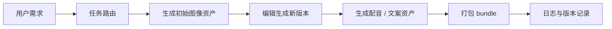

# 12.5.2 项目：AI 创意内容平台


:::tip[本节定位]
AI 创意平台特别容易做成“功能堆叠页”：

- 文生图一个按钮
- 配音一个按钮
- 改图一个按钮

但这还不够叫平台。
平台真正的难点是：

> **把多模态能力组织成连续工作流，并把中间资产稳定管理起来。**

这一节会把它往“作品级产品项目”再推一层。
:::
## 学习目标

- 学会把多模态生成能力组织成真实创作流程
- 学会定义创意平台里的资产结构和版本逻辑
- 学会把这个题材做成有产品感的作品级项目
- 理解创意平台为什么不只是单步生成功能集合

---

## 一、什么样的题目才像“平台项目”？

一个更像作品的题目应该是：

> **做一个活动海报创作平台：用户输入需求，系统生成海报、支持一次改图、再生成宣传配音，最后导出一个完整资产包。**

### 为什么这个范围合适？

- 流程完整
- 资产明确
- 展示起来很直观

### 为什么不建议一开始就做“大而全创作平台”？

因为：

- 功能太多会把主线冲淡
- 资产管理和路由逻辑会很快失控

---

## 二、作品级创意平台最小闭环长什么样？

1. 用户给需求
2. 路由到合适模块
3. 生成初始资产
4. 在已有资产基础上做修改
5. 生成配套语音或文案
6. 导出统一内容包

只要这 6 步跑顺，项目就已经很像产品了。

### 一张更像真实平台的资产流图



这张图很重要，因为它会提醒你：

- 平台不是功能清单
- 而是资产在流程里不断演化

## 三、推荐推进顺序

对新人来说，更稳的顺序通常是：

1. 先做单步海报生成
2. 再补一次改图
3. 再补配音资产
4. 最后再做 bundle、日志和版本管理

这样你才更容易把“平台感”一步步做出来。

### 一个更适合新人的总类比

你可以把创意平台理解成：

- 一间有素材柜、编辑台和导出区的小型工作室

如果只是有很多按钮，那更像：

- 把不同工具堆在一张桌子上

只有当你开始关心：

- 哪个资产是初稿
- 哪个资产是修改版
- 哪个资产属于同一个项目

它才会真的像“平台”。

---

## 四、先跑一个更像平台的工作流示例

```python
from dataclasses import dataclass, field


@dataclass
class AssetBundle:
    images: list = field(default_factory=list)
    voices: list = field(default_factory=list)
    logs: list = field(default_factory=list)
    metadata: dict = field(default_factory=dict)


def route_task(user_request):
    if "配音" in user_request or "语音" in user_request:
        return "tts"
    if "改图" in user_request or "修图" in user_request:
        return "image_editing"
    if "海报" in user_request or "图片" in user_request:
        return "image_generation"
    return "general"


def generate_image(prompt, style):
    return f"image_asset[{style}]::{prompt}"


def edit_image(image_name, instruction):
    return f"edited::{image_name}::{instruction}"


def generate_voice(script, speaker="default"):
    return f"voice_asset[{speaker}]::{script}"


def run_creative_project(requests):
    bundle = AssetBundle(metadata={"style": "futuristic", "project_name": "tech_event_campaign"})

    for req in requests:
        task_type = route_task(req)
        bundle.logs.append({"request": req, "task_type": task_type})

        if task_type == "image_generation":
            asset = generate_image(req, style=bundle.metadata["style"])
            bundle.images.append(asset)

        elif task_type == "image_editing" and bundle.images:
            asset = edit_image(bundle.images[-1], req)
            bundle.images.append(asset)

        elif task_type == "tts":
            asset = generate_voice(req, speaker="brand_voice")
            bundle.voices.append(asset)

    return bundle


requests = [
    "做一张科技大会海报",
    "改图：把背景改成深蓝色并加一点发光效果",
    "为这张海报生成一句宣传配音",
]

bundle = run_creative_project(requests)
print("image_count:", len(bundle.images))
print("voice_count:", len(bundle.voices))
print("log_count:", len(bundle.logs))
print("tasks:", [item["task_type"] for item in bundle.logs])
print("latest_image_is_edit:", bundle.images[-1].startswith("edited::"))
```

预期输出：

```text
image_count: 2
voice_count: 1
log_count: 3
tasks: ['image_generation', 'image_editing', 'tts']
latest_image_is_edit: True
```


关键看 `tasks` 这一行：同一个项目里现在有首张图、改图版本和配音资产，而不是三次彼此无关的生成调用。

### 这个版本比前一版强在哪？

这次不只是有：

- images
- voices

还多了：

- `logs`
- 更明确的 `metadata`

这让它更接近真实平台里的：

- 资产流
- 操作流

### 为什么 `logs` 很值得展示？

因为平台项目最怕用户只看到最后结果，
看不到中间过程。

而作品级展示里，中间过程往往就是亮点。

### 再看一个最小“版本管理”示例

```python
assets = [
    {"id": "img_v1", "type": "image", "parent": None},
    {"id": "img_v2", "type": "image", "parent": "img_v1"},
    {"id": "voice_v1", "type": "voice", "parent": None},
]

for asset in assets:
    print(asset)
```

预期输出：

```text
{'id': 'img_v1', 'type': 'image', 'parent': None}
{'id': 'img_v2', 'type': 'image', 'parent': 'img_v1'}
{'id': 'voice_v1', 'type': 'voice', 'parent': None}
```


`parent` 是最小可用的版本字段。它告诉你某个资产是新分支，还是从之前的资产改出来的。

这个示例很适合初学者，因为它会帮助你先建立一个平台思维：

- 资产不是孤立文件
- 它们常常有版本关系和父子关系

---

## 五、创意平台最容易失控的地方

### 资产版本混乱

例如：

- 初始图
- 改图 1
- 改图 2

如果命名和归档不清楚，系统很快就乱。

### 路由逻辑不清

例如：

- 同一句里既像图像请求又像语音请求

这会导致结果难预测。

### 多模态风格不一致

例如：

- 海报风格偏未来感
- 配音文案却像官方新闻播报

这类不一致很适合在项目里单独拿出来分析。

---

## 六、作品级创意平台最该展示什么？

建议至少展示：

1. 用户需求
2. 路由结果
3. 初始海报
4. 改图后版本
5. 配音资产
6. 最终 bundle 结构

### 为什么这比只贴一张海报更强？

因为这样别人能看到：

- 这是工作流系统
- 不是单次生成演示

### 如果你第一次做这类项目，最稳的默认顺序

更稳的顺序通常是：

1. 先做一个单主题创作场景
2. 先让图像资产闭环跑通
3. 再补一条编辑链
4. 再补语音或文案资产
5. 最后才做 bundle 和版本管理

这样会比一开始就做“大而全平台”更容易把主线立住。

---

## 七、一个很适合补上的错误分析层

例如你可以额外记录：

- 哪类需求最容易路由错
- 哪类 prompt 最容易让图像和配音风格不一致
- 哪些资产最容易在导出时丢元数据

这会让项目显得非常成熟。

---

## 项目交付时最好补上的内容

- 一张工作流图
- 一段从需求到 bundle 的完整 trace
- 一组风格一致 / 不一致的对比案例
- 一段你对资产管理和版本设计的说明

## 如果把它做成作品集，最值得强调什么

最值得强调的通常不是：

- 功能很多

而是：

1. 路由如何决定走哪条生成链
2. 资产如何一步步演化
3. 日志和版本如何记录
4. 最终 bundle 为什么像真正可交付内容包

这样别人会更容易感觉到：

- 你做的是一个创作平台
- 不只是多模态功能拼盘

---

## 留下的证据

学完这一页，至少保留这张证据卡：

```text
简介：用户目标、受众、素材、约束和导出格式
工件：源文件、提示词、生成候选、选定输出和被拒绝版本
审查：事实检查、版权/肖像/敏感内容检查，以及人工决定
集成: RAG 记录、Agent trace、创意包、故事板或导出预览
期望产出：可复现的资产包，包含 README、复查清单和失败说明
```

## 小结

这节最重要的是建立一个作品级判断：

> **AI 创意内容平台真正像平台的地方，不是功能多，而是能否把任务路由、资产版本和多步工作流组织成稳定、可展示的生产链路。**

只要这条链路讲清楚，这个项目就会非常像一个有产品感的多模态作品。


## 版本路线建议

| 版本 | 目标 | 交付重点 |
|---|---|---|
| 基础版 | 跑通最小闭环 | 能输入、能处理、能输出，并保留一组示例 |
| 标准版 | 形成可展示项目 | 增加配置、日志、错误处理、README 和截图 |
| 挑战版 | 接近作品集质量 | 增加评估、对比实验、失败样本分析和下一步路线 |

建议先完成基础版，不要一开始就追求大而全。每提升一个版本，都要把“新增了什么能力、怎么验证、还有什么问题”写进 README。

## 练习

1. 给 `AssetBundle` 再加一个 `video_scripts` 字段，想一想它在工作流里该怎么生成。
2. 为什么创意平台比单步生成功能更依赖资产管理？
3. 如果图像和配音风格总不一致，你会把问题归到路由、提示词，还是资产层？为什么？
4. 如果你把这个项目放进作品集，首页最值得展示哪 5 个模块？

<details>
<summary>项目交付参考与讲解</summary>

1. `video_scripts` 应在 brief 和资产计划稳定后生成。它可以包含 scene id、旁白、视觉方向、时长、所需资产和评审状态，这样视频工作流仍然连接到同一份 manifest。
2. 创意平台依赖资产管理，是因为生成会产生很多版本、被拒候选、prompt、版权说明和评审决策。没有资产记录，团队就无法复现，也无法安全复用。
3. 如果图像和语音风格总是不一致，先检查资产层，因为共享风格定义可能没有统一；然后再检查 routing 和 prompts，看是否调用了正确生成器并传入了正确风格指令。
4. 作品集首页最值得展示的 5 个模块通常是 brief 输入、资产 manifest/版本管理、生成工作流、安全/评审面板，以及最终导出或作品预览。

</details>
